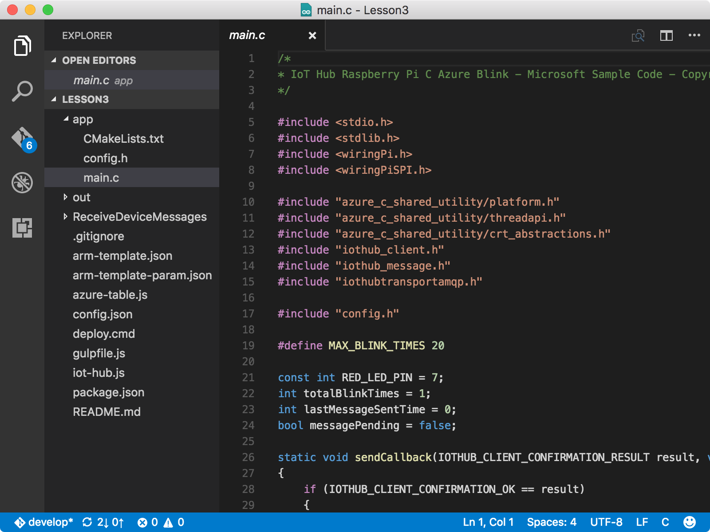
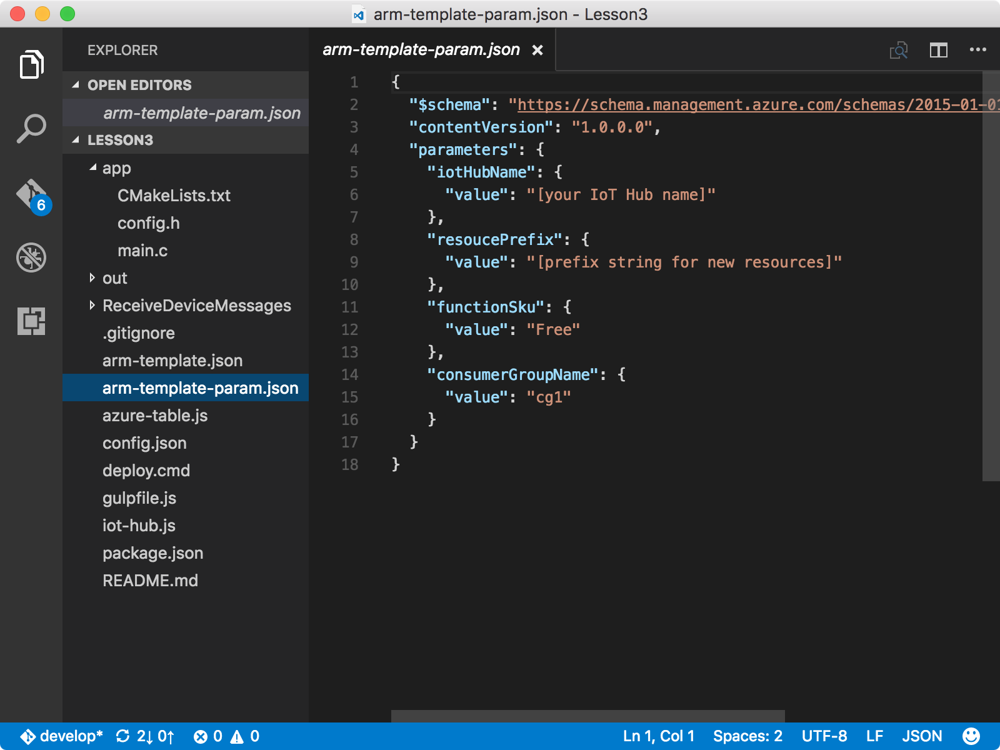

<properties
    pageTitle="创建 Azure Function App 和存储帐户 | Azure"
    description="Azure 函数应用可侦听 Azure IoT 中心事件、处理传入消息以及将其写入到 Azure 表存储。"
    services="iot-hub"
    documentationcenter=""
    author="shizn"
    manager="timtl"
    tags=""
    keywords="在云中存储数据, 云中存储的数据, iot 云服务" />
<tags
    ms.assetid="4bcfb071-b3ae-48cc-8ea5-7e7434732287"
    ms.service="iot-hub"
    ms.devlang="c"
    ms.topic="article"
    ms.tgt_pltfrm="na"
    ms.workload="na"
    ms.date: 3/21/2017
    wacn.date="05/08/2017"
    ms.author="xshi" />  

# 创建 Azure 函数应用和 Azure 存储帐户
Azure Functions 是一种解决方案，特别适合在云中运行*函数*（小块代码）。Azure 函数应用在 Azure 中托管函数的执行。

## 执行的操作
使用 Azure Resource Manager 模板创建 Azure 函数应用和 Azure 存储帐户。Azure 函数应用可侦听 Azure IoT 中心事件、处理传入消息以及将其写入到 Azure 表存储。如果有问题，可在[故障排除页](/documentation/articles/iot-hub-raspberry-pi-kit-c-troubleshooting/)上查找解决方案。

## 学习的内容
本文介绍：

 - 如何使用 [Azure Resource Manager](/documentation/articles/resource-group-overview/) 部署 Azure 资源。
 - 如何使用 Azure 函数应用处理 IoT 中心消息并将其写入到 Azure 表存储的表中。

## 所需条件
* 用户必须已成功完成：
- [Raspberry Pi 3 入门](/documentation/articles/iot-hub-raspberry-pi-kit-c-get-started/)
- [创建 Azure IoT 中心](/documentation/articles/iot-hub-raspberry-pi-kit-c-get-started/)

## 打开示例应用
通过运行以下命令在 Visual Studio Code 中打开示例项目：

		cd Lesson3
		code .

  

* `app` 子文件夹中的 `main.c` 文件是重要的源文件。此源文件包含的代码可将一条消息发送到 IoT 中心 20 次，并且在每次发送消息时使 LED 闪烁。
* `arm-template.json` 文件是 Azure Resource Manager 模板，其中包含一个 Azure 函数应用和一个 Azure 存储帐户。
* `arm-template-param.json` 文件是 Azure Resource Manager 模板使用的配置文件。
* `ReceiveDeviceMessages` 子文件夹包含用于 Azure 函数的 Node.js 代码。

## 在 Azure 中配置 Azure Resource Manager 模板并创建资源
在 Visual Studio Code 中更新 `arm-template-param.json` 文件。

  

* 将 **[你的 IoT 中心名称]** 替换为 **{我的中心名称}**，后者是在[创建 IoT 中心和注册 Raspberry Pi 3](/documentation/articles/iot-hub-raspberry-pi-kit-c-lesson2-prepare-azure-iot-hub/) 时指定的。
* 将 **[新资源的前缀字符串]** 替换为所需前缀。前缀可确保资源名称全局唯一，避免冲突。请勿在前缀中以短划线或数字开头。

更新 `arm-template-param.json` 文件后，请运行以下命令，将资源部署到 Azure：

	az group deployment create --template-file arm-template.json --parameters @arm-template-param.json -g iot-sample

创建这些资源约需五分钟。在创建这些资源时，用户可以阅读下一篇文章。

## 摘要
用户已创建 Azure 函数应用，因此可以处理 IoT 中心消息并通过 Azure 存储帐户存储这些消息。用户现在可以部署和运行示例，以便在 Pi 上发送从设备到云的消息。

## 后续步骤
[运行示例应用程序，以便发送从设备到云的消息](/documentation/articles/iot-hub-raspberry-pi-kit-c-lesson3-run-azure-blink/)

<!---HONumber=Mooncake_0206_2017-->
<!--Update_Description:update meta properties and code-->