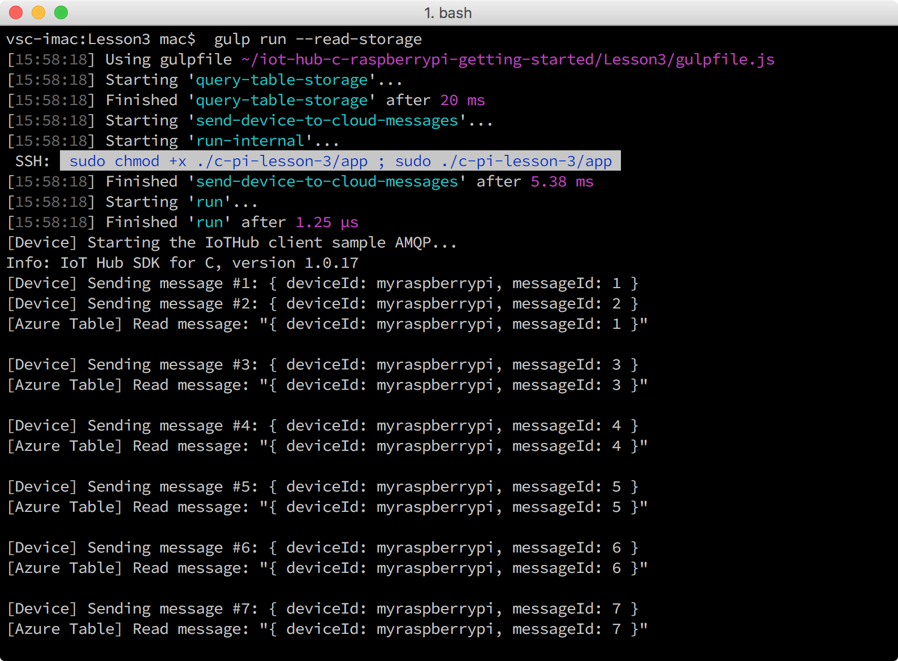

<properties
    pageTitle="读取保存在 Azure 存储中的消息 | Azure"
    description="在将从设备到云的消息写入 Azure 表存储时，对其进行监视。"
    services="iot-hub"
    documentationcenter=""
    author="shizn"
    manager="timtl"
    tags=""
    keywords="从云中检索数据, iot 云服务" />
<tags
    ms.assetid="8c5558bb-3c31-4445-90e6-b1a978738545"
    ms.service="iot-hub"
    ms.devlang="c"
    ms.topic="article"
    ms.tgt_pltfrm="na"
    ms.workload="na"
    ms.date="11/28/2016"
    wacn.date="01/06/2017"
    ms.author="xshi" />  

# 读取保存在 Azure 存储中的消息
## 执行的操作
在将从 Raspberry Pi 3 发送到 IoT 中心的从设备到云的消息写入到 Azure 表存储时，对其进行监视。如果有问题，可在[故障排除页](/documentation/articles/iot-hub-raspberry-pi-kit-c-troubleshooting/)上查找解决方案。

## 你要学习的知识
在本文中，用户将学习如何通过 gulp 的 read-message 任务读取保存在 Azure 表存储中的消息。

## 需要什么
在开始此过程之前，用户必须已成功完成[在 Raspberry Pi 3 上运行 Azure blink 示例应用程序](/documentation/articles/iot-hub-raspberry-pi-kit-c-lesson3-run-azure-blink/)。

## 从存储帐户中读取新消息
在以前的文章中，用户已在 Pi 上运行示例应用程序。示例应用程序发送消息到 Azure IoT 中心。发送到 IoT 中心的消息通过 Azure 函数应用存储在 Azure 表存储中。需要使用 Azure 存储连接字符串读取 Azure 表存储中的消息。

若要读取存储在 Azure 表存储中的消息，请执行以下步骤：

1. 运行以下命令，获取连接字符串：

   
		   az storage account list -g iot-sample --query [].name
		   az storage account show-connection-string -g iot-sample -n {storage name}
   

    第一个命令检索 `storage name`，后者在第二个命令中用于获取连接字符串。使用 `iot-sample` 作为 `{resource group name}` 的值（如果尚未更改此值）。
2. 运行以下命令，在 Visual Studio Code 中打开配置文件 `config-raspberrypi.json`：

   
		   # For Windows command prompt
		   code %USERPROFILE%\.iot-hub-getting-started\config-raspberrypi.json
   
		   # For MacOS or Ubuntu
		   code ~/.iot-hub-getting-started/config-raspberrypi.json
   
3. 将 `[Azure storage connection string]` 替换为在步骤 1 中获取的连接字符串。
4. 保存 `config-raspberrypi.json` 文件。
5. 运行以下命令，再次发送消息并从 Azure 表存储中读取这些消息：
   
   
		gulp run --read-storage
   
   
    从 Azure 表存储进行读取的逻辑位于 `azure-table.js` 文件中。
   
      

## 摘要
用户已成功地将 Pi 连接到云中的 IoT 中心，并已使用 blink 示例应用程序发送从设备到云的消息。用户还使用 Azure 函数应用将传入的 IoT 中心消息存储到 Azure 表存储中。用户现在可以将从云到设备的消息从 IoT 中心发送到 Pi。

## 后续步骤
[运行示例应用程序，接收云到设备消息](/documentation/articles/iot-hub-raspberry-pi-kit-c-lesson4-send-cloud-to-device-messages/)

<!---HONumber=Mooncake_0103_2017-->