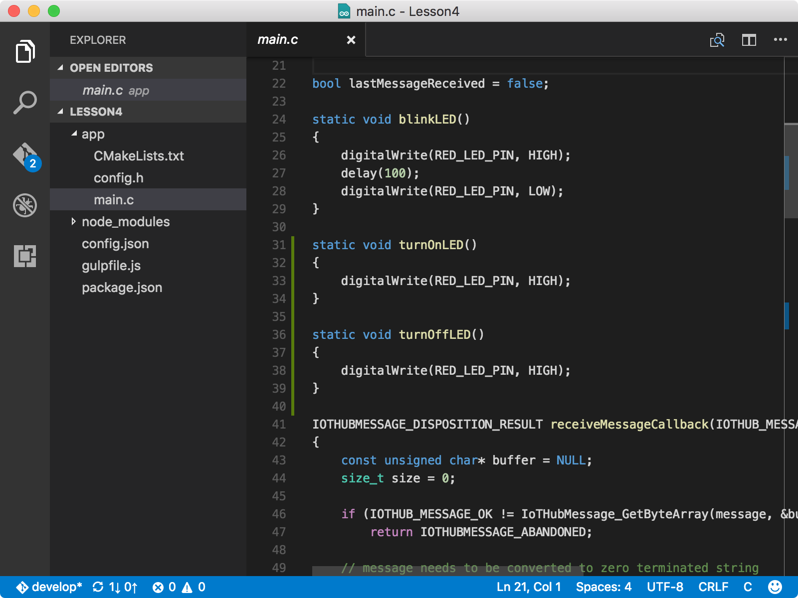
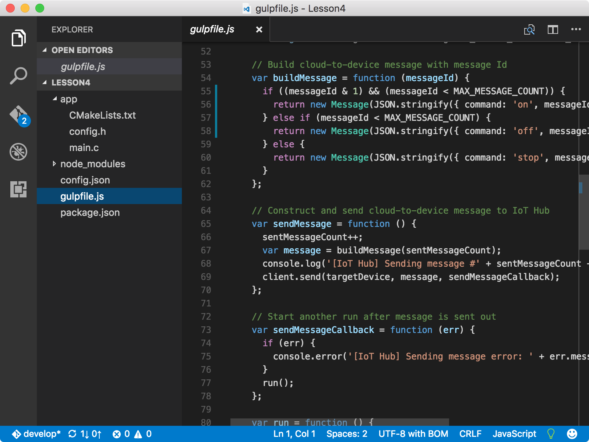
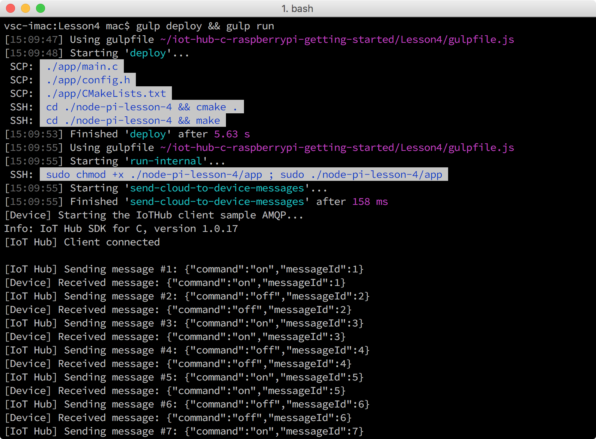

<properties
    pageTitle="可选：更改 LED 的开关行为 | Azure"
    description="自定义这些消息，以更改 LED 的开关行为。"
    services="iot-hub"
    documentationcenter=""
    author="shizn"
    manager="timtl"
    tags=""
    keywords="使用 raspberry pi 的控制 led, raspberry pi led 控制, raspberry pi 控制 led" />
<tags
    ms.assetid="0201b8ed-d5e6-4445-9a4d-1305003d1eff"
    ms.service="iot-hub"
    ms.devlang="c"
    ms.topic="article"
    ms.tgt_pltfrm="na"
    ms.workload="na"
    ms.date="11/28/2016"
    wacn.date="01/06/2017"
    ms.author="xshi" />  

# 更改 LED 的开关行为
## 执行的操作
自定义这些消息，以便更改 LED 的开关行为。如果有问题，可在[故障排除页](/documentation/articles/iot-hub-raspberry-pi-kit-c-troubleshooting/)上查找解决方案。

## 你要学习的知识
使用其他 Node.js 函数更改 LED 的开关行为。

## 需要什么
用户必须已成功完成[在 Raspberry Pi 上运行示例应用程序，以便接收云到设备消息](/documentation/articles/iot-hub-raspberry-pi-kit-c-lesson4-send-cloud-to-device-messages/)。

## 将函数添加到 main.c 和 gulpfile.js
1. 通过运行以下命令在 Visual Studio Code 中打开示例应用程序：

   
           cd Lesson4
           code .
   
2. 打开 `main.c` 文件，然后在 blinkLED() 函数之后添加以下函数：

   
           static void turnOnLED()
           {
             digitalWrite(LED_PIN, HIGH);
           }
        
           static void turnOffLED()
           {
             digitalWrite(LED_PIN, LOW);
           }
   

     

3. 在 `receiveMessageCallback` 函数的 `if` 块的默认条件之前添加以下条件：

   
           else if (0 == strcmp((const char*)value, ""on""))
           {
               turnOnLED();
           }
           else if (0 == strcmp((const char*)value, ""off""))
           {
               turnOffLED();
           }
   

   现在已将示例应用程序配置为通过消息响应更多指令。“on”指令打开 LED，“off”指令关闭 LED。
4. 打开 gulpfile.js 文件，然后在函数 `sendMessage` 之前添加新函数：

   
           var buildCustomMessage = function (messageId) {
             if ((messageId & 1) && (messageId < MAX_MESSAGE_COUNT)) {
               return new Message(JSON.stringify({ command: 'on', messageId: messageId }));
             } else if (messageId < MAX_MESSAGE_COUNT) {
               return new Message(JSON.stringify({ command: 'off', messageId: messageId }));
             } else {
               return new Message(JSON.stringify({ command: 'stop', messageId: messageId }));
             }
           }
   

     

5. 在 `sendMessage` 函数中，将 `var message = buildMessage(sentMessageCount);` 行替换为新行，如以下代码片段所示：

   
           var message = buildCustomMessage(sentMessageCount);
   
6. 保存所有更改。

### 部署并运行示例应用程序
运行以下命令，在 Pi 上部署并运行示例应用程序：

	gulp deploy && gulp run

此时会看到 LED 开启两秒，然后关闭两秒。最后一条为“停止”消息，停止示例应用程序运行。

  

祝贺你！ 你已成功自定义从 IoT 中心发送到 Pi 的消息。

### 摘要
此可选部分介绍了如何自定义消息，使得示例应用程序能够以其他方式控制 LED 的开关行为。

<!---HONumber=Mooncake_0103_2017-->