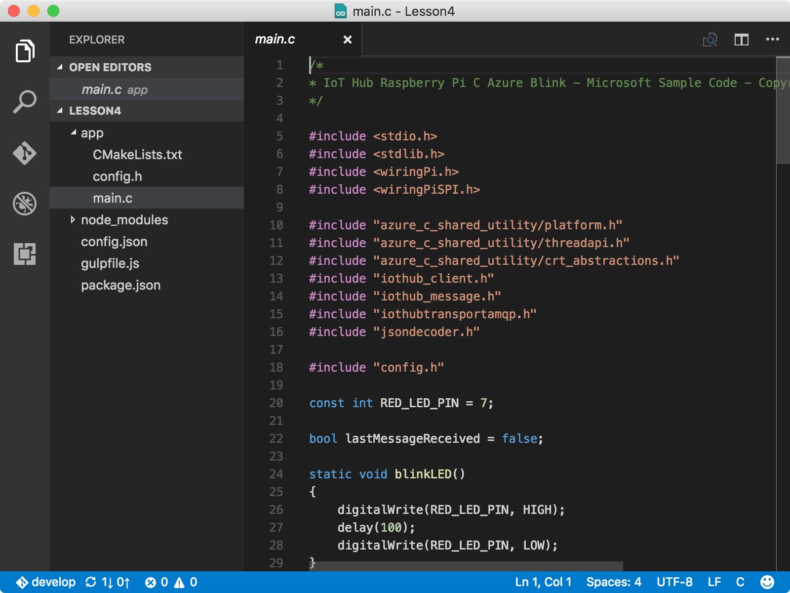
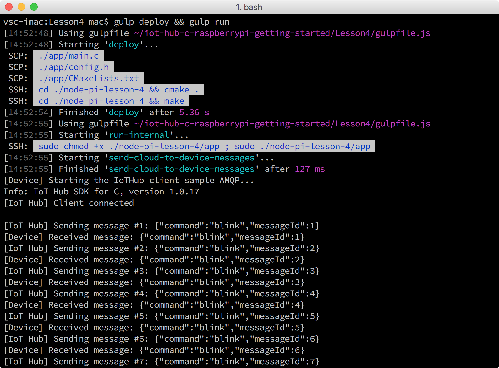

<properties
    pageTitle="运行示例应用程序，接收云到设备消息 | Azure"
    description="示例应用程序在 Pi 上运行，监视来自 IoT 中心的传入消息。新的 gulp 任务会将消息从 IoT 中心发送到 Pi，使 LED 闪烁。"
    services="iot-hub"
    documentationcenter=""
    author="shizn"
    manager="timtl"
    tags=""
    keywords="云到设备, 来自云的消息" />
<tags
    ms.assetid="fcbc0dd0-cae3-47b0-8e58-240e4f406f75"
    ms.service="iot-hub"
    ms.devlang="c"
    ms.topic="article"
    ms.tgt_pltfrm="na"
    ms.workload="na"
    ms.date="3/21/2017"
    wacn.date="05/08/2017"
    ms.author="xshi" />  

# 运行示例应用程序，接收云到设备消息
在本文中，用户需在 Raspberry Pi 3 上部署示例应用程序。示例应用程序监视来自 IoT 中心的传入消息。此外还需在计算机上运行一项 gulp 任务，将消息从 IoT 中心发送到 Pi。示例应用程序在收到这些消息后，就会让 LED 闪烁。如果有问题，可在[故障排除页](/documentation/articles/iot-hub-raspberry-pi-kit-c-troubleshooting/)上查找解决方案。

## 执行的操作
* 将示例应用程序连接到 IoT 中心。
* 部署并运行示例应用程序。
* 将消息从 IoT 中心发送到 Pi，使 LED 闪烁。

## 你要学习的知识
本文介绍：
 - 如何监视来自 IoT 中心的传入消息。
 - 如何将从云到设备的消息从 IoT 中心发送到 Pi。

## 需要什么
* Raspberry Pi 3，已完成使用设置。若要了解如何设置 Pi，请参阅[配置设备](/documentation/articles/iot-hub-raspberry-pi-kit-c-lesson1-configure-your-device/)。
* 一个 IoT 中心，已在 Azure 订阅中创建。若要了解如何创建 IoT 中心，请参阅[创建 IoT 中心并注册 Raspberry Pi 3](/documentation/articles/iot-hub-raspberry-pi-kit-c-lesson2-prepare-azure-iot-hub/)。

## 将示例应用程序连接到 IoT 中心
1. 确保位于存储库文件夹 `iot-hub-c-raspberrypi-getting-started` 中。通过运行以下命令在 Visual Studio Code 中打开示例应用程序：

           cd Lesson4
           code .

    请注意 `app` 子文件夹中的 `app.c` 文件。`app.c` 文件是关键的源文件，其中包含的代码用于监视 IoT 中心发出的传入消息。`blinkLED` 函数可使 LED 闪烁。

      

2. 运行以下命令初始化配置文件：

   
           npm install
           gulp init
   

    如果用户已在此计算机上完成[创建 Azure Function App 和存储帐户](/documentation/articles/iot-hub-raspberry-pi-kit-c-lesson3-deploy-resource-manager-template/)中的步骤，并继承了所有配置，则可跳转至部署并运行示例应用程序任务的步骤。如果用户在另一计算机上完成了[创建 Azure 函数应用和存储帐户](/documentation/articles/iot-hub-raspberry-pi-kit-c-lesson3-deploy-resource-manager-template/)中的步骤，则需替换 `config-raspberrypi.json` 文件中的占位符。`config-raspberrypi.json` 文件位于主文件夹的子文件夹中。

      

* 将 **[设备主机名或 IP 地址]** 替换为通过运行 `devdisco list --eth` 命令获取的 Pi 的 IP 地址或主机名。
* 将 **[IoT 设备连接字符串]** 替换为通过运行 `az iot device show-connection-string --hub-name {my hub name} --device-id {device id} -g iot-sample {resource group name}` 命令获取的设备连接字符串。
* 将 **[IoT 中心连接字符串]** 替换为通过运行 `az iot hub show-connection-string --name {my hub name} -g iot-sample {resource group name}` 命令获取的 IoT 中心连接字符串。

> [AZURE.NOTE]
如果尚未在第 1 课中完成，请同时运行 **gulp install-tools**。

## 部署并运行示例应用程序
运行以下命令，在 Pi 上部署并运行示例应用程序：

	gulp deploy && gulp run

Gulp 命令首先运行 install-tools 任务，然后将示例应用程序部署到 Pi。最后，它会在 Pi 上运行该应用程序，并在主机上运行单独的任务，以便从 IoT 中心将 20 条闪烁消息发送到 Pi。

在示例应用程序运行以后，它会开始侦听 IoT 中心发出的消息。同时，gulp 任务会将多个“闪烁”消息从 IoT 中心发送到 Pi。Pi 每收到一条闪烁消息，示例应用程序都会调用 `blinkLED` 函数，使 LED 闪烁。

当 gulp 任务将 20 条消息从 IoT 中心发送到 Pi 时，用户会看到 LED 每隔两秒闪烁一次。最后一条为“停止”消息，会停止示例应用程序的运行。

  

## 摘要
用户已成功地将消息从 IoT 中心发送到 Pi，使 LED 闪烁。下一任务为可选任务：更改 LED 的开关行为。

## 后续步骤
[更改 LED 的开关行为](/documentation/articles/iot-hub-raspberry-pi-kit-c-lesson4-change-led-behavior/)

<!---HONumber=Mooncake_0103_2017-->