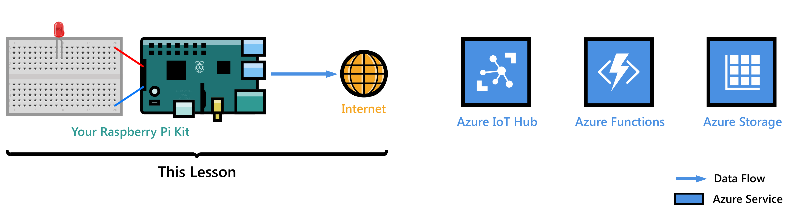
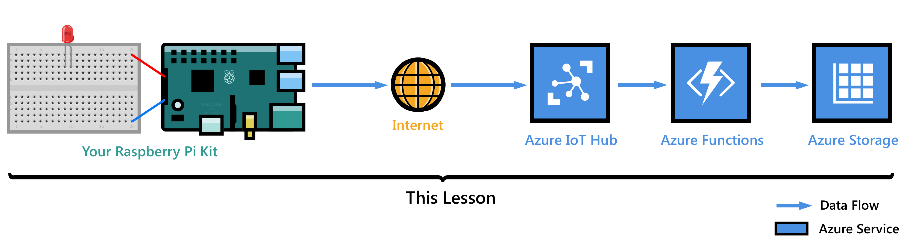
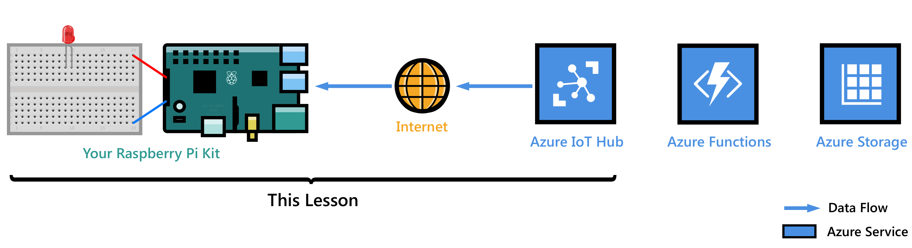

<properties
    pageTitle="将 Raspberry Pi 3 连接到 Azure IoT 中心 | Azure"
    description="开始使用 Raspberry Pi 3 设备、创建 Azure IoT 中心，并将 Pi 连接到 IoT 中心。"
    services="iot-hub"
    documentationcenter=""
    author="shizn"
    manager="timlt"
    tags=""
    keywords="azure iot 中心, 物联网入门, iot 工具包"
    experimental="true"
    experiment_id="xshi-happypathemu-20161202" />
<tags
    ms.assetid="b0e14bfa-8e64-440a-a6ec-e507ca0f76ba"
    ms.service="iot-hub"
    ms.devlang="node"
    ms.topic="article"
    ms.tgt_pltfrm="na"
    ms.workload="na"
    ms.date="11/28/2016"
    wacn.date="01/13/2017"
    ms.author="xshi" />  

# Raspberry Pi 3 入门 (Node.js)
<!--[AUZRE.SELECTOR]
- [Node.JS](/documentation/articles/iot-hub-raspberry-pi-kit-node-get-started/)
- [C](/documentation/articles/iot-hub-raspberry-pi-kit-c-get-started/) -->

在本教程中，用户将开始学习基础知识，了解如何使用运行 Raspbian 的 Raspberry Pi 3，然后学习如何使用 [Azure IoT 中心](/documentation/articles/iot-hub-what-is-iot-hub/)将设备无缝连接到云。有关 Windows 10 IoT Core 的示例，请访问 [Windows 开发人员中心](http://www.windowsondevices.com/)。

还没有工具包？ 从[此处](/develop/iot/iot-starter-kits)开始。

## 第 1 课：配置设备
  

在本课中，用户需为 Raspberry Pi 3 设备配置操作系统、设置开发环境，以及将应用程序部署到 Pi。

### 配置设备
对 Raspberry Pi 3 进行首次使用配置并安装 Raspbian。Raspbian 是一种免费的操作系统，已针对 Raspberry Pi 硬件进行优化。

*完成的估计时间：30 分钟*

转到[配置设备](/documentation/articles/iot-hub-raspberry-pi-kit-node-lesson1-configure-your-device/)。

### 获取工具
下载相关工具和软件，以便为 Raspberry Pi 3 生成和部署第一个应用程序。

*估计完成时间：20 分钟*

转到[获取工具](/documentation/articles/iot-hub-raspberry-pi-kit-node-lesson1-get-the-tools-win32/)。

### 创建和部署 blink 应用程序
克隆 GitHub 提供的示例 Node.js blink 应用程序，并使用 gulp 将该应用程序部署到 Raspberry Pi 3 板。此示例应用程序每隔两秒让连接到板的 LED 闪烁一次。

*估计完成时间：5 分钟*

转到[创建和部署 blink 应用程序](/documentation/articles/iot-hub-raspberry-pi-kit-node-lesson1-deploy-blink-app/)。

## 第 2 课：创建 IoT 中心
  

在本课中，用户需创建免费的 Azure 帐户、预配 Azure IoT 中心，以及在 IoT 中心创建第一个设备。

开始本课之前，请完成第 1 课。

### 获取 Azure 工具
安装 Azure 命令行接口 (Azure CLI)。

*估计完成时间：10 分钟*

转到[获取 Azure 工具](/documentation/articles/iot-hub-raspberry-pi-kit-node-lesson2-get-azure-tools-win32/)。

### 创建 IoT 中心并注册 Raspberry Pi 3
使用 Azure CLI 创建资源组、预配第一个 Azure IoT 中心，并将第一个设备添加到 IoT 中心。

*估计完成时间：10 分钟*

转到[创建 IoT 中心并注册 Raspberry Pi 3](/documentation/articles/iot-hub-raspberry-pi-kit-node-lesson2-prepare-azure-iot-hub/)。

## 第 3 课：发送从设备到云的消息
  

在本课中，用户需将消息从 Pi 发送到 IoT 中心。此外还需创建一个 Azure 函数应用，以便获取 IoT 中心发出的传入消息并将其写入到 Azure 表存储。

开始本课之前，请完成第 1 课和第 2 课。

### 创建 Azure 函数应用和 Azure 存储帐户
使用 Azure Resource Manager 模板创建 Azure 函数应用和 Azure 存储帐户。

*估计完成时间：10 分钟*

转到[创建 Azure 函数应用和 Azure 存储帐户](/documentation/articles/iot-hub-raspberry-pi-kit-node-lesson3-deploy-resource-manager-template/)。

### 运行示例应用程序，以便发送从设备到云的消息
将示例应用程序部署到 Raspberry Pi 3 设备并运行，以便将消息发送到 IoT 中心。

*估计完成时间：10 分钟*

转到[运行示例应用程序，以便发送从设备到云的消息](/documentation/articles/iot-hub-raspberry-pi-kit-node-lesson3-run-azure-blink/)。

### 读取保存在 Azure 存储中的消息
在将从设备到云的消息写入 Azure 存储时，对其进行监视。

*估计完成时间：5 分钟*

转到[读取保存在 Azure 存储中的消息](/documentation/articles/iot-hub-raspberry-pi-kit-node-lesson3-read-table-storage/)。

## 第 4 课：发送从云到设备的消息
  

本课介绍如何将消息从 Azure IoT 中心发送到 Raspberry Pi 3。这些消息控制连接到 Pi 的 LED 的开关行为。示例应用程序已准备就绪，你可以执行此任务了。

开始本课之前，请完成第 1 课、第 2 课和第 3 课。

### 运行示例应用程序，接收从云到设备的消息
第 4 课中的示例应用程序在 Pi 上运行，用于监视来自 IoT 中心的传入消息。新的 gulp 任务会将消息从 IoT 中心发送到 Pi，使 LED 闪烁。

*估计完成时间：10 分钟*

转到[运行示例应用程序，接收从云到设备的消息](/documentation/articles/iot-hub-raspberry-pi-kit-node-lesson4-send-cloud-to-device-messages/)。

### 可选部分：更改 LED 的开关行为
自定义这些消息，以便更改 LED 的开关行为。

*估计完成时间：10 分钟*

转到[可选部分：更改 LED 的开关行为](/documentation/articles/iot-hub-raspberry-pi-kit-node-lesson4-change-led-behavior/)。

## 故障排除
如果在课程中碰到问题，可参阅[故障排除](/documentation/articles/iot-hub-raspberry-pi-kit-node-troubleshooting/)一文以获取解决方案。

<!---HONumber=Mooncake_0109_2017-->
<!--Update_Description: add AZURE.SELECTOR-->