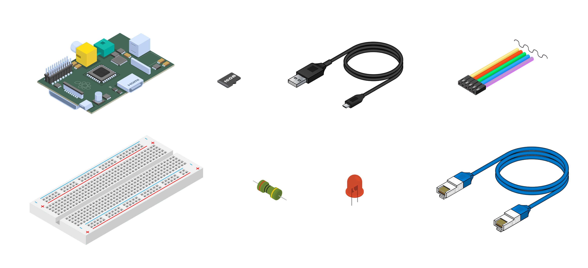
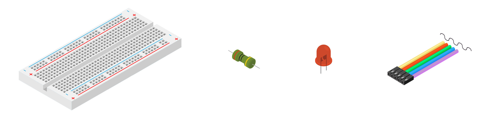

<properties
	pageTitle="配置设备"
	description="对 Raspberry Pi 3 进行首次使用配置，并安装 Raspbian OS，这是一个免费操作系统，已针对 Raspberry Pi 硬件优化。"
	services="iot-hub"
	documentationcenter=""
	author="shizn"
	manager="timlt"
	tags=""
	keywords=""/>  

<tags
	ms.service="iot-hub"
	ms.date="10/21/2016"
	wacn.date="12/19/2016"/>  

# 配置设备
## 执行的操作
对 Pi 进行首次使用配置，并安装 Raspbian 操作系统。Raspbian 是一种免费的操作系统，已针对 Raspberry Pi 硬件进行优化。如果有问题，可在[故障排除页](/documentation/artilcles/iot-hub-raspberry-pi-kit-node-troubleshooting/)上查找解决方案。

## 你要学习的知识
本文介绍：

* 如何在 Pi 上安装 Raspbian。
* 如何使用 USB 电缆启动 Pi。
* 如何通过以太网电缆或无线网络将 Pi 连接到网络。
* 如何将 LED 添加到电路试验板并将其连接到 Pi。

## 所需的项目
若要完成此操作，需要使用 Raspberry Pi 3 初学者工具包中的以下部件：

* Raspberry Pi 3 板
* 16 GB microSD 卡
* 带 6 英尺 USB 微电缆的 5 伏 2 安电源
* 电路试验板
* 连接器电缆
* 560 欧姆电阻器
* 扩散型 10 毫米 LED
* 以太网电缆

  

用户还需要：

* 适合 Pi 连接的有线或无线连接。
* USB-SD 适配器或 miniSD 卡，用于将 OS 映像刻录到 microSD 卡中。
* 运行 Windows、Mac 或 Linux 的计算机。该计算机用于将 Raspbian 安装在 microSD 卡上。
* Internet 连接，用于下载必需的工具和软件。

## 在 microSD 卡上安装 Raspbian。
准备用于安装 Raspbian 映像的 microSD 卡。

1. 下载 Raspbian。

   1. [下载](https://www.raspberrypi.org/downloads/raspbian/) Raspbian Jessie with Pixel 的 .zip 文件。
   2. 将 Raspbian 映像解压缩到计算机的某个文件夹中。

2. 将 Raspbian 安装到 microSD 卡。

   1. [下载](https://www.etcher.io)并安装 Etcher SD 卡刻录机实用程序。
   2. 运行 Etcher 并选择已在步骤 1 中解压缩的 Raspbian 映像。
   3. 选择 microSD 卡驱动器。请注意，Etcher 可能已选择正确的驱动器。
   4. 单击“闪存”将 Raspbian 安装到 microSD 卡。
   5. 安装完成后，从计算机中取出 microSD 卡。可以安全地直接取出 microSD 卡，因为 Etcher 会在完成后自动弹出或卸载 microSD 卡。
   6. 将 microSD 卡插入 Pi。

  

## 开启 Pi
使用 USB 微电缆和电源开启 Pi。

  

> [AZURE.NOTE] 必须使用工具包中至少为 2 安 的电源，确保 Raspberry 有正常运行所需的足够电力。
> 
> 

## 将 Raspberry Pi 3 连接到网络
可以将 Pi 连接到有线网络或无线网络。确保 Pi 与计算机连接到同一网络。例如，可以将 Pi 与计算机连接到同一网关。

### 连接到有线网络
使用以太网电缆将 Pi 连接到有线网络。如果建立了连接，则 Pi 上的两个 LED 会打开。

  

### 连接到无线网络
按照 Raspberry Pi Foundation 提供的[说明](https://www.raspberrypi.org/learning/software-guide/wifi/)，将 Pi 连接到无线网络。这些说明要求用户先将监视器和键盘连接到 Pi。

## 将 LED 连接到 Pi
若要完成此任务，请使用[电路试验板](https://learn.sparkfun.com/tutorials/how-to-use-a-breadboard)、连接器电缆、LED 和电阻器。将它们连接到 Pi 的[通用输入/输出](https://www.raspberrypi.org/documentation/usage/gpio/) (GPIO) 端口。

  

1. 将 LED 的短脚连接到 **GPIO GND（管脚 6）**。
2. 将 LED 的长脚连接到电阻器的一个脚。
3. 将电阻器的另一个脚连接到 **GPIO 4（管脚 7）**。

请注意，LED 极性很重要。此极性设置通常称为“低电平有效”。

  

祝贺你！ 你已成功配置 Pi。

## 摘要
本文介绍了如何配置 Pi，即如何安装 Raspbian、如何将 Pi 连接到网络，以及如何将 LED 连接到 Pi。请注意，LED 尚未亮起。下一任务是安装必要的工具和软件，准备在 Pi 上运行示例应用程序。

  

## 后续步骤
[获取工具](/documentation/articles/iot-hub-raspberry-pi-kit-node-lesson1-get-the-tools-win32/)

<!---HONumber=Mooncake_1212_2016-->