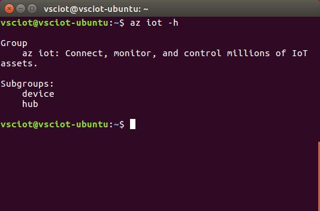

<properties
	pageTitle="获取 Azure 工具 (Ubuntu 16.04)"
	description="在 Ubuntu 上安装 Python 和 Azure 命令行接口 (Azure CLI)。"
	services="iot-hub"
	documentationcenter=""
	author="shizn"
	manager="timlt"
	tags=""
	keywords=""/>  


<tags
	ms.service="iot-hub"
	ms.date="10/21/2016"
	wacn.date="12/19/2016"/>  


# 获取 Azure 工具 (Ubuntu 16.04)
> [AZURE.SELECTOR]
- [Windows 7 及更高版本](/documentation/articles/iot-hub-raspberry-pi-kit-node-lesson2-get-azure-tools-win32/)
- [Ubuntu 16.04](/documentation/articles/iot-hub-raspberry-pi-kit-node-lesson2-get-azure-tools-ubuntu/)
- [macOS 10.10](/documentation/articles/iot-hub-raspberry-pi-kit-node-lesson2-get-azure-tools-mac/)

## 执行的操作
安装 Azure 命令行接口 (Azure CLI)。如果有问题，请在[故障排除页](/documentation/articles/iot-hub-raspberry-pi-kit-node-troubleshooting/)上查找解决方案。

## 你要学习的知识
* 如何安装 Azure CLI
* 如何添加 Azure CLI 的 IoT 子组

## 需要什么
* 启用 Internet 连接的 Ubuntu 计算机。
* 一个有效的 Azure 订阅。如果没有帐户，只需花费几分钟就能创建一个[帐户](/pricing/1rmb-trial/)。

## 安装 Azure CLI
Azure CLI 提供适用于 Azure 的多平台命令行体验。可以直接通过命令行预配和管理资源。

若要安装最新 Azure CLI，请执行以下步骤：

1. 在终端窗口运行以下命令。安装 Azure CLI 可能需要五分钟。
   
    ```bash
    sudo apt-get update
    sudo apt-get install -y libssl-dev libffi-dev
    sudo apt-get install -y python-dev
    sudo apt-get install -y build-essential
    sudo apt-get install -y python-pip
    sudo pip install azure-cli-core==0.1.0b7 azure-cli-vm==0.1.0b7 azure-cli-storage==0.1.0b7 azure-cli-role==0.1.0b7 azure-cli-resource==0.1.0b7 azure-cli-profile==0.1.0b7 azure-cli-network==0.1.0b7 azure-cli-iot==0.1.0b7 azure-cli-feedback==0.1.0b7 azure-cli-configure==0.1.0b7 azure-cli-component==0.1.0b7 azure-cli==0.1.0b7
    ```
2. 运行以下命令，对安装进行验证：
   
    ```bash
    az iot -h
    ```

如果安装成功，则会看到以下输出。

  


## 摘要
用户已安装 Azure CLI。下一任务是使用 Azure CLI 创建 Azure IoT 中心和设备标识。

## 后续步骤
[创建 IoT 中心并注册 Raspberry Pi 3](/documentation/articles/iot-hub-raspberry-pi-kit-node-lesson2-prepare-azure-iot-hub/)

<!---HONumber=Mooncake_1212_2016-->