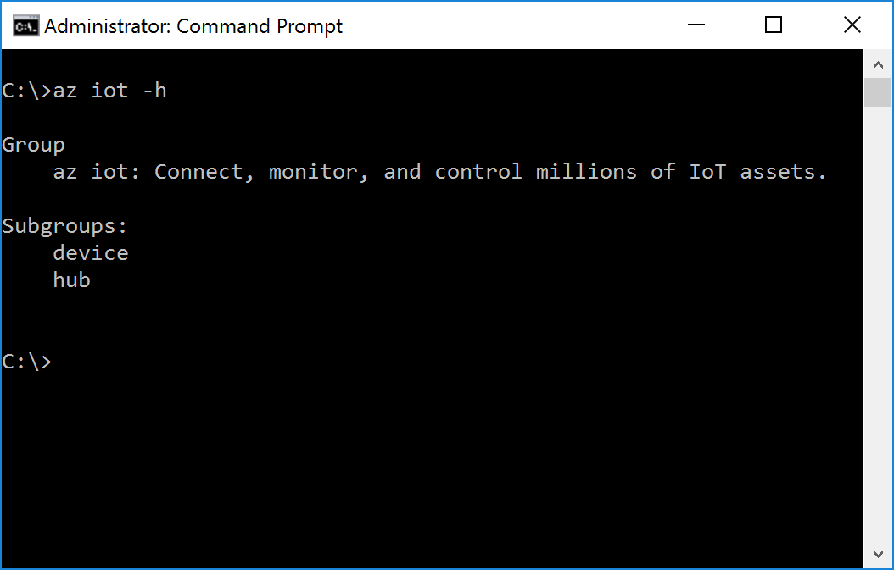

<properties
	pageTitle="获取 Azure 工具（Windows 7 及更高版本）"
	description="在 Windows 7 及更高版本上安装 Python 和 Azure 命令行接口 (Azure CLI)。"
	services="iot-hub"
	documentationcenter=""
	author="shizn"
	manager="timlt"
	tags=""
	keywords=""/>  


<tags
	ms.service="iot-hub"
	ms.date="10/21/2016"
	wacn.date="12/19/2016"/>  


# 获取 Azure 工具（Windows 7 及更高版本）
> [AZURE.SELECTOR]
- [Windows 7 及更高版本](/documentation/articles/iot-hub-raspberry-pi-kit-node-lesson2-get-azure-tools-win32/)
- [Ubuntu 16.04](/documentation/articles/iot-hub-raspberry-pi-kit-node-lesson2-get-azure-tools-ubuntu/)
- [macOS 10.10](/documentation/articles/iot-hub-raspberry-pi-kit-node-lesson2-get-azure-tools-mac/)

## 执行的操作
安装 Python 和 Azure 命令行接口 (Azure CLI)。如果有问题，请在[故障排除页](/documentation/articles/iot-hub-raspberry-pi-kit-node-troubleshooting/)上查找解决方案。

## 你要学习的知识
* 如何安装 Python
* 如何安装 Azure CLI

## 需要什么
* 启用 Internet 连接的 Windows 计算机。
* 一个有效的 Azure 订阅。如果没有帐户，只需花费几分钟就能创建一个[帐户](/pricing/1rmb-trial/)。

## 安装 Python
在 Windows 计算机上[安装 Python](https://www.python.org/downloads/)。可以安装 Python 2.7、3.4 或 3.5。本教程基于 Python 2.7。如果已安装 Python，请转到下一部分，然后安装 Azure CLI。

此外还需添加文件夹的路径，以便通过该路径将 python.exe 和 pip.exe 安装到系统的 `PATH` 环境变量中。默认情况下，python.exe 安装在 `C:\Python27` 中，pip.exe 安装在 `C:\Python27\Scripts` 中。

## 安装 Azure CLI
Azure CLI 提供适用于 Azure 的多平台命令行体验。可以直接通过命令行预配和管理资源。

若要安装 Azure CLI，请执行以下步骤：

1. 以管理员身份打开“命令提示符”窗口。
2. 运行以下命令：
   
    ```bash
    pip install azure-cli-core==0.1.0b7 azure-cli-vm==0.1.0b7 azure-cli-storage==0.1.0b7 azure-cli-role==0.1.0b7 azure-cli-resource==0.1.0b7 azure-cli-profile==0.1.0b7 azure-cli-network==0.1.0b7 azure-cli-iot==0.1.0b7 azure-cli-feedback==0.1.0b7 azure-cli-configure==0.1.0b7 azure-cli-component==0.1.0b7 azure-cli==0.1.0b7
    ```
3. 运行以下命令，对安装进行验证：
   
    ```bash
    az iot -h
    ```

如果安装成功，则会看到以下输出。

  


## 摘要
用户已安装 Azure CLI。下一任务是使用 Azure CLI 创建 Azure IoT 中心和设备标识。

## 后续步骤
[创建 IoT 中心并注册 Raspberry Pi 3](/documentation/articles/iot-hub-raspberry-pi-kit-node-lesson2-prepare-azure-iot-hub/)

<!---HONumber=Mooncake_1212_2016-->