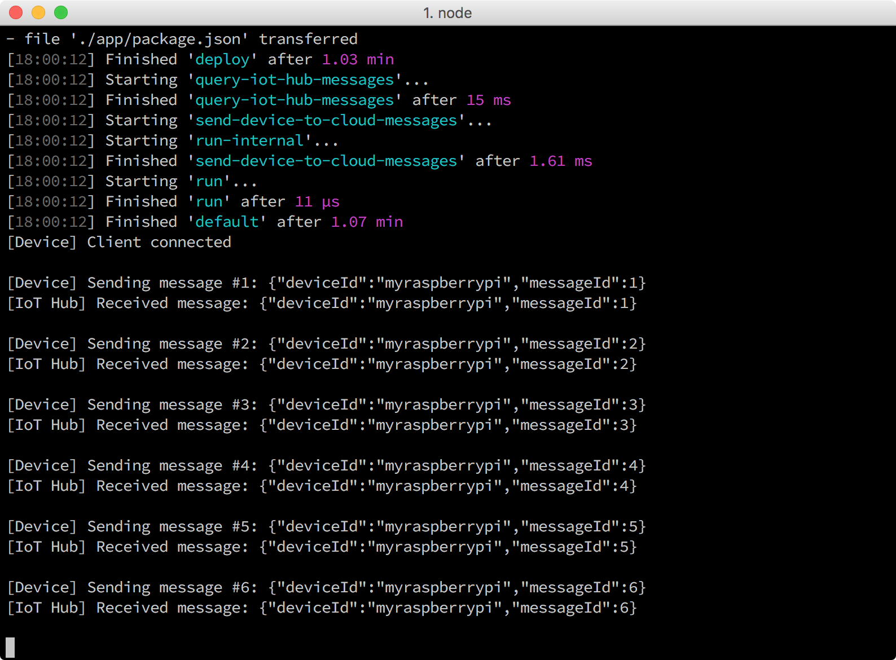

<properties
    pageTitle="将设备到云的消息发送到 Azure IoT 中心 | Azure"
    description="将示例应用程序部署到 Raspberry Pi 3 并运行，以便将消息发送到 IoT 中心并使 LED 闪烁。"
    services="iot-hub"
    documentationcenter=""
    author="shizn"
    manager="timlt"
    tags=""
    keywords="闪烁 led 云 pi, 云中的 led 闪烁" />
<tags
    ms.assetid="427d8e5e-8af8-4249-8607-44edc90a4972"
    ms.service="iot-hub"
    ms.devlang="node"
    ms.topic="article"
    ms.tgt_pltfrm="na"
    ms.workload="na"
    ms.date="11/28/2016"
    wacn.date="01/13/2017"
    ms.author="xshi" />  

# 运行示例应用程序，以便发送从设备到云的消息
## 执行的操作
本文介绍如何在 Raspberry Pi 3 上部署和运行示例应用程序，以便将消息发送到 IoT 中心。如果有问题，可在[故障排除页](/documentation/articles/iot-hub-raspberry-pi-kit-node-troubleshooting/)上查找解决方案。

## 你要学习的知识
用户将学习如何使用 gulp 工具在 Pi 上部署和运行示例性的 Node.js 应用程序。

## 需要什么
在开始此任务之前，用户必须已成功完成[创建 Azure 函数应用和存储帐户，以便处理和存储 IoT 中心消息](/documentation/articles/iot-hub-raspberry-pi-kit-node-lesson3-deploy-resource-manager-template/)。

## 获取 IoT 中心和设备连接字符串
Pi 使用设备连接字符串连接到 IoT 中心。IoT 中心连接字符串用于连接到 IoT 中心中的标识注册表，以便管理允许连接到 IoT 中心的设备。

* 运行以下 Azure CLI 命令，列出资源组中的所有 IoT 中心：

	az iot hub list -g iot-sample --query [].name

使用 `iot-sample` 作为 `{resource group name}` 的值（如果尚未更改此值）。

* 运行以下 Azure CLI 命令，获取 IoT 中心连接字符串：

	az iot hub show-connection-string --name {my hub name} -g iot-sample

`{my hub name}` 是用户在创建 IoT 中心和注册 Pi 时指定的名称。

* 运行以下命令，获取设备连接字符串：

	az iot device show-connection-string --hub-name {my hub name} --device-id myraspberrypi -g iot-sample

使用 `myraspberrypi` 作为 `{device id}` 的值（如果尚未更改此值）。

## 配置设备连接
1. 运行以下命令初始化配置文件：
   
        npm install
        gulp init

2. 运行以下命令，在 Visual Studio Code 中打开设备配置文件 `config-raspberrypi.json`：
   

        # For Windows command prompt
        code %USERPROFILE%\.iot-hub-getting-started\config-raspberrypi.json
       
        # For macOS or Ubuntu
        code ~/.iot-hub-getting-started/config-raspberrypi.json

   
      

3. 在 `config-raspberrypi.json` 文件中进行以下替换：
   
   * 将 **\[设备主机名或 IP 地址\]** 替换为从 `device-discovery-cli` 获取的设备 IP 地址或主机名，或替换为配置设备时继承的值。
   * 将 **\[IoT 设备连接字符串\]** 替换为获得的 `device connection string`。
   * 将 **\[IoT 中心连接字符串\]** 替换为获得的 `iot hub connection string`。

更新 `config-raspberrypi.json` 文件，以便部署计算机中的示例应用程序。

## 部署并运行示例应用程序
运行以下命令，在 Pi 上部署并运行示例应用程序：

	gulp deploy && gulp run

## 验证示例应用程序是否正常运行
用户会看到连接到 Pi 的 LED 每隔两秒闪烁一次。每次 LED 闪烁时，示例应用程序都会将消息发送到 IoT 中心，并验证该消息是否已成功发送到 IoT 中心。此外，IoT 中心收到的每条消息都会在控制台窗口输出。示例应用程序发送 20 条消息后会自动终止。

  

## 摘要
用户已在 Pi 上部署和运行新的 blink 示例应用程序，目的是将从设备到云的消息发送到 IoT 中心。用户现在可以在将消息写入到存储帐户时对其进行监视。

## 后续步骤
[读取保存在 Azure 存储中的消息](/documentation/articles/iot-hub-raspberry-pi-kit-node-lesson3-read-table-storage/)

<!---HONumber=Mooncake_0109_2017-->
<!--Update_Description:update wording and code-->