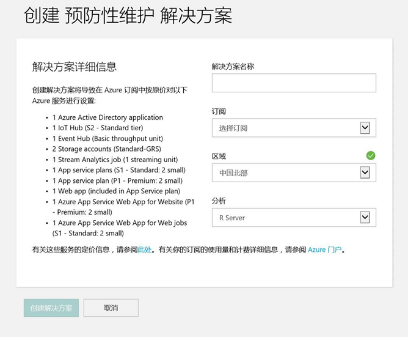

<properties
    pageTitle="预见性维护预配置解决方案 | Azure"
    description="介绍 Azure IoT 套件预见性维护预配置解决方案。"
    services=""
    suite="iot-suite"
    documentationcenter=""
    author="dominicbetts"
    manager="timlt"
    editor="" />
<tags
    ms.assetid="b370b3d7-2ce5-4906-9818-3aeedd471ee3"
    ms.service="iot-suite"
    ms.devlang="na"
    ms.topic="get-started-article"
    ms.tgt_pltfrm="na"
    ms.workload="na"
    ms.date="01/16/2017"
    wacn.date="02/22/2017"
    ms.author="dobett" />  

# 预见性维护预配置解决方案概述

*预见性维护* [预配置解决方案][lnk_preconfigured_solutions]是 [ Azure IoT 套件][lnk_iot_suite]预配置解决方案之一。此解决方案将实时设备遥测收集与使用 [Microsoft R Server](https://www.microsoft.com/en-sa/cloud-platform/r-server)创建的预测模型相集成。

使用 Azure IoT 套件，企业可以快速方便地连接和监视资产，实时分析数据。预见性维护预配置解决方案会利用该数据及丰富的仪表板与可视化效果，为用户提供新的信息，提升其效率及增加收入来源。

## 应用场景
Fabrikam 是一家区域性航空公司，致力于以优惠的价格为客户提供优质的体验。维护问题是造成航班延误的原因之一，而飞机引擎维护又是其中最为棘手的项目。因为必须严防飞行期间发生引擎故障，所以 Fabrikam 不仅会定期检查其引擎，而且会恪守所安排的维护计划。但因为飞机引擎的问题不一，所以有一些引擎维护工作并非必要。更重要的是，若在执行维护工作之前发生问题，可能会造成飞机停飞。这些问题会造成严重的损失，而飞机所在地点若正好缺少适当的技术人员或备用零件，将更为严重。

Fabrikam 飞机的引擎由各种传感器进行检测，这些传感器监视飞行期间的引擎状况。Fabrikam 使用预见性维护预配置解决方案收集飞行期间所收集的传感器数据。经过多年累积引擎运行数据和故障数据之后，Fabrikam 的数据科学家制作出了一个模型，可以预测飞机引擎的剩余使用寿命 (RUL)。他们从四个引擎传感器的数据中，找出了数据之间的相关性，而其中一个引擎更潜藏了最终会导致引擎故障的问题。Fabrikam 现在除了继续执行定期检查来确保安全之外，还会在每次飞行后，使用模型来计算每个引擎的 RUL。该模型使用飞行期间从引擎收集的遥测数据。Fabrikam 现在可以预测未来的故障点，并预先规划维护和维修工作。

> [AZURE.NOTE]
该解决方案模型使用实际的引擎损耗数据。

通过预测必要维护时间点，Fabrikam 可以优化各项作业，进而降低成本。维护专员与排班专员一起合作：

- 根据飞机在特定地点停机的时间规划维护。
- 确保飞机有足够的停飞时间，不会造成排班中断。
- 安排技术人员，确保飞机无需浪费时间等待，就可获得有效率的维修。

库存控制管理员会收到维护计划，因此可以优化其订单流程和备用零件库存。所有这些因素不仅让 Fabrikam 可以将飞机停飞的时间降至最低，还可以降低运营成本，同时确保了乘客与乘务员的安全。

若要了解 [Azure IoT 套件][lnk_iot_suite]如何提供这些功能，客户需要先了解预见性维护，请查看此[信息图][lnk_infographic]。

## 如何生成预见性维护解决方案

Azure 基于公开的数据[1] 构建了飞机引擎的[回归模型][lnk_regression_model]，并发布了有关如何使用该模型的分步指南。

Azure IoT 预见性维护预配置解决方案使用通过此模板创建的回归模型。该模型将部署到 Azure 订阅，通过自动生成的 API 公开。该解决方案包含代表 4 个（共 100 个）引擎和 4 个（共 21 个）传感器数据流的测试数据的子集，可通过定型模型提供精确的结果。

*[1] A. Saxena and K. Goebel (2008)."Turbofan Engine Degradation Simulation Data Set", NASA Ames Prognostics Data Repository (http://ti.arc.nasa.gov/tech/dash/pcoe/prognostic-data-repository/), NASA Ames Research Center, Moffett Field, CA*

## 预见性维护入门

本教程介绍如何预配预见性维护解决方案。其中还逐步讲解了预见性维护解决方案的基本功能。可以通过随预配置解决方案一起部署的解决方案仪表板来访问其中的多项功能。

需要有效的 Azure 订阅才能完成此教程。

> [AZURE.NOTE]
如果没有帐户，只需花费几分钟就能创建一个试用帐户。有关详细信息，请参阅 [Azure 试用][lnk_free_trial]。

1. 使用 Azure 帐户凭据登录到 [azureiotsuite.cn][lnk-azureiotsuite]，然后单击“+”创建解决方案。
1. 单击“选择预测维护”磁贴。
1. 为预见性维护预配置解决方案输入**解决方案名称**。
1. 选择要用于预配解决方案的“区域”和“订阅”。
1. 单击“创建解决方案”开始预配过程。运行此过程通常需要花费几分钟时间。

### 等待预配过程完成

1. 单击状态为“正在预配”的解决方案的磁贴。
1. 在 Azure 订阅中部署 Azure 服务时，请注意“预配状态”。
1. 预配完成后，状态会更改为“就绪”。
1. 单击磁贴，右窗格中随即会显示解决方案的详细信息。

> [AZURE.NOTE]
如果在部署预配置解决方案时遇到问题，请查看 [azureiotsuite.cn 站点上的权限][lnk-permissions]和[常见问题][lnk-faq]。如果问题仍然存在，请在[门户][lnk-portal]中创建服务票证。

以下屏幕截图显示了完成预配后的解决方案面板：

 

在此面板中，可以：

- 启动解决方案仪表板。
- 下载远程登录文件，用于连接到解决方案中的 R Server。
- 查看有关 R Server 的详细信息。

是否有你预期会看到但没有列出的解决方案详细信息？ 请在[用户之声](https://feedback.azure.com/forums/321918-azure-iot)中向我们提供功能建议。

## 查看解决方案

本部分逐步讲解解决方案 UI。

### 预见性维护仪表板
Web 应用程序中的此页面会使用 PowerBI JavaScript 控件（请参阅 [PowerBI-visuals repository][lnk-powerbi]（PowerBI 可视化效果存储库））以可视化方式呈现：

* blob 存储中流分析作业的输出数据。
* 每个飞机引擎的 RUL 和周期计数。

### 观察云解决方案的行为
在 Azure 门户中，可导航到带所选解决方案名称的资源组，查看预配解决方案。

![][img-resource-group]  

在预配包含 R Server 的预配置解决方案期间，界面中会显示服务器的链接。此外，当解决方案处于“就绪”状态时，可通过解决方案的 [azureiotsuite.cn][lnk-azureiotsuite]页连接到 R Server。

在解决方案门户中，可看到本示例预配了 4 个模拟设备，表示各有两个引擎的两架飞机，且每个引擎有 4 个传感器。当你第一次导航到解决方案门户时，模拟便会停止。

![][img-simulation-stopped]  

单击“开始模拟”即可开始模拟，在此期间仪表板上将填写传感器历史记录、RUL、周期和 RUL 历史记录。

![][img-simulation-running]  

RUL 小于 160 时（出于演示目的而选择的任意阈值），解决方案门户会在 RUL 旁边显示警告符号，并将飞机引擎高亮为黄色。请注意 RUL 值如何整体下滑但倾向于上下波动。此行为的原因是周期长度和模型精确度不同。

![][img-simulation-warning]  

完整模拟需要约 35 分钟的时间才能完成 148 个周期。160 RUL 阈值第一次在大约 5 分钟的时候达到，而这两个引擎在大约 8 分钟的时候同时达到阈值。

模拟会彻底运行 148 个周期的完整数据集并确定最终的 RUL 和周期值。

你可以随时停止模拟，但单击“开始模拟”会从数据集的开头重播模拟。

## 后续步骤

若要了解有关 Azure IoT 如何实现预见性维护方案的详细信息，请阅读 [Capture value from the Internet of Things][lnk_capture_value]（捕获物联网的价值）。

[演练][lnk-predictive-walkthrough]预见性维护预配置解决方案。

你还可以浏览 IoT 套件预配置的解决方案的一些其他特性和功能：

* [有关 IoT 套件的常见问题][lnk-faq]
* [从头开始保障 IoT 安全][lnk-security-groundup]

[img-resource-group]: ./media/iot-suite-predictive-overview/resource-group.png
[img-simulation-stopped]: ./media/iot-suite-predictive-overview/simulation-stopped.png
[img-simulation-running]: ./media/iot-suite-predictive-overview/simulation-running.png
[img-simulation-warning]: ./media/iot-suite-predictive-overview/simulation-warning.png
[img-provisioning-complete]: ./media/iot-suite-predictive-overview/provisioned.png

[lnk-powerbi]: https://www.github.com/Microsoft/PowerBI-visuals
[lnk-predictive-walkthrough]: /documentation/articles/iot-suite-predictive-walkthrough/
[lnk_preconfigured_solutions]: /documentation/articles/iot-suite-what-are-preconfigured-solutions/
[lnk_iot_suite]: /documentation/articles/iot-suite-overview/
[lnk_infographic]: https://www.microsoft.com/server-cloud/predictivemaintenance/Index.html
[lnk_regression_model]: http://gallery.cortanaanalytics.com/Collection/Predictive-Maintenance-Template-3

[lnk_capture_value]: http://download.microsoft.com/download/0/7/D/07D394CE-185D-4B96-AC3C-9B61179F7080/Capture_value_from_the_Internet%20of%20Things_with_Predictive_Maintenance.PDF
[lnk-faq]: /documentation/articles/iot-suite-faq/
[lnk-security-groundup]: /documentation/articles/securing-iot-ground-up/
[lnk-azureiotsuite]: https://www.azureiotsuite.cn/
[lnk_free_trial]: /pricing/1rmb-trial/
[lnk-azureiotsuite]: https://www.azureiotsuite.cn
[lnk-permissions]: /documentation/articles/iot-suite-permissions/
[lnk-portal]: http://portal.azure.cn/

<!---HONumber=Mooncake_0206_2017-->