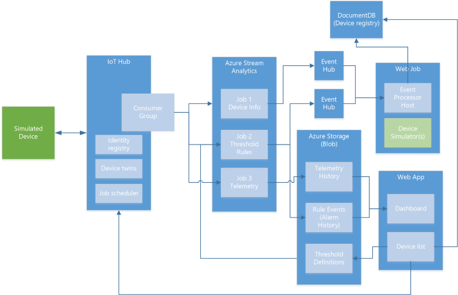

<properties
 pageTitle="远程监视预配置解决方案演练 | Azure"
 description="介绍 Azure IoT 预配置解决方案远程监视及其体系结构。"
 services=""
 suite="iot-suite"
 documentationCenter=""
 authors="dominicbetts"
 manager="timlt"
 editor=""/>  

<tags
 ms.service="iot-suite"
 ms.date="07/18/2016"
 wacn.date="09/05/2016"/>

# 远程监视预配置解决方案演练

## 介绍

IoT 套件远程监视[预配置解决方案][lnk-preconfigured-solutions]是适用于在远程位置运行的多个计算机的端到端监视解决方案实现。该解决方案结合了关键 Azure 服务来提供业务方案的通用实现，你可以将其用作自己实现的起点。你可以根据特定的业务要求[自定义][lnk-customize]该解决方案。

本文将逐步讲解远程监视解决方案的一些关键要素，以帮助你了解其工作原理。获得这些知识有助于对解决方案进行故障排除，根据自己的具体要求规划如何自定义解决方案，以及规划自己的、使用 Azure 服务的 IoT 解决方案。

## 逻辑体系结构

下图概述该预配置解决方案的逻辑组件：

  


## 模拟设备

在该预配置解决方案中，模拟设备表示冷却设备（例如建筑物空调或设施空气处理单位）。当你部署预配置解决方案时，也会自动预配四个在 [Azure Web 作业][lnk-webjobs]中运行的模拟设备。模拟设备可让你轻松观测解决方案的行为，而不需要部署任何物理设备。若要部署实际的物理设备，请参阅 [Connect your device to the remote monitoring preconfigured solution][lnk-connect-rm]（将设备连接到远程监视预配置解决方案）教程。

每个模拟设备可将以下消息类型发送到 IoT 中心：

| 消息 | 说明 |
|----------|-------------|
| 启动 | 当设备启动时，它会发送**设备信息**消息，其中包含自身的相关信息，例如设备 ID、设备元数据、设备支持的命令列表，以及设备的当前配置。 |
| 状态 | 设备定期发送**状态**消息，以报告该设备是否可以感应到传感器的状态。 |
| 遥测 | 设备定期发送**遥测**消息，以报告从连接到模拟设备的模拟传感器收集到的温度和湿度模拟值。 |


模拟设备在**设备信息**消息中发送以下设备属性：

| 属性 | 目的 |
|------------------------|--------- |
| 设备 ID | 在解决方案中创建设备时所提供或分配的 ID。 |
| 制造商 | 设备制造商 |
| 型号 | 设备的型号 |
| 序列号 | 设备的序列号 |
| 固件 | 设备上的当前固件版本 |
| 平台 | 设备的平台体系结构 |
| 处理器 | 运行设备的处理器 |
| 已安装的 RAM | 在设备上安装的 RAM 量 |
| 中心已启用状态 | 设备的 IoT 中心状态属性 |
| 创建时间 | 在解决方案中创建设备的时间 |
| 更新时间 | 设备上次更新属性的时间 |
| 纬度 | 设备的纬度位置 |
| 经度 | 设备的经度位置 |

模拟器会以示例值在模拟设备中植入这些属性。模拟器每次初始化模拟设备时，设备会将预定义的元数据发布到 IoT 中心。请注意，这会覆盖设备门户中所做的任何元数据更新。


模拟设备可以处理通过 IoT 中心从解决方案仪表板发送的以下命令：

| 命令 | 说明 |
|------------------------|-----------------------------------------------------|
| PingDevice | 向设备发送 _ping_ 以检查其是否处于活动状态 |
| StartTelemetry | 使设备开始发送遥测 |
| StopTelemetry | 使设备停止发送遥测 |
| ChangeSetPointTemp | 更改设置点值（将围绕其生成随机数据） |
| DiagnosticTelemetry | 触发设备模拟器以发送其他遥测值 (externalTemp) |
| ChangeDeviceState | 更改设备的扩展状态属性，并从设备发送设备信息消息 |

发送给解决方案后端的设备命令确认通过 IoT 中心提供。

## IoT 中心

[IoT 中心][lnk-iothub]将引入从设备发送到云的数据，并将其提供给 Azure 流分析 (ASA) 作业。IoT 中心还会代表设备门户向你的设备发送命令。每个流 ASA 作业使用不同的 IoT 中心使用者组从设备读取消息流。

## Azure 流分析

在远程监视解决方案中，[Azure 流分析][lnk-asa] (ASA) 将通过 IoT 中心从设备接收的消息分发到其他后端组件进行处理或存储。不同的 ASA 作业根据消息内容执行特定的功能。

**作业 1：设备信息**会筛选来自传入消息流的设备信息消息，并将它们发送到事件中心终结点。设备会在启动时发送设备信息消息，并且响应 **SendDeviceInfo** 命令。此作业使用以下查询定义来识别**设备信息**消息：

```
SELECT * FROM DeviceDataStream Partition By PartitionId WHERE  ObjectType = 'DeviceInfo'
```

此作业将其输出发送到事件中心做进一步处理。

**作业 2：规则**会针对每个设备的阈值评估传入温度和湿度遥测值。阈值在解决方案仪表板上的规则编辑器中设置。每个设备/值对按照时间戳存储在 Blob 中，流分析将读入该对作为**参考数据**。该作业会针对设备的设置阈值比较任何非空值。如果超过“>”条件，该作业将输出**警报**事件，表示已超过阈值，并且提供设备、值和时间戳值。此作业使用以下查询定义来识别应触发警报的遥测消息：
	
	WITH AlarmsData AS 
	(
	SELECT
	     Stream.DeviceID,
	     'Temperature' as ReadingType,
	     Stream.Temperature as Reading,
	     Ref.Temperature as Threshold,
	     Ref.TemperatureRuleOutput as RuleOutput,
	     Stream.EventEnqueuedUtcTime AS [Time]
	FROM IoTTelemetryStream Stream
	JOIN DeviceRulesBlob Ref ON Stream.DeviceID = Ref.DeviceID
	WHERE
	     Ref.Temperature IS NOT null AND Stream.Temperature > Ref.Temperature
	
	UNION ALL
	
	SELECT
	     Stream.DeviceID,
	     'Humidity' as ReadingType,
	     Stream.Humidity as Reading,
	     Ref.Humidity as Threshold,
	     Ref.HumidityRuleOutput as RuleOutput,
	     Stream.EventEnqueuedUtcTime AS [Time]
	FROM IoTTelemetryStream Stream
	JOIN DeviceRulesBlob Ref ON Stream.DeviceID = Ref.DeviceID
	WHERE
	     Ref.Humidity IS NOT null AND Stream.Humidity > Ref.Humidity
	)
	
	SELECT *
	INTO DeviceRulesMonitoring
	FROM AlarmsData
	
	SELECT *
	INTO DeviceRulesHub
	FROM AlarmsData

该作业将其输出发送到事件中心做进一步处理，并将每个警报的详细信息保存到 Blob 存储，解决方案仪表板可从该位置读取警报信息。

**作业 3：遥测**会通过两种方法来操作传入设备遥测流。第一种方法会将设备的所有遥测消息发送到永久性 Blob 存储以进行长期存储。第二种方法会通过五分钟滑动窗口计算平均、最小和最大湿度值，并将此数据发送到 Blob 存储。解决方案仪表板从 Blob 存储读取遥测数据来填充图表。此作业使用下列查询定义：

	
	WITH 
	    [StreamData]
	AS (
	    SELECT
	        *
	    FROM 
	      [IoTHubStream] 
	    WHERE
	        [ObjectType] IS NULL -- Filter out device info and command responses
	) 
	
	SELECT
	    *
	INTO
	    [Telemetry]
	FROM
	    [StreamData]
	
	SELECT
	    DeviceId,
	    AVG (Humidity) AS [AverageHumidity], 
	    MIN(Humidity) AS [MinimumHumidity], 
	    MAX(Humidity) AS [MaxHumidity], 
	    5.0 AS TimeframeMinutes 
	INTO
	    [TelemetrySummary]
	FROM
	    [StreamData]
	WHERE
	    [Humidity] IS NOT NULL
	GROUP BY
	    DeviceId, 
	    SlidingWindow (mi, 5)

## 事件中心

**设备信息**和**规则** ASA 作业将数据输出到事件中心，以便可靠地转发给 Web 作业中运行的**事件处理器**。

## Azure 存储空间

解决方案使用 Azure Blob 存储来保存解决方案设备中的所有原始数据和汇总的遥测数据。仪表板从 Blob 存储读取遥测数据来填充图表。为了显示警报，仪表板将从 Blob 存储读取当遥测值超过设置的阈值时所记录的数据。解决方案还使用 Blob 存储来记录用户在仪表板中设置的阈值。

## Web 作业

除了托管设备模拟器以外，解决方案中的 Web 作业还托管 Azure Web 作业中运行的、用于处理设备信息消息和命令响应的**事件处理器**。它使用：

- 具有当前设备信息的设备信息消息以更新设备注册表（存储在 DocumentDB 数据库中）。
- 命令响应消息以更新设备命令历史记录（存储在 DocumentDB 数据库中）。

## DocumentDB

解决方案使用 DocumentDB 数据库来存储连接到解决方案的设备信息，例如设备的元数据以及从仪表板发送到设备的命令历史记录。

## Web 应用

### 远程监视仪表板
Web 应用程序中的此页面使用 PowerBI javascript 控件（请参阅 [PowerBI-visuals repo（PowerBI 可视化效果存储库）](https://www.github.com/Microsoft/PowerBI-visuals)）来可视化设备发送的遥测数据。解决方案使用 ASA 遥测作业将遥测数据写入 Blob 存储。


### 设备管理门户

此 Web 应用可让你：

- 预配新设备。这会设置唯一设备 ID 并生成身份验证密钥。将有关设备的信息同时写入 IoT 中心标识注册表以及特定于解决方案的 DocumentDB 数据库。
- 管理设备属性。这包括查看现有属性和使用新属性进行更新。
- 将命令发送到设备。
- 查看设备的命令历史记录。
- 启用和禁用设备。

## 后续步骤

以下 TechNet 博客文章提供了有关远程监视预配置解决方案的更多详细信息：

- [IoT Suite - Under The Hood - Remote Monitoring（IoT 套件 - 幕后 - 远程监视）](http://social.technet.microsoft.com/wiki/contents/articles/32941.iot-suite-under-the-hood-remote-monitoring.aspx)
- [IoT Suite - Remote Monitoring - Adding Live and Simulated Devices（IoT 套件 - 远程监视 - 添加实时与模拟设备）](http://social.technet.microsoft.com/wiki/contents/articles/32975.iot-suite-remote-monitoring-adding-live-and-simulated-devices.aspx)

你可以通过阅读以下文章继续开始使用 IoT 套件：

- [将设备连接到远程监视预配置解决方案][lnk-connect-rm]
- [azureiotsuite.cn 站点权限][lnk-permissions]

[lnk-preconfigured-solutions]: /documentation/articles/iot-suite-what-are-preconfigured-solutions/
[lnk-customize]: /documentation/articles/iot-suite-guidance-on-customizing-preconfigured-solutions/
[lnk-iothub]: /documentation/services/iot-hub/
[lnk-asa]: /documentation/services/stream-analytics/
[lnk-webjobs]: /documentation/articles/websites-webjobs-resources/
[lnk-connect-rm]: /documentation/articles/iot-suite-connecting-devices/
[lnk-permissions]: /documentation/articles/iot-suite-permissions/

<!---HONumber=Mooncake_0815_2016-->