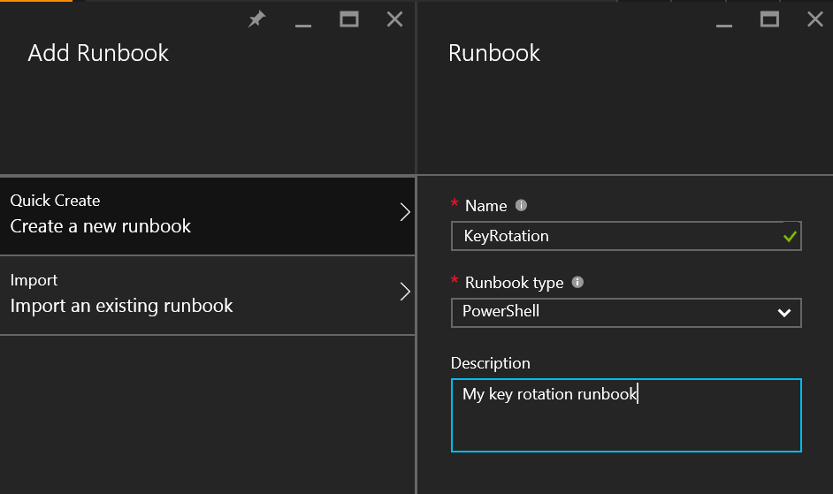

<properties
    pageTitle="使用端到端密钥轮替和审核设置 Azure 密钥保管库 | Azure"
    description="使用本操作指南帮助设置密钥轮替和监视密钥保管库日志。"
    services="key-vault"
    documentationcenter=""
    author="swgriffith"
    manager="mbaldwin"
    tags=""
    translationtype="Human Translation" />
<tags
    ms.assetid="9cd7e15e-23b8-41c0-a10a-06e6207ed157"
    ms.service="key-vault"
    ms.workload="identity"
    ms.tgt_pltfrm="na"
    ms.devlang="na"
    ms.topic="article"
    ms.date="01/07/2017"
    wacn.date="05/08/2017"
    ms.author="jodehavi;stgriffi"
    ms.sourcegitcommit="2c4ee90387d280f15b2f2ed656f7d4862ad80901"
    ms.openlocfilehash="5397742e9bfdfafddd63dd9c389e23659cc47d7d"
    ms.lasthandoff="04/28/2017" />

# 使用端到端密钥轮替和审核设置 Azure Key Vault
## 介绍
创建 Key Vault 后，可以开始使用该保管库存储密钥和机密。 应用程序不再需要保存密钥或机密，而会根据需要从密钥保管库请求密钥或机密。 这样，便可以更新密钥和机密，不会影响应用程序，同时可以各种可能的方法管理密钥和机密。

本文将演练一个使用 Azure Key Vault 来存储机密的示例。在本例中，应用程序将访问 Azure 存储帐户机密。 本文还将演示如何实现该存储帐户机密的计划轮替。 最后，本文将逐步演示如何监视 Key Vault 审核日志，并在收到意外的请求时发出警报。

> [AZURE.NOTE]
> 本教程不详细说明密钥保管库的初始设置。 有关这方面的信息，请参阅 [Get started with Azure Key Vault](/documentation/articles/key-vault-get-started/)（Azure 密钥保管库入门）。 有关跨平台命令行接口说明，请参阅[使用 CLI 管理密钥保管库](/documentation/articles/key-vault-manage-with-cli/)。
>
>

## 设置密钥保管库
若要使应用程序能够从 Key Vault 检索机密，必须先创建机密并将其上载到保管库。 此操作可通过以下方式实现：启动 Azure PowerShell 会话，然后使用以下命令登录你的 Azure 帐户：

    Login-AzureRmAccount -EnvironmentName AzureChinaCloud

在弹出的浏览器窗口中，输入你的 Azure 帐户用户名和密码。 PowerShell 将获取与此帐户关联的所有订阅。 PowerShell 默认使用第一个订阅。

如果你有多个订阅，可能需要指定创建 Key Vault 时所用的订阅。 输入以下命令查看帐户的订阅：

    Get-AzureRmSubscription

若要指定与你将日志记录的密钥保管库关联的订阅，请输入：

    Set-AzureRmContext -SubscriptionId <subscriptionID>

因为本文介绍了如何将存储帐户密钥存储为机密，因此你必须获取该存储帐户密钥。

    Get-AzureRmStorageAccountKey -ResourceGroupName <resourceGroupName> -Name <storageAccountName>

检索你的机密（在本例中，为存储帐户密钥）后，必须将该机密转换为安全字符串，然后在密钥保管库中使用该值创建机密。

    $secretvalue = ConvertTo-SecureString <storageAccountKey> -AsPlainText -Force

    Set-AzureKeyVaultSecret -VaultName <vaultName> -Name <secretName> -SecretValue $secretvalue

接下来，获取你创建的机密的 URI。 在后续步骤中调用 Key Vault 检索机密时，会用到该 URI。 运行以下 PowerShell 命令，并记下 ID 值（即机密 URI）：

    Get-AzureKeyVaultSecret -VaultName <vaultName>

## 设置应用程序
存储机密后，可以使用代码检索并使用它。 需要执行几个步骤才能实现此目的。 第一个也是最重要的步骤是向 Azure Active Directory 注册应用程序，然后让 Key Vault 知道应用程序的信息，以便允许来自应用程序的请求。

> [AZURE.NOTE]
> 必须在与 Key Vault 相同的 Azure Active Directory 租户上创建应用程序。
>
>

打开 Azure Active Directory 的“应用程序”选项卡。

选择“ADD”，向 Azure Active Directory 添加应用程序。

将应用程序类型保留为“Web 应用程序和/或 WEB API”，然后为应用程序命名。

为应用程序指定“登录 URL”和“应用 ID URI”。 可以在本演示中随意填写这些信息，以后也可以根据需要更改。

将应用程序添加到 Azure Active Directory 后，你将转到应用程序页。 单击“配置”选项卡，然后查找并复制“客户端 ID”值。 记下客户端 ID 以供后续步骤使用。

接下来，为你的应用程序生成密钥，以便它可以与 Azure Active Directory 交互。 可以在“配置”选项卡的“密钥”部分下创建此密钥。 记下在 Azure Active Directory 应用程序中新生成的密钥，以供后续步骤使用。

在建立从应用程序到密钥保管库的任何调用之前，必须让密钥保管库知道应用程序及其权限。 以下命令从 Azure Active Directory 应用获取保管库名称和客户端 ID，并为应用程序授予对密钥保管库的“Get”权限。

    Set-AzureRmKeyVaultAccessPolicy -VaultName <vaultName> -ServicePrincipalName <clientIDfromAzureAD> -PermissionsToSecrets Get

现在便可开始生成应用程序调用了。 在应用程序中，必须安装所需的 NuGet 包，以便与 Azure Key Vault和 Azure Active Directory 交互。 从 Visual Studio 包管理器控制台输入以下命令。 在编写本文时，Azure Active Directory 包的最新版本为 3.10.305231913，你可能想要确认最新版本并相应地更新。

    Install-Package Microsoft.IdentityModel.Clients.ActiveDirectory -Version 3.10.305231913

    Install-Package Microsoft.Azure.KeyVault

在应用程序代码中，创建一个类来保存 Azure Active Directory 身份验证的方法。 在本示例中，该类名为 **Utils**。 添加以下 using 语句：

    using Microsoft.IdentityModel.Clients.ActiveDirectory;

接下来，添加以下方法，从 Azure Active Directory 检索 JWT 令牌。 为了方便维护，请将硬编码的字符串值移到 Web 或应用程序配置中。

    public async static Task<string> GetToken(string authority, string resource, string scope)
    {
        var authContext = new AuthenticationContext(authority);

        ClientCredential clientCred = new ClientCredential("<AzureADApplicationClientID>","<AzureADApplicationClientKey>");

        AuthenticationResult result = await authContext.AcquireTokenAsync(resource, clientCred);

        if (result == null)

        throw new InvalidOperationException("Failed to obtain the JWT token");

        return result.AccessToken;
    }

添加所需的代码，调用密钥保管库并检索机密值。 首先，必须添加以下 using 语句：

    using Microsoft.Azure.KeyVault;

添加方法调用，调用密钥保管库并检索机密。 在此方法中，提供在前面步骤中保存的机密 URI。 请注意如何使用以前创建的“Utils”类中的 **GetToken** 方法。

    var kv = new KeyVaultClient(new KeyVaultClient.AuthenticationCallback(Utils.GetToken));

    var sec = kv.GetSecretAsync(<SecretID>).Result.Value;

现在，当你运行应用程序时，应该会向 Azure Active Directory 进行身份验证，然后从 Azure 密钥保管库中检索机密值。

## 使用 Azure 自动化进行密钥轮替
对于存储为 Azure 密钥保管库机密的值，可以使用多种选项实现其轮替策略。 机密可以手动轮替、使用 API 调用以编程方式轮替，或者通过自动化脚本来轮替。 本文将使用 Azure PowerShell 并结合 Azure 自动化来更改 Azure 存储帐户访问密钥。 然后使用该新密钥来更新 Key Vault 机密。

若要允许 Azure 自动化在密钥保管库中设置机密值，必须获取建立 Azure 自动化实例时所创建的名为“AzureRunAsConnection”的连接的客户端 ID。 可以通过从 Azure 自动化实例中选择“资产”获取此 ID。 在此处选择“连接”，然后选择“AzureRunAsConnection”服务主体。 请记下“应用程序 ID”。

在“资产”中，选择“模块”。 在“模块”中选择“库”，然后搜索并“导入”以下每个模块的更新版本：

    Azure
    Azure.Storage
    AzureRM.Profile
    AzureRM.KeyVault
    AzureRM.Automation
    AzureRM.Storage

> [AZURE.NOTE]
> 在撰写本文时，只需要针对以下脚本更新上面记下的模块。 如果自动化作业失败，请确认已导入所有必要的模块及其依赖项。
>
>

检索 Azure 自动化连接的应用程序 ID 之后，必须让 Key Vault 知道此应用程序有权更新保管库中的机密。 可以使用以下 PowerShell 命令实现此目的：

    Set-AzureRmKeyVaultAccessPolicy -VaultName <vaultName> -ServicePrincipalName <applicationIDfromAzureAutomation> -PermissionsToSecrets Set

接下来，选择 Azure 自动化实例下面的“Runbook”，然后选择“添加 Runbook”。 选择“快速创建”。 为 Runbook 命名，然后选择“PowerShell”作为 Runbook 类型。 你可以选择添加说明。 最后，单击“创建”。

将以下 PowerShell 脚本粘贴在新 Runbook 的编辑器窗格中：

    $connectionName = "AzureRunAsConnection"
    try
    {
        # Get the connection "AzureRunAsConnection "
        $servicePrincipalConnection=Get-AutomationConnection -Name $connectionName         

        "Logging in to Azure..."
        Add-AzureRmAccount -EnvironmentName AzureChinaCloud `
            -ServicePrincipal `
            -TenantId $servicePrincipalConnection.TenantId `
            -ApplicationId $servicePrincipalConnection.ApplicationId `
            -CertificateThumbprint $servicePrincipalConnection.CertificateThumbprint
        "Login complete."
    }
    catch {
        if (!$servicePrincipalConnection)
        {
            $ErrorMessage = "Connection $connectionName not found."
            throw $ErrorMessage
        } else{
            Write-Error -Message $_.Exception
            throw $_.Exception
        }
    }

    #Optionally you may set the following as parameters
    $StorageAccountName = <storageAccountName>
    $RGName = <storageAccountResourceGroupName>
    $VaultName = <keyVaultName>
    $SecretName = <keyVaultSecretName>

    #Key name. For example key1 or key2 for the storage account
    New-AzureRmStorageAccountKey -ResourceGroupName $RGName -Name $StorageAccountName -KeyName "key2" -Verbose
    $SAKeys = Get-AzureRmStorageAccountKey -ResourceGroupName $RGName -Name $StorageAccountName

    $secretvalue = ConvertTo-SecureString $SAKeys[1].Value -AsPlainText -Force

    $secret = Set-AzureKeyVaultSecret -VaultName $VaultName -Name $SecretName -SecretValue $secretvalue

在编辑器窗格中，选择“测试窗格”测试脚本。 正常运行脚本后，可以选择“发布”，然后返回 Runbook 的配置窗格以应用 Runbook 的计划。

