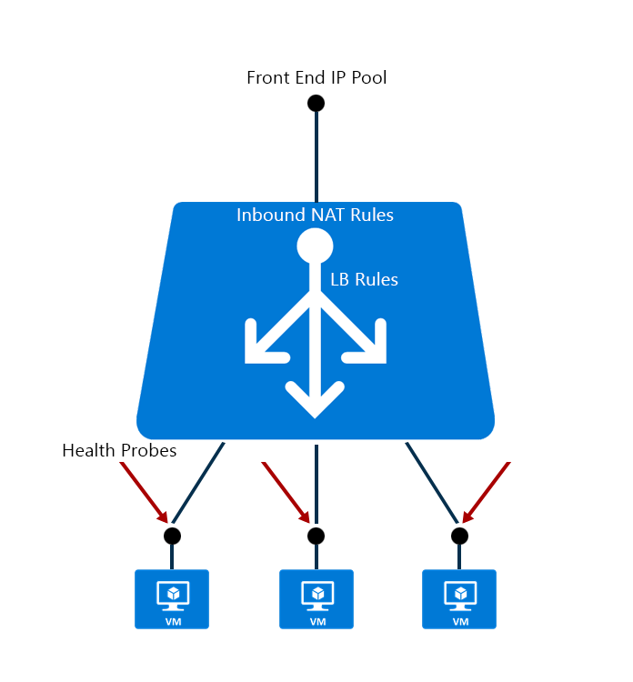

<properties
   pageTitle="Azure Resource Manager 对负载均衡器预览版的支持 | Azure "
   description="利用 Azure Resource Manager 预览版，将 powershell 用于负载均衡器。对负载均衡器使用模板"
   services="load-balancer"
   documentationCenter="na"
   authors="sdwheeler"
   manager="carmonm"
   editor="tysonn" />  

<tags
   ms.service="load-balancer"
   ms.devlang="na"
   ms.topic="article"
   ms.tgt_pltfrm="na"
   ms.workload="infrastructure-services"
   ms.date="08/25/2016"
   wacn.date="11/07/2016" />

# Azure Resource Manager 对负载均衡器的支持 

Azure Resource Manager 是 Azure 中的首选服务管理框架。Azure Load Balancer 可使用基于 Azure Resource Manager 的 API 和工具进行管理。

## 概念

借助 Resource Manager，Azure Load Balancer 包含以下子资源：

- 前端 IP 配置 – 单个负载均衡器可包含一个或多个前端 IP 地址（也称为虚拟 IP，即 VIP）。这些 IP 地址充当流量的入口。

- 后端地址池 – 即指与虚拟机网络接口卡 (NIC) 关联且要分配有负载的 IP 地址。

- 负载均衡规则 – 规则属性将给定的前端 IP 和端口组合映射到一组后端 IP 地址和端口组合。单个负载均衡器可拥有多个负载均衡规则。每个规则都包含前端 IP 和端口，以及与 VM 关联的后端 IP 和端口。

- 探测 – 使用探测可以跟踪 VM 实例的运行状况。如果运行状况探测失败，VM 实例将自动从轮转列表中删除。

- 入站 NAT 规则 – NAT 规则定义流过前端 IP 并分配到后端 IP 的入站流量。

## 快速入门模板

Azure Resource Manager 可让你使用声明性模板预配应用程序。在单个模板中，可以部署多个服务及其依赖项。在应用程序生命周期的每个阶段，可使用相同模板重复部署应用程序。

模板可包含以下项的定义：虚拟机、虚拟网络、可用性集、网络接口 (NIC)、存储帐户、负载均衡器、网络安全组和公开 IP。模板可用于创建复杂应用程序所需的一切内容。模板文件可签入到内容管理系统进行版本控制和协作。

[详细了解模板](http://go.microsoft.com/fwlink/?LinkId=544798)

[详细了解网络资源](/documentation/articles/resource-groups-networking/)

有关使用 Azure Load Balancer 的快速入门模板，可参阅 [GitHub 存储库](https://github.com/Azure/azure-quickstart-templates)（托管社区生成的一组模板）。

模板示例：

- [负载均衡器中的 2 个 VM 和负载均衡规则](https://github.com/Azure/azure-quickstart-templates/tree/master/201-2-vms-loadbalancer-lbrules)
- [VNET 中包含负载均衡器和负载均衡规则的 2 个 VM](https://github.com/Azure/azure-quickstart-templates/tree/master/201-2-vms-internal-load-balancer)
- [负载均衡器中的 2 个 VM，在 LB 上配置 NAT 规则](https://github.com/Azure/azure-quickstart-templates/tree/master/201-2-vms-loadbalancer-natrules)

## 使用 PowerShell 或 CLI 设置 Azure Load Balancer

Azure Resource Manager cmdlet、命令行工具和 REST API 入门

- [Azure 网络 Cmdlet](https://msdn.microsoft.com/zh-cn/library/azure/mt163510.aspx) 可用于创建负载均衡器。
- [How to create a load balancer using Azure Resource Manager（如何使用 Azure Resource Manager 创建负载均衡器）](/documentation/articles/load-balancer-get-started-ilb-arm-ps/)
- [Using the Azure CLI with Azure Resource Management（将 Azure CLI 与 Azure 资源管理配合使用）](/documentation/articles/xplat-cli-azure-resource-manager/)
- [Load Balancer REST APIs（负载均衡器 REST API）](https://msdn.microsoft.com/zh-cn/library/azure/mt163651.aspx)

## 后续步骤

还可以[开始创建面向 Internet 的负载均衡器](/documentation/articles/load-balancer-get-started-internet-arm-ps/)，并配置适合特定负载均衡器网络流量行为的[分发模式](/documentation/articles/load-balancer-distribution-mode/)类型。

了解如何管理[负载均衡器的空闲 TCP 超时设置](/documentation/articles/load-balancer-tcp-idle-timeout/)。应用程序对于负载均衡器后的服务器需要使连接保持活动状态时，这非常重要。

<!---HONumber=Mooncake_1031_2016-->