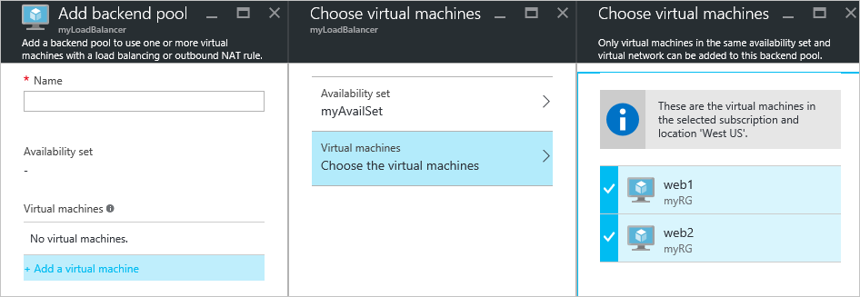
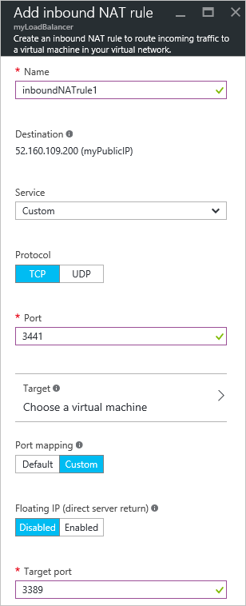

<properties
   pageTitle="使用 Azure 门户预览在 Resource Manager 中创建面向 Internet 的负载均衡器 | Azure"
   description="了解如何使用 Azure 门户预览在 Resource Manager 中创建面向 Internet 的负载均衡器"
   services="load-balancer"
   documentationCenter="na"
   authors="anavinahar"
   manager="narayan"
   editor=""
   tags="azure-resource-manager"
/>  

<tags
   ms.service="load-balancer"
   ms.devlang="na"
   ms.topic="article"
   ms.tgt_pltfrm="na"
   ms.workload="infrastructure-services"
   ms.date="09/14/2016"
   wacn.date="" />  

# 开始使用 Azure 门户预览创建面向 Internet 的负载均衡器

[AZURE.INCLUDE [load-balancer-get-started-internet-arm-selectors-include.md](../../includes/load-balancer-get-started-internet-arm-selectors-include.md)]

[AZURE.INCLUDE [load-balancer-get-started-internet-intro-include.md](../../includes/load-balancer-get-started-internet-intro-include.md)]

[AZURE.INCLUDE [azure-arm-classic-important-include](../../includes/azure-arm-classic-important-include.md)] 本文介绍资源管理器部署模型。还可以[了解如何使用经典部署创建面向 Internet 的负载均衡器](/documentation/articles/load-balancer-get-started-internet-classic-portal/)

[AZURE.INCLUDE [load-balancer-get-started-internet-scenario-include.md](../../includes/load-balancer-get-started-internet-scenario-include.md)]

这涵盖要创建负载均衡器所必须完成的单个任务的序列，以及详细说明要怎样做才能实现目标。

## 创建面向 Internet 的负载均衡器需要什么？

需要创建和配置以下对象以部署负载均衡器。

- 前端 IP 配置 - 包含传入网络流量的公共 IP 地址。

- 后端地址池 - 包含从负载均衡器接收网络流量的虚拟机网络接口 (NIC)。

- 负载均衡规则 - 包含将负载均衡器上的公共端口映射到后端地址池中的端口的规则。

- 入站 NAT 规则 - 包含将负载均衡器上的公共端口映射到后端地址池中特定虚拟机的端口的规则。

- 探测器 - 包含用于检查后端地址池中虚拟机实例的可用性的运行状况探测器。

可在以下网页中获取有关 Azure Resource Manager 的负载均衡器组件的详细信息：[Azure Resource Manager support for load balancer](/documentation/articles/load-balancer-arm/)（Azure Resource Manager 对负载均衡器的支持）。

## 在 Azure 门户预览中设置负载均衡器

> [AZURE.IMPORTANT] 本示例假定已有名为 **myVNet** 的虚拟网络。请参考[创建虚拟网络](/documentation/articles/virtual-networks-create-vnet-arm-pportal/)完成此操作。本示例还假定 **myVNet** 内有一个名为 **LB-Subnet-BE** 的子网以及两个分别名为 **web1** 和 **web2** 的 VM，这两个 VM 都位于 **myVNet** 中名为 **myAvailSet** 的可用性集中。请参考[此链接](/documentation/articles/virtual-machines-windows-hero-tutorial/)创建 VM。

1. 从浏览器导航到 Azure 门户预览：[http://portal.azure.cn](http://portal.azure.cn)，并使用 Azure 帐户登录。

2. 在屏幕的左上方，选择“新建”>“网络”>“负载均衡器”。

3. 在“创建负载均衡器”边栏选项卡中，为负载均衡器键入一个名称。此例中使用名称 **myLoadBalancer**。

4. 在“类型”下，选择“公共”。

5. 在“公共 IP 地址”下，创建名为 **myPublicIP** 的新公共 IP。

6. 在“资源组”下，选择“myRG”。然后，选择相应的**位置**，并单击“确定”。然后，负载均衡器将开始部署，成功完成部署需要几分钟的时间。

## 创建后端地址池

1. 成功部署负载均衡器后，请从资源中选择它。在“设置”下，选择“后端池”。为后端池键入名称。然后单击显示的边栏选项卡顶部附近的“添加”按钮。

2. 在“添加后端池”边栏选项卡中，单击“添加虚拟机”。在“可用性集”下，选择“选择可用性集”，然后选择“myAvailSet”。接下来，在边栏选项卡的“虚拟机”部分下选择“选择虚拟机”，然后单击为实现负载均衡而创建的两个 VM“web1”和“web2”。请确保这两个 VM 左侧都带有蓝色复选标记，如下图所示。然后，依次单击该边栏选项卡中的“选择”、“选择虚拟机”边栏选项卡中的“确定”和“添加后端池”边栏选项卡中的“确定”。

    

3. 进行相关检查，确保通知下拉列表中除了针对 VM **web1** 和 **web2** 的网络接口更新外，还包含有关保存负载均衡器后端池的更新。

## 创建探测器、LB 规则和 NAT 规则

1. 创建运行状况探测器。

    在负载均衡器的“设置”下，选择“探测器”。然后，单击边栏选项卡顶部的“添加”。

    可通过两种方法配置探测器：HTTP 或 TCP。此示例演示 HTTP 的配置，但可以按类似的方法配置 TCP。更新必要的信息。如前文所述，**myLoadBalancer** 将在端口 80 上实现流量的负载均衡。所选路径为 HealthProbe.aspx，时间间隔为 15 秒，不正常阈值为 2。完成后，单击“确定”以创建探测器。

    将指针悬停在“i”图标上可深入了解有关这些的配置的详细信息，以及可如何更改它们以满足特定要求。

    

2. 创建负载均衡器规则。

    单击负载均衡器的“设置”部分中的负载均衡规则。在“新建”边栏选项卡中，单击“添加”。为规则命名。此处使用 HTTP。选择前端和后端端口。此处，两个端口均选择 80。选择“LB-backend”作为后端池，选择以前创建的“HealthProbe”作为探测器。可根据用户的需求设置其他配置。然后，单击“确定”保存负载均衡规则。

    

3. 创建入站 NAT 规则

    单击负载均衡器的“设置”部分下的“入站 NAT 规则”。在“新建”边栏选项卡中，单击“添加”。然后，为入站 NAT 规则命名。此处使用名称 **inboundNATrule1**。目标应是以前创建的公共 IP。在“服务”下选择“自定义”，并选择要使用的协议。此处选择 TCP。输入端口 (3441) 和目标端口（此例中为 3389）。然后单击“确定”保存此规则。

    创建第一条规则后，对名为 inboundNATrule2 的第二个入站 NAT 规则重复此步骤（从端口 3442 到目标端口 3389）。

    

## 删除负载均衡器

若要删除负载均衡器，请选择要删除的负载均衡器。在“负载均衡器”边栏选项卡中，单击位于顶部的“删除”。然后在出现提示时选择“是”。

## 后续步骤

[开始配置内部负载均衡器](/documentation/articles/load-balancer-get-started-ilb-arm-cli)

[配置负载均衡器分发模式](/documentation/articles/load-balancer-distribution-mode)

[为负载均衡器配置空闲 TCP 超时设置](/documentation/articles/load-balancer-tcp-idle-timeout)

<!---HONumber=Mooncake_1031_2016-->