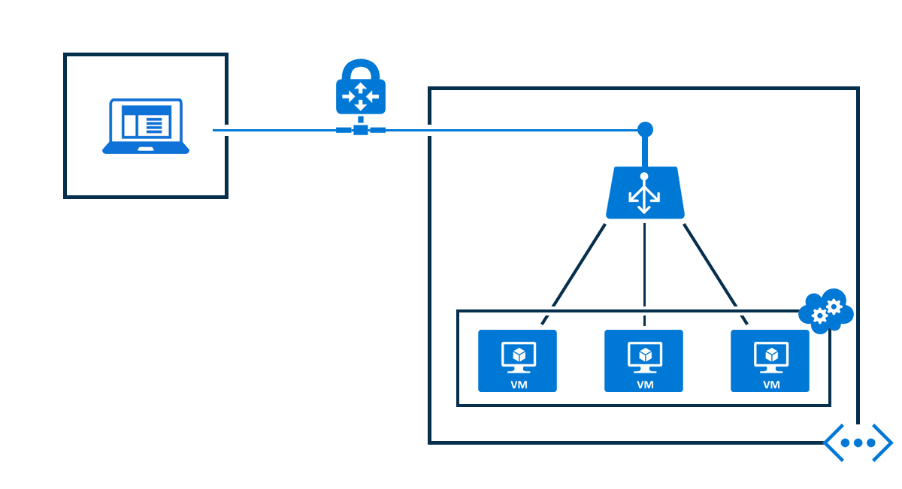

<properties 
   pageTitle="内部负载均衡器概述 | Azure"
   description="内部负载均衡器及其功能的概述。Azure 的负载均衡器的工作原理，以及配置内部终结点的可能方案"
   services="load-balancer"
   documentationCenter="na"
   authors="joaoma"
   manager="adinah"
   editor="tysonn" />
<tags 
   ms.service="load-balancer"
   ms.date="03/17/2016"
   wacn.date="08/29/2016" />  

# 内部负载均衡器概述

内部负载均衡器 (ILB) 是针对当前的面向 Internet 的负载均衡器（在 Azure 中提供）而实施的安全增强措施。只能通过云服务中的资源来访问 ILB，或者先通过 VPN 来访问 Azure 基础结构，然后再访问 ILB。
			
该基础结构限制了可访问性，在云服务或虚拟网络的经过负载平衡的虚拟 IP 地址之间创建信任边界，不会直接公开给 Internet 终结点。这样就可以让内部业务线应用程序在 Azure 中运行，只能在云中或本地进行访问。

## 内部负载均衡器方案

可以在许多新的配置中使用 ILB，具体包括：

Azure 内部负载平衡 (ILB) 可在驻留在云服务或虚拟网络（具有区域性作用域）中的虚拟机之间进行负载平衡。有关如何使用和配置具有区域性作用域的虚拟网络的信息，请参阅 Azure 博客中的 [Regional Virtual Networks](https://azure.microsoft.com/blog/2014/05/14/regional-virtual-networks/)（区域虚拟网络）。已配置关联组的现有虚拟网络无法使用 ILB。

ILB 允许进行下述全新类型的负载平衡：

- 在云服务中，从虚拟机负载平衡到驻留在同一云服务中的一组虚拟机（见图 1）。

- 在虚拟网络中，从该虚拟网络中的虚拟机负载平衡到驻留在该虚拟网络的同一云服务中的一组虚拟机（见图 2）。

- 对于跨界虚拟网络，从本地计算机负载平衡到驻留在该虚拟网络的同一云服务中的一组虚拟机（见图 3）。

现有的 Azure 负载平衡仅在基于 Internet 的计算机与云服务中的虚拟机之间进行负载平衡。可通过 ILB 启用在 Azure 中托管虚拟机的新功能。

- 面向 Internet 的多层应用程序，其中的后端层不面向 Internet，但需要针对面向 Internet 的层发出的流量进行负载平衡。
- 使托管在 Azure 中的业务线 (LOB) 应用程序实现负载平衡，而无需额外的负载均衡器硬件或软件。将本地服务器包含在一组流量已实现负载平衡的计算机中。
- 以下部分更详细说明了这些配置。

## 面向 Internet 的多层应用程序

Web 层包含 Internet 客户端的面向 Internet 的终结点，是负载平衡集的一部分。负载均衡器将来自 TCP 端口 443 (HTTPS) 的 Web 客户端的传入流量分发到 Web 服务器。

数据库服务器位于 ILB 终结点之后，Web 服务器使用该终结点进行存储。此数据库服务对终结点进行了负载平衡，该终结点的流量跨 ILB 集中的数据库服务器进行负载平衡。

下图说明了同一云服务中面向 Internet 的多层应用程序。

图 1

多层应用程序的另一可能方案是，ILB 部署到的云服务不同于使用 ILB 的服务的云服务。

使用同一虚拟网络的云服务将可访问该 ILB 终结点。

你可以在下图中看到，前端 Web 服务器所在的云服务不同于数据库后端，其利用的是同一虚拟网络中的 ILB 终结点。

图 2

  

## Intranet 业务线 (LOB) 应用程序

本地网络中客户端发出的流量跨 LOB 服务器集进行负载平衡，该服务器集使用到 Azure 网络的 VPN 连接。

该客户端计算机将可访问从 Azure VPN 服务（使用点到站点 VPN）发出的 IP 地址，并将允许使用托管在 ILB 终结点之后的 LOB 应用程序。

LOB 的另一方案是通过站点到站点 VPN 连接到在其中配置了 ILB 终结点的虚拟网络。这样即可将本地网络流量路由到 ILB 终结点。

## 后续步骤

[开始配置面向 Internet 的负载均衡器](/documentation/articles/load-balancer-get-started-internet-arm-ps/)

[开始配置内部负载均衡器](/documentation/articles/load-balancer-get-started-ilb-arm-ps/)

[配置负载均衡器分发模式](/documentation/articles/load-balancer-distribution-mode/)

[为负载均衡器配置空闲 TCP 超时设置](/documentation/articles/load-balancer-tcp-idle-timeout/)

 

<!---HONumber=Mooncake_0822_2016-->