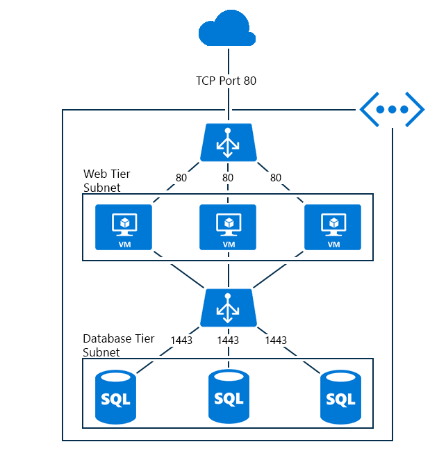

<properties
    pageTitle="内部负载均衡器概述 | Azure"
    description="内部负载均衡器及其功能的概述。Azure 的负载均衡器的工作原理，以及配置内部终结点的可能方案"
    services="load-balancer"
    documentationcenter="na"
    author="kumudd"
    manager="timlt"
    editor="tysonn"
    translationtype="Human Translation" />
<tags
    ms.assetid="36065bfe-0ef1-46f9-a9e1-80b229105c85"
    ms.service="load-balancer"
    ms.devlang="na"
    ms.topic="article"
    ms.tgt_pltfrm="na"
    ms.workload="infrastructure-services"
    ms.date="10/24/2016"
    wacn.date="05/08/2017"
    ms.author="kumud"
    ms.sourcegitcommit="2c4ee90387d280f15b2f2ed656f7d4862ad80901"
    ms.openlocfilehash="7a50970a9fd381744592d51986f5474d4e248782"
    ms.lasthandoff="04/28/2017" />

# Internal load balancer overview（内部负载均衡器概述）

与面向 Internet 的负载均衡器不同，内部负载均衡器 (ILB) 仅将流量定向到云服务内的资源，或使用 VPN 来访问 Azure 基础结构。 该基础结构限制了对云服务或虚拟网络的负载均衡虚拟 IP 地址 (VIP) 的访问，不会直接将这些地址公开给 Internet 终结点。 这让内部业务线 (LOB) 应用程序能够在 Azure 中运行，并可实现在云内或从本地资源访问这些应用程序。

## 需要内部负载均衡器的原因

Azure 内部负载均衡 (ILB) 可在驻留在云服务或虚拟网络（具有区域性作用域）中的虚拟机之间进行负载均衡。 有关如何使用和配置具有区域性作用域的虚拟网络的信息，请参阅 Azure 博客中的[区域虚拟网络](https://azure.microsoft.com/zh-cn/blog/2014/05/14/regional-virtual-networks/)。 已配置关联组的现有虚拟网络无法使用 ILB。

ILB 允许进行以下类型的负载均衡：

* 在云服务中，从虚拟机负载均衡到驻留在同一云服务中的一组虚拟机（见图 1）。
* 在虚拟网络中，从该虚拟网络中的虚拟机负载均衡到驻留在该虚拟网络的同一云服务中的一组虚拟机（见图 2）。
* 对于跨界虚拟网络，从本地计算机负载均衡到驻留在该虚拟网络的同一云服务中的一组虚拟机（见图 3）。
* 面向 Internet 的多层应用程序，其中的后端层不面向 Internet，但需要针对面向 Internet 的层发出的流量进行负载均衡。
* 使托管在 Azure 中的 LOB 应用程序实现负载均衡，而无需其他负载均衡器硬件或软件。 将本地服务器包含在一组流量已实现负载均衡的计算机中。

## 面向 Internet 的多层应用程序

Web 层包含 Internet 客户端的面向 Internet 的终结点，是负载均衡集的一部分。 负载均衡器将来自 TCP 端口 443 (HTTPS) 的 Web 客户端的传入流量分发到 Web 服务器。

数据库服务器位于 ILB 终结点之后，Web 服务器使用该终结点进行存储。 此数据库服务对终结点进行了负载均衡，该终结点的流量跨 ILB 集中的数据库服务器进行负载均衡。

下图显示同一云服务内面向 Internet 的多层应用程序。

图 1 - 面向 Internet 的多层应用程序

多层应用程序的另一可能用例是：ILB 部署到使用 ILB 服务的云服务以外的其他云服务。

使用同一虚拟网络的云服务将可访问该 ILB 终结点。 下图显示前端 Web 服务器所在的云服务不同于数据库后端所在的云服务，其利用的是同一虚拟网络中的 ILB 终结点。

图 2- 不同的云服务中的前端服务器

## Intranet 业务线应用程序

本地网络中客户端发出的流量跨 LOB 服务器集进行负载均衡，该服务器集使用到 Azure 网络的 VPN 连接。

客户端计算机可使用点到站点 VPN 通过 Azure VPN 服务访问 IP 地址。 它允许使用 ILB 终结点后面托管的 LOB 应用程序。

图 3 - LB 终结点后面托管的 LOB 应用程序

LOB 的另一方案是通过站点到站点 VPN 连接到在其中配置了 ILB 终结点的虚拟网络。 这样可以将本地网络流量路由到 ILB 终结点。

图 4 - 将本地网络流量路由到 ILB 终结点

## 限制

内部负载均衡器配置不支持 SNAT。 在本文档的上下文中，SNAT 指的是端口虚拟源网络地址转换。  这适用于以下方案：负载均衡器池中的 VM 需要访问各自内部负载均衡器的前端 IP 地址。 内部负载均衡器不支持此方案。 当流负载均衡到发出流的 VM 时，连接将失败。 必须为此类方案使用代理样式的负载均衡器。

## 后续步骤

[Azure 负载均衡器的 Azure Resource Manager 支持](/documentation/articles/load-balancer-arm/)

[开始配置面向 Internet 的负载均衡器](/documentation/articles/load-balancer-get-started-internet-arm-ps/)

[开始配置内部负载均衡器](/documentation/articles/load-balancer-get-started-ilb-arm-ps/)

[配置负载均衡器分发模式](/documentation/articles/load-balancer-distribution-mode/)

[配置负载均衡器的空闲 TCP 超时设置](/documentation/articles/load-balancer-tcp-idle-timeout/)

<!--Update_Description: update meta properties; wording update; add limitation content block-->