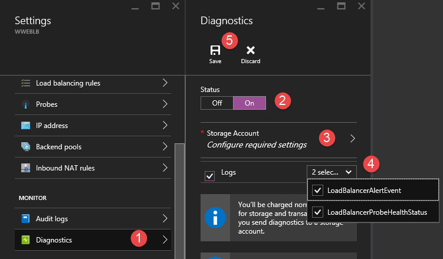

<!-- diagnostics unavailable in azure portal-->
<properties 
    pageTitle="监视负载均衡器的操作、事件和计数器 | Azure"
    description="了解如何为 Azure 负载均衡器启用警报事件以及探测运行状况日志记录"
    services="load-balancer"
    documentationCenter="na"
    author="kumudd"
    manager="timlt"
    tags="azure-resource-manager" />

<tags 
    ms.assetid="56656d74-0241-4096-88c8-aa88515d676d"
   ms.service="load-balancer"
   ms.devlang="na"
   ms.topic="article"
   ms.tgt_pltfrm="na"
   ms.workload="infrastructure-services"
   ms.date="10/24/2016"
    wacn.date="03/03/2017"
    ms.author="kumud" />  

# Azure 负载均衡器的 Log Analytics

可以在 Azure 中使用不同类型的日志对负载均衡器进行管理和故障排除。可通过门户访问其中某些日志。可从 Azure Blob 存储提取并在 Excel 和 PowerBI 等各种工具中查看所有日志。可从下表了解有关各种类型日志的详细信息。

* **审核日志：**可以使用 [Azure 审核日志](/documentation/articles/insights-debugging-with-events/)（以前称为操作日志）查看提交到你的 Azure 订阅的所有操作及其状态。默认情况下，审核日志已启用，并可在 Azure 门户中查看。
* **警报事件日志：**可以使用此日志来查看针对负载均衡器发出的警报。每隔五分钟收集一次负载均衡器的状态。仅在引发了负载均衡器警报事件的情况下，才会向此日志写入相关内容。
* **运行状况探测日志：**可以使用此日志来查看探测运行状况时的检查状态、负载均衡器后端处于联机状态的实例的数目，以及从负载均衡器接收网络流量的虚拟机的百分比。探测状态事件变化时，将会向此日志写入相应内容。

> [AZURE.IMPORTANT]
Log Analytics 当前仅适用于面向 Internet 的负载均衡器。日志仅适用于 Resource Manager 部署模型中部署的资源。不能将日志用于经典部署模型中的资源。有关部署模型的详细信息，请参阅[了解 Resource Manager 部署和经典部署](/documentation/articles/resource-manager-deployment-model/)。
>

## 启用日志记录

每个 Resource Manager 资源都会自动启用审核日志记录。需启用事件和运行状况探测日志记录才能开始收集通过这些日志提供的数据。使用以下步骤启用日志记录。

登录到 [Azure 门户](http://portal.azure.cn)。如果你还没有负载均衡器，请先[创建负载均衡器](/documentation/articles/load-balancer-get-started-internet-arm-ps/)，然后继续。

1. 在门户中，单击“浏览”。
2. 选择“负载均衡器”。

      

3. 选择现有的负载均衡器，然后单击“所有设置”。
4. 在负载均衡器名称下的对话框右侧，滚动到“监视”，然后单击“诊断”。

      

5. 在“诊断”窗格的“状态”下，选择“开”。
6. 单击“存储帐户”。
7. 在“日志”下，选择现有存储帐户或创建新存储帐户。使用滑块来确定事件数据可在事件日志中保存的天数。8.单击“保存”。

      

> [AZURE.NOTE]
审核日志不需要单独的存储帐户。使用存储来记录事件和运行状况探测需支付服务费用。

## 审核日志
默认生成审核日志。日志在 Azure 的事件日志存储区中保留 90 天。通过阅读[查看事件和审核日志](/documentation/articles/insights-debugging-with-events/)一文可了解有关这些日志的详细信息。

##  警报事件日志

只有基于每个负载均衡器启用了此日志，才会生成此日志。事件以 JSON 格式记录，并存储在启用日志记录时指定的存储帐户中。下面是事件的示例。

	
    {
        "time": "2016-01-26T10:37:46.6024215Z",
        "systemId": "32077926-b9c4-42fb-94c1-762e528b5b27",
        "category": "LoadBalancerAlertEvent",
        "resourceId": "/SUBSCRIPTIONS/XXXXXXXXXXXXXXXXX-XXXX-XXXX-XXXXXXXXX/RESOURCEGROUPS/RG7/PROVIDERS/MICROSOFT.NETWORK/LOADBALANCERS/WWEBLB",
        "operationName": "LoadBalancerProbeHealthStatus",
        "properties": {
            "eventName": "Resource Limits Hit",
            "eventDescription": "Ports exhausted",
            "eventProperties": {
                "public ip address": "40.117.227.32"
            }
        }
    }

JSON 输出显示的 *eventname* 属性将说明负载均衡器创建警报的原因。在本示例中，生成警报是因为源 IP NAT 限制 (SNAT) 导致 TCP 端口耗竭。

## 运行状况探测日志

只有你按照上述详细步骤基于每个负载均衡器启用了该日志，才会生成该日志。数据存储在你启用日志记录时指定的存储帐户中。创建了名为“insights-logs-loadbalancerprobehealthstatus”的容器并记录了以下数据：

    {
        "records":[
        {
            "time": "2016-01-26T10:37:46.6024215Z",
            "systemId": "32077926-b9c4-42fb-94c1-762e528b5b27",
            "category": "LoadBalancerProbeHealthStatus",
            "resourceId": "/SUBSCRIPTIONS/XXXXXXXXXXXXXXXXX-XXXX-XXXX-XXXX-XXXXXXXXX/RESOURCEGROUPS/RG7/PROVIDERS/MICROSOFT.NETWORK/LOADBALANCERS/WWEBLB",
            "operationName": "LoadBalancerProbeHealthStatus",
            "properties": {
                "publicIpAddress": "40.83.190.158",
                "port": "81",
                "totalDipCount": 2,
                "dipDownCount": 1,
                "healthPercentage": 50.000000
            }
        },
        {
            "time": "2016-01-26T10:37:46.6024215Z",
            "systemId": "32077926-b9c4-42fb-94c1-762e528b5b27",
            "category": "LoadBalancerProbeHealthStatus",
            "resourceId": "/SUBSCRIPTIONS/XXXXXXXXXXXXXXXXX-XXXX-XXXX-XXXX-XXXXXXXXX/RESOURCEGROUPS/RG7/PROVIDERS/MICROSOFT.NETWORK/LOADBALANCERS/WWEBLB",
            "operationName": "LoadBalancerProbeHealthStatus",
            "properties": {
                "publicIpAddress": "40.83.190.158",
                "port": "81",
                "totalDipCount": 2,
                "dipDownCount": 0,
                "healthPercentage": 100.000000
            }
        }]
    }

JSON 输出在属性字段显示了探测运行状况的基本信息。 *dipDownCount* 属性显示在后端因探测响应失败而收不到网络流量的实例的总数。

## 查看和分析审核日志

你可以使用任何以下方法查看和分析审核日志数据：

* **Azure 工具：**通过 Azure PowerShell、Azure 命令行界面 (CLI)、Azure REST API 或 Azure 门户检索审计日志中的信息。[使用资源管理器审核操作](/documentation/articles/resource-group-audit/)一文中详细介绍了每种方法的分步说明。
* **Power BI：**如果尚无 [Power BI](https://powerbi.microsoft.com/pricing) 帐户，可免费试用。使用[适用于 Power BI 的 Azure 审核日志内容包](https://powerbi.microsoft.com/documentation/powerbi-content-pack-azure-audit-logs)，可以借助预配置的仪表板分析数据，也可以自定义视图来满足自己的需求。

## 查看和分析运行状况探测和事件日志

你需要连接到你的存储帐户并检索事件和运行状况探测日志的 JSON 日志项。下载 JSON 文件后，你可以将它们转换为 CSV 并在 Excel、PowerBI 或任何其他数据可视化工具中查看。

> [AZURE.TIP]
如果你熟悉 Visual Studio 和更改 C# 中的常量和变量值的基本概念，则可以使用 Github 提供的[日志转换器工具](https://github.com/Azure-Samples/networking-dotnet-log-converter)。
>

## 其他资源

* [使用 Power BI 直观显示你的 Azure 审核日志](http://blogs.msdn.com/b/powerbi/archive/2015/09/30/monitor-azure-audit-logs-with-power-bi.aspx)博客文章。
* [查看和分析 Power BI 中的 Azure 审核日志及更多内容](https://azure.microsoft.com/blog/analyze-azure-audit-logs-in-powerbi-more/)博客文章。

## 后续步骤

[了解负载均衡器探测](/documentation/articles/load-balancer-custom-probe-overview/)

<!---HONumber=Mooncake_0227_2017-->
<!--Update_Description: update meta properties; wording update -->