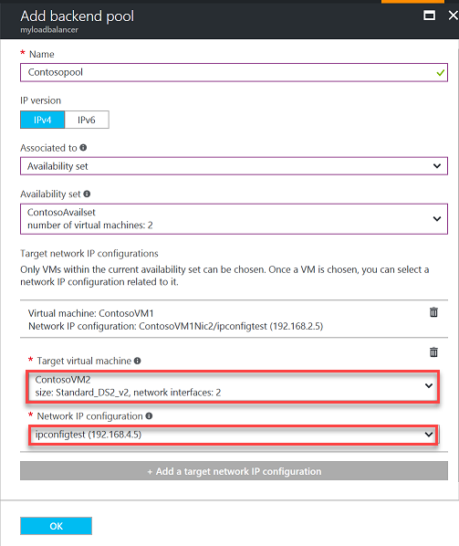

<properties
    pageTitle="针对 Azure 中的多个 IP 配置进行负载均衡 | Azure"
    description="在主要和辅助 IP 配置之间进行负载均衡。"
    services="load-balancer"
    documentationcenter="na"
    author="kumudd"
    manager="timlt"
    editor="na"
    translationtype="Human Translation" />
<tags
    ms.assetid="244907cd-b275-4494-aaf7-dcfc4d93edfe"
    ms.service="load-balancer"
    ms.devlang="na"
    ms.topic="article"
    ms.tgt_pltfrm="na"
    ms.workload="infrastructure-services"
    ms.date="03/22/2017"
    wacn.date="04/17/2017"
    ms.author="kumud"
    ms.sourcegitcommit="7cc8d7b9c616d399509cd9dbdd155b0e9a7987a8"
    ms.openlocfilehash="54b086cdbde6c36824f5bd62406589a32fe6c980"
    ms.lasthandoff="04/07/2017" />

# 使用 Azure 门户对多个 IP 配置进行负载均衡
> [AZURE.SELECTOR]
- [门户](/documentation/articles/load-balancer-multiple-ip/)
- [PowerShell](/documentation/articles/load-balancer-multiple-ip-powershell/)
- [CLI](/documentation/articles/load-balancer-multiple-ip-cli/)

本文介绍如何将 Azure 负载均衡器用于辅助网络接口 (NIC) 的多个 IP 地址。 目前，对一个 NIC 的多个 IP 地址的支持是预览版的功能。 有关详细信息，请参阅本文的 [限制](#limitations) 部分。 以下场景说明了如何通过负载均衡器使用此功能。

在此方案中，有两个运行 Windows 的 VM，每个 VM 有一个主 NIC 和一个辅助 NIC。 每个辅助 NIC 具有两个 IP 配置。 每个 VM 托管网站 contoso.com 和 fabrikam.com。 每个网站都绑定到辅助 NIC 的一个 IP 配置。 我们使用 Azure 负载均衡器公开两个前端 IP 地址，每个地址分别对应于一个网站，从而将流量分发到网站的各个 IP 配置。 此场景中两个前端以及两个后端池 IP 地址都使用相同的端口号。

  

##先决条件
本示例假设已有一个名为 *contosofabrikam* 的、使用以下配置的资源组：
- 在名为 *myAvailset* 的同一个可用性集中包含名为 *myVNet* 的虚拟网络，以及名为 *VM1* 和 *VM2* 的两个 VM。
- 每个 VM 包含主要 NIC 和辅助 NIC。 主要 NIC 名为 *VM1NIC1* 和 *VM2NIC1*，辅助 NIC 名为 *VM1NIC2* 和 *VM2NIC2*。 有关创建具有多个 NIC 的 VM 的详细信息，请参阅[使用 PowerShell 创建具有多个 NIC 的 VM](/documentation/articles/virtual-network-deploy-multinic-arm-ps/)。

## 在多个 IP 配置上进行负载平衡的步骤

遵循以下步骤实现本文所述的方案：

### 步骤 1：为每个 VM 配置辅助 NIC

对于虚拟网络中的每个 VM，请按如下所述为辅助 NIC 添加 IP 配置：  

1. 从浏览器导航到 Azure 门户预览版：http://portal.azure.cn，并使用 Azure 帐户登录。
2. 在屏幕的左上方单击“资源组”图标，然后单击 VM 所在的资源组（例如 *contosofabrikam*）。 此时将显示“资源组”边栏选项卡，其中列出了 VM 的所有资源以及网络接口。
3. 针对每个 VM 的辅助 NIC，请按如下所述添加 IP 配置：
    1. 选择要将 IP 配置添加到的网络接口。
    2. 在针对所选 NIC 显示的边栏选项卡中，单击“IP 配置”。 然后单击显示的边栏选项卡顶部附近的“添加”。
    3. 在“添加 IP 配置”边栏选项卡中，按如下所述将第二个 IP 配置添加到 NIC： 
        1. 键入辅助 IP 配置的名称（例如，对于 VM1 和 VM2，分别将 IP 配置命名为 *VM1NIC2-ipconfig2* 和 *VM2NIC2-ipconfig2*）。
        2. 对于“专用 IP 地址”的“分配”方法，请选择“静态”。
        3. 单击 **“确定”**。
        4. 完成辅助 NIC 的第二个 IP 配置后，它将显示在给定 NIC 的“IP 配置”设置边栏选项卡中。

### 步骤 2：创建负载均衡器

按如下所述创建负载均衡器：

1. 从浏览器导航到 Azure 门户：http://portal.azure.cn，并使用 Azure 帐户登录。
2. 在屏幕的左上方，单击“新建” > “网络” > “负载均衡器”。 接下来，单击“创建”。
3. 在“创建负载均衡器”边栏选项卡中，为负载均衡器键入一个名称。 本例中使用名称 *mylb*。
4. 在“公共 IP 地址”下，创建名为 **PublicIP1** 的新公共 IP。
5. 在“资源组”下，选择 VM 的现有资源组（例如 *contosofabrikam*）。 然后选择相应的位置并单击“确定”。 然后，负载均衡器将开始部署，成功完成部署需要几分钟的时间。
6. 部署后，负载均衡器将作为资源显示在资源组中。

### 步骤 3：配置前端 IP 池

按如下所述为每个网站（Contoso 和 Fabrikam）配置前端 IP 池：

1. 在门户中单击“更多服务”> 在筛选框中键入“公共 IP 地址”，然后单击“公共 IP 地址”。 单击显示的边栏选项卡顶部附近的“添加”。
2. 按如下所述为两个网站（contoso 和 fabrikam）配置两个公共 IP 地址（*PublicIP1* 和 *PublicIP2*）：
    1. 键入前端 IP 地址的名称。
    2. 对于“资源组”下，请选择 VM 的现有资源组（例如 *contosofabrikam*）。
    3. 对于“位置”，请选择 VM 所在的同一位置。
    4. 单击 **“确定”**。
    5. 创建两个公共 IP 地址后，它们会显示在“公共 IP 地址”边栏选项卡中。
3. 在门户中单击“更多服务”> 在筛选框中键入“负载均衡器”，然后单击“负载均衡器”。  
4. 选择要将前端 IP 池添加到的负载均衡器 (*mylb*)。
5. 在“设置”下，选择“前端池”。 然后单击显示的边栏选项卡顶部附近的“添加”。
6. 键入前端 IP 地址的名称（*farbikamfe* 或 **contosofe*）。
7. 单击“IP 地址”，然后在“选择公共 IP 地址”边栏选项卡中选择前端的 IP 地址（*PublicIP1* 或 *PublicIP2*）。
8. 重复本部分中的步骤 3 到 7，创建第二个前端 IP 地址。
9. 完成前端 IP 池配置后，这两个前端 IP 地址将显示在负载均衡器的“前端 IP 池”边栏选项卡中。 

### 步骤 4：配置后端池   
按如下所述在每个网站（Contoso 和 Fabrikam）的负载均衡器上配置后端地址池：

1. 在门户中单击“更多服务”> 在筛选框中键入“负载均衡器”，然后单击“负载均衡器”。  
2. 选择要将后端池添加到的负载均衡器 (*mylb*)。
3. 在“设置”下，选择“后端池”。 键入后端池的名称（例如 *contosopool* 或 *fabrikampool*）。 然后单击显示的边栏选项卡顶部附近的“添加”按钮。 
4. 对于“关联到”，请选择“可用性集”。
5. 对于“可用性集”，请选择“myAvailset”。
6. 按如下所示为两个 VM 添加目标网络 IP 配置（参阅图 2）：  
    1. 对于“目标虚拟机”，请选择要添加到后端池的 VM（例如 VM1 或 VM2）。
    2. 对于“网络 IP 配置”，请选择该 VM 的辅助 NIC IP 配置（例如 VM1NIC2-ipconfig2 或 VM2NIC2-ipconfig2）。
    

        **图 2**：使用后端池配置负载均衡器  
7. 单击 **“确定”**。
8. 完成后端池配置后，这两个后端地址池将显示在负载均衡器的“后端池”边栏选项卡中。

### 步骤 5：为负载均衡器配置运行状况探测
按如下所述为负载均衡器配置运行状况探测：
    1. 在门户中单击“更多服务”> 在筛选框中键入“负载均衡器”，然后单击“负载均衡器”。  
    2. 选择要将后端池添加到的负载均衡器。
    3. 在“设置”下，选择“运行状况探测”。 然后单击显示的边栏选项卡顶部附近的“添加”。
    4. 键入运行状况探测的名称（例如 HTTP），然后单击“确定”。

### 步骤 6：配置负载均衡规则
按如下所述为每个网站配置负载均衡规则（*HTTPc* 和 *HTTPf*）：

1. 在“设置”下，选择“运行状况探测”。 然后单击显示的边栏选项卡顶部附近的“添加”。
2. 对于“名称”，请键入负载均衡规则的名称（例如，为 Contoso 键入 *HTTPc*，为 Fabrikam 键入 *HTTPf*）
3. 对于“前端 IP 地址”，请选择前端 IP 地址（例如 *Contosofe* 或 *Fabrikamfe*）
4. 对于“端口”和“后端端口”，请保留默认值 **80**。
5. 对于“浮动 IP (直接服务器返回)”，请单击“已启用”。
6. 单击 **“确定”**。
7. 重复本部分中的步骤 1 到 6，创建第二个负载均衡器规则。
8. 完成负载均衡规则配置后，这两个规则（*HTTPc* 和 *HTTPf*）将显示在负载均衡器的“负载均衡规则”边栏选项卡中。

### 步骤 7：配置 DNS 记录
最后，必须将 DNS 资源记录配置为指向各自的负载均衡器的前端 IP 地址。 可以在 Azure DNS 中托管域。 有关将 Azure DNS 与负载均衡器配合使用的详细信息，请参阅[将 Azure DNS 与其他 Azure 服务配合使用](/documentation/articles/dns-for-azure-services/)。

## 后续步骤
- 若要深入了解如何在 Azure 中结合使用负载均衡服务，请参阅[在 Azure 中使用负载均衡服务](/documentation/articles/traffic-manager-load-balancing-azure/)。
- 若要了解如何在 Azure 中使用不同类型的日志对负载均衡器进行管理和故障排除，请参阅 [Azure 负载均衡器的 Log Analytics](/documentation/articles/load-balancer-monitor-log/)。

<!--Update_Description:udpate meta properties; new whole content configuration for setup the load balancer with multiple IP-->