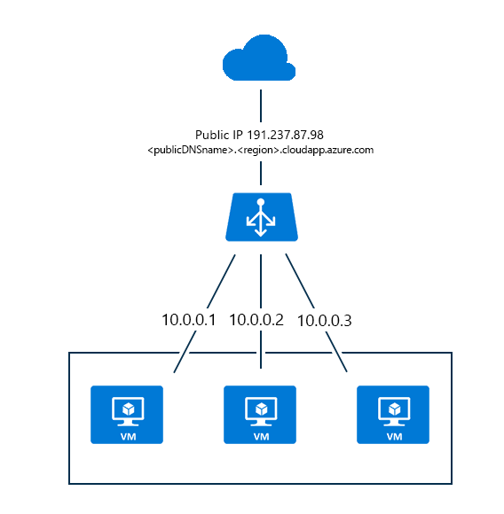

<properties
   pageTitle="Azure Load Balancer 概述 | Azure"
   description="Azure Load Balancer 功能、体系结构和实现概述。了解负载均衡器工作原理，在云中对其进行利用。"
   services="load-balancer"
   documentationCenter="na"
   authors="sdwheeler"
   manager="carmonm"
   editor="" />
<tags
   ms.service="load-balancer"
   ms.devlang="na"
   ms.topic="article"
   ms.tgt_pltfrm="na"
   ms.workload="infrastructure-services"
   ms.date="08/22/2016"
   wacn.date="10/10/2016" />

# Azure Load Balancer 概述

Azure Load Balancer 可提高应用程序的可用性和网络性能。它是第 4 层（TCP、UDP）类型的负载均衡器，可在负载均衡集中定义的运行状况良好的服务实例之间分配传入流量。

## Azure Load Balancer 配置

可将其配置为：

- 对传入到虚拟机的 Internet 流量进行负载均衡。此配置称为[面向 Internet 的负载均衡](/documentation/articles/load-balancer-internet-overview/)。
- 对虚拟网络中虚拟机之间的流量、云服务中虚拟机之间的流量或本地计算机和跨界虚拟网络中虚拟机之间的流量进行负载均衡。此配置称为[负载均衡](/documentation/articles/load-balancer-internal-overview/)。
* 将外部流量转发到特定的虚拟机。

云中的所有资源都需要通过公共 IP 地址从 Internet 进行访问。在云基础结构中，Azure 对其资源使用不可路由的 IP 地址。为了与 Internet 通信，Azure 对公共 IP 地址使用网络地址转换 (NAT)。

## Azure 部署模型

务必了解 Azure 经典[部署模型](/documentation/articles/resource-manager-deployment-model/)与 Resource Manager 部署模型之间的差异，因为负载均衡器在每个模型中的配置各不相同。

### Azure 经典部署模型

在此模型中，为云服务分配了一个公共 IP 地址和一个 FQDN。部署在云服务边界内的虚拟机可组合起来使用一个负载均衡器。负载均衡器可进行端口转换，并分发在云服务的公共 IP 地址接收到的网络流量。

负载均衡的流量由终结点定义。端口转换终结点在公共 IP 地址的公共分配端口与分配到特定虚拟机上的服务的本地端口之间存在一对一的关系。负载均衡终结点在公共 IP 地址与分配到云服务中虚拟机上的服务的本地端口之间存在一对多的关系。

负载均衡器用于此部署模型中使用的公共 IP 地址的域标签为 <云服务名称>.chinacloudapp.cn。下图显示此模型中的 Azure Load Balancer。

### Azure Resource Manager 部署模型

在 Resource Manager 部署模型中，无需创建云服务。可显式创建负载均衡器，以在虚拟机之间路由流量。

在 Resource Manager 中，公共 IP 地址是其自身的资源，可以与域标签或 DNS 名称关联。在本例中，公共 IP 地址与负载均衡器资源关联。对于接收负载均衡的网络流量的资源，负载均衡器规则和入站 NAT 规则使用公共 IP 地址作为 Internet 终结点。

将专用或公共 IP 地址分配给附加到虚拟机的网络接口资源。将网络接口添加到负载均衡器的后端 IP 地址池后，负载均衡器就可以根据所创建的负载均衡规则发送负载均衡的网络流量。

下图显示此模型中的 Azure Load Balancer：

#### 通过 Azure Resource Manager 进行基于模板的部署

负载均衡器可以通过基于 Resource Manager 的 API 和工具进行管理。若要了解有关 Resource Manager 的详细信息，请参阅 [Resource Manager overview](../resource-group-overview.md)（Resource Manager 概述）。

## 负载均衡器功能

* 基于哈希的分发

    负载均衡器使用基于哈希的分发算法。默认情况下，它使用 5 元组（源 IP、源端口、目标 IP、目标端口和协议类型）哈希将流量映射到可用服务器。它仅在传输会话 *内* 提供粘性。同一 TCP 或 UDP 会话中的数据包将会定向到负载均衡的终结点后面的同一实例。当客户端关闭连接后再重新将其打开，或者从同一源 IP 启动新的会话时，源端口将会变化。这可能会导致流量转到其他数据中心的其他终结点。

有关详细信息，请参阅[负载均衡器分发模式](/documentation/articles/load-balancer-distribution-mode/)。下图显示了基于哈希的分发：

    

* 端口转发

可以使用负载均衡器对入站通信的管理方式进行控制。该通信可能包括从 Internet 主机或者其他云服务或虚拟网络中的虚拟机发出的流量。终结点（也称输入终结点）代表的就是这种控制。

    输入终结点侦听公共端口，并将流量转发到内部端口。你可以对内部或外部终结点映射相同端口，也可以对其使用其他端口。例如，你可以将 Web 服务器配置为侦听端口 81，而公共终结点映射则为端口 80。创建公共终结点这一操作会触发负载均衡器实例的创建。

    使用 Azure 门户进行创建时，该门户会针对远程桌面协议 (RDP) 和远程 Windows PowerShell 会话流量自动创建虚拟机的终结点。你可以使用这些终结点通过 Internet 远程管理虚拟机。

* 自动重新配置

    对实例进行上下缩放时，负载均衡器会立即自行重新配置。例如，增加云服务中 Web 角色/辅助角色的实例计数时，或者向同一负载均衡集中添加更多虚拟机时，会发生这样的重新配置。

* 服务监视

    负载均衡器可以探测不同服务器实例的运行状况。当探测无法响应时，负载均衡器将会停止向状况不良的实例发送新连接。现有连接不受影响。

    支持三种类型的探测：

    + **来宾代理探测（仅在 PaaS VM 上进行）****：**负载均衡器利用虚拟机中的来宾代理。该来宾代理仅在实例处于“就绪”状态（即实例不处于“忙”、“正在回收”或“正在停止”这样的状态）时侦听并使用“HTTP 200 正常”响应消息进行响应。如果代理没有使用“HTTP 200 正常”进行响应，则负载均衡器会将实例标记为无响应，并停止向该实例发送流量。负载均衡器将继续 ping 实例。如果来宾代理使用 HTTP 200 进行了响应，则负载均衡器将再次向该实例发送流量。使用 Web 角色时，网站代码通常在不受 Azure 结构或来宾代理监视的 w3wp.exe 中运行。这意味着，系统不会向来宾代理报告 w3wp.exe 中的失败（例如，HTTP 500 响应），并且负载均衡器不会知道将该实例退出轮转。
    + **HTTP 自定义探测：**此探测将替代默认（来宾代理）探测。你可以使用此探测来创建自己的自定义逻辑，以便确定角色实例的运行状况。负载均衡器将定期探测你的终结点（默认情况下，每隔 15 秒探测 1 次）。如果实例在超时期限内（默认为 31 秒）使用 TCP ACK 或 HTTP 200 进行了响应，则认为该实例处于轮换状态。若要实现自己的逻辑以便从负载均衡器轮换中删除实例，这非常有用。例如，你可以将实例配置为在实例的 CPU 使用率超出 90% 时返回非 200 状态。如果 Web 角色使用 w3wp.exe，则也可以自动监视网站，因为网站代码出错会导致探测时返回非 200 状态。
    + **TCP 自定义探测：**此探测依赖于在定义的探测端口上成功建立 TCP 会话。

有关详细信息，请参阅 [LoadBalancerProbe 架构](https://msdn.microsoft.com/zh-cn/library/azure/jj151530.aspx)。

* 源 NAT

    所有源自服务且流向 Internet 的出站流量都使用与传入流量相同的 VIP 地址进行源 NAT (SNAT) 操作。SNAT 的重要优势在于：

    + 可以轻松地对服务进行升级和灾难恢复操作，因为 VIP 可以动态映射到服务的其他实例。
    + 简化了访问控制列表 (ACL) 管理。以 VIP 表示的 ACL 不会随着服务的增加、减少或重新部署而更改。

    负载均衡器配置支持适用于 UDP 的完整圆锥型 NAT。完整圆锥型 NAT 是一种类型的 NAT，其中的端口允许入站连接来自任何外部主机（响应出站请求）。

    >[AZURE.NOTE] 对于 VM 启动的每个新的出站连接，还会由负载均衡器分配出站端口。外部主机会看到分配了虚拟 IP (VIP) 的端口的流量。对于需要大量出站连接的方案，建议使用[实例层级公共 IP](../virtual-network/virtual-networks-instance-level-public-ip.md) 地址，这样 VM 就有一个专用于 SNAT 的出站 IP 地址。这可降低端口耗尽的风险。
    >
    >VIP 或实例层级公共 IP (PIP) 可以使用的最大端口数为 64,000。这属于 TCP 标准限制。

### 支持为虚拟机提供多个负载均衡的 IP 地址

可将多个负载均衡的公共 IP 地址分配给一组虚拟机。可以通过此功能在同一组虚拟机上托管多个 SSL 网站和/或多个 SQL Server AlwaysOn 可用性组侦听器。有关详细信息，请参阅[每项云服务拥有多个 VIP](load-balancer-multivip.md)。

[AZURE.INCLUDE [load-balancer-compare-tm-ag-lb-include.md](../../includes/load-balancer-compare-tm-ag-lb-include.md)]

## 后续步骤

[面向 Internet 的负载均衡器概述](/documentation/articles/load-balancer-internet-overview/)

[内部负载均衡器概述](/documentation/articles/load-balancer-internal-overview/)

[开始创建面向 Internet 的负载均衡器](/documentation/articles/load-balancer-get-started-internet-arm-ps/)

<!---HONumber=Mooncake_0926_2016-->