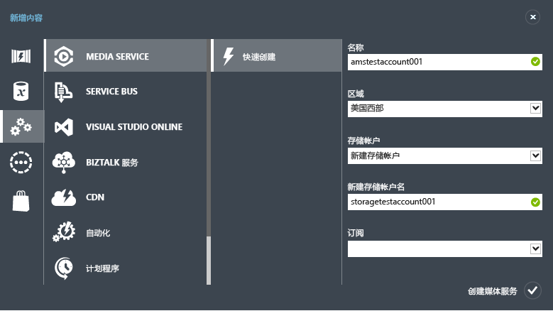

<properties
	pageTitle="创建媒体服务帐户 | Azure"
	description="介绍如何在 Azure 中创建新的 Azure 媒体服务帐户。"
	services="media-services"
	documentationCenter=""
	authors="Juliako"
	manager="dwrede"
	editor=""/>

<tags
	ms.service="media-services"
	ms.date="04/18/2016"
	wacn.date="06/20/2016"/>

# 创建 Azure 媒体服务帐户

> [AZURE.SELECTOR]
- [门户](/documentation/articles/media-services-create-account/)
- [PowerShell](/documentation/articles/media-services-manage-with-powershell/)
- [REST](http://msdn.microsoft.com/zh-cn/library/azure/dn194267.aspx)

> [AZURE.NOTE] 若要完成本教程，你需要一个 Azure 帐户。有关详细信息，请参阅 [ 1 元试用](/pricing/1rmb-trial/?WT.mc_id=A261C142F)。
 
使用 Azure 管理门户，你可以快速创建 Azure 媒体服务帐户。你可以使用自己的帐户访问媒体服务，这些服务使你能够在 Azure 中存储、加密、编码、管理和流式传输媒体内容。创建媒体服务帐户时，你还将在此帐户所在的地理区域内创建一个关联的媒体服务帐户（或使用现有存储帐户）。

本文介绍如何使用“快速创建”方法创建新的媒体服务帐户，然后将该帐户与存储帐户关联。

## 概念

访问媒体服务需要两个关联的帐户：

-   **一个媒体服务帐户**。你可以使用你的帐户访问 Azure 中可用的一组基于云的媒体服务。媒体服务帐户不会存储实际媒体内容，而是存储有关你帐户中的媒体内容和媒体处理作业的元数据。创建该帐户时，需要选择一个可用的媒体服务区域。所选的区域是存储你帐户的元数据记录的数据中心。

	可用媒体服务 (AMS) 区域包括：中国北部、中国东部。媒体服务不使用地缘组。
	

-   **一个关联的存储帐户**。你的存储帐户是一个与你的媒体服务帐户关联的 Azure 存储帐户。该存储帐户为媒体文件提供了 Blob 存储，并且必须位于媒体服务帐户所在的地理区域内。创建媒体服务帐户时，你可以选择位于同一区域内的现有存储帐户，也可以在同一区域内创建新的存储帐户。如果你删除媒体服务帐户，相关存储帐户中的 Blob 不会被删除。

## 使用“快速创建”创建媒体服务帐户

1. 在 [Azure 管理门户][]中，依次单击“新建”、“媒体服务”和“快速创建”。

2. 在“名称”中，输入新帐户的名称。媒体服务帐户名称由小写字母或数字构成（不含空格），长度为 3 到 24 个字符。

3. 在“区域”中，选择将用于存储媒体服务帐户的元数据记录的地理区域。下拉列表中仅显示可用的媒体服务区域。

4. 在“存储帐户”中，选择一个存储帐户以便为媒体服务帐户中的媒体内容提供 Blob 存储。你可以选择位于媒体服务帐户所在的地理区域内的现有存储帐户，也可以创建一个新的存储帐户。将在同一区域内创建一个新的存储帐户。

5. 如果你创建了一个新的存储帐户，请在“新建存储帐户名称”中输入该存储帐户的名称。适用于存储帐户名的规则对媒体服务帐户同样适用。

6. 单击窗体底部的“快速创建”。

可以在窗口底部的消息区域中监视过程的状态。

如果状态更改为“活动”，则表示已成功创建帐户。此时将打开“媒体服务”页，其中显示了新帐户。

在页面底部，将出现“管理密钥”按钮。当你单击此按钮时，将会显示一个页面，其中包含媒体服务帐户名以及主密钥和辅助密钥。你必须要有帐户名和主要密钥信息，才能以编程方式访问媒体服务帐户。

当你双击帐户名时，默认情况下将显示“快速启动”页。可从此页执行某些管理任务，而这些管理任务也可从该门户的其他页执行。例如，你可以从此页上载视频文件，也可以从“内容”页执行此操作。

此外，你还可以查看使用 Azure 媒体服务 SDK 完成以下任务的代码：上载、编码和发布视频。你可以单击“编写一些代码”部分下的某个链接，复制代码并在应用程序中使用该代码。

## 后续步骤

- [使用 .NET SDK 开始传送点播视频 (VoD) 内容](/documentation/articles/media-services-dotnet-get-started/)

- [使用 .NET SDK 可创建频道，以执行从单比特率流到多比特率流的实时编码](/documentation/articles/media-services-dotnet-creating-live-encoder-enabled-channel/)

<!-- Reusable paths. -->

<!-- Anchors. -->
  [Concepts]: #concepts
  [Before you begin]: #begin
  [How to: Create a Media Services account using Quick Create]: #quick

<!-- URLs. -->
  [Web Platform Installer]: http://go.microsoft.com/fwlink/?linkid=255386

  [Azure 管理门户]: http://manage.windowsazure.cn/

<!---HONumber=Mooncake_0613_2016-->