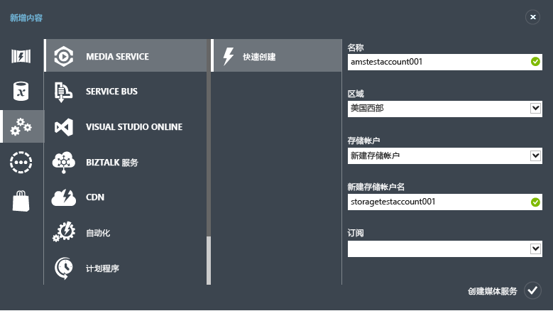
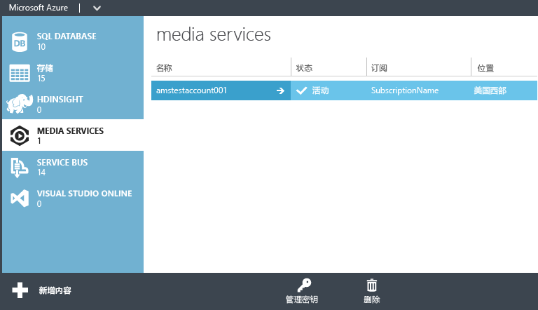

<properties
	pageTitle="使用 .NET SDK 开始传送点播内容"
	description="本教程将引导你完成使用 Azure 媒体服务和 .NET 实施点播内容传送应用程序的步骤。"
	services="media-services"
	documentationCenter=""
	authors="Juliako"
	manager="dwrede"
	editor=""/>

<tags
	ms.service="media-services"
 	ms.date="04/18/2016"
	wacn.date="06/20/2016"/>

# 使用 .NET SDK 开始传送点播内容

[AZURE.INCLUDE [media-services-selector-get-started](../includes/media-services-selector-get-started.md)]

>[AZURE.NOTE]
若要完成本教程，你需要一个 Azure 帐户。有关详细信息，请参阅 [Azure 试用](/pricing/1rmb-trial/?WT.mc_id=A261C142F)。
 
##概述 

本教程将引导你完成使用用于 .NET 的 Azure 媒体服务 (AMS) SDK 实施视频点播 (VoD) 内容传送应用程序的步骤。

本教程介绍了基本的媒体服务工作流，以及进行媒体服务开发需要用到的最常见编程对象和任务。完成本教程后，你就能够流式传输或渐进下载你已上载、编码和下载的示例媒体文件。

## 学习内容

本教程说明如何完成以下任务：

1.  创建媒体服务帐户（使用 Azure 管理门户）。
2.  配置流式处理终结点（使用门户）。
3.  创建和配置 Visual Studio 项目。
5.  连接到媒体服务帐户。
6.  创建新资产并上载视频文件。
7.  将源文件编码为一组自适应比特率 MP4 文件。
8.  发布资产并获取用于流式处理和渐进式下载的 URL。
9.  通过播放内容进行测试。

## 先决条件

以下是完成本教程所需具备的条件。

- 若要完成本教程，你需要一个 Azure 帐户。 
	
	如果你没有帐户，可以创建一个试用帐户，只需几分钟即可完成。有关详细信息，请参阅 [Azure 试用](/pricing/1rmb-trial/?WT.mc_id=A261C142F)。获取可用来尝试付费版 Azure 服务的信用额度。即使在信用额度用完之后，你也可以保留该帐户，使用那些免费的 Azure 服务和功能，例如 Azure 中的 Web 应用功能。
- 操作系统：Windows 8 或更高版本、Windows 2008 R2、Windows 7。
- .NET Framework 4.0 或更高版本
- Visual Studio 2010 SP1（Professional、Premium、Ultimate 或 Express）或更高版本。

##下载示例

从[此处](http://azure.microsoft.com/documentation/samples/media-services-dotnet-on-demand-encoding-with-media-encoder-standard/)获取并运行示例。

##使用门户创建媒体服务帐户

1. 在 Azure 管理门户中，依次单击“新建”、“媒体服务”和“快速创建”。

	

2. 在“名称”中，输入新帐户的名称。媒体服务帐户名称由小写字母或数字构成（不含空格），长度为 3 - 24 个字符。

3. 在“区域”中，选择将用于存储媒体服务帐户的元数据记录的地理区域。下拉列表中仅显示可用的媒体服务区域。

4. 在“存储帐户”中，选择一个存储帐户以便为媒体服务帐户中的媒体内容提供 Blob 存储。你可以选择位于媒体服务帐户所在的地理区域内的现有存储帐户，也可以创建一个新的存储帐户。将在同一区域内创建一个新的存储帐户。

5. 如果你创建了一个新的存储帐户，请在“新建存储帐户名称”中输入该存储帐户的名称。适用于存储帐户名的规则对媒体服务帐户同样适用。

6. 单击窗体底部的“快速创建”。

可以在窗口底部的消息区域中监视过程的状态。

成功创建帐户后，状态将更改为“活动”。

在页面底部，将出现“管理密钥”按钮。当你单击此按钮时，将会显示一个对话框，其中包含媒体服务帐户名以及主密钥和辅助密钥。你必须要有帐户名和主要密钥信息，才能以编程方式访问媒体服务帐户。

当你双击帐户名时，默认情况下将显示“快速启动”页。可从此页执行某些管理任务，而这些管理任务也可从该门户的其他页执行。例如，你可以从此页上载视频文件，也可以从“内容”页执行此操作。

##使用门户配置流式处理终结点

使用 Azure 媒体服务时最常见的方案之一是将自适应比特率流传送至你的客户端。通过自适应比特率流，客户端可以在视频显示时，根据当前网络带宽、CPU 利用率和其他因素，切换至较高或较低的比特率流。媒体服务支持以下自适应比特率流式处理技术：HTTP 实时流式处理 (HLS)、平滑流式处理、MPEG DASH 和 HDS（仅适用于 Adobe PrimeTime/Access 许可证持有人）。

媒体服务所提供的动态打包可让你以媒体服务支持的流格式（MPEG DASH、HLS、Smooth Streaming、HDS）传送自适应比特率 MP4 或平滑流编码内容，而无须重新打包成这些流格式。

若要使用动态打包，必须执行下列操作：

- 将夹层（源）文件编码或转换成一组自适应比特率 MP4 文件或自适应比特率平滑流文件（本教程稍后将演示编码步骤）。
- 针对你要传送内容的**流式处理终结点**，获取至少一个流式处理单位。

通过动态打包，你只需要存储及支付一种存储格式的文件，媒体服务将会根据客户端的要求创建并提供适当的响应。

若要更改流式处理保留单元数，请执行以下操作：

1. 在[门户](https://manage.windowsazure.cn/)中单击“媒体服务”。然后，单击媒体服务的名称。

2. 选择“流式处理终结点”页。然后，单击要修改的流式处理终结点。

3. 若要指定流式处理单元数，请单击“缩放”选项卡，然后移动“保留容量”滑块。

	

4. 按“保存”以保存更改。

分配所有新的单元大约需要 20 分钟才能完成。

>[AZURE.NOTE] 当前，将流式处理单位的任何正值设置回“无”可将流式处理功能禁用最多 1 小时。
>
> 为 24 小时期间指定的最大单位数将用于计算成本。有关定价详细信息，请参阅[媒体服务定价详细信息](/home/features/media-services/pricing/)。

##创建和配置 Visual Studio 项目

1. 在 Visual Studio 2013、Visual Studio 2012 或 Visual Studio 2010 SP1 中创建一个新的 C# 控制台应用程序。输入“名称”、“位置”和“解决方案名称”，然后单击“确定”。

2. 使用 [windowsazure.mediaservices.extensions](https://www.nuget.org/packages/windowsazure.mediaservices.extensions) Nuget 包安装 **Azure 媒体服务 .NET SDK 扩展**。媒体服务 .NET SDK Extensions 是一组扩展方法和帮助器函数，可简化你的代码，并令使用媒体服务进行开发变得更加容易。安装此包也会安装**媒体服务 .NET SDK** 并添加所有其他必需的依赖项。

3. 添加对 System.Configuration 程序集的引用。此程序集包含用于访问配置文件（例如，App.config）的 **System.Configuration.ConfigurationManager** 类。

4. 打开 App.config 文件（如果该文件未按默认添加到项目中，请添加）并在该文件中添加 *appSettings* 节。如以下示例中所示设置 Azure 媒体服务帐户名和帐户密钥的值。若要获取帐户名和密钥信息，请打开 Azure 管理门户，选择你的媒体服务帐户，然后单击“管理密钥”按钮。

		<configuration>
		...
		  <appSettings>
		    <add key="MediaServicesAccountName" value="Media-Services-Account-Name" />
		    <add key="MediaServicesAccountKey" value="Media-Services-Account-Key" />
		  </appSettings>
		  
		</configuration>

5. 使用以下代码覆盖位于 Program.cs 文件开头的现有 **using** 语句。

		using System;
		using System.Collections.Generic;
		using System.Linq;
		using System.Text;
		using System.Threading.Tasks;
		using System.Configuration;
		using System.Threading;
		using System.IO;
		using Microsoft.WindowsAzure.MediaServices.Client;
		

6. 在 projects 目录下创建新的文件夹，然后复制你要编码和流处理或渐进式下载的 .mp4 或 .wmv 文件。在此示例中，我们使用了“C:\\VideoFiles”路径。

##连接到媒体服务帐户

使用采用 .NET 的媒体服务时，你必须将 **CloudMediaContext** 类用于大多数媒体服务编程任务：连接到媒体服务帐户；创建、更新、访问和删除以下对象：资产、资产文件、作业、访问策略、定位符等等。

使用以下代码覆盖默认程序类。该代码演示如何从 App.config 文件中读取连接值，以及如何创建 **CloudMediaContext** 对象以连接到媒体服务。有关连接到媒体服务的详细信息，请参阅[使用适用于 .NET 的媒体服务 SDK 连接到媒体服务](/documentation/articles/media-services-dotnet-connect_programmatically/)。

**Main** 函数调用将在本部分中进一步定义的方法。

    class Program
    {
        // Read values from the App.config file.
        private static readonly string _mediaServicesAccountName =
            ConfigurationManager.AppSettings["MediaServicesAccountName"];
        private static readonly string _mediaServicesAccountKey =
            ConfigurationManager.AppSettings["MediaServicesAccountKey"];

        private static readonly String _defaultScope = "urn:WindowsAzureMediaServices";

		// Azure China uses a different API server and a different ACS Base Address from the Global.
		private static readonly String _chinaApiServerUrl = "https://wamsshaclus001rest-hs.chinacloudapp.cn/API/";
		private static readonly String _chinaAcsBaseAddressUrl = "https://wamsprodglobal001acs.accesscontrol.chinacloudapi.cn";

        // Field for service context.
        private static CloudMediaContext _context = null;
		private static MediaServicesCredentials _cachedCredentials = null;
		private static Uri _apiServer = null;

        static void Main(string[] args)
        {
            try
            {
                // Create and cache the Media Services credentials in a static class variable.
                _cachedCredentials = new MediaServicesCredentials(
                                _mediaServicesAccountName,
                                _mediaServicesAccountKey,
								_defaultScope,
								_chinaAcsBaseAddressUrl);

				// Create the API server Uri
				_apiServer = new Uri(_chinaApiServerUrl);

                // Used the chached credentials to create CloudMediaContext.
                _context = new CloudMediaContext(_apiServer, _cachedCredentials);

                // Add calls to methods defined in this section.

                IAsset inputAsset =
                    UploadFile(@"C:\VideoFiles\BigBuckBunny.mp4", AssetCreationOptions.None);

                IAsset encodedAsset =
                    EncodeToAdaptiveBitrateMP4s(inputAsset, AssetCreationOptions.None);

                PublishAssetGetURLs(encodedAsset);
            }
            catch (Exception exception)
            {
                // Parse the XML error message in the Media Services response and create a new
                // exception with its content.
                exception = MediaServicesExceptionParser.Parse(exception);

                Console.Error.WriteLine(exception.Message);
            }
            finally
            {
                Console.ReadLine();
            }
        }

##创建新资产并上载视频文件

在媒体服务中，可以将数字文件上载（引入）到资产中。**资产**实体可以包含视频、音频、图像、缩略图集合、图文轨迹和隐藏字幕文件（以及有关这些文件的元数据。） 上载文件完成后，相关内容即安全地存储在云中供后续处理和流式处理。资产中的文件称为**资产文件**。

下面定义的 **UploadFile** 方法调用 **CreateFromFile**（在 .NET SDK Extensions 中定义）。**CreateFromFile** 创建指定的源文件所要上载到的新资产。

**CreateFromFile** 方法采用 **AssetCreationOptions**，它可让你指定以下其中一个资产创建选项：

- **无** - 不使用加密。这是默认值。请注意，使用此选项时，你的内容在传送过程中或静态存储过程中都不会受到保护。如果计划使用渐进式下载交付 MP4，则使用此选项。
- **StorageEncrypted** - 使用此选项可以通过高级加密标准 (AES) 256 位加密在本地加密明文内容，然后将其上载到 Azure 存储空间中以加密形式静态存储相关内容。受存储加密保护的资产将在编码前自动解密并放入经过加密的文件系统中，并可选择在重新上载为新的输出资产前重新加密。存储加密的主要用例是在磁盘上通过静态增强加密来保护高品质的输入媒体文件。
- **CommonEncryptionProtected** - 上载经过通用加密或 PlayReady DRM 加密并受其保护的内容（例如，受 PlayReady DRM 保护的平滑流）时使用此选项。
- **EnvelopeEncryptionProtected** - 如果要上载使用 AES 加密的 HLS，请使用此选项。请注意，Transform Manager 必须已对文件进行编码和加密。

**CreateFromFile** 方法还允许你指定回调，以报告文件的上载进度。

在以下示例中，指定了 **None** 作为资产选项。

将以下方法添加到 Program 类。

	static public IAsset UploadFile(string fileName, AssetCreationOptions options)
	{
	    IAsset inputAsset = _context.Assets.CreateFromFile(
	        fileName,
	        options,
	        (af, p) =>
	        {
	            Console.WriteLine("Uploading '{0}' - Progress: {1:0.##}%", af.Name, p.Progress);
	        });

	    Console.WriteLine("Asset {0} created.", inputAsset.Id);

	    return inputAsset;
	}

##将源文件编码为一组自适应比特率 MP4 文件

将资产引入媒体服务后，即可对媒体进行编码、传输复用、打水印等处理，然后将其传送至客户端。将根据多个后台角色实例调度把那个运行这些活动，以确保较高的性能和可用性。这些活动称为作业，每个作业由原子任务构成，这些原子任务将在资产文件上执行具体的工作。

如前所述，使用 Azure 媒体服务时最常见的方案之一是将自适应比特率流传送至你的客户端。媒体服务可以将一组自适应比特率 MP4 文件动态打包为以下其中一种格式：HTTP 实时流式处理 (HLS)、平滑流式处理、MPEG DASH 和 HDS（仅适用于 Adobe PrimeTime/Access 许可证持有人）。

若要使用动态打包，必须执行下列操作：

- 将夹层（源）文件编码或转换成一组自适应比特率 MP4 文件或自适应比特率平滑流文件，  
- 针对你要传送内容的“流式处理终结点”，获取至少一个流式处理单位。

以下代码演示如何提交编码作业。该作业所包含的一项任务会指定要使用 **Media Encoder Standard** 将夹层文件转码成一组自适应比特率 MP4。代码会提交作业，并等待作业完成。

作业完成后，你即可流式处理资产，或渐进式下载转码后所创建的 MP4 文件。请注意，你不需要拥有超过 0 个流式处理单位才能渐进式下载 MP4 文件。

将以下方法添加到 Program 类。

	static public IAsset EncodeToAdaptiveBitrateMP4s(IAsset asset, AssetCreationOptions options)
	{
	
	    // Prepare a job with a single task to transcode the specified asset
	    // into a multi-bitrate asset.
	
	    IJob job = _context.Jobs.CreateWithSingleTask(
	        "Media Encoder Standard",
	        "H264 Multiple Bitrate 720p",
	        asset,
	        "Adaptive Bitrate MP4",
	        options);
	
	    Console.WriteLine("Submitting transcoding job...");
	
	
	    // Submit the job and wait until it is completed.
	    job.Submit();
	
	    job = job.StartExecutionProgressTask(
	        j =>
	        {
	            Console.WriteLine("Job state: {0}", j.State);
	            Console.WriteLine("Job progress: {0:0.##}%", j.GetOverallProgress());
	        },
	        CancellationToken.None).Result;
	
	    Console.WriteLine("Transcoding job finished.");
	
	    IAsset outputAsset = job.OutputMediaAssets[0];
	
	    return outputAsset;
	}

##发布资产并获取用于流式处理和渐进式下载的 URL

若要流处理或下载资产，你必须先创建定位符来“发布”资产。定位符提供对资产中所含文件的访问权限。媒体服务支持两种类型的定位符：用于流媒体（例如 MPEG DASH、HLS 或平滑流式处理）的 OnDemandOrigin 定位符，以及用于下载媒体文件的访问签名 (SAS) 定位符。

创建定位符后，可以创建用来流式处理或下载文件的 URL。

平滑流式处理的流 URL 采用以下格式：

	 {streaming endpoint name-media services account name}.streaming.mediaservices.chinacloudapi.cn/{locator ID}/{filename}.ism/Manifest

HLS 的流 URL 采用以下格式：

	 {streaming endpoint name-media services account name}.streaming.mediaservices.chinacloudapi.cn/{locator ID}/{filename}.ism/Manifest(format=m3u8-aapl)

MPEG DASH 的流 URL 采用以下格式：

	{streaming endpoint name-media services account name}.streaming.mediaservices.chinacloudapi.cn/{locator ID}/{filename}.ism/Manifest(format=mpd-time-csf)

用于下载文件的 SAS URL 采用以下格式：

	{blob container name}/{asset name}/{file name}/{SAS signature}

媒体服务 .NET SDK Extensions 提供了便利的帮助器方法，可针对已发布的资产返回格式化 URL。

以下代码使用 .NET SDK 扩展创建定位符，获取流和渐进式下载 URL。该代码还演示了如何将文件下载到本地文件夹。

将以下方法添加到 Program 类。

    static public void PublishAssetGetURLs(IAsset asset)
    {
        // Publish the output asset by creating an Origin locator for adaptive streaming,
        // and a SAS locator for progressive download.

        _context.Locators.Create(
            LocatorType.OnDemandOrigin,
            asset,
            AccessPermissions.Read,
            TimeSpan.FromDays(30));

        _context.Locators.Create(
            LocatorType.Sas,
            asset,
            AccessPermissions.Read,
            TimeSpan.FromDays(30));

        IEnumerable<IAssetFile> mp4AssetFiles = asset
                .AssetFiles
                .ToList()
                .Where(af => af.Name.EndsWith(".mp4", StringComparison.OrdinalIgnoreCase));

        // Get the Smooth Streaming, HLS and MPEG-DASH URLs for adaptive streaming,
        // and the Progressive Download URL.
        Uri smoothStreamingUri = asset.GetSmoothStreamingUri();
        Uri hlsUri = asset.GetHlsUri();
        Uri mpegDashUri = asset.GetMpegDashUri();

        // Get the URls for progressive download for each MP4 file that was generated as a result
		// of encoding.
		List<Uri> mp4ProgressiveDownloadUris = mp4AssetFiles.Select(af => af.GetSasUri()).ToList();

        // Display  the streaming URLs.
        Console.WriteLine("Use the following URLs for adaptive streaming: ");
        Console.WriteLine(smoothStreamingUri);
        Console.WriteLine(hlsUri);
        Console.WriteLine(mpegDashUri);
        Console.WriteLine();

		// Display the URLs for progressive download.
        Console.WriteLine("Use the following URLs for progressive download.");
        mp4ProgressiveDownloadUris.ForEach(uri => Console.WriteLine(uri + "\n"));
        Console.WriteLine();

        // Download the output asset to a local folder.
        string outputFolder = "job-output";
        if (!Directory.Exists(outputFolder))
        {
            Directory.CreateDirectory(outputFolder);
        }

        Console.WriteLine();
        Console.WriteLine("Downloading output asset files to a local folder...");
        asset.DownloadToFolder(
            outputFolder,
            (af, p) =>
            {
                Console.WriteLine("Downloading '{0}' - Progress: {1:0.##}%", af.Name, p.Progress);
            });

        Console.WriteLine("Output asset files available at '{0}'.", Path.GetFullPath(outputFolder));
    }

##通过播放内容进行测试  

在执行上一部分中定义的程序后，控制台窗口中会显示如下所示的 URL。

自适应流式处理 URL：

平滑流

	http://amstestaccount001.streaming.mediaservices.chinacloudapi.cn/ebf733c4-3e2e-4a68-b67b-cc5159d1d7f2/BigBuckBunny.ism/manifest

HLS

	http://amstestaccount001.streaming.mediaservices.chinacloudapi.cn/ebf733c4-3e2e-4a68-b67b-cc5159d1d7f2/BigBuckBunny.ism/manifest(format=m3u8-aapl)

MPEG DASH

	http://amstestaccount001.streaming.mediaservices.chinacloudapi.cn/ebf733c4-3e2e-4a68-b67b-cc5159d1d7f2/BigBuckBunny.ism/manifest(format=mpd-time-csf)

渐进式下载 URL（音频和视频）。

	https://storagetestaccount001.blob.core.chinacloudapi.cn/asset-38058602-a4b8-4b33-b9f0-6880dc1490ea/BigBuckBunny_H264_650kbps_AAC_und_ch2_96kbps.mp4?sv=2012-02-12&sr=c&si=166d5154-b801-410b-a226-ee2f8eac1929&sig=P2iNZJAvAWpp%2Bj9yV6TQjoz5DIIaj7ve8ARynmEM6Xk%3D&se=2015-02-14T01:13:05Z

	https://storagetestaccount001.blob.core.chinacloudapi.cn/asset-38058602-a4b8-4b33-b9f0-6880dc1490ea/BigBuckBunny_H264_400kbps_AAC_und_ch2_96kbps.mp4?sv=2012-02-12&sr=c&si=166d5154-b801-410b-a226-ee2f8eac1929&sig=P2iNZJAvAWpp%2Bj9yV6TQjoz5DIIaj7ve8ARynmEM6Xk%3D&se=2015-02-14T01:13:05Z

	https://storagetestaccount001.blob.core.chinacloudapi.cn/asset-38058602-a4b8-4b33-b9f0-6880dc1490ea/BigBuckBunny_H264_3400kbps_AAC_und_ch2_96kbps.mp4?sv=2012-02-12&sr=c&si=166d5154-b801-410b-a226-ee2f8eac1929&sig=P2iNZJAvAWpp%2Bj9yV6TQjoz5DIIaj7ve8ARynmEM6Xk%3D&se=2015-02-14T01:13:05Z

	https://storagetestaccount001.blob.core.chinacloudapi.cn/asset-38058602-a4b8-4b33-b9f0-6880dc1490ea/BigBuckBunny_H264_2250kbps_AAC_und_ch2_96kbps.mp4?sv=2012-02-12&sr=c&si=166d5154-b801-410b-a226-ee2f8eac1929&sig=P2iNZJAvAWpp%2Bj9yV6TQjoz5DIIaj7ve8ARynmEM6Xk%3D&se=2015-02-14T01:13:05Z

	https://storagetestaccount001.blob.core.chinacloudapi.cn/asset-38058602-a4b8-4b33-b9f0-6880dc1490ea/BigBuckBunny_H264_1500kbps_AAC_und_ch2_96kbps.mp4?sv=2012-02-12&sr=c&si=166d5154-b801-410b-a226-ee2f8eac1929&sig=P2iNZJAvAWpp%2Bj9yV6TQjoz5DIIaj7ve8ARynmEM6Xk%3D&se=2015-02-14T01:13:05Z

	https://storagetestaccount001.blob.core.chinacloudapi.cn/asset-38058602-a4b8-4b33-b9f0-6880dc1490ea/BigBuckBunny_H264_1000kbps_AAC_und_ch2_96kbps.mp4?sv=2012-02-12&sr=c&si=166d5154-b801-410b-a226-ee2f8eac1929&sig=P2iNZJAvAWpp%2Bj9yV6TQjoz5DIIaj7ve8ARynmEM6Xk%3D&se=2015-02-14T01:13:05Z

	https://storagetestaccount001.blob.core.chinacloudapi.cn/asset-38058602-a4b8-4b33-b9f0-6880dc1490ea/BigBuckBunny_AAC_und_ch2_96kbps.mp4?sv=2012-02-12&sr=c&si=166d5154-b801-410b-a226-ee2f8eac1929&sig=P2iNZJAvAWpp%2Bj9yV6TQjoz5DIIaj7ve8ARynmEM6Xk%3D&se=2015-02-14T01:13:05Z

	https://storagetestaccount001.blob.core.chinacloudapi.cn/asset-38058602-a4b8-4b33-b9f0-6880dc1490ea/BigBuckBunny_AAC_und_ch2_56kbps.mp4?sv=2012-02-12&sr=c&si=166d5154-b801-410b-a226-ee2f8eac1929&sig=P2iNZJAvAWpp%2Bj9yV6TQjoz5DIIaj7ve8ARynmEM6Xk%3D&se=2015-02-14T01:13:05Z

若要流式处理视频，请使用 [Azure 媒体服务播放器](http://amsplayer.azurewebsites.net/azuremediaplayer.html)。

若要测试渐进式下载，请将 URL 粘贴到浏览器（例如 Internet Explorer、Chrome 或 Safari）中。

### 想要寻找其他内容吗？

如果本主题不包含你所期待的内容、缺少某些内容，或在其他方面不符合你的需求，请使用下面的 Disqus 会话向我们提供反馈。

<!-- Anchors. -->

<!-- URLs. -->
  [Web Platform Installer]: http://go.microsoft.com/fwlink/?linkid=255386
  [Portal]: http://manage.windowsazure.cn/

<!---HONumber=Mooncake_0613_2016-->