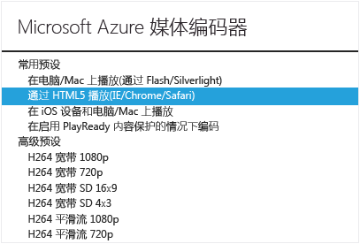

<properties linkid="manage-services-mediaservices-manage-media-services-content" urlDisplayName="How to manage media content" pageTitle="How to manage media content - Azure Media Services" metaKeywords="" description="Learn how to manage your media content in Azure Media Services." metaCanonical="" services="media-services" documentationCenter="" title="How to Manage Content in Media Services" authors="migree" solutions="" manager="" editor="" />

如何管理 Media Services 中的内容
================================

利用 Azure Media Services 内容视图，你可以管理 Media Services 帐户的媒体内容。

当前你可以直接从门户执行以下内容操作：

-   查看发布状态、已发布 URL、大小和上次更新日期时间等内容信息。
-   上载新内容
-   对内容进行编码
-   播放内容视频
-   发布/取消发布内容
-   删除内容

如何：上载内容
--------------

1.  在[管理门户](http://go.microsoft.com/fwlink/?LinkID=256666&clcid=0x409)中，单击**“Media Services”**，然后单击 Media Services 帐户名。
2.  选择“内容”页。
3.  单击该页上或者门户底部的**“上载”**按钮。
4.  在**“上载内容”**对话框中，浏览到所需的资产文件。单击该文件，然后单击**“打开”**或按 **Enter**。

    

5.  在“上载内容”对话框中，单击勾选按钮以接受文件和内容名称。
6.  随后将开始上载，你可以从门户底部跟踪进度。

    

上载完成后，内容列表中会列出新的资产。根据约定，名称的末尾将附加“**-Source**”，以便将新内容作为编码任务的源内容进行跟踪。

如果在上载过程停止后未更新文件大小值，请按**“同步元数据”**按钮。这会将资产文件大小与存储中的实际文件大小同步，并刷新“内容”页上的值。

如何：对内容进行编码
--------------------

1.  在[管理门户](http://go.microsoft.com/fwlink/?LinkID=256666&clcid=0x409)中，单击**“Media Services”**，然后单击 Media Services 帐户名。
2.  单击页顶部的“内容”页。
3.  单击编码作业所需的源视频，然后单击页底部的**“编码”**。
4.  在“Azure 媒体编码器”对话框中，选择常用或高级编码预设之一。

    **常用预置**

    -   在 PC/Mac 上(通过 Flash/Silverlight)播放\*\*。此预设将生成具有以下特征的平滑流式处理资产：使用 AAC 按照 96 kbps 速率进行 CBR 编码的 44.1 kHz（16 位/采样）立体声音频，使用 H.264 Main Profile 按照 6 种位速率（3400 kbps 到 400 kbps）进行 CBR 编码的 720p 视频，以及两个辅助 GOP。
    -   通过 HTML5 (IE/Chrome/Safari)播放\*\*。此预设将生成具有以下特征的单个 MP4 文件：使用 AAC 按照 128 kbps 速率进行 CBR 编码的 44.1 kHz（16 位/采样）立体声音频，使用 H.264 Main Profile 按照 4500 kbps 速率进行 CBR 编码的 720p 视频。
    -   在 iOS 设备和 PC/Mac 上播放\*\*。此预设将生成具有与平滑流式处理资产相同特征的资产（如上所述），但该资产采用的是可用于将 Apple HLS 流传递到 iOS 设备的格式。

    **高级预置**

    -   [Azure 媒体编码器的任务预设字符串](http://go.microsoft.com/fwlink/?LinkId=270865)主题说明了“高级预设”列表中每个预设的含义。

    

    当前，该门户不支持媒体编码器所支持的所有编码格式，也不支持媒体资产加密\\解密。你可以以编程方式执行这些任务。有关详细信息，请参阅[使用 Media Services SDK for .NET 生成应用程序](http://go.microsoft.com/fwlink/?LinkId=270866)和 [Azure Media Encoder 的任务预设字符串](http://go.microsoft.com/fwlink/?LinkId=270865)。

5.  在“Azure 媒体编码器”对话框中，输入所需的友好输出内容名称或接受默认值。然后，单击勾选按钮开始编码操作，你可以在门户底部跟踪进度。

在完成编码后，你的视图应类似于以下屏幕截图。

	![PortalViewUploadCompleted][portaloverview]

如果在完成编码后未更新文件大小值，请按“同步元数据”****按钮。这会将输出资产文件大小与存储中的实际文件大小同步，并刷新“内容”页上的值。

如何：发布内容
--------------

1.  在[管理门户](http://go.microsoft.com/fwlink/?LinkID=256666&clcid=0x409)中，单击**“Media Services”**，然后单击 Media Services 帐户名。
2.  单击页顶部的“内容”页。
3.  单击未发布的资产。然后单击“发布”按钮以发布到公共 URL。在将内容发布到某个 URL 后，可通过能够呈现编码内容的客户端播放器打开该 URL。

如何：从门户播放内容
--------------------

1.  在[管理门户](http://go.microsoft.com/fwlink/?LinkID=256666&clcid=0x409)中，单击**“Media Services”**，然后单击 Media Services 帐户名。
2.  单击页顶部的“内容”页。
3.  单击所需的视频内容，然后单击门户底部的**“播放”**按钮。只有已发布的内容才能从门户播放。此外，你的浏览器必须支持该编码。

