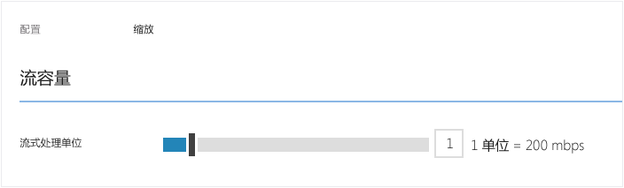
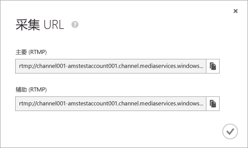
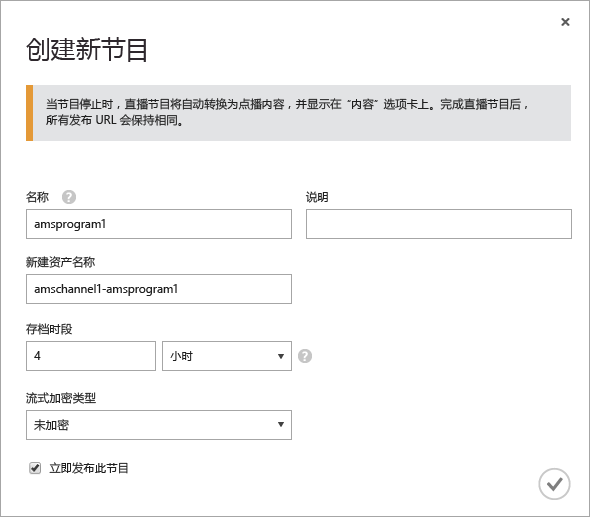
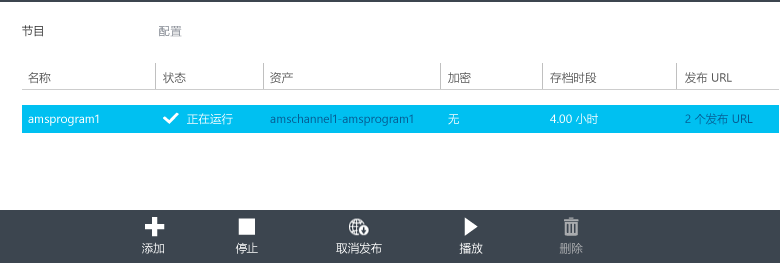

<properties
	pageTitle="使用 Azure 管理门户创建从本地编码器接收多比特率实时流的通道 | Azure"
	description="本教程将指导你完成实施一个基本媒体服务实时传送视频流应用程序的步骤，在该应用程序中，某个通道将从本地实时编码器接收多比特率实时流。"
	services="media-services"
	documentationCenter=""
	authors="Juliako,cenkdin" 
	manager="dwrede" 
	editor=""/>

<tags
	ms.service="media-services"
	ms.date="04/25/2016"  
	wacn.date="06/27/2016"/>

# 使用 Azure 管理门户创建从本地编码器接收多比特率实时流的通道

[AZURE.INCLUDE [media-services-selector-manage-channels](../includes/media-services-selector-manage-channels.md)]

本教程将指导你完成实施一个基本媒体服务实时传送视频流应用程序的步骤，在该应用程序中，某个通道将从本地实时编码器接收多比特率实时流。有关使用通道和相关组件的详细概述，请参阅[使用从本地编码器接收多比特率实时流的通道](/documentation/articles/media-services-live-streaming-with-onprem-encoders/)。

在本教程中，将使用 Azure 管理门户完成以下任务：

2.  配置流式处理终结点。
3.  创建通道。
1.  配置实时编码器，并将实时流引入通道（此步骤将使用 Wirecast）。
1.  创建节目（和资产）。
1.  发布资产并获取流 URL。
1.  播放内容。
2.  清理。

## 先决条件
以下是完成本教程所需具备的条件。

- 若要完成本教程，你需要一个 Azure 帐户。有关详细信息，请参阅 [Azure 试用](/pricing/1rmb-trial/?WT.mc_id=A261C142F)。 
- 一个媒体服务帐户。若要创建媒体服务帐户，请参阅[创建帐户](/documentation/articles/media-services-create-account/)。
- 可以发送多比特率实时流的摄像头和编码器。

## 使用 Azure 管理门户配置流式处理终结点

使用 Azure 媒体服务时最常见的方案之一是将自适应比特率流传送至你的客户端。通过自适应比特率流式处理，客户端可以在视频显示时，根据当前网络带宽、CPU 利用率和其他因素，切换至较高或较低的比特率流。媒体服务支持以下自适应比特率流式处理技术：HTTP 实时流式处理 (HLS)、平滑流式处理、MPEG DASH 和 HDS（仅适用于 Adobe PrimeTime/Access 许可证持有人）。

使用实时流时，本地实时编码器（在本例中为 Wirecast）会将多比特率实时流引入你的通道。当用户请求流时，媒体服务会使用动态打包将源流重新打包成自适应比特率流（HLS、DASH 或平滑流）。

若要利用动态打包，你需要获取计划从中传送内容的流式处理终结点的至少一个流式处理单元。

若要更改流式处理保留单元数，请执行以下操作：

1. 在 [Azure 管理门户](https://manage.windowsazure.cn/)中单击“媒体服务”。然后，单击媒体服务的名称。

2. 选择“流式处理终结点”页。然后，单击要修改的流式处理终结点。

3. 若要指定流式处理单元数，请选择“缩放”选项卡并移动“保留容量”滑块。

4. 单击“保存”按钮保存更改。

分配所有新的单元大约需要 20 分钟才能完成。

>[AZURE.NOTE] 当前，将流式处理单位的任何正值设置回“无”可将流式处理功能禁用最多 1 小时。
>
> 为 24 小时期间指定的最大单位数将用于计算成本。有关定价详细信息，请参阅 [媒体服务定价详细信息](/home/features/media-services/pricing/)。

## 创建通道

在 Azure 管理门户中选择“通道”页。然后单击“新建”。在“创建新的实时通道”页中输入通道的名称。

在页面右下角，单击复选标记以保存更新。

几分钟后，将会创建并启动通道。

## 获取引入 URL

创建通道后，你可以获得要提供给实时编码器的引入 URL。编码器将使用这些 URL 来输入实时流。

有关引入 URL 的详细信息，请参阅[使用本地编码器向通道发送多比特率实时流](/documentation/articles/media-services-live-streaming-with-onprem-encoders/)。

## 配置实时编码器并引入实时流

>[AZURE.NOTE] 此步骤需要上一步中提到的通道引入 URL。

有关如何配置 Wirecast 并开始引入流的详细信息，请参阅 [Wirecast 配置](https://azure.microsoft.com/blog/2014/09/18/azure-media-services-rtmp-support-and-live-encoders/)。

>[AZURE.NOTE] 如果出于任何原因停止了编码器，然后需要重新启动它，则应先重置通道，方法是在 Azure 管理门户中单击“重置”命令。

## 创建和管理节目

### 概述

频道与节目相关联，使用节目，你可以控制实时流中的段的发布和存储。通道管理节目。通道和节目的关系非常类似于传统媒体，频道具有恒定的内容流，而节目的范围限定为该频道上的一些定时事件。

可以通过设置**存档窗口**长度，指定你希望保留节目录制内容的小时数。此值的设置范围是最短 5 分钟，最长 25 小时。存储时间窗口长度还决定了客户端能够从当前实时位置按时间向后搜索的最长时间。超出指定时间长度后，节目也能够运行，但落在时间窗口长度后面的内容将全部被丢弃。此属性的这个值还决定了客户端清单能够增加多长时间。

每个节目都与某个资产关联。若要发布节目，必须为关联的资产创建按需定位符。创建此定位符后，你可以生成提供给客户端的流 URL。

一个通道最多支持三个并发运行的节目，因此你可以为同一传入流创建多个存档。这样，你便可以根据需要发布和存档事件的不同部分。例如，你的业务要求是存档 6 小时的节目，但只广播过去 10 分钟的内容。为了实现此目的，你需要创建两个同时运行的节目。一个节目设置为存档 6 小时的事件但不发布该节目。另一个节目设置为存档 10 分钟的事件，并且要发布该节目。

不应当将现有节目重用于新事件。与之相反，应针对每个事件创建并启动新节目。

在准备好开始流式传输和存档时，启动节目。在要停止对事件进行流式传输和存档时，停止节目。

若要删除存档的内容，请停止并删除节目，然后删除关联的资产。如果资产被某个节目使用，则无法将其删除，必须先删除该节目。

即使你停止并删除了节目，只要你没有删除资产，用户也将能够按需将你的已存档内容作为视频进行流式传输。

如果希望保留已存档的内容但不希望其可供流式传输，请删除流式传输定位符。

### 创建、启动和停止节目

将流传输到通道后，你可以通过创建资产、节目和流定位符来启动流式传输事件。这将会存档流，并使观看者可通过流式处理终结点使用该流。

可通过两种方式启动一个事件：

1. 在“频道”页上，单击“添加”以添加新节目。

在“创建新节目”页上，指定节目名称、资产名称、存档时段和加密选项。

如果选择“立即发布此节目”，则会创建发布 URL。

在准备好流式传输节目时，可以单击“启动”。

启动节目后，你可以单击“播放”开始播放内容。

2. 或者，可以使用快捷方式或单击“频道”页上的“开始流式传输”按钮。这将会创建资产、节目和流定位符。

节目命名为 DefaultProgram，存档时段设置为 1 小时。

你可以从“频道”页播放发布的节目。

如果你在“频道”页上单击“停止流式传输”，将会停止并删除默认节目。资源仍在那里，并且你可以从**“内容”**页发布或取消发布它。

如果你切换到**“内容”**页，你将看到为节目创建的资源。

## 播放内容

若要为用户提供一个可用来流式传输内容的 URL，你首先需要通过创建定位符（当你使用 Azure 管理门户发布资产时，系统已经为你创建了定位符）来发布资产（如上一部分中所述）。定位符提供对资产中所含文件的访问权限。

根据你要用来播放内容的流式处理协议，你可能需要修改从频道\\节目的**“发布 URL”**链接获取的 URL。

动态打包负责将实时流打包成指定的协议。

默认情况下，流 URL 采用以下格式，你可以用它来播放平滑流资产。

	{streaming endpoint name-media services account name}.streaming.mediaservices.chinacloudapi.cn/{locator ID}/{filename}.ism/Manifest

若要生成 HLS 流 URL，请将 (format=m3u8-aapl) 附加到 URL。

	{streaming endpoint name-media services account name}.streaming.mediaservices.chinacloudapi.cn/{locator ID}/{filename}.ism/Manifest(format=m3u8-aapl)

若要生成 MPEG DASH 流 URL，请将 (format=mpd-time-csf) 追加到 URL。

	{streaming endpoint name-media services account name}.streaming.mediaservices.chinacloudapi.cn/{locator ID}/{filename}.ism/Manifest(format=mpd-time-csf)

有关传送内容的详细信息，请参阅[传送内容](/documentation/articles/media-services-deliver-content-overview/)。

你可以使用 [AMS 播放器](http://amsplayer.azurewebsites.net/azuremediaplayer.html)播放平滑流，或使用 iOS 和 Android 设备播放 HLS 版本 3。

## 清理

如果你已完成流式处理事件，并想要清理先前预配的资源，请使用以下过程。

- 停止从编码器推送流。
- 停止通道。停止频道后，将不会产生任何费用。当你需要重新启动它时，它将采用相同的引入 URL，因此你无需重新配置编码器。
- 除非你想要继续以按需流式处理形式提供实时事件的存档，否则你可以停止流式处理终结点。如果频道处于停止状态，将不会产生任何费用。

### 想要寻找其他内容吗？

如果本主题不包含你所期待的内容、缺少某些内容，或在其他方面不符合你的需求，请使用下面的 Disqus 会话向我们提供反馈。

## 其他资源
- [使用 Azure 管理门户开始实时流式处理](https://azure.microsoft.com/blog/getting-started-with-live-streaming-using-the-azure-management-portal/)

<!-- URLs. -->
[Azure Management Portal]: http://manage.windowsazure.cn/

<!-- Images -->

<!---HONumber=Mooncake_0620_2016-->