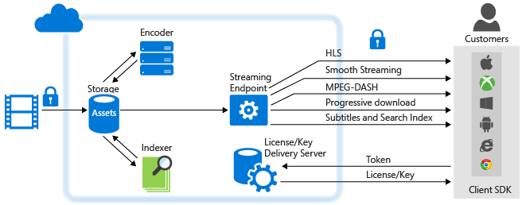

<properties
	pageTitle="Azure 媒体服务分析概述 | Azure"
	description="Azure 媒体服务提供了 Azure 媒体分析公共预览版，其中集合了企业级的语音和计算机视觉服务、合规性、安全性和全球市场宣传功能。Azure 媒体分析服务是使用核心 Azure 媒体服务平台组件构建而成的，因此一开始就能进行大规模的媒体处理。"
	services="media-services"
	documentationCenter=""
	authors="juliako"
	manager="erikre"
	editor=""/>

<tags
	ms.service="media-services"
	ms.workload="media"
	ms.tgt_pltfrm="na"
	ms.devlang="dotnet"
	ms.topic="article"
	ms.date="09/14/2016"   
	wacn.date="10/10/2016"
	ms.author="milanga;juliako;johndeu"/>

# Azure 媒体服务分析概述

##概述

越来越多的组织和企业采用视频作为首选媒体来培训员工、与客户沟通以及规定业务职能。使用云计算可以有效地存储、流式传输和访问这些大型媒体文件，但是当公司扩展其视频内容库时，必须采用同样有效的方式从视频中提取新的见解，以便与其受众之间建立更有意义且个性化的交互，并将其业务提升到更高的层次。

为了解决市场上这一不断增长的需求，Azure 媒体服务提供了媒体分析，即一系列语音和影像组件（具企业规模、合规性、安全性和全球性覆盖），让组织和企业可以从其视频文件中更轻松地获得可操作的见解。Azure 媒体分析服务是使用核心 Azure 媒体服务平台组件构建而成的，因此一开始就能进行大规模的媒体处理。

Azure 媒体分析可让开发人员在一定程度上对视频快速使用视觉功能，并将此高级功能引入 Bot 和应用程序。Azure 媒体分析可在企业环境中使用，满足各种规模的大型组织所需的合规性、安全性和全球市场宣传需求。

下图显示**媒体分析**和媒体服务平台的其他主要部分。请注意，媒体分析媒体处理器会生成 MP4 文件或 JSON 文件。如果媒体处理器生成了 MP4 文件，你可以采用渐进方式下载该文件。如果媒体处理器生成了 JSON 文件，你可以从 Azure Blob 存储下载该文件。

## Azure 媒体分析服务

- **Indexer** — Azure Media Indexer 能使内容可搜索，以及生成隐藏式字幕跟踪。
 
- **Hyperlapse** — Microsoft Hyperlapse 是 Microsoft Research (MSR) 20 多年以来在计算机视觉研究上获取的成果，它结合了视频稳定化和缩时功能，可从长格式内容创建快速可用的优美视频。除了创建缩时视频，你还可以使用 Hyperlapse 将通过手机和摄影机拍摄的不稳定视频创建稳定的视频。有关详细信息和示例，请参阅[使用 Azure Media Hyperlapse 创建 Hyperlapse 媒体文件](/documentation/articles/media-services-hyperlapse-content/)
 
- **动作检测** — 可以使用此服务来检测具有固定背景的视频中的动作。对于想要检查监视视频摘要上由监控摄影机检测到的动作事件是否存在误报的客户，此功能非常合适。有关详细信息和示例，请参阅 [Azure 媒体分析的动作检测](/documentation/articles/media-services-motion-detection/)。
 
- **面部检测和面部情绪** — 使用此服务可以检测人的面部和情绪，包括快乐、悲伤、惊讶、生气、藐视、恐惧、厌恶与冷漠/淡定。此服务具有如下所述的多个有用行业应用程序，包括聚合与分析参与事件的人员的反应。有关详细信息和示例，请参阅 [Azure 媒体分析的面部和情绪检测](/documentation/articles/media-services-face-and-emotion-detection/)。
 
- **视频摘要** — 视频摘要可通过自动选择来自源视频的有趣片段帮助你创建长视频的摘要。当你要提供有关长视频内容的快速概述时，这很有用。有关详细信息和示例，请参阅[使用 Azure 媒体视频缩略图创建视频摘要](/documentation/articles/media-services-video-summarization/)

- **光学字符识别** — Azure 媒体分析 OCR（光学字符识别）可让你将视频文件中的文本内容转换成可编辑、可搜索的数字文本。这可让你从媒体的视频信号中自动提取有意义的元数据。
 

 
## 常见方案

在下面的方案中，Azure 媒体分析可帮助跨行业组织和企业从视频搜集新的见解，以便以更加个性化的方式来与观众和员工沟通，以及更有效地管理大量视频内容：

- **呼叫中心** - 即使是出现了社交媒体，客户呼叫中心也仍能够帮助解决大量的客户服务事务。此音频数据中编码了有关客户的丰富信息，分析这些信息可以改进产品路线图，同时为客服中心员工提供培训，以实现更高的客户满意度。通过使用 Azure Media Indexer，客户可以提取文本并生成搜索索引和仪表板来提取最常见的投诉、投诉原因以及其他相关数据的情报。

- **用户生成的内容仲裁** - 从新闻媒体分支机构到公安部门，许多组织都设立了对外公开的门户，用于在其中接受 UGC 媒体，例如视频和图像。内容的数量可能因意外事件而激增。在这种情况下，仅凭人力几乎不可能有效地审查哪些内容是不当的。客户可以依赖于内容仲裁服务，将工作重点放在适当的内容上。

- **监控** - 由于 IP 相机的不断普及，监控视频的数量呈爆炸式增长。人工审查监控视频既耗时又容易发生人为错误。Azure 媒体分析提供了多个组件，例如动作检测、面部检测和 Hyperlapse，来方便审查、管理和创建衍生对象。

## 媒体服务分析媒体处理器 

本节列出所有媒体服务分析媒体处理器 (MP)，并说明如何使用 .NET 或 REST 来获取 MP 对象。

### MP 名称

- Azure Media Indexer
- Azure Media Hyperlapse
- Azure 媒体面部检测器
- Azure 媒体动作检测器
- Azure 媒体视频缩略图
- Azure 媒体 OCR

### .NET

以下函数采用其中一个指定的 MP 名称，并返回 MP 对象。

    static IMediaProcessor GetLatestMediaProcessorByName(string mediaProcessorName)
    {
        var processor = _context.MediaProcessors
            .Where(p => p.Name == mediaProcessorName)
            .ToList()
            .OrderBy(p => new Version(p.Version))
            .LastOrDefault();

        if (processor == null)
            throw new ArgumentException(string.Format("Unknown media processor",
                                                       mediaProcessorName));

        return processor;
    }

## REST

请求：

	GET https://wamsshaclus001rest-hs.chinacloudapp.cn/api/MediaProcessors()?$filter=Name%20eq%20'Azure%20Media%20OCR' HTTP/1.1
	DataServiceVersion: 1.0;NetFx
	MaxDataServiceVersion: 3.0;NetFx
	Accept: application/json
	Accept-Charset: UTF-8
	User-Agent: Microsoft ADO.NET Data Services
	Authorization: Bearer <token>
	x-ms-version: 2.12
	Host: wamsshaclus001rest-hs.chinacloudapp.cn
	
响应：
		
	. . .
	
	{  
	   "odata.metadata":"https://wamsshaclus001rest-hs.chinacloudapp.cn/api/$metadata#MediaProcessors",
	   "value":[  
	      {  
	         "Id":"nb:mpid:UUID:074c3899-d9fb-448f-9ae1-4ebcbe633056",
	         "Description":"Azure Media OCR",
	         "Name":"Azure Media OCR",
	         "Sku":"",
	         "Vendor":"Microsoft",
	         "Version":"1.1"
	      }
	   ]
	}

##演示

[Azure Media Analytics demos（Azure 媒体分析演示）](http://azuremedialabs.azurewebsites.net/demos/Analytics.html)

##相关文章

[Azure 媒体服务公告](https://azure.microsoft.com/blog/introducing-azure-media-analytics/)
  

<!-- Images -->

[overview]: ./media/media-services-video-on-demand-workflow/media-services-video-on-demand.png

<!---HONumber=Mooncake_0926_2016-->