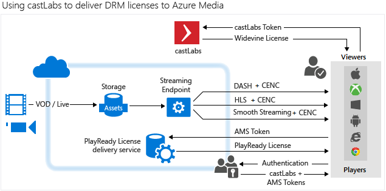

<properties 
	pageTitle="使用 castLabs 将 Widevine 许可证传送到 Azure 媒体服务" 
	description="本文介绍如何使用 Azure 媒体服务(AMS) 传送 AMS 使用 PlayReady 和 Widevine DRM 动态加密的流。PlayReady 许可证来自媒体服务 PlayReady 许可证服务器，而 Widevine 许可证则由 castLabs 许可证服务器传送。" 
	services="media-services" 
	documentationCenter="" 
	authors="Mingfeiy,willzhan,Juliako" 
	manager="dwrede" 
	editor=""/>

<tags
	ms.service="media-services"
	ms.date="04/18/2016"    
	wacn.date="06/20/2016"/>

#使用 castLabs 将 Widevine 许可证传送到 Azure 媒体服务

> [AZURE.SELECTOR]
- [castLabs](/documentation/articles/media-services-castlabs-integration/)

##概述

本文介绍如何使用 Azure 媒体服务(AMS) 传送 AMS 使用 PlayReady 和 Widevine DRM 动态加密的流。PlayReady 许可证来自媒体服务 PlayReady 许可证服务器，而 Widevine 许可证则由 **castLabs** 许可证服务器传送。

若要播放受 CENC（PlayReady 和/或 Widevine）保护的流式处理内容，可使用 [Azure Media Player](http://amsplayer.azurewebsites.net/azuremediaplayer.html)。有关详细信息，请参阅 [AMP 文档](http://amp.azure.net/libs/amp/latest/docs/)。

下图演示了高级 Azure 媒体服务和 castLabs 集成体系结构。

##典型的系统设置

- 媒体内容存储在 AMS 中。
- 内容密钥的密钥 ID 存储在 castLabs 和 AMS 中。
- castLabs 和 AMS 均内置了令牌身份验证。以下部分讨论身份验证令牌。 
- 当客户端请求流式传输视频时，内容将使用 **通用加密** (CENC) 进行动态加密，并由 AMS 动态打包成平滑流和 DASH。我们还针对 HLS 流式处理协议提供 PlayReady M2TS 基本流加密。
- PlayReady 许可证从 AMS 许可证服务器检索，而 Widevine 许可证则从 castLabs 许可证服务器检索。 
- Media Player 将自动根据客户端平台功能决定要提取哪个许可证。 

##用于获取许可证的身份验证令牌生成

castLabs 和 AMS 均支持用于授予许可证的 JWT（JSON Web 令牌）令牌格式。

###AMS 中的 JWT 令牌 

下表描述了 AMS 中的 JWT 令牌。

颁发者|所选安全令牌服务 (STS) 中的颁发者字符串
---|---
目标受众|所用 STS 中的受众字符串
声明|一组声明
NotBefore|令牌的有效起始日期
Expires|令牌的有效结束日期
SigningCredentials|在 PlayReady 许可证服务器、castLabs 许可证服务器和 STS 之间共享的密钥，它可以是对称或非对称密钥。

###castLabs 中的 JWT 令牌

下表描述了 castLabs 中的 JWT 令牌。

Name|说明
---|---
optData|一个包含你的相关信息的 JSON 字符串。 
crt|一个包含有关资源、其许可证信息和播放权限的信息的 JSON 字符串。
iat|用 epoch 表示的当前日期时间。
jti|有关此令牌的唯一标识符（每个令牌只能在 castLabs 系统中使用一次）。

##示例解决方案设置 

[示例解决方案](https://github.com/AzureMediaServicesSamples/CastlabsIntegration)由两个项目组成：

-	可用于对 PlayReady 和 Widevine 的已引入资源设置 DRM 限制的控制台应用程序。
-	分发令牌的 Web 应用程序，可将其视为 STS 的非常简化版本。

若要使用控制台应用程序，请执行以下操作：

1.	更改 app.config 以设置 AMS 凭据、castLabs 凭据、STS 配置和共享密钥。
2.	将资源上载到 AMS。
3.	从上载的资源中获取 UUID 并更改 Program.cs 文件中的第 32 行：

		 var objIAsset = _context.Assets.Where(x => x.Id == "nb:cid:UUID:dac53a5d-1500-80bd-b864-f1e4b62594cf").FirstOrDefault();

4.	使用 AssetId 来命名 castLabs 系统中的资源（Program.cs 文件中的第 44 行）。

	必须为 **castLabs** 设置 AssetId；它必须是唯一的字母数字字符串。

5.	运行该程序。

若要使用 Web 应用程序 (STS)，请执行以下操作：

1.	更改 web.config 以设置 castlabs 商家 ID、STS 配置和共享密钥。
2.	部署到 Azure 网站。
3.	导航到该网站。

##播放视频

若要播放通过通用加密（PlayReady 和/或 Widevine）加密的视频，可以使用 [Azure Media Player](http://amsplayer.azurewebsites.net/azuremediaplayer.html)。运行控制台应用程序时，将回显内容密钥 ID 和清单 URL。

1.	打开新选项卡并启动 STS：http://[yourStsName].chinacloudsites.cn/api/token/assetid/[yourCastLabsAssetId]/contentkeyid/[thecontentkeyid]。
2.	转到 [Azure Media Player](http://amsplayer.azurewebsites.net/azuremediaplayer.html)。
3.	粘贴到流 URL 中。
4.	单击 **“高级选项”** 复选框。
5.	在“保护”下拉列表中选择 PlayReady 和/或 Widevine。
6.	将从 STS 获取的令牌粘贴到“令牌”文本框中。 
	
	castLab 许可证服务器不需要在令牌前面添加“Bearer=”前缀。因此，请在提交令牌之前删除该前缀。
7.	更新播放器。
8.	视频应正在播放。

<!---HONumber=Mooncake_0613_2016-->