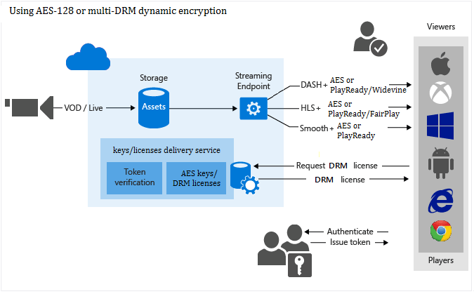

<properties 
	pageTitle="保护内容概述" 
	description="本文概述了如何使用媒体服务来保护内容。" 
	services="media-services" 
	documentationCenter="" 
	authors="Juliako" 
	manager="erikre" 
	editor=""/>  

<tags 
	ms.service="media-services" 
	ms.workload="media" 
	ms.tgt_pltfrm="na" 
	ms.devlang="na" 
	ms.topic="article" 
	ms.date="09/27/2016" 
	wacn.date="11/14/2016" 
	ms.author="juliako"/>  

#保护内容概述

使用 Azure 媒体服务，可以在媒体从离开计算机到存储、处理和传送的整个过程中确保其安全。借助媒体服务，可以传送使用高级加密标准（AES，使用 128 位加密密钥）或任何主要 DRM（Microsoft PlayReady、Google Widevine 和 Apple FairPlay）动态加密的实时和点播内容。媒体服务还提供用于向已授权客户端传送 AES 密钥和 DRM（PlayReady、Widevine 和 FairPlay）许可证的服务。

下图演示 AMS 支持的内容保护工作流。

  

>[AZURE.NOTE]若要使用动态加密，首先必须获取你想要从中流式传输加密内容的流式处理终结点的至少一个流式处理保留单元。

本主题介绍与了解如何使用 AMS 保护内容相关的[概念和术语](/documentation/articles/media-services-content-protection-overview/)。本主题还包含说明如何完成内容保护任务的主题的[链接](/documentation/articles/media-services-content-protection-overview/#common-scenarios)。

##动态加密

Azure 媒体服务支持传送使用 AES 明文密钥和 DRM 加密（Microsoft PlayReady、Google Widevine 和 Apple FairPlay）动态加密的内容。

当前你可以加密以下流格式：HLS、MPEG DASH 和平滑流。无法加密 HDS 流格式或渐进式下载。

如果你需要媒体服务来加密资产，则需要将加密密钥（CommonEncryption 或 EnvelopeEncryption）与资产相关联，并且配置密钥的授权策略。

你还需要配置资产的传送策略。如果你要流式传输存储加密的资产，请确保通过配置资产传送策略来指定该资产的传送方式。

播放器请求流时，媒体服务会使用指定的密钥通过 AES 明文密钥或 DRM 加密来动态加密内容。为了解密流，播放器将从密钥传送服务请求密钥。为了确定用户是否被授权获取密钥，服务将评估你为密钥指定的授权策略。

>[AZURE.NOTE]若要利用动态加密，首先必须获取你计划从中传送内容的流式处理终结点的至少一个点播流单元。有关详细信息，请参阅[如何缩放媒体服务](/documentation/articles/media-services-manage-origins/#scale_streaming_endpoints)。

##存储加密

使用存储加密通过 AES 256 位加密在本地加密明文内容，然后将其上传到 Azure 存储中，相关内容在此以加密形式静态存储。受存储加密保护的资产将在编码前自动解密并放入经过加密的文件系统中，并可选择在重新上载为新的输出资产前重新加密。存储加密的主要用例是在磁盘上通过静态增强加密来保护高品质的输入媒体文件。

若要传送存储加密资产，必须配置资产的传送策略，以使媒体服务了解要如何传送你的内容。在流式传输资产之前，流式处理服务器会删除存储加密，然后再使用指定的传传送策略（例如 AES、通用加密或无加密）流式传输你的内容。

## 通用加密 (CENC)

通过 PlayReady 和/或 Widewine 加密内容时使用通用加密。

## 使用 cbcs-aapl 加密

通过 FairPlay 加密内容时使用 cbcs-aapl。

## 信封加密 

如果想要使用 AES-128 明文密钥保护内容，可使用此选项。如果想要更高的安全级别，可选择本主题中列出的其中一个 DRM。

##许可证和密钥传送服务

媒体服务提供用于向已授权客户端传送 DRM（PlayReady、Widevine、FairPlay）许可证和 AES 明文密钥的服务。可以使用 REST API 或用于 .NET 的媒体服务 SDK 来配置许可证和密钥的授权与身份验证策略。

##令牌限制

内容密钥授权策略可能受到一种或多种授权限制：开放或令牌限制。令牌限制策略必须附带由安全令牌服务 (STS) 颁发的令牌。媒体服务支持采用简单 Web 令牌 (SWT) 格式和 JSON Web 令牌 (JWT) 格式的令牌。媒体服务不提供安全令牌服务。你可以创建自定义 STS 或利用 Azure ACS 来颁发令牌。必须将 STS 配置为创建令牌，该令牌使用指定密钥以及你在令牌限制配置中指定的颁发声明进行签名。如果令牌有效，而且令牌中的声明与为密钥（或许可证）配置的声明相匹配，则媒体服务密钥传送服务会将请求的密钥（或许可证）返回到客户端。

在配置令牌限制策略时，必须指定主验证密钥、颁发者和受众参数。主验证密钥包含用来为令牌签名的密钥，颁发者是颁发令牌的安全令牌服务。受众（有时称为范围）描述该令牌的意图，或者令牌授权访问的资源。媒体服务密钥交付服务将验证令牌中的这些值是否与模板中的值匹配。

##流 URL

如果资产使用多个 DRM 加密，则应在流式处理 URL 中使用加密标记：(format='m3u8-aapl', encryption='xxx')。

请注意以下事项：

- 仅可指定零个或一个加密类型。
- 如果只将一个加密应用到资产，则无需在 URL 中指定加密类型。
- 加密类型区分大小写。
- 可以指定以下加密类型：
	- **cenc**：通用加密（Playready 或 Widevine）
	- **cbc aapl**：Fairplay
	- **cbc**：AES 信封加密。

##常见方案

以下主题演示如何在存储中保护内容、以动态方式传送加密的流媒体、使用 AMS 密钥/许可证传送服务

- [使用 AES 进行保护](/documentation/articles/media-services-protect-with-aes128/)
- [使用 PlayReady 和/或 Widevine 进行保护](/documentation/articles/media-services-protect-with-drm/)
- [使用 Apple FairPlay 和/或 PlayReady 流式传输受保护的 HLS 内容](/documentation/articles/media-services-protect-hls-with-fairplay/)

### 其他方案

- [如何将 Azure PlayReady 许可证服务与自己的加密程序/流式处理服务器集成](http://mingfeiy.com/integrate-azure-playready-license-service-encryptorstreaming-server)。
- [使用 castLabs 将 DRM 许可证传送到 Azure 媒体服务](/documentation/articles/media-services-castlabs-integration/)

##相关链接

[将 PlayReady 声明为服务并使用 Azure 媒体服务进行 AES 动态加密](http://mingfeiy.com/playready)

[Azure 媒体服务 PlayReady 许可证交付定价详述](http://mingfeiy.com/playready-pricing-explained-in-azure-media-services)

[如何在 Azure 媒体服务中调用 AES 加密流](http://mingfeiy.com/debug-aes-encrypted-stream-azure-media-services)

[JWT 令牌身份验证](http://www.gtrifonov.com/2015/01/03/jwt-token-authentication-in-azure-media-services-and-dynamic-encryption/)

[将基于 Azure 媒体服务 OWIN MVC 的应用与 Azure Active Directory 相集成，并基于 JWT 声明限制内容密钥传送](http://www.gtrifonov.com/2015/01/24/mvc-owin-azure-media-services-ad-integration/)。

[使用 Azure ACS 颁发令牌](http://mingfeiy.com/acs-with-key-services)。

[content-protection]: ./media/media-services-content-protection-overview/media-services-content-protection.png

<!---HONumber=Mooncake_1107_2016-->