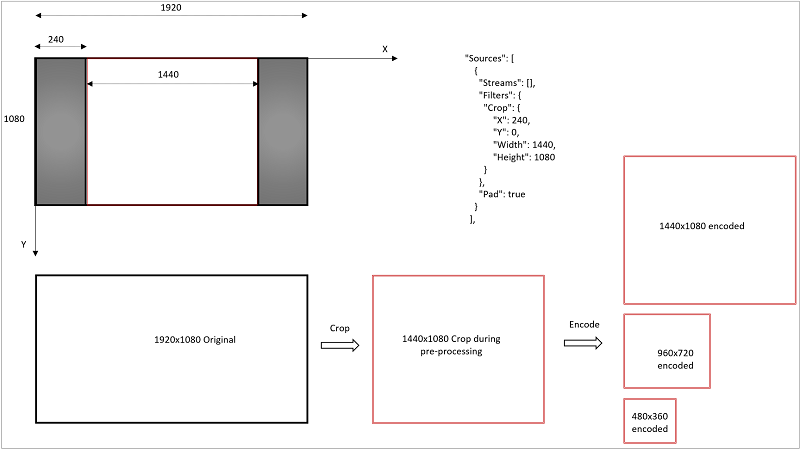

<properties
	pageTitle="如何裁剪视频 | Azure"
	description="本文说明如何使用媒体编码器标准版裁剪视频。"
	services="media-services"
	documentationCenter=""
	authors="anilmur"
	manager="erikre"
	editor=""/>  

<tags
	ms.service="media-services"
	ms.workload="media"
	ms.tgt_pltfrm="na"
	ms.devlang="dotnet"
	ms.topic="article"
	ms.date="09/26/2016"
	wacn.date="11/14/2016"  
	ms.author="anilmur;juliako;"/>  

# 使用媒体编码器标准版裁剪视频

可以使用媒体编码器标准版 (MES) 裁剪输入视频。裁剪是指在视频帧内选择一个矩形窗口并且只编码该窗口内的像素的过程。下图可帮助说明该过程。

假设作为输入的视频的分辨率为 1920x1080 像素（16:9 纵横比），不过因为左侧和右侧有黑色长条（圆柱框），导致包含活动视频的区域只有 4:3 窗口或 1440x1080 像素。你可以使用 MES 裁剪或去掉黑色长条，然后编码 1440x1080 区域。

MES 中的裁剪是预处理阶段，因此，编码预设​​值中的裁剪参数适用于原始输入视频。编码是后续阶段，因此，宽度/高度设置适用于*经过预先处理*的视频，而非原始视频。在设计预设值时，需要执行以下操作：(a) 根据原始输入视频选择裁剪参数；(b) 根据裁剪后的视频选择编码设置。如果编码设置与裁剪后的视频不匹配，输出将会不如预期。

[以下](/documentation/articles/media-services-advanced-encoding-with-mes#encoding_with_dotnet)主题说明如何使用 MES 创建编码作业，以及如何为编码任务指定自定义预设值。

## 创建自定义预设值

在下图所示的示例中：

1. 原始输入为 1920x1080
1. 需将其裁剪为 1440x1080 的输出，使其能位于输入帧的中央
1. 这表示 X 偏移量为 (1920 – 1440)/2 = 240，Y 偏移量为零
1. 裁剪矩形的宽度和高度分别为 1440 和 1080
1. 在编码阶段，我们的任务是生成三层，分别为 1440x1080、960x720 和 480x360 的分辨率

###JSON 预设

	{
	  "Version": 1.0,
	  "Sources": [
	    {
	      "Streams": [],
	      "Filters": {
	        "Crop": {
	            "X": 240,
	            "Y": 0,
	            "Width": 1440,
	            "Height": 1080
	        }
	      },
	      "Pad": true
	    }
	  ],
	  "Codecs": [
	    {
	      "KeyFrameInterval": "00:00:02",
	      "H264Layers": [
	        {
	          "Profile": "Auto",
	          "Level": "auto",
	          "Bitrate": 3400,
	          "MaxBitrate": 3400,
	          "BufferWindow": "00:00:05",
	          "Width": 1440,
	          "Height": 1080,
	          "BFrames": 3,
	          "ReferenceFrames": 3,
	          "AdaptiveBFrame": true,
	          "Type": "H264Layer",
	          "FrameRate": "0/1"
	        },
	        {
	          "Profile": "Auto",
	          "Level": "auto",
	          "Bitrate": 2250,
	          "MaxBitrate": 2250,
	          "BufferWindow": "00:00:05",
	          "Width": 960,
	          "Height": 720,
	          "BFrames": 3,
	          "ReferenceFrames": 3,
	          "AdaptiveBFrame": true,
	          "Type": "H264Layer",
	          "FrameRate": "0/1"
	        },
	        {
	          "Profile": "Auto",
	          "Level": "auto",
	          "Bitrate": 1250,
	          "MaxBitrate": 1250,
	          "BufferWindow": "00:00:05",
	          "Width": 480,
	          "Height": 360,
	          "BFrames": 3,
	          "ReferenceFrames": 3,
	          "AdaptiveBFrame": true,
	          "Type": "H264Layer",
	          "FrameRate": "0/1"
	        }
	      ],
	      "Type": "H264Video"
	    },
	    {
	      "Profile": "AACLC",
	      "Channels": 2,
	      "SamplingRate": 48000,
	      "Bitrate": 128,
	      "Type": "AACAudio"
	    }
	  ],
	  "Outputs": [
	    {
	      "FileName": "{Basename}_{Width}x{Height}_{VideoBitrate}.mp4",
	      "Format": {
	        "Type": "MP4Format"
	      }
	    }
	  ]
	}

##裁剪的限制

裁剪功能仅供手动操作。你需要将输入视频加载到合适的编辑工具中，以便选择感兴趣的帧、放置光标以确定裁剪矩形的偏移量、确定针对该特定视频调整的编码预设值等。此功能的本意并非实现诸如自动检测及删除输入视频黑边之类的功能。

裁剪功能受到以下限制。如果不符合以下情况，编码任务可能会失败或生成非预期的输出。

1. 裁剪矩形的坐标和大小不得超出输入视频
1. 如前文所述，编码设置的宽度和高度必须与裁剪后的视频对应
1. 裁剪适用于以横向模式捕获的视频（即，不适用于以垂直方向或纵向模式手持的智能手机录制的视频）
1. 最适合用于以方形像素捕获的渐进式视频

<!---HONumber=Mooncake_1107_2016-->