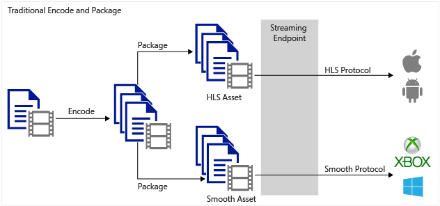
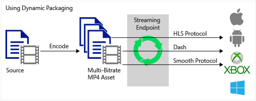

<properties
	pageTitle="动态打包概述"
	description="主题提供动态打包的概述。"
	authors="Juliako"
	manager="dwrede"
	editor=""
	services="media-services"
	documentationCenter=""/>

<tags
	ms.service="media-services"
 	ms.date="04/18/2016" 
	wacn.date="06/20/2016"/>

#动态打包

##概述

Azure 媒体服务可用于向多种客户端技术（例如，iOS、XBOX、Silverlight、Windows 8）传递多种媒体源文件格式、媒体流格式和内容保护格式。这些客户端可识别不同的协议，例如，iOS 需要 HTTP 实时流 (HLS) V4 格式，Silverlight 和 Xbox 需要平滑流。如果你有一组自适应比特率（多码率）MP4（ISO 基媒体 14496-12）文件或平滑流文件要提供给了解 MPEG DASH、HLS 或平滑流的客户端，则应利用媒体服务动态打包。

使用动态打包，你只需要创建一个包含一组自适应比特率 MP4 文件或自适应比特率平滑流文件的资产。然后，点播流服务器会确保你以选定的协议按清单或分段请求中的指定格式接收流。因此，你只需以单一存储格式存储文件并为其付费，然后媒体服务服务就会基于客户端的请求构建并提供相应响应。

下图显示传统编码和静态打包工作流。

下图显示了动态打包工作流。

>[AZURE.NOTE]若要利用动态打包，首先必须获取你计划从中传送内容的流式处理终结点的至少一个点播流单元。有关详细信息，请参阅[如何缩放媒体服务](/documentation/articles/media-services-manage-origins/#scale_streaming_endpoints)。

##常见方案

1. 上载一个输入文件（称为夹层文件）。例如，H.264、MP4 或 WMV（有关受支持格式的列表，请参阅[媒体编码器标准支持的格式](/documentation/articles/media-services-media-encoder-standard-formats/)）。

1. 将夹层文件编码为 H.264 MP4 自适应比特率集。

1. 通过创建点播定位符来发布包含自适应比特率 MP4 集的资产。

1. 生成用于访问和流式传输内容的流 URL。

##准备用于动态流式传输的资产

若要准备用于动态流式传输的资产，可以使用两个选项：

1. [上载主文件](/documentation/articles/media-services-dotnet-upload-files/)。
2. [使用标准编码器标准编码器生成 H.264 MP4 自适应比特率集](/documentation/articles/media-services-dotnet-encode-with-media-encoder-standard/)。
3. [Stream your content]/documentation/articles/(media-services-deliver-content-overview/).

- 或 -
 
1. 上载预先编码的 MP4 文件。 

	>[AZURE.NOTE] 不建议使用此选项。
	
2. [验证预先编码的文件](media-services-static-packaging.md#validating-adaptive-bitrate-mp4s-encoded-with-external-encoders)。
3. [流式传输内容](media-services-deliver-content-overview.md)。

##动态打包不支持的格式

动态打包不支持以下源文件格式。

- Dolby Digital MP4 文件。
- Dolby Digital 平滑流文件。

<!---HONumber=Mooncake_0613_2016-->