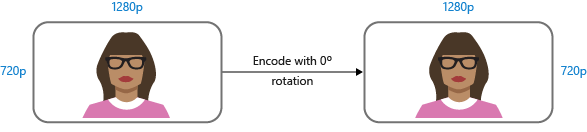
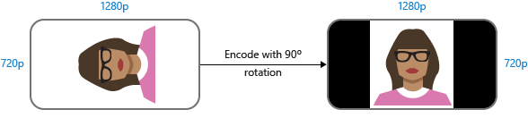
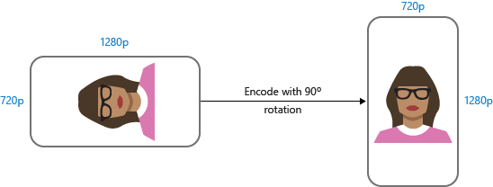

<properties
    pageTitle="Media Encoder Standard 架构 | Azure"
    description="本主题概述 Media Encoder Standard 架构。"
    author="Juliako"
    manager="erikre"
    editor=""
    services="media-services"
    documentationcenter="" />
<tags
    ms.assetid="4c060062-8ef2-41d9-834e-e81e8eafcf2e"
    ms.service="media-services"
    ms.workload="media"
    ms.tgt_pltfrm="na"
    ms.devlang="na"
    ms.topic="article"
    ms.date="01/10/2017"
    wacn.date="02/24/2017"
    ms.author="juliako" />  

# Media Encoder Standard 架构
本主题介绍 [Media Encoder Standard 预设](/documentation/articles/media-services-mes-presets-overview/)以其为基础的 XML 架构的一些元素和类型。本主题介绍元素及其有效值。将在以后发布完整架构。

##  Preset（根元素）
定义编码预设。

### 元素
| 名称 | 类型 | 说明 |
| --- | --- | --- |
| **编码** |[编码](/documentation/articles/media-services-mes-schema/#Encoding) |根元素，指示要编码的输入源。 |
| **Outputs** |[Outputs](/documentation/articles/media-services-mes-schema/#Output) |所需输出文件的集合。 |

### 属性
| 名称 | 类型 | 说明 |
| --- | --- | --- |
| 
**Version**

必需
 |**xs:decimal** |预设版本。以下限制适用：xs:fractionDigits value="1" 和 xs:minInclusive value="1" 例如，**version="1.0"**。 |

##  编码
包含以下元素的序列。

### 元素
| 名称 | 类型 | 说明 |
| --- | --- | --- |
| **H264Video** |[H264Video](/documentation/articles/media-services-mes-schema/#H264Video) |视频的 H.264 编码的设置。 |
| **AACAudio** |[AACAudio](/documentation/articles/media-services-mes-schema/#AACAudio) |音频的 AAC 编码的设置。 |
| **BmpImage** |[BmpImage](/documentation/articles/media-services-mes-schema/#BmpImage) |Bmp 图像的设置。 |
| **PngImage** |[PngImage](/documentation/articles/media-services-mes-schema/#PngImage) |Png 图像的设置。 |
| **JpgImage** |[JpgImage](/documentation/articles/media-services-mes-schema/#JpgImage) |Jpg 图像的设置。 |

##  H264Video
### 元素
| 名称 | 类型 | 说明 |
| --- | --- | --- |
| 
**TwoPass**

 minOccurs="0"
 |**xs:boolean** |目前，仅支持单步编码。 |
| 
**KeyFrameInterval**

 minOccurs="0"

 **default="00:00:02"**
 |**xs:time** |确定 IDR 帧之间的（默认）间距。 |
| 
**SceneChangeDetection**

 minOccurs="0"

 **default="false"**
 |**xs:boolean** |如果设置为 true，编码器尝试检测视频中的场景更改并插入 IDR 帧。 |
| 
**Complexity**

 minOccurs="0"

 **default="Balanced"**
 |**xs:string** |
控制编码速度和视频质量的平衡。可以是以下值之一： **Speed**、**Balanced** 或 **Quality**

 默认值：**Balanced**
 |
| 
**SyncMode**

 minOccurs="0"
 | |将在未来版本中公开功能。 |
| 
**H264Layers**

 minOccurs="0"
 |[H264Layers](/documentation/articles/media-services-mes-schema/#H264Layers) |输出视频层的集合。 |

##  H264Layers
### 元素
| 名称 | 类型 | 说明 |
| --- | --- | --- |
| 
**H264Layer**

 minOccurs="0" maxOccurs="unbounded"
 |[H264Layer](/documentation/articles/media-services-mes-schema/#H264Layer) |H264 层的集合。 |

##  H264Layer
> [AZURE.NOTE]视频限制基于 [H264 级别](https://en.wikipedia.org/wiki/H.264/MPEG-4_AVC#Levels)表中描述的值。

### 元素
| 名称 | 类型 | 说明 |
| --- | --- | --- |
| 
**Profile**

 minOccurs="0"

 default=”Auto”
 |**xs:string** |可以是以下 **xs:string** 值之一： **Auto**, **Baseline**、**Main**、**High**。 |
| 
**Level**

 minOccurs="0"

 default=”Auto”
 |**xs:string** | |
| 
**Bitrate**

 minOccurs="0"
 |**xs:int** |此视频层使用的比特率，以 kbps 为单位指定。 |
| 
**MaxBitrate**

 minOccurs="0"
 |**xs:int** |此视频层使用的最大比特率，以 kbps 为单位指定。 |
| 
**BufferWindow**

 minOccurs="0"

 default="00:00:05"
 |**xs:time** |视频缓冲区的长度。 |
| 
**Width**

 minOccurs="0"
 |**xs:int** |
输出视频帧的宽度，以像素为单位。

 请注意，当前必须指定宽度和高度。宽度和高度需为偶数。
 |
| 
**Height**

 minOccurs="0"
 |**xs:int** |
输出视频帧高度，以像素为单位。

 请注意，当前必须指定宽度和高度。宽度和高度需为偶数。
|
| 
**BFrames**

 minOccurs="0"
 |**xs:int** |参考帧之间的 B 帧数。 |
| 
**ReferenceFrames**

 minOccurs="0"

 default=”3”
 |**xs:int** |GOP 中的参考帧数。 |
| 
**EntropyMode**

 minOccurs="0"

 default=”Cabac”
 |**xs:string** |必须是以下值之一：**Cabac** 和 **Cavlc**。 |
| 
**FrameRate**

 minOccurs="0"
 |有理数 |
确定输出视频的帧速率。使用默认值“0/1”，允许编码器使用与输入视频相同的帧速率。允许的值应为常规视频帧速率，如下所示。但是，允许使用任何有效的有理数。例如，1/1 将是 1 fps 且有效。

 - 12/1 (12 fps)

 - 15/1 (15 fps)

 - 24/1 (24 fps)

 - 24000/1001 (23.976 fps)

 - 25/1 (25 fps)

 - 30/1 (30 fps)

 - 30000/1001 (29.97 fps)
 |
| 
**AdaptiveBFrame**

 minOccurs="0"
 |**xs:boolean** |从 Azure 媒体编码器复制 |
| 
**Slices**

 minOccurs="0"

 default="0"
 |**xs:int** |确定一帧分为多少切片。建议使用默认值。 |

##  AACAudio
 包含以下元素和组的序列。

 有关 AAC 的详细信息，请参阅 [AAC](https://en.wikipedia.org/wiki/Advanced_Audio_Coding)。

### 元素
| 名称 | 类型 | 说明 |
| --- | --- | --- |
| 
**Profile**

 minOccurs="0 "

 default="AACLC"
 |**xs:string** |可以是以下值之一：**AACLC**、**HEAACV1** 或 **HEAACV2**。 |

### 属性
| 名称 | 类型 | 说明 |
| --- | --- | --- |
| **条件** |**xs:string** |
若要强制编码器在输入不包含音频时生成包含静音曲目的资产，请指定“InsertSilenceIfNoAudio”值。

 默认情况下，如果要向编码器发送仅包含视频而不包含音频的输入，输出资产将包含仅有视频数据的文件。某些播放器可能无法处理此类输出流。对于这种方案，你可以使用此设置来强制编码器将静音曲目添加到输出。
 |

### 组
| 引用 | 说明 |
| --- | --- |
| 
[AudioGroup](/documentation/articles/media-services-mes-schema/#AudioGroup)

 minOccurs="0"
 |请参阅 [AudioGroup](/documentation/articles/media-services-mes-schema/#AudioGroup) 的说明，了解可为每个配置文件设置的通道、采样率和比特率的恰当数量。 |

##  AudioGroup
有关每个配置文件的有效值的详细信息，请参阅随后的“音频编解码器详细信息”表。

### 元素
| 名称 | 类型 | 说明 |
| --- | --- | --- |
| 
**Channels**

 minOccurs="0"
 |**xs:int** |
编码的音频通道数。以下是有效选项：1、2、5、6、8。

 默认值：2。
 |
| 
**SamplingRate**

 minOccurs="0"
 |**xs:int** |音频采样率，以 Hz 为单位指定。 |
| 
**Bitrate**

 minOccurs="0"
 |**xs:int** |对音频进行编码时使用的比特率，以 kbps 为单位指定。 |

### 音频编解码器详细信息
音频编解码器|详细信息  
-----------------|---  
**AACLC**|
1:

 - 11025 : 8 &lt;= bitrate &lt; 16

 - 12000 : 8 &lt;= bitrate &lt; 16

 - 16000 : 8 &lt;= bitrate &lt;32

- 22050 : 24 &lt;= bitrate &lt; 32

 - 24000 : 24 &lt;= bitrate &lt; 32

 - 32000 : 32 &lt;= bitrate &lt;= 192

 - 44100 : 56 &lt;= bitrate &lt;= 288

 - 48000 : 56 &lt;= bitrate &lt;= 288

 - 88200 : 128 &lt;= bitrate &lt;= 288

 - 96000 : 128 &lt;= bitrate &lt;= 288

 2:

 - 11025 : 16 &lt;= bitrate &lt; 24

 - 12000 : 16 &lt;= bitrate &lt; 24

 - 16000 : 16 &lt;= bitrate &lt; 40

 - 22050 : 32 &lt;= bitrate &lt; 40

 - 24000 : 32 &lt;= bitrate &lt; 40

 - 32000 : 40 &lt;= bitrate &lt;= 384

 - 44100 : 96 &lt;= bitrate &lt;= 576

 - 48000 : 96 &lt;= bitrate &lt;= 576

 - 88200 : 256 &lt;= bitrate &lt;= 576

 - 96000 : 256 &lt;= bitrate &lt;= 576

 5/6:

 - 32000 : 160 &lt;= bitrate &lt;= 896

 - 44100 : 240 &lt;= bitrate &lt;= 1024

 - 48000 : 240 &lt;= bitrate &lt;= 1024

 - 88200 : 640 &lt;= bitrate &lt;= 1024

 - 96000 : 640 &lt;= bitrate &lt;= 1024

 8:

 - 32000 : 224 &lt;= bitrate &lt;= 1024

 - 44100 : 384 &lt;= bitrate &lt;= 1024

 - 48000 : 384 &lt;= bitrate &lt;= 1024

 - 88200 : 896 &lt;= bitrate &lt;= 1024

 - 96000 : 896 &lt;= bitrate &lt;= 1024

**HEAACV1**|
1:

 - 22050 : bitrate = 8

 - 24000 : 8 &lt;= bitrate &lt;= 10

 - 32000 : 12 &lt;= bitrate &lt;= 64

 - 44100 : 20 &lt;= bitrate &lt;= 64

 - 48000 : 20 &lt;= bitrate &lt;= 64

 - 88200 : bitrate = 64

 2:

 - 32000 : 16 &lt;= bitrate &lt;= 128

 - 44100 : 16 &lt;= bitrate &lt;= 128

 - 48000 : 16 &lt;= bitrate &lt;= 128

 - 88200 : 96 &lt;= bitrate &lt;= 128

 - 96000 : 96 &lt;= bitrate &lt;= 128

 5/6:

 - 32000 : 64 &lt;= bitrate &lt;= 320

 - 44100 : 64 &lt;= bitrate &lt;= 320

 - 48000 : 64 &lt;= bitrate &lt;= 320

 - 88200 : 256 &lt;= bitrate &lt;= 320

 - 96000 : 256 &lt;= bitrate &lt;= 320

 8:

 - 32000 : 96 &lt;= bitrate &lt;= 448

 - 44100 : 96 &lt;= bitrate &lt;= 448

 - 48000 : 96 &lt;= bitrate &lt;= 448

 - 88200 : 384 &lt;= bitrate &lt;= 448

 - 96000 : 384 &lt;= bitrate &lt;= 448 

**HEAACV2**|
2:

 - 22050 : 8 &lt;= bitrate &lt;= 10

 - 24000 : 8 &lt;= bitrate &lt;= 10

 - 32000 : 12 &lt;= bitrate &lt;= 64

 - 44100 : 20 &lt;= bitrate &lt;= 64

 - 48000 : 20 &lt;= bitrate &lt;= 64

 - 88200 : 64 &lt;= bitrate &lt;= 64
 
  

##  剪辑
### 属性
| 名称 | 类型 | 说明 |
| --- | --- | --- |
| **StartTime** |**xs:duration** |指定演示的开始时间。StartTime 的值需与输入视频的绝对时间戳匹配。例如，如果输入视频第一帧的时间戳为 12:00:10.000，则 StartTime 应大于或等于 12:00:10.000。 |
| **持续时间** |**xs:duration** |指定演示（例如视频中覆盖层的外观）的持续时间。 |

##  输出
### 属性
| 名称 | 类型 | 说明 |
| --- | --- | --- |
| **FileName** |**xs:string** |
输出文件的名称。

 可使用下表所述宏生成输出文件名。例如：

 **"Outputs": [ { "FileName": "{Basename}*{Resolution}*{Bitrate}.mp4", "Format": { "Type": "MP4Format" } } ]**
 |

### 宏
| 宏 | 说明 |
| --- | --- |
| **{Basename}** |
若要执行 VoD 编码，{Basename} 是输入资产中主文件的 AssetFile.Name 属性的前 32 个字符。

 如果输入资产是实时存档，则 {Basename} 从服务器清单中的 trackName 属性派生。如果要使用 TopBitrate 提交子剪辑作业（如“\<VideoStream\>TopBitrate\</VideoStream\>”），且输出文件包含视频，则 {Basename} 是具有最高比特率的视频层的 trackName 的前 32 个字符。

 如果要使用所有输入比特率（例如“\<VideoStream\>*\</VideoStream\>”）提交子剪辑作业，且输出文件包含视频，则 {Basename} 是相应视频层的 trackName 的前 32 个字符。 |
| **{Codec}** |对于视频，映射到“H264”；对于音频，映射到“AAC”。 |
| **{Bitrate}** |如果输出文件包含视频和音频，则为目标视频比特率；如果输出文件仅包含音频，则为目标音频比特率。使用的值是以 kbps 为单位的比特率。 |
| **{Channel}** |如果文件包含音频，则为音频通道计数。 |
| **{Width}** |如果文件包含视频，则为输出文件中以像素为单位的视频宽度。 |
| **{Height}** |输出文件中以像素为单位的视频高度，如果文件包含视频。 |
| **{Extension}** |从输出文件的“Type”属性继承。输出文件名包含以下扩展名之一：“mp4”、“ts”、“jpg”、“png”或“bmp”。 |
| **{Index}** |对于缩略图是必需的。仅可呈现一次。 |

##  视频（从编解码器继承复杂类型）
### 属性
| 名称 | 类型 | 说明 |
| --- | --- | --- |
| **启动** |**xs:string** | |
| **步骤** |**xs:string** | |
| **范围** |**xs:string** | |
| **PreserveResolutionAfterRotation** |**xs:boolean** |有关详细说明，请参阅以下部分：[PreserveResolutionAfterRotation](/documentation/articles/media-services-mes-schema/#PreserveResolutionAfterRotation) |

###  PreserveResolutionAfterRotation
建议将 PreserveResolutionAfterRotation 标志与以百分比表示的分辨率值（Width=“100%”，Height =“100%”）结合使用。

默认情况下，Media Encoder Standard (MES) 中的编码分辨率设置（宽度、长度）预设针对未旋转的视频。例如，如果输入视频在未旋转时为 1280x720，默认预设可确保输出具有相同的分辨率。请参见下图。

  

但是，这意味着如果捕获到输入视频有旋转（例如竖放的智能手机或平板电脑），则默认情况下，MES 会将编码分辨率设置（宽度、高度）应用到输入视频，然后针对旋转进行校正。有关示例，请参阅下图。预设使用 Width = “100%”、Height = “100%”，MES 将其解释为要求输出为 1280 像素宽和 720 像素高。旋转视频后，将缩小图片以适应窗口大小，导致左右黑边。

  

如果不需要以上行为，可使用 PreserveResolutionAfterRotation 标志并将其设置为“true”（默认为“false”）。因此，如果预设为 Width = “100%”，Height = “100%” 且 PreserveResolutionAfterRotation 设置为“true”，则宽 1280 像素、高 720 像素且具有 90 度旋转的输入视频将生成宽 720 像素、高 1280 像素的未旋转输出。请参见下图。

  

##  FormatGroup（组）
### 元素
| 名称 | 类型 | 说明 |
| --- | --- | --- |
| **BmpFormat** |**BmpFormat** | |
| **PngFormat** |**PngFormat** | |
| **JpgFormat** |**JpgFormat** | |

##  BmpLayer
### 元素
| 名称 | 类型 | 说明 |
| --- | --- | --- |
| 
**Width**

 minOccurs="0"
 |**xs:int** | |
| 
**Height**

 minOccurs="0"
 |**xs:int** | |

### 属性
| 名称 | 类型 | 说明 |
| --- | --- | --- |
| **条件** |**xs:string** | |

##  PngLayer
### 元素
| 名称 | 类型 | 说明 |
| --- | --- | --- |
| 
**Width**

 minOccurs="0"
 |**xs:int** | |
| 
**Height**

 minOccurs="0"
 |**xs:int** | |

### 属性
| 名称 | 类型 | 说明 |
| --- | --- | --- |
| **条件** |**xs:string** | |

##  JpgLayer
### 元素
| 名称 | 类型 | 说明 |
| --- | --- | --- |
| 
**Width**

 minOccurs="0"
 |**xs:int** | |
| 
**Height**

 minOccurs="0"
 |**xs:int** | |
| 
**Quality**

 minOccurs="0"
 |**xs:int** |有效值：1（最差）- 100（最佳） |

### 属性
| 名称 | 类型 | 说明 |
| --- | --- | --- |
| **条件** |**xs:string** | |

##  PngLayers
### 元素
| 名称 | 类型 | 说明 |
| --- | --- | --- |
| 
**PngLayer**

 minOccurs="0"

 maxOccurs="unbounded"
 |[PngLayer](/documentation/articles/media-services-mes-schema/#PngLayer) | |

##  BmpLayers
### 元素
| 名称 | 类型 | 说明 |
| --- | --- | --- |
| 
**BmpLayer**

 minOccurs="0"

 maxOccurs="unbounded"
 |[BmpLayer](/documentation/articles/media-services-mes-schema/#BmpLayer) | |

##  JpgLayers
### 元素
| 名称 | 类型 | 说明 |
| --- | --- | --- |
| 
**JpgLayer**

 minOccurs="0"

 maxOccurs="unbounded"
 |[JpgLayer](/documentation/articles/media-services-mes-schema/#JpgLayer) | |

##  BmpImage（从视频继承的复杂类型）
### 元素
| 名称 | 类型 | 说明 |
| --- | --- | --- |
| 
**PngLayers**

 minOccurs="0"
 |[PngLayers](/documentation/articles/media-services-mes-schema/#PngLayers) |Png 层 |

##  JpgImage（从视频继承的复杂类型）
### 元素
| 名称 | 类型 | 说明 |
| --- | --- | --- |
| 
**PngLayers**

 minOccurs="0"
 |[PngLayers](/documentation/articles/media-services-mes-schema/#PngLayers) |Png 层 |

##  PngImage（从视频继承的复杂类型）
### 元素
| 名称 | 类型 | 说明 |
| --- | --- | --- |
| 
**PngLayers**

 minOccurs="0"
 |[PngLayers](/documentation/articles/media-services-mes-schema/#PngLayers) |Png 层 |

## 示例
有关基于此架构生成的 XML 预设的示例，请参阅 [MES \(Media Encoder Standard\) 的任务预设](/documentation/articles/media-services-mes-presets-overview/)。

<!---HONumber=Mooncake_0220_2017-->
<!--Update_Description: update two MSDN links to A.CN links-->