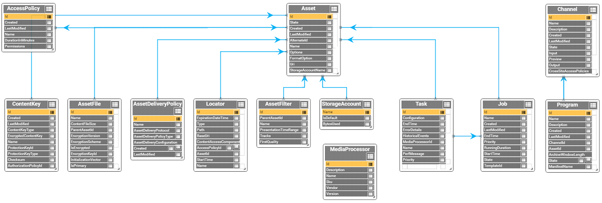

<properties
    pageTitle="Azure 媒体服务概述和常见方案 | Azure"
    description="本部分提供 Azure 媒体服务的概述"
    services="media-services"
    documentationcenter=""
    author="Juliako"
    manager="erikre"
    editor="" />
<tags
    ms.assetid="7a5e9723-c379-446b-b4d6-d0e41bd7d31f"
    ms.service="media-services"
    ms.workload="media"
    ms.tgt_pltfrm="na"
    ms.devlang="na"
    ms.topic="hero-article"
    ms.date="12/14/2016"
    wacn.date="01/13/2017"
    ms.author="juliako;anilmur" />  

# Azure 媒体服务概述和常见应用场景

Azure 媒体服务是一个可扩展的基于云的平台，使开发人员能够生成可缩放的媒体管理和传送应用程序。媒体服务基于 REST API，可以使用这些 API 安全地上传、存储、编码和打包视频或音频内容，以供点播和以实时流形式传送到各种客户端（例如，电视、电脑和移动设备）。

可以完全使用媒体服务构建端到端工作流。也可以选择使用第三方组件来构建工作流的某些组成部分。例如，使用第三方编码器进行编码。然后，使用媒体服务进行上传、保护、打包和传送。

可以选择实时流式播放内容，或者根据点播情况交付内容。本主题演示了[实时](/documentation/articles/media-services-overview/#live_scenarios)交付内容或按[点播](/documentation/articles/media-services-overview/#vod_scenarios)交付内容的常见方案。本主题还提供了其他相关主题的链接。

## SDK 和工具

若要构建媒体服务解决方案，可以使用：

- [媒体服务 REST API](https://docs.microsoft.com/zh-cn/rest/api/media/mediaservice)
- 可用的客户端 SDK 之一：
	- [适用于 .NET 的 Azure 媒体服务 SDK](https://github.com/Azure/azure-sdk-for-media-services)、
	- [Azure SDK for Java](https://github.com/Azure/azure-sdk-for-java)，
	- [Azure PHP SDK](https://github.com/Azure/azure-sdk-for-php)，
	- [适用于 Node.js 的 Azure 媒体服务](https://github.com/michelle-becker/node-ams-sdk/blob/master/lib/request.js)（这是 Node.js SDK 的非 Microsoft 版本。它由社区维护，当前未包括所有的 AMS API）。
- 现有工具：
	- [Azure 经典管理门户](http://manage.windowsazure.cn/) 
	- [Azure-Media-Services-Explorer](https://github.com/Azure/Azure-Media-Services-Explorer)（Azure 媒体服务资源管理器 (AMSE) 是适用于 Windows 的 Winforms/C# 应用程序）

针对媒体服务 OData 模型进行开发时，以下图像将显示某些最常用的对象。

单击图像查看其完整大小。

可在[此处](https://media.windows.net/API/$metadata?api-version=2.14)查看完整模型。

## 先决条件

若要开始使用 Azure 媒体服务，应该具备以下条件：
 
3. 一个 Azure 帐户。如果没有帐户，可以创建一个试用帐户，只需几分钟即可完成。有关详细信息，请参阅 [Azure 试用](/pricing/1rmb-trial/)。
2. Azure 媒体服务帐户。使用 Azure 经典管理门户、.NET 或 REST API 创建 Azure 媒体服务帐户。有关详细信息，请参阅[创建帐户](/documentation/articles/media-services-create-account/)。
3. （可选）设置开发环境。为开发环境选择“.NET”或“REST API”。有关详细信息，请参阅[设置环境](/documentation/articles/media-services-dotnet-how-to-use/)。

	此外，请学习如何以编程方式进行[连接](/documentation/articles/media-services-dotnet-connect-programmatically/)。
4. （推荐）分配一个或多个缩放单位。建议为生产环境中的应用程序分配一个或多个缩放单位。有关详细信息，请参阅[管理流式处理终结点](/documentation/articles/media-services-manage-origins/)。

##概念和概述

有关 Azure 媒体服务的概念，请参阅[概念](/documentation/articles/media-services-concepts/)。

有关介绍 Azure 媒体服务所有主要组件的操作说明系列文章，请参阅 [Azure 媒体服务分步教程](https://docs.com/fukushima-shigeyuki/3439/english-azure-media-services-step-by-step-series)。此系列文章全面概述了各个概念，并使用 AMSE 工具演示了 AMS 任务。请注意 AMSE 工具是一种 Windows 工具。可以使用 [AMS SDK for.NET](https://github.com/Azure/azure-sdk-for-media-services)、[Azure SDK for Java](https://github.com/Azure/azure-sdk-for-java) 或 [Azure PHP SDK](https://github.com/Azure/azure-sdk-for-php) 以编程方式完成的大多数任务也可以使用此工具来完成。

##使用 Azure 媒体服务交付按需媒体：常见方案和任务

本部分描述常见方案并提供相关主题的链接。下图显示了参与点播内容交付的主要媒体服务平台部分。

###保护存储中的内容并以明文（非加密）形式交付流式处理媒体

1. 将优质夹层文件上传到资产中。
	
	建议向资产应用存储加密选项，以便在内容上传期间和内容在存储中处于静态时，为其提供保护。
 
1. 编码为一组自适应比特率 MP4 文件。

	建议向输出资产应用存储加密选项，以便保护静态内容。
	
1. 配置资产传送策略（由动态打包使用）。
	
	如果资产已经过存储加密，则**必须**配置资产传送策略。

1. 通过创建 OnDemand 定位符发布资产。

	确保要从中以流形式传输内容的流式传输终结点上至少有一个串流保留单元。

1. 流式传输已发布的内容。

###在存储中保护内容，并以动态方式传送加密的流媒体  

若要使用动态加密，首先必须获取想要从中流式传输加密内容的流式处理终结点的至少一个串流保留单元。

1. 将优质夹层文件上传到资产中。向资产应用存储加密选项。
1. 编码为一组自适应比特率 MP4 文件。向输出资产应用存储加密选项。
1. 为播放期间想要动态加密的资产创建加密内容密钥。
2. 配置内容密钥授权策略。
1. 配置资产传送策略（由动态打包和动态加密使用）。
1. 通过创建 OnDemand 定位符发布资产。
1. 流式传输已发布的内容。

###使用媒体分析从视频中汲取可操作的见解 

媒体分析是语音和视觉组件的集合，便于组织和企业从视频文件中汲取可操作的见解。有关详细信息，请参阅 [Azure 媒体服务分析概述](/documentation/articles/media-services-analytics-overview/)。

1. 将优质夹层文件上传到资产中。
2. 使用下述媒体分析服务之一来处理视频：
	

	- **Hyperlapse** – [Hyperlapse 媒体文件与 Azure Media Hyperlapse](/documentation/articles/media-services-hyperlapse-content/)
	- **动作检测** – [Azure 媒体分析的动作检测](/documentation/articles/media-services-motion-detection/)。
	- **面部检测和面部情绪** – [Azure 媒体分析的面部和情绪检测](/documentation/articles/media-services-face-and-emotion-detection/)。
	- **视频摘要** – [使用 Azure 媒体视频缩略图创建视频摘要](/documentation/articles/media-services-video-summarization/)
3. 媒体分析媒体处理器会生成 MP4 文件或 JSON 文件。如果媒体处理器生成了 MP4 文件，可采用渐进方式下载该文件。如果媒体处理器生成了 JSON 文件，可从 Azure Blob 存储下载该文件。

### 提供渐进式下载
1. 将优质夹层文件上传到资产中。
1. 编码为单个 MP4 文件。
1. 通过创建 OnDemand 或 SAS 定位符来发布资产。

	如果使用 OnDemand 定位符，请确保要从中以渐进方式下载内容的流式处理终结点上至少有一个串流保留单元。

	如果使用 SAS 定位符，可从 Azure blob 存储中下载内容。在这种情况下，不需要串流保留单元。
  
1. 渐进式下载内容。

##使用 Azure 媒体服务传送实时流式处理事件

使用实时流式处理时，通常涉及以下组件：

- 一个用于广播事件的相机。
- 一个将信号从相机转换为发送至实时流式处理服务的流的实时视频编码器。

（可选）多个实时同步编码器。对于某些需要高可用性与优质体验的重要实时事件，建议使用带时间同步功能的主动-主动冗余编码器，以实现无缝故障转移，且不会丢失数据。
- 实时流式处理服务允许执行以下操作：

- 使用多种实时流式处理协议（例如 RTMP 或平滑流式处理）引入实时内容
- （可选）将流编码为自适应比特率流
- 预览实时流，
- 记录和存储引入的内容，以便稍后进行流式处理（视频点播）
- 直接通过常用流式传输协议（例如 MPEG DASH、平滑流式处理、HLS）将内容传递给客户，或传递至内容交付网络 \(CDN\) 以供进一步分发。

**Azure 媒体服务** (AMS) 提供了引入、编码、预览、存储和传送实时流式处理内容的功能。

将内容传送给客户时，目标是将优质视频传递到处于不同网络条件下的各种设备。为了满足质量和网络条件的要求，使用实时编码器将流编码为多比特率（自适应比特率）视频流。为满足不同设备的流式处理要求，使用媒体服务[动态打包](/documentation/articles/media-services-dynamic-packaging-overview/)将流动态地重新打包为不同的协议。媒体服务支持传送以下自适应比特率流式处理技术：HTTP Live Streaming \(HLS\)、平滑流式处理、MPEG DASH。

在 Azure 媒体服务中，**频道**、**节目**和**流式处理终结点**处理所有实时流式处理功能，包括引入、格式化、DVR、安全性、缩放性和冗余。

**通道**表示用于处理实时流内容的管道。通道可以通过以下方式接收实时输入流：

- 本地实时编码器将多比特率 **RTMP** 或**平滑流式处理**（分片 MP4）发送到经配置可以进行**直通**传递的通道。**直通**传递是指引入的流将会直接通过**通道**，而不会经过任何进一步的处理。可以使用以下输出多比特率平滑流的实时编码器：Elemental、Envivio、Cisco。以下实时编码器输出 RTMP：Adobe Flash Live、Telestream Wirecast 和 Tricaster 转码器。实时编码器也可将单比特率流发送到并未启用实时编码的通道，但不建议这样做。收到请求时，媒体服务会将该流传送给客户。

>[AZURE.NOTE] 需要长时间处理多个事件，并且已经在本地编码器上进行了投入时，可以使用直通这种最经济的方法来实时传送视频流。请参阅[定价](/pricing/details/media-services/)详细信息。

- 本地实时编码器（采用以下格式之一：RTP \(MPEG-TS\)、RTMP 或平滑流式处理 （分片 MP4））将单比特率流发送至能够使用媒体服务执行实时编码的通道。然后，频道将对传入的单比特率流执行实时编码，使之转换为多比特率（自适应）视频流。收到请求时，媒体服务会将该流传送给客户。

###使用从本地编码器（直通）接收多比特率实时流的通道

下图显示的是“直通”工作流中涉及的 AMS 平台的主要组成部分。

![实时工作流][live-overview2]  

有关详细信息，请参阅[使用从本地编码器接收多比特率实时流的频道](/documentation/articles/media-services-live-streaming-with-onprem-encoders/)。

###使用能够通过 Azure 媒体服务执行实时编码的通道

下图显示的是实时流式处理工作流中涉及的 AMS 平台的主要组成部分，该工作流中的频道能够通过媒体服务执行实时编码。

![实时工作流][live-overview1]  

有关详细信息，请参阅[使用能够通过 Azure 媒体服务执行实时编码的频道](/documentation/articles/media-services-manage-live-encoder-enabled-channels/)。

##使用内容

Azure 媒体服务提供所需的工具，以便创建适用于大多数平台的丰富、动态的客户端播放器应用程序，这些平台包括：iOS 设备、Android 设备、Windows、Windows Phone、Xbox 和机顶盒。以下主题提供了可用于开发客户端应用程序（这些应用程序使用媒体服务中的流媒体）的 SDK 和播放器框架的链接。

[开发视频播放器应用程序](/documentation/articles/media-services-develop-video-players/)

##启用 Azure CDN

媒体服务支持与 Azure CDN 集成。有关如何启用 Azure CDN 的信息，请参阅[如何在媒体服务帐户中管理流式处理终结点](/documentation/articles/media-services-manage-origins/#enable_cdn)。

##缩放媒体服务帐户

通过指定要为帐户预配的**串流保留单元**和**编码保留单元**的数量，可以缩放**媒体服务**。

也可以通过向媒体服务帐户添加存储帐户来缩放该帐户。每个存储帐户大小限制为 500 TB。若要在默认限制之外扩展存储，可选择将多个存储帐户附加到单个媒体服务帐户。

[本](/documentation/articles/media-services-how-to-scale/)主题链接到相关的主题。

##支持

[Azure 支持](/support/contact/)为 Azure（包括媒体服务）提供支持选项。

##服务级别协议 (SLA)

- 对于媒体服务编码，我们保证 REST API 事务可实现 99.9% 的可用性。
- 对于流式处理，我们将以 99.9% 的可用性保证成功处理现有媒体内容的请求。
- 对于实时通道，我们保证运行中的通道在至少 99.9% 的时间都能建立外部连接。
- 对于内容保护，我们保证将在至少 99.9% 的时间成功满足密钥请求。
- 对于索引器，我们将使用编码保留单元在 99.9% 的时间成功处理索引器任务请求。

	有关详细信息，请参阅 [Azure SLA](/support/legal/sla/)。

<!-- Images -->

[overview]: ./media/media-services-overview/media-services-overview.png
[vod-overview]: ./media/media-services-video-on-demand-workflow/media-services-video-on-demand.png
[live-overview1]: ./media/media-services-live-streaming-workflow/media-services-live-streaming-new.png
[live-overview2]: ./media/media-services-live-streaming-workflow/media-services-live-streaming-current.png
 

<!---HONumber=Mooncake_0109_2017-->
<!--Update_Description: remove HDS ralated content; add references links of Media Service analytics features; add introduction of Media Service Odata model-->