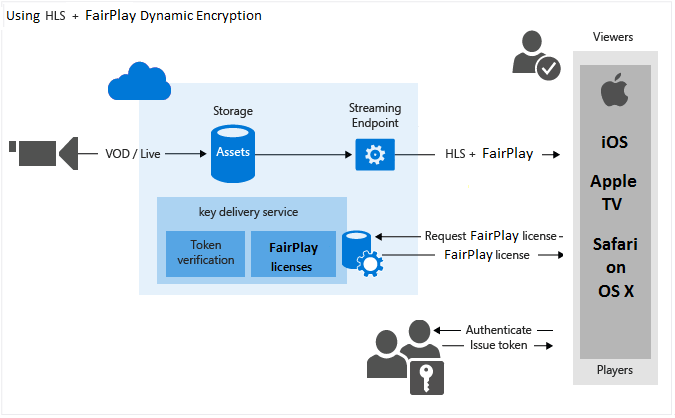

<properties
    pageTitle="使用 Apple FairPlay 和/或 Microsoft PlayReady 保护 HLS 内容 | Azure"
    description="本主题概括介绍并演示了如何使用 Azure 媒体服务通过 Apple FairPlay 动态加密 HTTP 实时传送视频流 (HLS) 内容。它还演示了如何使用媒体服务许可证传送服务将 FairPlay 许可证传送到客户端。"
    services="media-services"
    documentationcenter=""
    author="Juliako"
    manager="erikre"
    editor="" />
<tags
    ms.assetid="7c3b35d9-1269-4c83-8c91-490ae65b0817"
    ms.service="media-services"
    ms.workload="media"
    ms.tgt_pltfrm="na"
    ms.devlang="na"
    ms.topic="article"
    ms.date="01/05/2017"
    wacn.date="02/24/2017"
    ms.author="juliako" />  

# 使用 Apple FairPlay 和/或 Microsoft PlayReady 保护 HLS 内容

使用 Azure 媒体服务，可动态加密使用以下格式的 HTTP Live Streaming (HLS) 内容：

- **AES-128 信封明文密钥**

	整个区块使用 **AES-128 CBC** 模式进行加密。iOS 和 OSX 播放器本身支持解密流。有关详细信息，请参阅[此文章](/documentation/articles/media-services-protect-with-aes128/)。

- **Apple FairPlay**

	各视频和音频示例都使用 **AES-128 CBC** 模式进行加密。**FairPlay 流式处理** (FPS) 集成到设备操作系统，iOS 和 Apple TV 本身支持这项功能。OS X 上的 Safari 使用加密媒体扩展 (EME) 接口支持启用 FPS。
- **Microsoft PlayReady**

下图显示了 **HLS + FairPlay 和/或 PlayReady 动态加密**工作流。

  

本主题演示如何使用 Azure 媒体服务通过 Apple FairPlay 动态加密 HLS 内容。它还演示了如何使用媒体服务许可证传送服务将 FairPlay 许可证传送到客户端。

>[AZURE.NOTE] 如果还想要使用 PlayReady 加密 HLS 内容，则需要创建一个通用的内容密钥并将其与你的资产相关联。你还需要配置此内容密钥的授权策略，如[使用 PlayReady 动态通用加密](/documentation/articles/media-services-protect-with-drm/)主题中所述。

	
## 要求和注意事项

- 在使用 AMS 传送通过 FairPlay 加密的 HLS 和传送 FairPlay 许可证时需要以下各项。

	- 一个 Azure 帐户。有关详细信息，请参阅 [Azure 试用](/pricing/1rmb-trial/?WT.mc_id=A261C142F)。
	- 一个媒体服务帐户。若要创建媒体服务帐户，请参阅[创建帐户](/documentation/articles/media-services-create-account/)。
	- 注册 [Apple 开发计划](https://developer.apple.com/)。
	- Apple 要求内容所有者获取[部署包](https://developer.apple.com/contact/fps/)。说明已使用 Azure 媒体服务实现 KSM（密钥安全模块）的请求以及正在请求最终 FPS 包。在最终 FPS 包中将有生成证书并获取 ASK 的说明，你可以用来配置 FairPlay。

	- Azure 媒体服务 .NET SDK **3.6.0** 版本或更高版本。

- 以下各项必须在 AMS 密钥传送端上设置：
	- **应用证书 (AC)** - 包含私钥的 .pfx 文件。此文件是由客户创建，并通过同一个客户使用密码进行加密。
		
	 	当客户配置密钥传送策略时，必须提供该密码和 base64 格式的 .pfx。

		以下步骤介绍如何为 FairPlay 生成 pfx 证书。
		
		1. 从 https://slproweb.com/products/Win32OpenSSL.html 安装 OpenSSL
		
			转到 Apple 提供的 FairPlay 证书和其他文件所在的文件夹。
		
		2. 将 cer 转换为 pem 的命令行：
		
			"C:\\OpenSSL-Win32\\bin\\openssl.exe" x509 -inform der -in fairplay.cer -out fairplay-out.pem
		
		3. 使用私钥将 pem 转换为 pfx 的命令行（随后 OpenSSL 会要求提供 pfx 文件的密码）。
		
			"C:\\OpenSSL-Win32\\bin\\openssl.exe" pkcs12 -export -out fairplay-out.pfx -inkey privatekey.pem -in fairplay-out.pem -passin file:privatekey-pem-pass.txt
		
	- **应用证书密码** - 客户创建 .pfx 文件的密码。
	- **应用证书密码 ID** - 客户上载密码的方式必须与上载其他 AMS 密钥类似，并且必须使用 **ContentKeyType.FairPlayPfxPassword** 枚举值。最后，他们将得到 AMS ID，在密钥传送策略选项中，他们需要使用此 ID。
	- **iv** - 16 字节随机值，该值必须与资产传送策略中的 iv 相匹配。客户生成 IV 并将其放入两个位置：资产传递策略和密钥传递策略选项。
	- **ASK** - 当你使用 Apple 开发人员门户生成证书时会收到 ASK（应用程序机密密钥）。每个开发团队将会收到唯一的 ASK。请保存一份 ASK 副本，并将其存储在安全位置。你稍后需要将 ASK 作为 FairPlayAsk 配置到 Azure 媒体服务。
	-  **ASK ID** - 在客户将 ASK 上载到 AMS 时获得。客户必须使用 **ContentKeyType.FairPlayASk** 枚举值上载 ASK。因此，将返回 AMS ID，在设置密钥传送策略选项时应使用此 ID。

- 以下事项必须通过 FPS 客户端来设置：
 	- **应用证书 (AC)** - 包含操作系统用于加密某些有效负载的公钥的 .cer/.der 文件。AMS 需要了解它，因为播放器需要它。密钥传送服务使用相应的私钥对其进行解密。

- 要播放 FairPlay 加密的流，你需要先获取实际的 ASK，然后生成实际的证书。该过程将创建 3 个部分：

	-  .der、
	-  .pfx 和
	-  .pfx 的密码。
 
- 支持采用 **AES-128 CBC** 加密的 HLS 的客户端：OS X、Apple TV 和 iOS 上的 Safari。

##配置 FairPlay 动态加密和许可证交付服务的步骤

下面是使用 FairPlay 保护资产时需要执行的常规步骤，这些步骤使用媒体服务许可证传送服务，也使用动态加密。

1. 创建资产并将文件上载到资产。
1. 将包含文件的资产编码为自适应比特率 MP4 集。
1. 创建内容密钥并将其与编码资产相关联。
1. 配置内容密钥授权策略。在创建内容密钥授权策略时，你需要指定下列各项：
	
	- 传送方法（在本例中为 FairPlay）、
	- FairPlay 策略选项配置。有关如何配置 FairPlay 的详细信息，请参阅以下示例中的 ConfigureFairPlayPolicyOptions() 方法。
	
		>[AZURE.NOTE] 通常，可能只需配置一次 FairPlay 策略选项，因为仅有一套证书和 ASK。
	- 限制（打开或令牌）
	- 以及特定于密钥传送类型的信息，其定义了将密钥传送到客户端的方式。
	
2. 配置资产传送策略。传送策略配置包括：

	- 传送协议 (HLS)、
	- 动态加密类型（常用的 CBC 加密）、
	- 许可证获取 URL。
	
	>[AZURE.NOTE]如果要传送使用 FairPlay + 另一个 DRM 加密的流，则必须配置单独的传送策略
	>
	>- 一个 IAssetDeliveryPolicy 用来将 DASH 配置为 CENC（PlayReady 和 WideVine）并将平滑配置为 PlayReady。
	>- 另一个 IAssetDeliveryPolicy 用来配置 HLS 的 FairPlay

1. 创建 OnDemand 定位符以获取流式处理 URL。

##使用播放器/客户端应用执行的 FairPlay 密钥传送

客户可以通过使用 iOS SDK 开发播放器应用。为了能够播放 FairPlay 内容，客户必须实现许可证交换协议。许可证交换协议不由 Apple 指定。而是取决于每个应用发送密钥传送请求的方式。AMS FairPlay 密钥传送服务期望 SPC 为采用以下形式的 www-form-url 编码后消息：

	spc=<Base64 encoded SPC>

>[AZURE.NOTE] Azure Media Player 不支持现成的 FairPlay 播放。客户需要通过 Apple 开发人员帐户获得示例播放器，以便在 MAC OSX 上播放 FairPlay。
 
##流 URL

如果资产使用多个 DRM 加密，则应在流式处理 URL 中使用加密标记：(format='m3u8-aapl', encryption='xxx')。

请注意以下事项：

- 仅可指定零个或一个加密类型。
- 如果只将一个加密应用到资产，则无需在 URL 中指定加密类型。
- 加密类型区分大小写。
- 可以指定以下加密类型：
	- **cenc**：通用加密（Playready 或 Widevine）
	- **cbc aapl**：Fairplay
	- **cbc**：AES 信封加密。

##.NET 示例

下面的示例演示了在适用于 .Net 的 Azure 媒体服务 SDK - 版本 3.6.0 中引入的功能（使用 Azure 媒体服务传送通过 FairPlay 加密的内容的功能）。以下 Nuget 包命令用于安装该包：

	PM> Install-Package windowsazure.mediaservices -Version 3.6.0

1. 创建控制台项目。
1. 使用 NuGet 安装和添加 Azure 媒体服务 .NET SDK。
2. 添加附加引用：System.Configuration。
2. 添加包含帐户名称和密钥信息的配置文件：
	
		<?xml version="1.0" encoding="utf-8"?>
		<configuration>
		    <startup> 
		        <supportedRuntime version="v4.0" sku=".NETFramework,Version=v4.5" />
		    </startup>
			  <appSettings>
			
			    <add key="MediaServicesAccountName" value="AccountName"/>
			    <add key="MediaServicesAccountKey" value="AccountKey"/>
			
			    <add key="Issuer" value="http://testacs.com"/>
			    <add key="Audience" value="urn:test"/>
			  </appSettings>
		</configuration>

1. 使用本部分中所示的代码覆盖 Program.cs 文件中的代码。
			
		
		using System;
		using System.Collections.Generic;
		using System.Configuration;
		using System.IO;
		using System.Linq;
		using System.Threading;
		using Microsoft.WindowsAzure.MediaServices.Client;
		using Microsoft.WindowsAzure.MediaServices.Client.ContentKeyAuthorization;
		using Microsoft.WindowsAzure.MediaServices.Client.DynamicEncryption;
		using Microsoft.WindowsAzure.MediaServices.Client.FairPlay;
		using Newtonsoft.Json;
		using System.Security.Cryptography.X509Certificates;
		
		namespace DynamicEncryptionWithFairPlay
		{
		    class Program
		    {
		        // Read values from the App.config file.
		        private static readonly string _mediaServicesAccountName =
		            ConfigurationManager.AppSettings["MediaServicesAccountName"];
		        private static readonly string _mediaServicesAccountKey =
		            ConfigurationManager.AppSettings["MediaServicesAccountKey"];

				private static readonly String _defaultScope = "urn:WindowsAzureMediaServices";

				// Azure China uses a different API server and a different ACS Base Address from the Global.
				private static readonly String _chinaApiServerUrl = "https://wamsshaclus001rest-hs.chinacloudapp.cn/API/";
				private static readonly String _chinaAcsBaseAddressUrl = "https://wamsprodglobal001acs.accesscontrol.chinacloudapi.cn";
		
		        private static readonly Uri _sampleIssuer =
		            new Uri(ConfigurationManager.AppSettings["Issuer"]);
		        private static readonly Uri _sampleAudience =
		            new Uri(ConfigurationManager.AppSettings["Audience"]);
		
		        // Field for service context.
		        private static CloudMediaContext _context = null;
		        private static MediaServicesCredentials _cachedCredentials = null;

				private static Uri _apiServer = null;
		
		        private static readonly string _mediaFiles =
		            Path.GetFullPath(@"../..\Media");
		
		        private static readonly string _singleMP4File =
		            Path.Combine(_mediaFiles, @"BigBuckBunny.mp4");
		
		        static void Main(string[] args)
		        {
		           	// Create and cache the Media Services credentials in a static class variable.
                	_cachedCredentials = new MediaServicesCredentials(
                                _mediaServicesAccountName,
                                _mediaServicesAccountKey,
								_defaultScope,
								_chinaAcsBaseAddressUrl);

					// Create the API server Uri
					_apiServer = new Uri(_chinaApiServerUrl);

                	// Used the chached credentials to create CloudMediaContext.
                	_context = new CloudMediaContext(_apiServer, _cachedCredentials);
		
		            bool tokenRestriction = false;
		            string tokenTemplateString = null;
		
		            IAsset asset = UploadFileAndCreateAsset(_singleMP4File);
		            Console.WriteLine("Uploaded asset: {0}", asset.Id);
		
		            IAsset encodedAsset = EncodeToAdaptiveBitrateMP4Set(asset);
		            Console.WriteLine("Encoded asset: {0}", encodedAsset.Id);
		
		            IContentKey key = CreateCommonCBCTypeContentKey(encodedAsset);
		            Console.WriteLine("Created key {0} for the asset {1} ", key.Id, encodedAsset.Id);
		            Console.WriteLine("FairPlay License Key delivery URL: {0}", key.GetKeyDeliveryUrl(ContentKeyDeliveryType.FairPlay));
		            Console.WriteLine();
		
		            if (tokenRestriction)
		                tokenTemplateString = AddTokenRestrictedAuthorizationPolicy(key);
		            else
		                AddOpenAuthorizationPolicy(key);
		
		            Console.WriteLine("Added authorization policy: {0}", key.AuthorizationPolicyId);
		            Console.WriteLine();
		
		            CreateAssetDeliveryPolicy(encodedAsset, key);
		            Console.WriteLine("Created asset delivery policy. \n");
		            Console.WriteLine();
		
		            if (tokenRestriction && !String.IsNullOrEmpty(tokenTemplateString))
		            {
		                // Deserializes a string containing an Xml representation of a TokenRestrictionTemplate
		                // back into a TokenRestrictionTemplate class instance.
		                TokenRestrictionTemplate tokenTemplate =
		                    TokenRestrictionTemplateSerializer.Deserialize(tokenTemplateString);
		
		                // Generate a test token based on the the data in the given TokenRestrictionTemplate.
		                // Note, you need to pass the key id Guid because we specified 
		                // TokenClaim.ContentKeyIdentifierClaim in during the creation of TokenRestrictionTemplate.
		                Guid rawkey = EncryptionUtils.GetKeyIdAsGuid(key.Id);
		                string testToken = TokenRestrictionTemplateSerializer.GenerateTestToken(tokenTemplate, null, rawkey,
		                                                                        DateTime.UtcNow.AddDays(365));
		                Console.WriteLine("The authorization token is:\nBearer {0}", testToken);
		                Console.WriteLine();
		            }
		
		            string url = GetStreamingOriginLocator(encodedAsset);
		            Console.WriteLine("Encrypted HLS URL: {0}/manifest(format=m3u8-aapl)", url);
		
		            Console.ReadLine();
		        }
		
		        static public IAsset UploadFileAndCreateAsset(string singleFilePath)
		        {
		            if (!File.Exists(singleFilePath))
		            {
		                Console.WriteLine("File does not exist.");
		                return null;
		            }
		
		            var assetName = Path.GetFileNameWithoutExtension(singleFilePath);
		            IAsset inputAsset = _context.Assets.Create(assetName, AssetCreationOptions.None);
		
		            var assetFile = inputAsset.AssetFiles.Create(Path.GetFileName(singleFilePath));
		
		            Console.WriteLine("Created assetFile {0}", assetFile.Name);
		
		            var policy = _context.AccessPolicies.Create(
		                                    assetName,
		                                    TimeSpan.FromDays(30),
		                                    AccessPermissions.Write | AccessPermissions.List);
		
		            var locator = _context.Locators.CreateLocator(LocatorType.Sas, inputAsset, policy);
		
		            Console.WriteLine("Upload {0}", assetFile.Name);
		
		            assetFile.Upload(singleFilePath);
		            Console.WriteLine("Done uploading {0}", assetFile.Name);
		
		            locator.Delete();
		            policy.Delete();
		
		            return inputAsset;
		        }
		
		        static public IAsset EncodeToAdaptiveBitrateMP4Set(IAsset inputAsset)
		        {
		            var encodingPreset = "H264 Multiple Bitrate 720p";
		
		            IJob job = _context.Jobs.Create(String.Format("Encoding into Mp4 {0} to {1}",
		                                    inputAsset.Name,
		                                    encodingPreset));
		
		            var mediaProcessors =
		                _context.MediaProcessors.Where(p => p.Name.Contains("Media Encoder Standard")).ToList();
		
		            var latestMediaProcessor =
		                mediaProcessors.OrderBy(mp => new Version(mp.Version)).LastOrDefault();
		
		            ITask encodeTask = job.Tasks.AddNew("Encoding", latestMediaProcessor, encodingPreset, TaskOptions.None);
		            encodeTask.InputAssets.Add(inputAsset);
		            encodeTask.OutputAssets.AddNew(String.Format("{0} as {1}", inputAsset.Name, encodingPreset), 	AssetCreationOptions.StorageEncrypted);
		
		            job.StateChanged += new EventHandler<JobStateChangedEventArgs>(JobStateChanged);
		            job.Submit();
		            job.GetExecutionProgressTask(CancellationToken.None).Wait();
		
		            return job.OutputMediaAssets[0];
		        }
		
		        static public IContentKey CreateCommonCBCTypeContentKey(IAsset asset)
		        {
		            // Create HLS SAMPLE AES encryption content key
		            Guid keyId = Guid.NewGuid();
		            byte[] contentKey = GetRandomBuffer(16);
		
		            IContentKey key = _context.ContentKeys.Create(
		                                    keyId,
		                                    contentKey,
		                                    "ContentKey",
		                                    ContentKeyType.CommonEncryptionCbcs);
		
		            // Associate the key with the asset.
		            asset.ContentKeys.Add(key);
		
		            return key;
		        }
		
		
		        static public void AddOpenAuthorizationPolicy(IContentKey contentKey)
		        {
		            // Create ContentKeyAuthorizationPolicy with Open restrictions 
		            // and create authorization policy          
		
		            List<ContentKeyAuthorizationPolicyRestriction> restrictions = new List<ContentKeyAuthorizationPolicyRestriction>
		                    {
		                        new ContentKeyAuthorizationPolicyRestriction
		                        {
		                            Name = "Open",
		                            KeyRestrictionType = (int)ContentKeyRestrictionType.Open,
		                            Requirements = null
		                        }
		                    };
		
		
		            // Configure FairPlay policy option.
		            string FairPlayConfiguration = ConfigureFairPlayPolicyOptions();
		
		            IContentKeyAuthorizationPolicyOption FairPlayPolicy =
		                _context.ContentKeyAuthorizationPolicyOptions.Create("",
		                ContentKeyDeliveryType.FairPlay,
		                restrictions,
		                FairPlayConfiguration);
		
		
		            IContentKeyAuthorizationPolicy contentKeyAuthorizationPolicy = _context.
		                        ContentKeyAuthorizationPolicies.
		                        CreateAsync("Deliver Common CBC Content Key with no restrictions").
		                        Result;
		
		            contentKeyAuthorizationPolicy.Options.Add(FairPlayPolicy);
		
		            // Associate the content key authorization policy with the content key.
		            contentKey.AuthorizationPolicyId = contentKeyAuthorizationPolicy.Id;
		            contentKey = contentKey.UpdateAsync().Result;
		        }
		
		        public static string AddTokenRestrictedAuthorizationPolicy(IContentKey contentKey)
		        {
		            string tokenTemplateString = GenerateTokenRequirements();
		
		            List<ContentKeyAuthorizationPolicyRestriction> restrictions = new List<ContentKeyAuthorizationPolicyRestriction>
		                    {
		                        new ContentKeyAuthorizationPolicyRestriction
		                        {
		                            Name = "Token Authorization Policy",
		                            KeyRestrictionType = (int)ContentKeyRestrictionType.TokenRestricted,
		                            Requirements = tokenTemplateString,
		                        }
		                    };
		
		            // Configure FairPlay policy option.
		            string FairPlayConfiguration = ConfigureFairPlayPolicyOptions();
		
		
		            IContentKeyAuthorizationPolicyOption FairPlayPolicy =
		                _context.ContentKeyAuthorizationPolicyOptions.Create("Token option",
		                       ContentKeyDeliveryType.FairPlay,
		                       restrictions,
		                       FairPlayConfiguration);
		
		            IContentKeyAuthorizationPolicy contentKeyAuthorizationPolicy = _context.
		                        ContentKeyAuthorizationPolicies.
		                        CreateAsync("Deliver Common CBC Content Key with token restrictions").
		                        Result;
		
		            contentKeyAuthorizationPolicy.Options.Add(FairPlayPolicy);
		
		            // Associate the content key authorization policy with the content key
		            contentKey.AuthorizationPolicyId = contentKeyAuthorizationPolicy.Id;
		            contentKey = contentKey.UpdateAsync().Result;
		
		            return tokenTemplateString;
		        }
		
		        private static string ConfigureFairPlayPolicyOptions()
		        {
		            // For testing you can provide all zeroes for ASK bytes together with the cert from Apple FPS SDK. 
		            // However, for production you must use a real ASK from Apple bound to a real prod certificate.
		            byte[] askBytes = Guid.NewGuid().ToByteArray();
		            var askId = Guid.NewGuid();
		            // Key delivery retrieves askKey by askId and uses this key to generate the response.
		            IContentKey askKey = _context.ContentKeys.Create(
		                                    askId,
		                                    askBytes,
		                                    "askKey",
		                                    ContentKeyType.FairPlayASk);
		
		            //Customer password for creating the .pfx file.
		            string pfxPassword = "<customer password for creating the .pfx file>";
		            // Key delivery retrieves pfxPasswordKey by pfxPasswordId and uses this key to generate the response.
		            var pfxPasswordId = Guid.NewGuid();
		            byte[] pfxPasswordBytes = System.Text.Encoding.UTF8.GetBytes(pfxPassword);
		            IContentKey pfxPasswordKey = _context.ContentKeys.Create(
		                                    pfxPasswordId,
		                                    pfxPasswordBytes,
		                                    "pfxPasswordKey",
		                                    ContentKeyType.FairPlayPfxPassword);
		
		            // iv - 16 bytes random value, must match the iv in the asset delivery policy.
		            byte[] iv = Guid.NewGuid().ToByteArray();
		
		            //Specify the .pfx file created by the customer.
		            var appCert = new X509Certificate2("path to the .pfx file created by the customer", pfxPassword, X509KeyStorageFlags.Exportable);
		
		            string FairPlayConfiguration =
		                Microsoft.WindowsAzure.MediaServices.Client.FairPlay.FairPlayConfiguration.CreateSerializedFairPlayOptionConfiguration(
		                    appCert,
		                    pfxPassword,
		                    pfxPasswordId,
		                    askId,
		                    iv);
		
		            return FairPlayConfiguration;
		        }
		
		        static private string GenerateTokenRequirements()
		        {
		            TokenRestrictionTemplate template = new TokenRestrictionTemplate(TokenType.SWT);
		
		            template.PrimaryVerificationKey = new SymmetricVerificationKey();
		            template.AlternateVerificationKeys.Add(new SymmetricVerificationKey());
		            template.Audience = _sampleAudience.ToString();
		            template.Issuer = _sampleIssuer.ToString();
		            template.RequiredClaims.Add(TokenClaim.ContentKeyIdentifierClaim);
		
		            return TokenRestrictionTemplateSerializer.Serialize(template);
		        }
		
		        static public void CreateAssetDeliveryPolicy(IAsset asset, IContentKey key)
		        {
		            var kdPolicy = _context.ContentKeyAuthorizationPolicies.Where(p => p.Id == key.AuthorizationPolicyId).Single();
		
		            var kdOption = kdPolicy.Options.Single(o => o.KeyDeliveryType == ContentKeyDeliveryType.FairPlay);
		
		            FairPlayConfiguration configFP = JsonConvert.DeserializeObject<FairPlayConfiguration>(kdOption.KeyDeliveryConfiguration);
		
		            // Get the FairPlay license service URL.
		            Uri acquisitionUrl = key.GetKeyDeliveryUrl(ContentKeyDeliveryType.FairPlay);
		
					// The reason the below code replaces "https://" with "skd://" is because
					// in the IOS player sample code which you obtained in Apple developer account, 
					// the player only recognizes a Key URL that starts with skd://. 
					// However, if you are using a customized player, 
					// you can choose whatever protocol you want. 
					// For example, "https". 

		            Dictionary<AssetDeliveryPolicyConfigurationKey, string> assetDeliveryPolicyConfiguration =
		                new Dictionary<AssetDeliveryPolicyConfigurationKey, string>
		                {
		                    {AssetDeliveryPolicyConfigurationKey.FairPlayLicenseAcquisitionUrl, acquisitionUrl.ToString().Replace("https://", "skd://")},
		                    {AssetDeliveryPolicyConfigurationKey.CommonEncryptionIVForCbcs, configFP.ContentEncryptionIV}
		                };
		
		            var assetDeliveryPolicy = _context.AssetDeliveryPolicies.Create(
		                    "AssetDeliveryPolicy",
		                AssetDeliveryPolicyType.DynamicCommonEncryptionCbcs,
		                AssetDeliveryProtocol.HLS,
		                assetDeliveryPolicyConfiguration);
		
		            // Add AssetDelivery Policy to the asset
		            asset.DeliveryPolicies.Add(assetDeliveryPolicy);
		
		        }
		
		
		        /// 

		        /// Gets the streaming origin locator.
		        /// 

		        /// <param name="assets"></param>
		        /// <returns></returns>
		        static public string GetStreamingOriginLocator(IAsset asset)
		        {
		
		            // Get a reference to the streaming manifest file from the  
		            // collection of files in the asset. 
		
		            var assetFile = asset.AssetFiles.Where(f => f.Name.ToLower().
		                                         EndsWith(".ism")).
		                                         FirstOrDefault();
		
		            // Create a 30-day readonly access policy. 
		            IAccessPolicy policy = _context.AccessPolicies.Create("Streaming policy",
		                TimeSpan.FromDays(30),
		                AccessPermissions.Read);
		
		            // Create a locator to the streaming content on an origin. 
		            ILocator originLocator = _context.Locators.CreateLocator(LocatorType.OnDemandOrigin, asset,
		                policy,
		                DateTime.UtcNow.AddMinutes(-5));
		
		            // Create a URL to the manifest file. 
		            return originLocator.Path + assetFile.Name;
		        }
		
		        static private void JobStateChanged(object sender, JobStateChangedEventArgs e)
		        {
		            Console.WriteLine(string.Format("{0}\n  State: {1}\n  Time: {2}\n\n",
		                ((IJob)sender).Name,
		                e.CurrentState,
		                DateTime.UtcNow.ToString(@"yyyy_M_d__hh_mm_ss")));
		        }
		
		        static private byte[] GetRandomBuffer(int length)
		        {
		            var returnValue = new byte[length];
		
		            using (var rng =
		                new System.Security.Cryptography.RNGCryptoServiceProvider())
		            {
		                rng.GetBytes(returnValue);
		            }
		
		            return returnValue;
		        }
		    }
		}

<!---HONumber=Mooncake_0220_2017-->
<!--Update_Description: wording update-->