<properties
    pageTitle="使用 Azure 媒体分析进行面部修订演练 | Azure"
    description="本主题提供分步指导，引导用户使用 Azure 媒体服务资源管理器 (AMSE) 和 Azure Media Redactor Visualizer（开源工具）运行完整修正工作流。"
    services="media-services"
    documentationcenter=""
    author="Lichard"
    manager="erikre"
    editor="" />
<tags
    ms.assetid="d6fa21b8-d80a-41b7-80c1-ff1761bc68f2"
    ms.service="media-services"
    ms.workload="media"
    ms.tgt_pltfrm="na"
    ms.devlang="dotnet"
    ms.topic="article"
    ms.date="11/30/2016"
    wacn.date="01/13/2017"
    ms.author="rli; juliako;" />  

# 使用 Azure 媒体分析进行面部修订演练

## 概述

**Azure 媒体修订器**是一种 [Azure 媒体分析](/documentation/articles/media-services-analytics-overview/)媒体处理器 (MP)，可用于在云中进行可缩放的面部修订。使用面部修订，可对视频进行修改，使所选个人的面部模糊显示。用户可能想要在公共安全和新闻媒体场景中使用面部修订服务。对于时长仅几分钟但包含多张面孔的镜头，进行手动面部修订可能需要几个小时，但使用此服务仅需几个简单步骤即可完成该过程。有关详细信息，请参阅[此](https://azure.microsoft.com/blog/azure-media-redactor/)博客。

有关 **Azure Media Redactor** 的详细信息，请参阅[面部修正概述](/documentation/articles/media-services-face-redaction/)主题。

本主题提供分步指导，引导用户使用 Azure 媒体服务资源管理器 (AMSE) 和 Azure Media Redactor Visualizer（开源工具）运行完整修正工作流。

**Azure 媒体修订器** MP 目前以预览版提供。它在所有公共 Azure 区域以及美国政府和中国数据中心中可用。当前，此预览版免费。在当前版本中，已处理视频长度的限制为 10 分钟。

有关详细信息，请参阅[这一](https://azure.microsoft.com/zh-CN/blog/redaction-preview-available-globally)博客。

## Azure 媒体服务资源管理器工作流

开始使用 Redactor 的最简单方法是使用 github 上的开源 AMSE 工具。如果不需要访问批注 json 或 jpg 面部图像，可通过**合并**模式运行简化的工作流。

### 下载和安装

1. 从 [此处下载 AMSE 工具](https://github.com/Azure/Azure-Media-Services-Explorer)。
1. 使用服务密钥登录媒体服务帐户。

	若要获取帐户名和密钥信息，请转到 [Azure 经典管理门户](https://manage.windowsazure.cn/)获取。

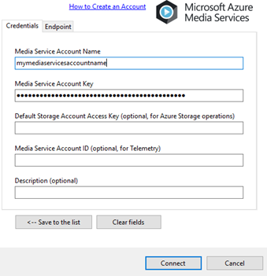  

### 第一步 – 分析模式

1. 通过“资产”–>“上传”或拖放上传媒体文件。
1. 右键单击，然后使用“媒体分析”–>“Azure Media Redactor”–>“分析模式”处理媒体文件。

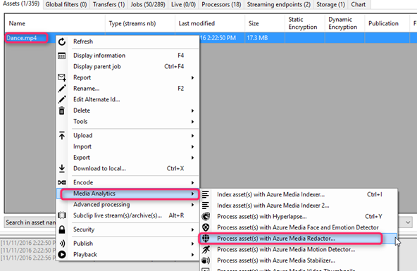  

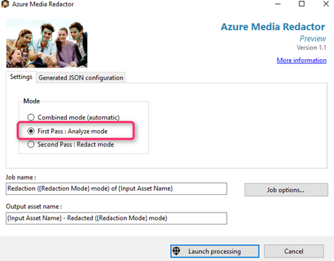  

输出包括带有面部位置数据的批注 json 文件以及检测到的每张脸的 jpg。

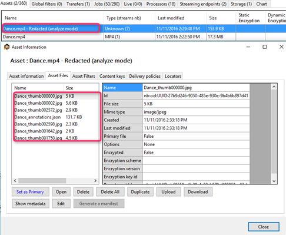  

###第二步 – 修正模式

1. 将原始视频资产上传到第一步中的输出，并设置为主要资产。

	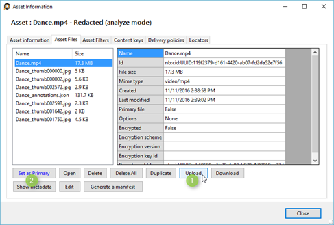  

2. （可选）上传“Dance\_idlist.txt”文件，它包含要修订的 ID 的换行符分隔列表。

	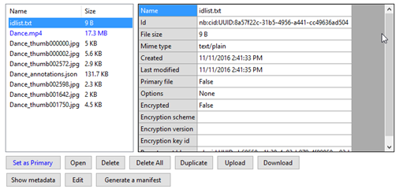  

3. （可选）编辑 annotations.json 文件，例如增加边界框边界。
4. 右键单击第一步中的输出资产，选择 Redactor，在“修正”模式下运行。

	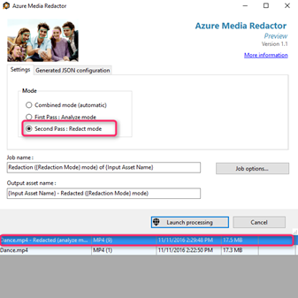  

5. 下载或共享最终修正的输出资产。

	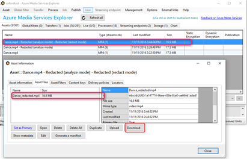  

##Azure Media Redactor Visualizer 开源工具

有一开源[可视化工具](https://github.com/Microsoft/azure-media-redactor-visualizer)，可帮助开发人员通过批注格式分析和使用输出。

克隆存储库后，若要运行项目，需要从其[官方网站](https://ffmpeg.org/download.html)下载 FFMPEG。

如果开发人员要分析 JSON 批注数据，可在 Models.MetaData 内查看样本代码示例。

### 设置工具

1.	下载并生成整个解决方案。

	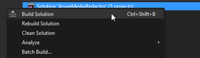  

2.	从[此处](https://ffmpeg.org/download.html)下载 FFMPEG。此项目最初使用具有静态链接的版本 be1d324 (2016-10-04) 开发。
3.	将 ffmpeg.exe 和 ffprobe.exe 复制到与 AzureMediaRedactor.exe 相同的输出文件夹。

	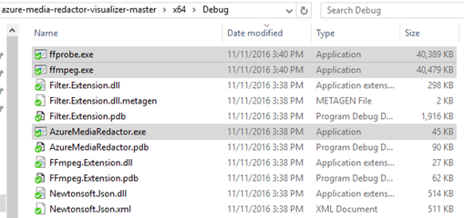  

4. 运行 AzureMediaRedactor.exe。

### 使用工具

1. 在分析模式下使用 Redactor MP 在 Azure 媒体服务帐户中处理视频。
2. 下载原始视频文件和修正 - 分析作业的输出。
3. 运行可视化工具应用程序并选择上述文件。

	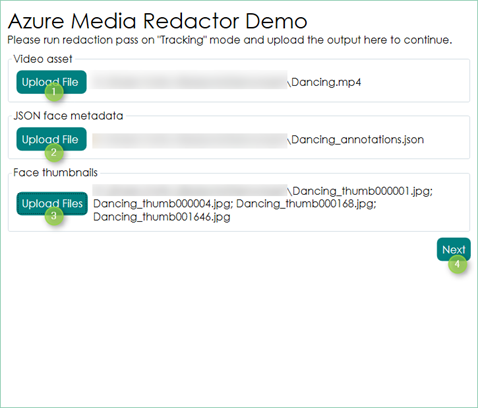  

4. 预览文件。通过右侧边栏选择要进行模糊处理的人脸。
	
	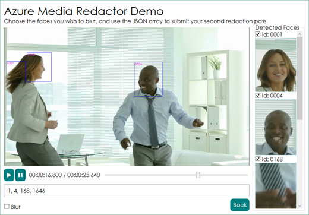  

5.	将更新底部文本字段，使其带有面部 ID。创建名为“idlist.txt”的文件，将这些 ID 作为换行符分隔列表。
6.	将此文件上传到步骤 1 中的输出资产。也将原始视频上传到此资产并设置为主要资产。
7.	在“修正”模式下对此资产运行修正作业，以获取最终修正的视频。

## 相关链接
[Azure Media Services Analytics Overview（Azure 媒体服务分析概述）](/documentation/articles/media-services-analytics-overview/)

[Azure 媒体分析演示](http://azuremedialabs.azurewebsites.net/demos/Analytics.html)

<!---HONumber=Mooncake_0109_2017-->
<!--Update_Description: wording update-->