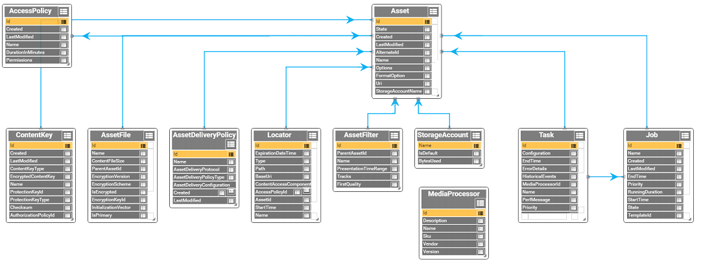
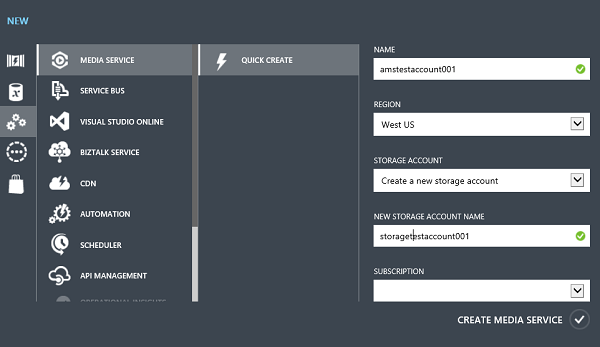
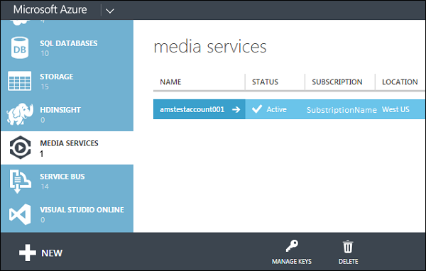

<properties
    pageTitle="开始使用 REST 按需传送内容 | Azure"
    description="本教程介绍了使用 Azure 媒体服务和 REST API 实现点播内容传送应用程序的步骤。"
    services="media-services"
    documentationcenter=""
    author="Juliako"
    manager="erikre"
    editor="" />
<tags
    ms.assetid="88194b59-e479-43ac-b179-af4f295e3780"
    ms.service="media-services"
    ms.workload="media"
    ms.tgt_pltfrm="na"
    ms.devlang="na"
    ms.topic="article"
    ms.date="01/10/2017"
    wacn.date="03/02/2017"
    ms.author="juliako" />

# 开始使用 REST 传送点播内容
[AZURE.INCLUDE [media-services-selector-get-started](../../includes/media-services-selector-get-started.md)]

本快速入门介绍了使用 Azure 媒体服务 \(AMS\) REST API 实现视频点播 \(VoD\) 内容传送应用程序的步骤。

本教程介绍了基本的媒体服务工作流，以及进行媒体服务开发需要用到的最常见编程对象和任务。完成本教程后，就可以流式传输或渐进下载已上传、编码和下载的示例媒体文件。

开发针对媒体服务 OData 模型的 VoD 应用程序时，以下图像将显示某些最常用的对象。

单击图像查看其完整大小。

 

## 先决条件
以下是开始使用媒体服务和 REST API 进行开发所要满足的先决条件。

- 一个 Azure 帐户。有关详细信息，请参阅 [Azure 试用](/pricing/1rmb-trial/)。
- 一个媒体服务帐户。若要创建媒体服务帐户，请参阅[如何创建媒体服务帐户](/documentation/articles/media-services-create-account/)。
- 了解如何使用媒体服务 REST API 进行开发。有关详细信息，请参阅[媒体服务 REST API 概述](/documentation/articles/media-services-rest-how-to-use/)。
- 可以发送 HTTP 请求和响应的所选应用程序。本教程使用 [Fiddler](http://www.telerik.com/download/fiddler)。 

本快速入门教程中说明了以下任务。

1. 启动流式处理终结点（使用 Azure 经典管理门户）。
2. 使用 REST API 连接到媒体服务帐户。
3. 使用 REST API 创建新资产并上传视频文件。
4. 使用 REST API 将源文件编码为一组自适应比特率 MP4 文件。
5. 使用 REST API 发布资产并获取流式处理和渐进式下载 URL。
6. 播放内容。

有关此主题中使用的 AMS REST 实体的详细信息，请参阅 [Azure 媒体服务 REST API 参考](https://docs.microsoft.com/en-us/rest/api/media/mediaservice)。另请参阅 [Azure 媒体服务概念](/documentation/articles/media-services-concepts/)。

## 使用门户创建媒体服务帐户

1. 在 [Azure 经典管理门户][]中，依次单击“新建”、“媒体服务”和“快速创建”。
   
	

2. 在“名称”中，输入新帐户的名称。媒体服务帐户名称由小写字母或数字构成（不含空格），长度为 3 - 24 个字符。

3. 在“区域”中，选择将用于存储媒体服务帐户的元数据记录的地理区域。下拉列表中仅显示可用的媒体服务区域。

4. 在“存储帐户”中，选择一个存储帐户以便为媒体服务帐户中的媒体内容提供 Blob 存储。你可以选择位于媒体服务帐户所在的地理区域内的现有存储帐户，也可以创建一个新的存储帐户。将在同一区域内创建一个新的存储帐户。

5. 如果你创建了一个新的存储帐户，请在“新建存储帐户名称”中输入该存储帐户的名称。适用于存储帐户名的规则对媒体服务帐户同样适用。

6. 单击窗体底部的“快速创建”。

	可以在窗口底部的消息区域中监视过程的状态。

	成功创建帐户后，状态将更改为“活动”。
	
	在页面底部，将出现“管理密钥”按钮。当你单击此按钮时，将会显示一个对话框，其中包含媒体服务帐户名以及主密钥和辅助密钥。你需要有帐户名和主密钥信息，才能以编程方式访问媒体服务帐户。

	
	

	当你双击帐户名时，默认情况下将显示“快速启动”页。可从此页执行某些管理任务，而这些管理任务也可从该门户的其他页执行。例如，你可以从此页上传视频文件，也可以从“内容”页执行此操作。

## 使用 REST API 连接到媒体服务帐户

访问 Azure 媒体服务时需要以下两项内容：由 Azure 访问控制服务 (ACS) 提供的访问令牌和媒体服务本身的 URI。在创建这些请求时，可以使用任何想要的方法，前提是在调用媒体服务时指定了正确的标头值，并且正确地传入了访问令牌。

以下步骤描述了在使用媒体服务 REST API 连接到媒体服务时运用的最常见工作流：

1. 获取访问令牌。 
2. 连接到媒体服务 URI。  
	>[AZURE.NOTE]上海 DC URI：https://wamsshaclus001rest-hs.chinacloudapp.cn/API/ ； 北京 DC URI： https://wamsbjbclus001rest-hs.chinacloudapp.cn/API/
3. 将后续 API 调用发布到相应的 URL。 

###获取访问令牌

若要直接通过 REST API 访问媒体服务，请从 ACS 中检索一个访问令牌，并在向该服务提出每个 HTTP 请求期间使用该令牌。在直接连接到媒体服务之前，你不需要满足任何其他先决条件。

以下示例显示了用于检索令牌的 HTTP 请求标头和正文。

**标头**：

	POST https://wamsprodglobal001acs.accesscontrol.chinacloudapi.cn/v2/OAuth2-13 HTTP/1.1
	Content-Type: application/x-www-form-urlencoded
	Host: wamsprodglobal001acs.accesscontrol.chinacloudapi.cn
	Content-Length: 120
	Expect: 100-continue
	Connection: Keep-Alive
	Accept: application/json

	
**正文**：

请在此请求的正文中提供 client\_id 和 client\_secret 值；client\_id 和 client\_secret 分别对应于 AccountName 和 AccountKey 值。在你设置帐户时，媒体服务将向你提供这些值。

当用作访问令牌请求中的 client\_secret 值时，媒体服务帐户的 AccountKey 必须进行 URL 编码。

	grant_type=client_credentials&client_id=ams_account_name&client_secret=URL_encoded_ams_account_key&scope=urn%3aWindowsAzureMediaServices

例如：

	grant_type=client_credentials&client_id=amstestaccount001&client_secret=wUNbKhNj07oqjqU3Ah9R9f4kqTJ9avPpfe6Pk3YZ7ng%3d&scope=urn%3aWindowsAzureMediaServices

以下示例显示了在响应正文中包含访问令牌的 HTTP 响应。

	HTTP/1.1 200 OK
	Cache-Control: no-cache, no-store
	Pragma: no-cache
	Content-Type: application/json; charset=utf-8
	Expires: -1
	request-id: a65150f5-2784-4a01-a4b7-33456187ad83
	X-Content-Type-Options: nosniff
	Strict-Transport-Security: max-age=31536000; includeSubDomains
	Date: Thu, 15 Jan 2015 08:07:20 GMT
	Content-Length: 670
	
	{  
	   "token_type":"http://schemas.xmlsoap.org/ws/2009/11/swt-token-profile-1.0",
	   "access_token":"http%3a%2f%2fschemas.xmlsoap.org%2fws%2f2005%2f05%2fidentity%2fclaims%2fnameidentifier=amstestaccount001&urn%3aSubscriptionId=z7f09258-2233-4ca2-b1ae-193798e2c9d8&http%3a%2f%2fschemas.microsoft.com%2faccesscontrolservice%2f2010%2f07%2fclaims%2fidentityprovider=https%3a%2f%2fwamsprodglobal001acs.accesscontrol.chinacloudapi.cn%2f&Audience=urn%3aWindowsAzureMediaServices&ExpiresOn=1421330840&Issuer=https%3a%2f%2fwamsprodglobal001acs.accesscontrol.chinacloudapi.cn%2f&HMACSHA256=uf69n82KlqZmkJDNxhJkOxpyIpA2HDyeGUTtSnq1vlE%3d",
	   "expires_in":"21600",
	   "scope":"urn:WindowsAzureMediaServices"
	}
	

>[AZURE.NOTE]
建议在外部存储中缓存“access\_token”和“expires\_in”（访问令牌的有效期，以秒为单位）值。以后可以从存储中检索令牌数据，并在媒体服务 REST API 调用中重新使用。这对于令牌可以在多个进程或多台计算机之间安全共享的方案尤其有用。

确保监视访问令牌的“expires_in”值，并在必要时使用新令牌更新你的 REST API 调用。

###连接到媒体服务 URI

连接到媒体服务 URI:

- 上海 DC URI：https://wamsshaclus001rest-hs.chinacloudapp.cn/API/ 
- 北京 DC URI： https://wamsbjbclus001rest-hs.chinacloudapp.cn/API/

用于上传和下载资产文件的根 URI 为 https://yourstorageaccount.blob.core.chinacloudapi.cn/ ，其中存储帐户名为媒体服务帐户设置期间使用的同一帐户名。

以下示例演示了对上海 DC 媒体服务 URI 发出的 HTTP 请求 (https://wamsshaclus001rest-hs.chinacloudapp.cn/API/)。 

**HTTP 请求**：
			
	GET https://wamsshaclus001rest-hs.chinacloudapp.cn/api/ HTTP/1.1
	Authorization: Bearer http%3a%2f%2fschemas.xmlsoap.org%2fws%2f2005%2f05%2fidentity%2fclaims%2fnameidentifier=amstestaccount001&urn%3aSubscriptionId=z7f09258-2233-4ca2-b1ae-193798e2c9d8&http%3a%2f%2fschemas.microsoft.com%2faccesscontrolservice%2f2010%2f07%2fclaims%2fidentityprovider=https%3a%2f%2fwamsprodglobal001acs.accesscontrol.chinacloudapi.cn%2f&Audience=urn%3aWindowsAzureMediaServices&ExpiresOn=1421500579&Issuer=https%3a%2f%2fwamsprodglobal001acs.accesscontrol.chinacloudapi.cn%2f&HMACSHA256=ElVWXOnMVggFQl%2ft9vhdcv1qH1n%2fE8l3hRef4zPmrzg%3d
	x-ms-version: 2.11
	Accept: application/json
	Host: wamsshaclus001rest-hs.chinacloudapp.cn

**HTTP 响应**：
	
	HTTP/1.1 200 OK
	Cache-Control: no-cache
	Content-Length: 1250
	Content-Type: application/json;odata=minimalmetadata;streaming=true;charset=utf-8
	Server: Microsoft-IIS/8.5
	request-id: 5f52ea9d-177e-48fe-9709-24953d19f84a
	x-ms-request-id: 5f52ea9d-177e-48fe-9709-24953d19f84a
	X-Content-Type-Options: nosniff
	DataServiceVersion: 3.0;
	X-Powered-By: ASP.NET
	Strict-Transport-Security: max-age=31536000; includeSubDomains
	Date: Sat, 17 Jan 2015 07:44:52 GMT
	
	{"odata.metadata":"https://wamsshaclus001rest-hs.chinacloudapp.cn/api/$metadata","value":[{"name":"AccessPolicies","url":"AccessPolicies"},{"name":"Locators","url":"Locators"},{"name":"ContentKeys","url":"ContentKeys"},{"name":"ContentKeyAuthorizationPolicyOptions","url":"ContentKeyAuthorizationPolicyOptions"},{"name":"ContentKeyAuthorizationPolicies","url":"ContentKeyAuthorizationPolicies"},{"name":"Files","url":"Files"},{"name":"Assets","url":"Assets"},{"name":"AssetDeliveryPolicies","url":"AssetDeliveryPolicies"},{"name":"IngestManifestFiles","url":"IngestManifestFiles"},{"name":"IngestManifestAssets","url":"IngestManifestAssets"},{"name":"IngestManifests","url":"IngestManifests"},{"name":"StorageAccounts","url":"StorageAccounts"},{"name":"Tasks","url":"Tasks"},{"name":"NotificationEndPoints","url":"NotificationEndPoints"},{"name":"Jobs","url":"Jobs"},{"name":"TaskTemplates","url":"TaskTemplates"},{"name":"JobTemplates","url":"JobTemplates"},{"name":"MediaProcessors","url":"MediaProcessors"},{"name":"EncodingReservedUnitTypes","url":"EncodingReservedUnitTypes"},{"name":"Operations","url":"Operations"},{"name":"StreamingEndpoints","url":"StreamingEndpoints"},{"name":"Channels","url":"Channels"},{"name":"Programs","url":"Programs"}]}
	 

>[AZURE.NOTE] 从现在起，本教程使用新 URI。

## 使用 REST API 创建新资产并上传视频文件

在媒体服务中，可以将数字文件上传到资产中。**资产**实体可以包含视频、音频、图像、缩略图集合、图文轨迹和隐藏式字幕文件（以及有关这些文件的元数据。） 将文件上传到资产后，相关内容即安全地存储在云中供后续处理和流式处理。

创建资产时必须提供的值之一是资产创建选项。**Options** 属性是一个枚举值，描述可用于创建资产的加密选项。有效值为以下列表中的某个值，而不是此列表中值的组合：

 
- **None** = **0** - 不使用加密。使用此选项时，内容在传送过程中或静态存储过程中都不会受到保护。
	如果计划使用渐进式下载交付 MP4，则使用此选项。
- **StorageEncrypted** = **1** - 使用 AES-256 位加密在本地加密明文内容，然后将其上传到 Azure 存储空间中以加密形式静态存储相关内容。受存储加密保护的资产将在编码前自动解密并放入经过加密的文件系统中，并可选择在重新上传为新的输出资产前重新加密。存储加密的主要用例是在磁盘上通过静态增强加密来保护高品质的输入媒体文件。
- **CommonEncryptionProtected** = **2** - 上传经过常用加密或 PlayReady DRM 加密并受其保护的内容（例如，受 PlayReady DRM 保护的平滑流）时使用此选项。
- **EnvelopeEncryptionProtected** = **4** – 如果要上传使用 AES 加密的 HLS，请使用此选项。Transform Manager 必须已对文件进行编码和加密。

### 创建资产

资产是媒体服务中多种类型的对象或多组对象（包括视频、音频、图像、缩略图集合、文本轨道和隐藏的解释性字幕文件）的容器。在 REST API 中，创建资产需要向媒体服务发送 POST 请求，并将任何有关资产的属性信息放入请求正文中。

以下示例说明了如何创建资产。

**HTTP 请求**

	POST https://wamsshaclus001rest-hs.chinacloudapp.cn/api/Assets HTTP/1.1
	Content-Type: application/json
	DataServiceVersion: 1.0;NetFx
	MaxDataServiceVersion: 3.0;NetFx
	Accept: application/json
	Accept-Charset: UTF-8
	Authorization: Bearer http%3a%2f%2fschemas.xmlsoap.org%2fws%2f2005%2f05%2fidentity%2fclaims%2fnameidentifier=amstestaccount001&urn%3aSubscriptionId=z7f09258-2233-4ca2-b1ae-193798e2c9d8&http%3a%2f%2fschemas.microsoft.com%2faccesscontrolservice%2f2010%2f07%2fclaims%2fidentityprovider=https%3a%2f%2fwamsprodglobal001acs.accesscontrol.chinacloudapi.cn%2f&Audience=urn%3aWindowsAzureMediaServices&ExpiresOn=1421640053&Issuer=https%3a%2f%2fwamsprodglobal001acs.accesscontrol.chinacloudapi.cn%2f&HMACSHA256=vlG%2fPYdFDMS1zKc36qcFVWnaNh07UCkhYj3B71%2fk1YA%3d
	x-ms-version: 2.11
	x-ms-client-request-id: c59de965-bc89-4295-9a57-75d897e5221e
	Host: wamsshaclus001rest-hs.chinacloudapp.cn
	Content-Length: 45
	
	{"Name":"BigBuckBunny.mp4", "Options":"0"}
	

**HTTP 响应**

如果成功，将返回以下响应：
	
	HTP/1.1 201 Created
	Cache-Control: no-cache
	Content-Length: 452
	Content-Type: application/json;odata=minimalmetadata;streaming=true;charset=utf-8
	Location: https://wamsshaclus001rest-hs.chinacloudapp.cn/api/Assets('nb%3Acid%3AUUID%3A9bc8ff20-24fb-4fdb-9d7c-b04c7ee573a1')
	Server: Microsoft-IIS/8.5
	x-ms-client-request-id: c59de965-bc89-4295-9a57-75d897e5221e
	request-id: e98be122-ae09-473a-8072-0ccd234a0657
	x-ms-request-id: e98be122-ae09-473a-8072-0ccd234a0657
	X-Content-Type-Options: nosniff
	DataServiceVersion: 3.0;
	X-Powered-By: ASP.NET
	Strict-Transport-Security: max-age=31536000; includeSubDomains
	Date: Sun, 18 Jan 2015 22:06:40 GMT
		
	{  
	   "odata.metadata":"https://wamsshaclus001rest-hs.chinacloudapp.cn/api/$metadata#Assets/@Element",
	   "Id":"nb:cid:UUID:9bc8ff20-24fb-4fdb-9d7c-b04c7ee573a1",
	   "State":0,
	   "Created":"2015-01-18T22:06:40.6010903Z",
	   "LastModified":"2015-01-18T22:06:40.6010903Z",
	   "AlternateId":null,
	   "Name":"BigBuckBunny2.mp4",
	   "Options":0,
	   "Uri":"https://storagetestaccount001.blob.core.chinacloudapi.cn/asset-9bc8ff20-24fb-4fdb-9d7c-b04c7ee573a1",
	   "StorageAccountName":"storagetestaccount001"
	}
	
### 创建 AssetFile

[AssetFile](https://docs.microsoft.com/zh-cn/rest/api/media/operations/assetfile) 实体表示 blob 容器中存储的视频或音频文件。一个资产文件始终与一个资产关联，而一个资产则可能包含一个或多个 AssetFiles。如果资产文件对象未与 Blob 容器中的数字文件关联，则媒体服务编码器任务将失败。

将数字媒体文件上传到 blob 容器中后，需要使用 **MERGE** HTTP 请求来更新 AssetFile 中有关媒体文件的信息（如本主题稍后所述）。

**HTTP 请求**

	POST https://wamsshaclus001rest-hs.chinacloudapp.cn/api/Files HTTP/1.1
	Content-Type: application/json
	DataServiceVersion: 1.0;NetFx
	MaxDataServiceVersion: 3.0;NetFx
	Accept: application/json
	Accept-Charset: UTF-8
	Authorization: Bearer http%3a%2f%2fschemas.xmlsoap.org%2fws%2f2005%2f05%2fidentity%2fclaims%2fnameidentifier=amstestaccount001&urn%3aSubscriptionId=z7f09258-2233-4ca2-b1ae-193798e2c9d8&http%3a%2f%2fschemas.microsoft.com%2faccesscontrolservice%2f2010%2f07%2fclaims%2fidentityprovider=https%3a%2f%2fwamsprodglobal001acs.accesscontrol.chinacloudapi.cn%2f&Audience=urn%3aWindowsAzureMediaServices&ExpiresOn=1421640053&Issuer=https%3a%2f%2fwamsprodglobal001acs.accesscontrol.chinacloudapi.cn%2f&HMACSHA256=vlG%2fPYdFDMS1zKc36qcFVWnaNh07UCkhYj3B71%2fk1YA%3d
	x-ms-version: 2.11
	Host: wamsshaclus001rest-hs.chinacloudapp.cn
	Content-Length: 164
	
	{  
	   "IsEncrypted":"false",
	   "IsPrimary":"false",
	   "MimeType":"video/mp4",
	   "Name":"BigBuckBunny.mp4",
	   "ParentAssetId":"nb:cid:UUID:9bc8ff20-24fb-4fdb-9d7c-b04c7ee573a1"
	}

**HTTP 响应**

	HTTP/1.1 201 Created
	Cache-Control: no-cache
	Content-Length: 535
	Content-Type: application/json;odata=minimalmetadata;streaming=true;charset=utf-8
	Location: https://wamsshaclus001rest-hs.chinacloudapp.cn/api/Files('nb%3Acid%3AUUID%3Af13a0137-0a62-9d4c-b3b9-ca944b5142c5')
	Server: Microsoft-IIS/8.5
	request-id: 98a30e2d-f379-4495-988e-0b79edc9b80e
	x-ms-request-id: 98a30e2d-f379-4495-988e-0b79edc9b80e
	X-Content-Type-Options: nosniff
	DataServiceVersion: 3.0;
	X-Powered-By: ASP.NET
	Strict-Transport-Security: max-age=31536000; includeSubDomains
	Date: Mon, 19 Jan 2015 00:34:07 GMT
	
	{  
	   "odata.metadata":"https://wamsshaclus001rest-hs.chinacloudapp.cn/api/$metadata#Files/@Element",
	   "Id":"nb:cid:UUID:f13a0137-0a62-9d4c-b3b9-ca944b5142c5",
	   "Name":"BigBuckBunny.mp4",
	   "ContentFileSize":"0",
	   "ParentAssetId":"nb:cid:UUID:9bc8ff20-24fb-4fdb-9d7c-b04c7ee573a1",
	   "EncryptionVersion":null,
	   "EncryptionScheme":null,
	   "IsEncrypted":false,
	   "EncryptionKeyId":null,
	   "InitializationVector":null,
	   "IsPrimary":false,
	   "LastModified":"2015-01-19T00:34:08.1934137Z",
	   "Created":"2015-01-19T00:34:08.1934137Z",
	   "MimeType":"video/mp4",
	   "ContentChecksum":null
	}

### 创建具有写入权限的 AccessPolicy。 

将任何文件上传到 blob 存储之前，请设置用于对资产执行写入操作的访问策略权限。为此，请向 AccessPolicy 实体集发送一个 HTTP POST 请求。请在执行创建操作时定义 DurationInMinutes 值，否则会在响应中收到 500 内部服务器错误消息。有关 AccessPolicies 的详细信息，请参阅 [AccessPolicy](https://docs.microsoft.com/zh-cn/rest/api/media/operations/accesspolicy)。

以下示例说明了如何创建 AccessPolicy：
		
**HTTP 请求**

	POST https://wamsshaclus001rest-hs.chinacloudapp.cn/api/AccessPolicies HTTP/1.1
	Content-Type: application/json
	DataServiceVersion: 1.0;NetFx
	MaxDataServiceVersion: 3.0;NetFx
	Accept: application/json
	Accept-Charset: UTF-8
	Authorization: Bearer http%3a%2f%2fschemas.xmlsoap.org%2fws%2f2005%2f05%2fidentity%2fclaims%2fnameidentifier=amstestaccount001&urn%3aSubscriptionId=z7f09258-2233-4ca2-b1ae-193798e2c9d8&http%3a%2f%2fschemas.microsoft.com%2faccesscontrolservice%2f2010%2f07%2fclaims%2fidentityprovider=https%3a%2f%2fwamsprodglobal001acs.accesscontrol.chinacloudapi.cn%2f&Audience=urn%3aWindowsAzureMediaServices&ExpiresOn=1421640053&Issuer=https%3a%2f%2fwamsprodglobal001acs.accesscontrol.chinacloudapi.cn%2f&HMACSHA256=vlG%2fPYdFDMS1zKc36qcFVWnaNh07UCkhYj3B71%2fk1YA%3d
	x-ms-version: 2.11
	Host: wamsshaclus001rest-hs.chinacloudapp.cn
	Content-Length: 74
	
	{"Name":"NewUploadPolicy", "DurationInMinutes":"440", "Permissions":"2"} 

**HTTP 响应**

	If successful, the following response is returned:
	
	HTTP/1.1 201 Created
	Cache-Control: no-cache
	Content-Length: 312
	Content-Type: application/json;odata=minimalmetadata;streaming=true;charset=utf-8
	Location: https://wamsshaclus001rest-hs.chinacloudapp.cn/api/AccessPolicies('nb%3Apid%3AUUID%3Abe0ac48d-af7d-4877-9d60-1805d68bffae')
	Server: Microsoft-IIS/8.5
	request-id: 74c74545-7e0a-4cd6-a440-c1c48074a970
	x-ms-request-id: 74c74545-7e0a-4cd6-a440-c1c48074a970
	X-Content-Type-Options: nosniff
	DataServiceVersion: 3.0;
	X-Powered-By: ASP.NET
	Strict-Transport-Security: max-age=31536000; includeSubDomains
	Date: Sun, 18 Jan 2015 22:18:06 GMT

	{  
	   "odata.metadata":"https://wamsshaclus001rest-hs.chinacloudapp.cn/api/$metadata#AccessPolicies/@Element",
	   "Id":"nb:pid:UUID:be0ac48d-af7d-4877-9d60-1805d68bffae",
	   "Created":"2015-01-18T22:18:06.6370575Z",
	   "LastModified":"2015-01-18T22:18:06.6370575Z",
	   "Name":"NewUploadPolicy",
	   "DurationInMinutes":440.0,
	   "Permissions":2
	}

### 获取上传 URL

若要检索实际上传 URL，请创建一个 SAS 定位符。定位符为希望访问资产中文件的客户端定义连接终结点的开始时间和类型。可以为给定 AccessPolicy 和资产对创建多个定位符实体，以处理不同的客户端请求和需求。这其中的任一定位符都可使用 AccessPolicy 的 StartTime 值和 DurationInMinutes 值来确定可以使用某 URL 的时间长度。有关详细信息，请参阅[定位符](https://docs.microsoft.com/zh-cn/rest/api/media/operations/locator)。

SAS URL 采用以下格式：

	{https://myaccount.blob.core.chinacloudapi.cn}/{asset name}/{video file name}?{SAS signature}

请注意以下事项：

- 一项给定的资产一次最多只能与五个唯一的定位符相关联。有关详细信息，请参阅定位符。
- 如果需要立即上传文件，应将 StartTime 值设置为当前时间前五分钟。这是因为你的客户端计算机与媒体服务之间可能存在时钟偏差。此外，StartTime 值必须采用以下 DateTime 格式：YYYY-MM-DDTHH:mm:ssZ（例如，“2014-05-23T17:53:50Z”）。
- 定位符从创建到可用可能会有 30-40 秒的延迟。SAS URL 和源定位符都会出现这个问题。

有关 SAS 定位符的详细信息，请参阅[此博客](http://southworks.com/blog/2015/05/27/reusing-azure-media-services-locators-to-avoid-facing-the-5-shared-access-policy-limitation/)。

以下示例说明了如何创建 SAS URL 定位符，如请求正文中的 Type 属性定义（“1”表示 SAS 定位符，“2”表示按需来源定位符）。返回的 **Path** 属性包含上传文件时必须使用的 URL。
	
**HTTP 请求**
	
	POST https://wamsshaclus001rest-hs.chinacloudapp.cn/api/Locators HTTP/1.1
	Content-Type: application/json
	DataServiceVersion: 1.0;NetFx
	MaxDataServiceVersion: 3.0;NetFx
	Accept: application/json
	Accept-Charset: UTF-8
	Authorization: Bearer http%3a%2f%2fschemas.xmlsoap.org%2fws%2f2005%2f05%2fidentity%2fclaims%2fnameidentifier=amstestaccount001&urn%3aSubscriptionId=f7f09258-6753-4ca2-b1ae-193798e2c9d8&http%3a%2f%2fschemas.microsoft.com%2faccesscontrolservice%2f2010%2f07%2fclaims%2fidentityprovider=https%3a%2f%2fwamsprodglobal001acs.accesscontrol.chinacloudapi.cn%2f&Audience=urn%3aWindowsAzureMediaServices&ExpiresOn=1421640053&Issuer=https%3a%2f%2fwamsprodglobal001acs.accesscontrol.chinacloudapi.cn%2f&HMACSHA256=vlG%2fPYdFDMS1zKc36qcFVWnaNh07UCkhYj3B71%2fk1YA%3d
	x-ms-version: 2.11
	Host: wamsshaclus001rest-hs.chinacloudapp.cn
	Content-Length: 178
	
	{  
	   "AccessPolicyId":"nb:pid:UUID:be0ac48d-af7d-4877-9d60-1805d68bffae",
	   "AssetId":"nb:cid:UUID:9bc8ff20-24fb-4fdb-9d7c-b04c7ee573a1",
	   "StartTime":"2015-02-18T16:45:53",
	   "Type":1
	}

**HTTP 响应**

如果成功，将返回以下响应：
		
	HTTP/1.1 201 Created
	Cache-Control: no-cache
	Content-Length: 949
	Content-Type: application/json;odata=minimalmetadata;streaming=true;charset=utf-8
	Location: https://wamsshaclus001rest-hs.chinacloudapp.cn/api/Locators('nb%3Alid%3AUUID%3Aaf57bdd8-6751-4e84-b403-f3c140444b54')
	Server: Microsoft-IIS/8.5
	request-id: 2adeb1f8-89c5-4cc8-aa4f-08cdfef33ae0
	x-ms-request-id: 2adeb1f8-89c5-4cc8-aa4f-08cdfef33ae0
	X-Content-Type-Options: nosniff
	DataServiceVersion: 3.0;
	X-Powered-By: ASP.NET
	Strict-Transport-Security: max-age=31536000; includeSubDomains
	Date: Mon, 19 Jan 2015 03:01:29 GMT
	
	{  
	   "odata.metadata":"https://wamsshaclus001rest-hs.chinacloudapp.cn/api/$metadata#Locators/@Element",
	   "Id":"nb:lid:UUID:af57bdd8-6751-4e84-b403-f3c140444b54",
	   "ExpirationDateTime":"2015-02-19T00:05:53",
	   "Type":1,
	   "Path":"https://storagetestaccount001.blob.core.chinacloudapi.cn/asset-f438649c-313c-46e2-8d68-7d2550288247?sv=2012-02-12&sr=c&si=af57bdd8-6751-4e84-b403-f3c140444b54&sig=fE4btwEfZtVQFeC0Wh3Kwks2OFPQfzl5qTMW5YytiuY%3D&st=2015-02-18T16%3A45%3A53Z&se=2015-02-19T00%3A05%3A53Z",
	   "BaseUri":"https://storagetestaccount001.blob.core.chinacloudapi.cn/asset-f438649c-313c-46e2-8d68-7d2550288247",
	   "ContentAccessComponent":"?sv=2012-02-12&sr=c&si=af57bdd8-6751-4e84-b403-f3c140444b54&sig=fE4btwEfZtVQFeC0Wh3Kwks2OFPQfzl5qTMW5YytiuY%3D&st=2015-02-18T16%3A45%3A53Z&se=2015-02-19T00%3A05%3A53Z",
	   "AccessPolicyId":"nb:pid:UUID:be0ac48d-af7d-4877-9d60-1805d68bffae",
	   "AssetId":"nb:cid:UUID:9bc8ff20-24fb-4fdb-9d7c-b04c7ee573a1",
	   "StartTime":"2015-02-18T16:45:53",
	   "Name":null
	}

### 将文件上传到 Blob 存储容器
设置 AccessPolicy 和定位符后，即可使用 Azure 存储 REST API 将具体的文件上载到 Azure Blob 存储容器。必须将文件作为块 blob 上载。页 blob 不受 Azure 媒体服务支持。

>[AZURE.NOTE] 必须将要上传的文件的文件名添加到在上一节收到的定位符 **Path** 值中。例如，https://storagetestaccount001.blob.core.chinacloudapi.cn/asset-e7b02da4-5a69-40e7-a8db-e8f4f697aac0/BigBuckBunny.mp4? . . .

有关使用 Azure 存储 blob 的详细信息，请参阅 [Blob 服务 REST API](https://docs.microsoft.com/rest/api/storageservices/fileservices/Blob-Service-REST-API)。

### 更新 AssetFile 

上传文件后，请更新 FileAsset 大小（和其他）信息。例如：
	
	MERGE https://wamsshaclus001rest-hs.chinacloudapp.cn/api/Files('nb%3Acid%3AUUID%3Af13a0137-0a62-9d4c-b3b9-ca944b5142c5') HTTP/1.1
	Content-Type: application/json
	DataServiceVersion: 1.0;NetFx
	MaxDataServiceVersion: 3.0;NetFx
	Accept: application/json
	Accept-Charset: UTF-8
	Authorization: Bearer http%3a%2f%2fschemas.xmlsoap.org%2fws%2f2005%2f05%2fidentity%2fclaims%2fnameidentifier=amstestaccount001&urn%3aSubscriptionId=z7f09258-2233-4ca2-b1ae-193798e2c9d8&http%3a%2f%2fschemas.microsoft.com%2faccesscontrolservice%2f2010%2f07%2fclaims%2fidentityprovider=https%3a%2f%2fwamsprodglobal001acs.accesscontrol.chinacloudapi.cn%2f&Audience=urn%3aWindowsAzureMediaServices&ExpiresOn=1421662918&Issuer=https%3a%2f%2fwamsprodglobal001acs.accesscontrol.chinacloudapi.cn%2f&HMACSHA256=utmoXXbm9Q7j4tW1yJuMVA3egRiQy5FPygwadkmPeaY%3d
	x-ms-version: 2.11
	Host: wamsshaclus001rest-hs.chinacloudapp.cn
	
	{  
	   "ContentFileSize":"1186540",
	   "Id":"nb:cid:UUID:f13a0137-0a62-9d4c-b3b9-ca944b5142c5",
	   "MimeType":"video/mp4",
	   "Name":"BigBuckBunny.mp4",
	   "ParentAssetId":"nb:cid:UUID:9bc8ff20-24fb-4fdb-9d7c-b04c7ee573a1"
	}

**HTTP 响应**

如果成功，将返回以下响应：
	HTTP/1.1 204 无内容

## 删除定位符和 AccessPolicy 

**HTTP 请求**

	DELETE https://wamsshaclus001rest-hs.chinacloudapp.cn/api/Locators('nb%3Alid%3AUUID%3Aaf57bdd8-6751-4e84-b403-f3c140444b54') HTTP/1.1
	DataServiceVersion: 1.0;NetFx
	MaxDataServiceVersion: 3.0;NetFx
	Accept: application/json
	Accept-Charset: UTF-8
	Authorization: Bearer http%3a%2f%2fschemas.xmlsoap.org%2fws%2f2005%2f05%2fidentity%2fclaims%2fnameidentifier=amstestaccount001&urn%3aSubscriptionId=z7f09258-2233-4ca2-b1ae-193798e2c9d8&http%3a%2f%2fschemas.microsoft.com%2faccesscontrolservice%2f2010%2f07%2fclaims%2fidentityprovider=https%3a%2f%2fwamsprodglobal001acs.accesscontrol.chinacloudapi.cn%2f&Audience=urn%3aWindowsAzureMediaServices&ExpiresOn=1421662918&Issuer=https%3a%2f%2fwamsprodglobal001acs.accesscontrol.chinacloudapi.cn%2f&HMACSHA256=utmoXXbm9Q7j4tW1yJuMVA3egRiQy5FPygwadkmPeaY%3d
	x-ms-version: 2.11
	Host: wamsshaclus001rest-hs.chinacloudapp.cn

	
**HTTP 响应**

如果成功，将返回以下响应：

	HTTP/1.1 204 No Content 
	...

**HTTP 请求**

	DELETE https://wamsshaclus001rest-hs.chinacloudapp.cn/api/AccessPolicies('nb%3Apid%3AUUID%3Abe0ac48d-af7d-4877-9d60-1805d68bffae') HTTP/1.1
	DataServiceVersion: 1.0;NetFx
	MaxDataServiceVersion: 3.0;NetFx
	Accept: application/json
	Accept-Charset: UTF-8
	Authorization: Bearer http%3a%2f%2fschemas.xmlsoap.org%2fws%2f2005%2f05%2fidentity%2fclaims%2fnameidentifier=amstestaccount001&urn%3aSubscriptionId=z7f09258-2233-4ca2-b1ae-193798e2c9d8&http%3a%2f%2fschemas.microsoft.com%2faccesscontrolservice%2f2010%2f07%2fclaims%2fidentityprovider=https%3a%2f%2fwamsprodglobal001acs.accesscontrol.chinacloudapi.cn%2f&Audience=urn%3aWindowsAzureMediaServices&ExpiresOn=1421662918&Issuer=https%3a%2f%2fwamsprodglobal001acs.accesscontrol.chinacloudapi.cn%2f&HMACSHA256=utmoXXbm9Q7j4tW1yJuMVA3egRiQy5FPygwadkmPeaY%3d
	x-ms-version: 2.11
	Host: wamsshaclus001rest-hs.chinacloudapp.cn

**HTTP 响应**

如果成功，将返回以下响应：

    HTTP/1.1 204 No Content
    ...

## 将源文件编码为一组自适应比特率 MP4 文件

将资产引入媒体服务后，即可对媒体进行编码、传输复用、打水印等处理，然后将其传送至客户端。将根据多个后台角色实例调度和运行这些活动，以确保高性能和高可用性。这些活动称为作业，每个作业由原子任务构成，这些原子任务将在资产文件上执行具体的工作。有关详细信息，请参阅[Job](https://docs.microsoft.com/zh-CN/rest/api/media/operations/job)（作业）、[Task](https://docs.microsoft.com/zh-CN/rest/api/media/operations/task)（任务）说明。

如前所述，使用 Azure 媒体服务最常见的方案之一是将自适应比特率流传送至客户端。媒体服务可将一组自适应比特率 MP4 文件动态打包为以下格式之一：HTTP Live Streaming \(HLS\)、平滑流式处理、MPEG DASH。
 
以下部分说明了如何创建包含一个编码任务的作业。该任务指定使用**媒体编码器标准版**将夹层文件转码成一组自适应比特率 MP4。该部分还说明了如何监视作业处理进度。作业完成后，可创建所需的定位符来获取对资产的访问权限。

### 获取媒体处理器

在媒体服务中，媒体处理器是完成特定处理任务（例如，对媒体内容进行编码、格式转换、加密或解密）的组件。对于本教程中所示的编码任务，将使用 Media Encoder Standard。

以下代码会请求编码器的 ID。

**HTTP 请求**

	GET https://wamsshaclus001rest-hs.chinacloudapp.cn/api/MediaProcessors()?$filter=Name%20eq%20'Media%20Encoder%20Standard' HTTP/1.1
	DataServiceVersion: 1.0;NetFx
	MaxDataServiceVersion: 3.0;NetFx
	Accept: application/json
	Accept-Charset: UTF-8
	Authorization: Bearer http%3a%2f%2fschemas.xmlsoap.org%2fws%2f2005%2f05%2fidentity%2fclaims%2fnameidentifier=amstestaccount001&urn%3aSubscriptionId=f7f09258-6753-4ca2-b1ae-193798e2c9d8&http%3a%2f%2fschemas.microsoft.com%2faccesscontrolservice%2f2010%2f07%2fclaims%2fidentityprovider=https%3a%2f%2fwamsprodglobal001acs.accesscontrol.chinacloudapi.cn%2f&Audience=urn%3aWindowsAzureMediaServices&ExpiresOn=1421675491&Issuer=https%3a%2f%2fwamsprodglobal001acs.accesscontrol.chinacloudapi.cn%2f&HMACSHA256=9hUudHYnATpi5hN3cvTfgw%2bL4N3tL0fdsRnQnm6ZYIU%3d
	x-ms-version: 2.11
	Host: wamsshaclus001rest-hs.chinacloudapp.cn
	

**HTTP 响应**

	HTTP/1.1 200 OK
	Cache-Control: no-cache
	Content-Length: 273
	Content-Type: application/json;odata=minimalmetadata;streaming=true;charset=utf-8
	Server: Microsoft-IIS/8.5
	request-id: 6beb04b4-55a7-480d-8aa8-e5c5d59ffa1f
	x-ms-request-id: 6beb04b4-55a7-480d-8aa8-e5c5d59ffa1f
	X-Content-Type-Options: nosniff
	DataServiceVersion: 3.0;
	X-Powered-By: ASP.NET
	Strict-Transport-Security: max-age=31536000; includeSubDomains
	Date: Mon, 19 Jan 2015 07:54:09 GMT
	
	{  
	   "odata.metadata":"https://wamsshaclus001rest-hs.chinacloudapp.cn/api/$metadata#MediaProcessors",
	   "value":[  
	      {  
	         "Id":"nb:mpid:UUID:ff4df607-d419-42f0-bc17-a481b1331e56",
	         "Description":"Media Encoder Standard",
	         "Name":"Media Encoder Standard",
	         "Sku":"",
	         "Vendor":"Microsoft",
	         "Version":"1.1"
	      }
	   ]
	}

### 创建作业

每个作业可以有一个或多个任务，具体因要完成的处理类型而异。REST API 可通过以下两种方式之一创建作业及相关任务：可以通过作业实体上的任务导航属性以内联方式定义任务，或通过 OData 批处理来定义任务。媒体服务 SDK 使用批处理。但是，为了确保本主题中代码示例的可读性，以内联方式定义任务。有关批处理的信息，请参阅[开放数据协议 (OData) 批处理](http://www.odata.org/documentation/odata-version-3-0/batch-processing/)。

以下示例说明了如何使用一个任务集来创建和发布一个作业，从而以特定分辨率和质量来编码某个视频。以下文档部分包含媒体编码器标准版处理器支持的所有[任务预设](http://msdn.microsoft.com/zh-cn/library/mt269960)的列表。

**HTTP 请求**
	
	POST https://wamsshaclus001rest-hs.chinacloudapp.cn/api/Jobs HTTP/1.1
	DataServiceVersion: 1.0;NetFx
	MaxDataServiceVersion: 3.0;NetFx
	Content-Type: application/json
	Accept: application/json;odata=verbose
	Accept-Charset: UTF-8
	Authorization: Bearer http%3a%2f%2fschemas.xmlsoap.org%2fws%2f2005%2f05%2fidentity%2fclaims%2fnameidentifier=amstestaccount001&urn%3aSubscriptionId=z7f09258-2233-4ca2-b1ae-193798e2c9d8&http%3a%2f%2fschemas.microsoft.com%2faccesscontrolservice%2f2010%2f07%2fclaims%2fidentityprovider=https%3a%2f%2fwamsprodglobal001acs.accesscontrol.chinacloudapi.cn%2f&Audience=urn%3aWindowsAzureMediaServices&ExpiresOn=1421675491&Issuer=https%3a%2f%2fwamsprodglobal001acs.accesscontrol.chinacloudapi.cn%2f&HMACSHA256=9hUudHYnATpi5hN3cvTfgw%2bL4N3tL0fdsRnQnm6ZYIU%3d
	x-ms-version: 2.11
	Host: wamsshaclus001rest-hs.chinacloudapp.cn
	Content-Length: 482
	
	{  
	   "Name":"NewTestJob",
	   "InputMediaAssets":[  
	      {  
	         "__metadata":{  
	            "uri":"https://wamsshaclus001rest-hs.net/api/Assets('nb%3Acid%3AUUID%3A9bc8ff20-24fb-4fdb-9d7c-b04c7ee573a1')"
	         }
	      }
	   ],
	   "Tasks":[  
	      {  
	         "Configuration":"H264 Adaptive Bitrate MP4 Set 720p",
	         "MediaProcessorId":"nb:mpid:UUID:ff4df607-d419-42f0-bc17-a481b1331e56",
	         "TaskBody":"<?xml version="1.0" encoding="utf-8"?><taskBody><inputAsset>JobInputAsset(0)</inputAsset>
				<outputAsset>JobOutputAsset(0)</outputAsset></taskBody>"
	      }
	   ]
	}

**HTTP 响应**

如果成功，将返回以下响应：

	HTTP/1.1 201 Created
	Cache-Control: no-cache
	Content-Length: 1215
	Content-Type: application/json;odata=verbose;charset=utf-8
	Location: https://wamsshaclus001rest-hs.chinacloudapp.cn/api/Jobs('nb%3Ajid%3AUUID%3A71d2dd33-efdf-ec43-8ea1-136a110bd42c')
	Server: Microsoft-IIS/8.5
	request-id: 532ac1ec-a475-4dce-b2d5-7c8ce94ac87c
	x-ms-request-id: 532ac1ec-a475-4dce-b2d5-7c8ce94ac87c
	X-Content-Type-Options: nosniff
	DataServiceVersion: 3.0;
	X-Powered-By: ASP.NET
	Strict-Transport-Security: max-age=31536000; includeSubDomains
	Date: Mon, 19 Jan 2015 08:04:35 GMT
		
	{  
	   "d":{  
	      "__metadata":{  
	         "id":"https://wamsshaclus001rest-hs.chinacloudapp.cn/api/Jobs('nb%3Ajid%3AUUID%3A71d2dd33-efdf-ec43-8ea1-136a110bd42c')",
	         "uri":"https://wamsshaclus001rest-hs.chinacloudapp.cn/api/Jobs('nb%3Ajid%3AUUID%3A71d2dd33-efdf-ec43-8ea1-136a110bd42c')",
	         "type":"Microsoft.Cloud.Media.Vod.Rest.Data.Models.Job"
	      },
	      "Tasks":{  
	         "__deferred":{  
	            "uri":"https://wamsshaclus001rest-hs.chinacloudapp.cn/api/Jobs('nb%3Ajid%3AUUID%3A71d2dd33-efdf-ec43-8ea1-136a110bd42c')/Tasks"
	         }
	      },
	      "OutputMediaAssets":{  
	         "__deferred":{  
	            "uri":"https://wamsshaclus001rest-hs.chinacloudapp.cn/api/Jobs('nb%3Ajid%3AUUID%3A71d2dd33-efdf-ec43-8ea1-136a110bd42c')/OutputMediaAssets"
	         }
	      },
	      "InputMediaAssets":{  
	         "__deferred":{  
	            "uri":"https://wamsshaclus001rest-hs.chinacloudapp.cn/api/Jobs('nb%3Ajid%3AUUID%3A9bc8ff20-24fb-4fdb-9d7c-b04c7ee573a1')/InputMediaAssets"
	         }
	      },
	      "Id":"nb:jid:UUID:71d2dd33-efdf-ec43-8ea1-136a110bd42c",
	      "Name":"NewTestJob",
	      "Created":"2015-01-19T08:04:34.3287057Z",
	      "LastModified":"2015-01-19T08:04:34.3287057Z",
	      "EndTime":null,
	      "Priority":0,
	      "RunningDuration":0,
	      "StartTime":null,
	      "State":0,
	      "TemplateId":null,
	      "JobNotificationSubscriptions":{  
	         "__metadata":{  
	            "type":"Collection(Microsoft.Cloud.Media.Vod.Rest.Data.Models.JobNotificationSubscription)"
	         },
	         "results":[  
	
	         ]
	      }
	   }
	}

在任何作业请求中，都需要注意以下重要事项：

- TaskBody 属性必须使用文本 XML 来定义任务使用的输入资产或输出资产的数量。任务主题包含 XML 的 XML 架构定义。
- 在 TaskBody 定义中，必须将 <inputAsset> 和 <outputAsset> 的每个内部值设置为 JobInputAsset(value) 或 JobOutputAsset(value)。
- 一个任务可以有多个输出资产。一个 JobOutputAsset(x) 只能一次用作作业中任务的输出。
- 可以将 JobInputAsset 或 JobOutputAsset 指定为任务的输入资产。
- 任务不得构成循环。
- 传递给 JobInputAsset 或 JobOutputAsset 的 value 参数代表资产的索引值。在作业实体定义的 InputMediaAssets 和 OutputMediaAssets 导航属性中定义实际资产。

>[AZURE.NOTE] 由于媒体服务基于 OData v3，因此通过“\_\_metadata : uri”名称-值对引用 InputMediaAssets 和 OutputMediaAssets 导航属性集合中的各项资产。

- InputMediaAssets 映射到已在媒体服务中创建的一项或多项资产。OutputMediaAssets 由系统创建。它们不引用现有资产。
- 可以使用 assetName 属性来命名 OutputMediaAssets。如果此属性不存在，则 OutputMediaAsset 的名称将为 <outputAsset> 元素的任意内部文本值，并以作业名称值或作业 ID 值（在没有定义名称属性的情况下）为后缀。例如，如果将 assetName 的值设置为“Sample”，则会将 OutputMediaAsset 名称属性设置为“Sample”。但是，如果未设置 assetName 的值，但已将作业名称设置为“NewJob”，则 OutputMediaAsset 名称为“JobOutputAsset(value)\_NewJob”。

	以下示例说明了如何设置 assetName 属性：
	
		"<?xml version="1.0" encoding="utf-8"?><taskBody><inputAsset>JobInputAsset(0)</inputAsset><outputAsset assetName="CustomOutputAssetName">JobOutputAsset(0)</outputAsset></taskBody>"

- 若要启用任务链，必须满足以下条件：

	- 一个作业必须至少具有两个任务
	- 必须至少有一个任务的输入是作业中另一个任务的输出。

有关详细信息，请参阅[使用媒体服务 REST API 创建编码作业](/documentation/articles/media-services-rest-encode-asset/)。

### 监视处理进度

如以下示例所示，可以使用状态属性检索作业状态。

**HTTP 请求**

	GET https://wamsshaclus001rest-hs.chinacloudapp.cn/api/Jobs('nb%3Ajid%3AUUID%3A71d2dd33-efdf-ec43-8ea1-136a110bd42c')/State HTTP/1.1
	Content-Type: application/json;odata=verbose
	Accept: application/json;odata=verbose
	DataServiceVersion: 3.0
	MaxDataServiceVersion: 3.0
	x-ms-version: 2.11
	Authorization: Bearer http%3a%2f%2fschemas.xmlsoap.org%2fws%2f2005%2f05%2fidentity%2fclaims%2fnameidentifier=youraccountname&urn%3aSubscriptionId=zf84471d-2233-4e75-aa09-010f0fc0cf5b&http%3a%2f%2fschemas.microsoft.com%2faccesscontrolservice%2f2010%2f07%2fclaims%2fidentityprovider=https%3a%2f%2fwamsprodglobal001acs.accesscontrol.chinacloudapi.cn%2f&Audience=urn%3aWindowsAzureMediaServices&ExpiresOn=1336908022&Issuer=https%3a%2f%2fwamsprodglobal001acs.accesscontrol.chinacloudapi.cn%2f&HMACSHA256=RYXOraO6Z%2f7l9whWZQN%2bypeijgHwIk8XyikA01Kx1%2bk%3d
	Host: wamsshaclus001rest-hs.chinacloudapp.cn
	Content-Length: 0

**HTTP 响应**

如果成功，将返回以下响应：

	HTTP/1.1 200 OK
	Cache-Control: no-cache
	Content-Length: 17
	Content-Type: application/json;odata=verbose;charset=utf-8
	Server: Microsoft-IIS/7.5
	x-ms-request-id: 01324d81-18e2-4493-a3e5-c6186209f0c8
	X-Content-Type-Options: nosniff
	DataServiceVersion: 1.0;
	X-AspNet-Version: 4.0.30319
	X-Powered-By: ASP.NET
	Date: Sun, 13 May 2012 05:16:53 GMT
	
	{"d":{"State":2}}

### 取消作业

媒体服务可通过 CancelJob 函数取消正在运行的作业。如果在作业的状态为“已取消”、“正在取消”、“错误”或“已完成”时尝试取消该作业，则此调用会返回 400 错误代码。

以下示例说明了如何调用 CancelJob。

**HTTP 请求**

	GET https://wamsshaclus001rest-hs.chinacloudapp.cn/API/CancelJob?jobid='nb%3ajid%3aUUID%3a71d2dd33-efdf-ec43-8ea1-136a110bd42c' HTTP/1.1
	Content-Type: application/json;odata=verbose
	Accept: application/json;odata=verbose
	DataServiceVersion: 3.0
	MaxDataServiceVersion: 3.0
	x-ms-version: 2.2
	Authorization: Bearer http%3a%2f%2fschemas.xmlsoap.org%2fws%2f2005%2f05%2fidentity%2fclaims%2fnameidentifier=youraccountname&urn%3aSubscriptionId=2f84471d-b1ae-4e75-aa09-010f0fc0cf5b&http%3a%2f%2fschemas.microsoft.com%2faccesscontrolservice%2f2010%2f07%2fclaims%2fidentityprovider=https%3a%2f%2fwamsprodglobal001acs.accesscontrol.chinacloudapi.cn%2f&Audience=urn%3aWindowsAzureMediaServices&ExpiresOn=1336908753&Issuer=https%3a%2f%2fwamsprodglobal001acs.accesscontrol.chinacloudapi.cn%2f&HMACSHA256=kolAgnFfbQIeRv4lWxKSFa4USyjWXRm15Kd%2bNd5g8eA%3d
	Host: wamsshaclus001rest-hs.chinacloudapp.cn

如果成功，将返回不带消息正文的 204 响应代码。

>[AZURE.NOTE] 将作业 ID 作为参数传递给 CancelJob 时，必须对作业 ID 进行 URL 编码（通常为 nb:jid:UUID: 某个值）。

### 获取输出资产 

以下代码演示如何请求输出资产 ID。

**HTTP 请求**

	GET https://wamsshaclus001rest-hs.chinacloudapp.cn/api/Jobs('nb%3Ajid%3AUUID%3A71d2dd33-efdf-ec43-8ea1-136a110bd42c')/OutputMediaAssets() HTTP/1.1
	DataServiceVersion: 1.0;NetFx
	MaxDataServiceVersion: 3.0;NetFx
	Accept: application/json
	Accept-Charset: UTF-8
	User-Agent: Microsoft ADO.NET Data Services
	Authorization: Bearer http%3a%2f%2fschemas.xmlsoap.org%2fws%2f2005%2f05%2fidentity%2fclaims%2fnameidentifier=amstestaccount001&urn%3aSubscriptionId=z7f09258-2233-4ca2-b1ae-193798e2c9d8&http%3a%2f%2fschemas.microsoft.com%2faccesscontrolservice%2f2010%2f07%2fclaims%2fidentityprovider=https%3a%2f%2fwamsprodglobal001acs.accesscontrol.chinacloudapi.cn%2f&Audience=urn%3aWindowsAzureMediaServices&ExpiresOn=1421675491&Issuer=https%3a%2f%2fwamsprodglobal001acs.accesscontrol.chinacloudapi.cn%2f&HMACSHA256=9hUudHYnATpi5hN3cvTfgw%2bL4N3tL0fdsRnQnm6ZYIU%3d
	x-ms-version: 2.11
	Host: wamsshaclus001rest-hs.chinacloudapp.cn
	

**HTTP 响应**

	HTTP/1.1 200 OK
	Cache-Control: no-cache
	Content-Length: 445
	Content-Type: application/json;odata=minimalmetadata;streaming=true;charset=utf-8
	Server: Microsoft-IIS/8.5
	request-id: 73cd605d-066a-46f1-8358-f4bd25a9220a
	x-ms-request-id: 73cd605d-066a-46f1-8358-f4bd25a9220a
	X-Content-Type-Options: nosniff
	DataServiceVersion: 3.0;
	X-Powered-By: ASP.NET
	Strict-Transport-Security: max-age=31536000; includeSubDomains
	Date: Mon, 19 Jan 2015 08:28:13 GMT
		
	{  
	   "odata.metadata":"https://wamsshaclus001rest-hs.chinacloudapp.cn/api/$metadata#Assets",
	   "value":[  
	      {  
	         "Id":"nb:cid:UUID:71d2dd33-efdf-ec43-8ea1-136a110bd42c",
	         "State":0,
	         "Created":"2015-01-19T07:52:15.603",
	         "LastModified":"2015-01-19T07:52:15.603",
	         "AlternateId":null,
	         "Name":"Multibitrate MP4s",
	         "Options":0,
	         "Uri":"https://storagetestaccount001.blob.core.chinacloudapi.cn/asset-71d2dd33-efdf-ec43-8ea1-136a110bd42c",
	         "StorageAccountName":"storagetestaccount001"
	      }
	   ]
	}

## 使用 REST API 发布资产并获取流式处理和渐进式下载 URL

若要流处理或下载资产，必须先创建定位符来“发布”资产。定位符提供对资产中所含文件的访问权限。媒体服务支持两种类型的定位符：用于流媒体（例如 MPEG DASH、HLS 或平滑流式处理）的 OnDemandOrigin 定位符，以及用于下载媒体文件的访问签名 \(SAS\) 定位符。有关 SAS 定位符的详细信息，请参阅[此博客](http://southworks.com/blog/2015/05/27/reusing-azure-media-services-locators-to-avoid-facing-the-5-shared-access-policy-limitation/)。

创建定位符后，可以创建用来流式处理或下载文件的 URL。

>[AZURE.NOTE]
创建 AMS 帐户时，系统会将**默认**流式处理终结点以“已停止”状态添加到用户的帐户。若要开始对内容进行流式处理并利用动态打包和动态加密功能，必须确保要从其流式获取内容的流式处理终结点处于“正在运行”状态。

平滑流式处理的流式处理 URL 采用以下格式：

	{streaming endpoint name-media services account name}.streaming.mediaservices.chinacloudapi.cn/{locator ID}/{filename}.ism/Manifest

HLS 的流 URL 采用以下格式：

	{streaming endpoint name-media services account name}.streaming.mediaservices.chinacloudapi.cn/{locator ID}/{filename}.ism/Manifest(format=m3u8-aapl)

MPEG DASH 的流 URL 采用以下格式：

	{streaming endpoint name-media services account name}.streaming.mediaservices.chinacloudapi.cn/{locator ID}/{filename}.ism/Manifest(format=mpd-time-csf)

用于下载文件的 SAS URL 采用以下格式：

	{blob container name}/{asset name}/{file name}/{SAS signature}

本部分演示如何执行以下必要任务以“发布”资产。

- 创建具有读取权限的 AccessPolicy
- 创建用于下载内容的 SAS URL
- 创建用于传输内容的源 URL

###创建具有读取权限的 AccessPolicy

在下载或传输任何媒体内容之前，请首先定义一个具有读取权限的 AccessPolicy，然后创建相应的定位符实体，以便指定将要为客户端启用的传送机制类型。有关可用属性的详细信息，请参阅 [AccessPolicy 实体属性](https://docs.microsoft.com/zh-cn/rest/api/media/operations/accesspolicy#accesspolicy_properties)。

以下示例说明如何为给定资产指定具有读取权限的 AccessPolicy。

	POST https://wamsshaclus001rest-hs.chinacloudapp.cn/API/AccessPolicies HTTP/1.1
	Content-Type: application/json
	Accept: application/json
	DataServiceVersion: 3.0
	MaxDataServiceVersion: 3.0
	x-ms-version: 2.11
	Authorization: Bearer http%3a%2f%2fschemas.xmlsoap.org%2fws%2f2005%2f05%2fidentity%2fclaims%2fnameidentifier=youraccountname&urn%3aSubscriptionId=2f84471d-b1ae-4e75-aa09-010f0fc0cf5b&http%3a%2f%2fschemas.microsoft.com%2faccesscontrolservice%2f2010%2f07%2fclaims%2fidentityprovider=https%3a%2f%2fwamsprodglobal001acs.accesscontrol.chinacloudapi.cn%2f&Audience=urn%3aWindowsAzureMediaServices&ExpiresOn=1337067658&Issuer=https%3a%2f%2fwamsprodglobal001acs.accesscontrol.chinacloudapi.cn%2f&HMACSHA256=dithjGvlXR9HlyAf5DE99N5OCYkPAxsHIcsTSjm9%2fVE%3d
	Host: wamsshaclus001rest-hs.chinacloudapp.cn
	Content-Length: 74
	Expect: 100-continue
	
	{"Name": "DownloadPolicy", "DurationInMinutes" : "300", "Permissions" : 1}

如果成功，将返回描述已创建的 AccessPolicy 实体的 201 成功代码。然后，需要使用 AccessPolicy ID 以及包含需传送文件的资产（如某个输出资产）的资产 ID 来创建定位符实体。

>[AZURE.NOTE]
此基本工作流与引入资产时上传文件的工作流相同（如本主题前面所述）。此外，和上传文件一样，如果（或你的客户端）需要立即访问文件，请将 StartTime 值设置为当前时间前五分钟。此操作是必需的，因为客户端与媒体服务之间可能存在时钟偏差。StartTime 值必须采用以下 DateTime 格式：YYYY-MM-DDTHH:mm:ssZ（例如，“2014-05-23T17:53:50Z”）。

###创建用于下载内容的 SAS URL 

以下代码演示了如何获取可用于下载以前创建和上传的媒体文件的 URL。AccessPolicy 已设置读取权限，并且定位符路径指向 SAS 下载 URL。

	POST https://wamsshaclus001rest-hs.chinacloudapp.cn/API/Locators HTTP/1.1
	Content-Type: application/json
	Accept: application/json
	DataServiceVersion: 3.0
	MaxDataServiceVersion: 3.0
	x-ms-version: 2.11
	Authorization: Bearer http%3a%2f%2fschemas.xmlsoap.org%2fws%2f2005%2f05%2fidentity%2fclaims%2fnameidentifier=youraccountname&urn%3aSubscriptionId=zf84471d-b1ae-2233-aa09-010f0fc0cf5b&http%3a%2f%2fschemas.microsoft.com%2faccesscontrolservice%2f2010%2f07%2fclaims%2fidentityprovider=https%3a%2f%2fwamsprodglobal001acs.accesscontrol.chinacloudapi.cn%2f&Audience=urn%3aWindowsAzureMediaServices&ExpiresOn=1337067658&Issuer=https%3a%2f%2fwamsprodglobal001acs.accesscontrol.chinacloudapi.cn%2f&HMACSHA256=dithjGvlXR9HlyAf5DE99N5OCYkPAxsHIcsTSjm9%2fVE%3d
	Host: wamsshaclus001rest-hs.chinacloudapp.cn
	Content-Length: 182
	Expect: 100-continue
	
	{"AccessPolicyId": "nb:pid:UUID:38c71dd0-44c5-4c5f-8418-08bb6fbf7bf8", "AssetId" : "nb:cid:UUID:71d2dd33-efdf-ec43-8ea1-136a110bd42c", "StartTime" : "2014-05-17T16:45:53", "Type":1}

如果成功，将返回以下响应：

	
	HTTP/1.1 201 Created
	Cache-Control: no-cache
	Content-Length: 1150
	Content-Type: application/json;odata=verbose;charset=utf-8
	Location: https://wamsshaclus001rest-hs.chinacloudapp.cn/api/Locators('nb%3Alid%3AUUID%3A8e5a821d-2194-4d00-8884-adf979856874')
	Server: Microsoft-IIS/7.5
	x-ms-request-id: 8cfd8556-3064-416a-97f2-67d9e35f0911
	X-Content-Type-Options: nosniff
	DataServiceVersion: 1.0;
	X-AspNet-Version: 4.0.30319
	X-Powered-By: ASP.NET
	Date: Mon, 14 May 2012 21:41:32 GMT
		
	{  
	   "d":{  
	      "__metadata":{  
	         "id":"https://wamsshaclus001rest-hs.chinacloudapp.cn/api/Locators('nb%3Alid%3AUUID%3A8e5a821d-2194-4d00-8884-adf979856874')",
	         "uri":"https://wamsshaclus001rest-hs.chinacloudapp.cn/api/Locators('nb%3Alid%3AUUID%3A8e5a821d-2194-4d00-8884-adf979856874')",
	         "type":"Microsoft.Cloud.Media.Vod.Rest.Data.Models.Locator"
	      },
	      "AccessPolicy":{  
	         "__deferred":{  
	            "uri":"https://wamsshaclus001rest-hs.chinacloudapp.cn/api/Locators('nb%3Alid%3AUUID%3A8e5a821d-2194-4d00-8884-adf979856874')/AccessPolicy"
	         }
	      },
	      "Asset":{  
	         "__deferred":{  
	            "uri":"https://wamsshaclus001rest-hs.chinacloudapp.cn/api/Locators('nb%3Alid%3AUUID%3A71d2dd33-efdf-ec43-8ea1-136a110bd42c')/Asset"
	         }
	      },
	      "Id":"nb:lid:UUID:8e5a821d-2194-4d00-8884-adf979856874",
	      "ExpirationDateTime":"\/Date(1337049393000)\/",
	      "Type":1,
	      "Path":"https://storagetestaccount001.blob.core.chinacloudapi.cn/asset-71d2dd33-efdf-ec43-8ea1-136a110bd42c?st=2012-05-14T21%3A36%3A33Z&se=2012-05-15T02%3A36%3A33Z&sr=c&si=8e5a821d-2194-4d00-8884-adf979856874&sig=y75dViDpC5V8WutrXM%2B%2FGpR3uOtqmlISiNlHU1YUBOg%3D",
	      "AccessPolicyId":"nb:pid:UUID:38c71dd0-44c5-4c5f-8418-08bb6fbf7bf8",
	      "AssetId":"nb:cid:UUID:71d2dd33-efdf-ec43-8ea1-136a110bd42c",
	      "StartTime":"\/Date(1337031393000)\/"
	   }
	}

返回的 **Path** 属性包含的 SAS URL。

>[AZURE.NOTE]
如果下载存储加密的内容，则必须先手动进行解密，然后才能显示该内容；也可以在处理任务中使用 Storage Decryption MediaProcessor 将已处理的文件以明文形式输出到某个 OutputAsset，然后从该资产中进行下载。有关处理的详细信息，请参阅“使用媒体服务 REST API 创建编码作业”。此外，SAS URL 定位符在创建后即无法更新。例如，不能将同一定位符重用于已更新的 StartTime 值。这是由创建 SAS URL 的方式决定的。如果希望在定位符过期后访问某个供下载的资产，则必须创建一个带新 StartTime 的新定位符。

###下载文件

设置 AccessPolicy 和定位符后，可以使用 Azure 存储 REST API 下载文件。

>[AZURE.NOTE] 必须将要下载的文件的文件名添加到在上一部分收到的 Locator **Path** 值中。例如，https://storagetestaccount001.blob.core.chinacloudapi.cn/asset-e7b02da4-5a69-40e7-a8db-e8f4f697aac0/BigBuckBunny.mp4? . . .

有关使用 Azure 存储 blob 的详细信息，请参阅 [Blob 服务 REST API](http://msdn.microsoft.com/zh-cn/library/azure/dd135733.aspx)。

由于之前已经执行了编码作业（编码成自适应 MP4 集），因此可以渐进式下载多个 MP4 文件。例如：
	
	https://storagetestaccount001.blob.core.chinacloudapi.cn/asset-38058602-a4b8-4b33-b9f0-6880dc1490ea/BigBuckBunny_H264_650kbps_AAC_und_ch2_96kbps.mp4?sv=2012-02-12&sr=c&si=166d5154-b801-410b-a226-ee2f8eac1929&sig=P2iNZJAvAWpp%2Bj9yV6TQjoz5DIIaj7ve8ARynmEM6Xk%3D&se=2015-02-14T01:13:05Z
	
	https://storagetestaccount001.blob.core.chinacloudapi.cn/asset-38058602-a4b8-4b33-b9f0-6880dc1490ea/BigBuckBunny_H264_400kbps_AAC_und_ch2_96kbps.mp4?sv=2012-02-12&sr=c&si=166d5154-b801-410b-a226-ee2f8eac1929&sig=P2iNZJAvAWpp%2Bj9yV6TQjoz5DIIaj7ve8ARynmEM6Xk%3D&se=2015-02-14T01:13:05Z
	
	https://storagetestaccount001.blob.core.chinacloudapi.cn/asset-38058602-a4b8-4b33-b9f0-6880dc1490ea/BigBuckBunny_H264_3400kbps_AAC_und_ch2_96kbps.mp4?sv=2012-02-12&sr=c&si=166d5154-b801-410b-a226-ee2f8eac1929&sig=P2iNZJAvAWpp%2Bj9yV6TQjoz5DIIaj7ve8ARynmEM6Xk%3D&se=2015-02-14T01:13:05Z
	
	https://storagetestaccount001.blob.core.chinacloudapi.cn/asset-38058602-a4b8-4b33-b9f0-6880dc1490ea/BigBuckBunny_H264_2250kbps_AAC_und_ch2_96kbps.mp4?sv=2012-02-12&sr=c&si=166d5154-b801-410b-a226-ee2f8eac1929&sig=P2iNZJAvAWpp%2Bj9yV6TQjoz5DIIaj7ve8ARynmEM6Xk%3D&se=2015-02-14T01:13:05Z
	
	https://storagetestaccount001.blob.core.chinacloudapi.cn/asset-38058602-a4b8-4b33-b9f0-6880dc1490ea/BigBuckBunny_H264_1500kbps_AAC_und_ch2_96kbps.mp4?sv=2012-02-12&sr=c&si=166d5154-b801-410b-a226-ee2f8eac1929&sig=P2iNZJAvAWpp%2Bj9yV6TQjoz5DIIaj7ve8ARynmEM6Xk%3D&se=2015-02-14T01:13:05Z
	
	https://storagetestaccount001.blob.core.chinacloudapi.cn/asset-38058602-a4b8-4b33-b9f0-6880dc1490ea/BigBuckBunny_H264_1000kbps_AAC_und_ch2_96kbps.mp4?sv=2012-02-12&sr=c&si=166d5154-b801-410b-a226-ee2f8eac1929&sig=P2iNZJAvAWpp%2Bj9yV6TQjoz5DIIaj7ve8ARynmEM6Xk%3D&se=2015-02-14T01:13:05Z
	
	https://storagetestaccount001.blob.core.chinacloudapi.cn/asset-38058602-a4b8-4b33-b9f0-6880dc1490ea/BigBuckBunny_AAC_und_ch2_96kbps.mp4?sv=2012-02-12&sr=c&si=166d5154-b801-410b-a226-ee2f8eac1929&sig=P2iNZJAvAWpp%2Bj9yV6TQjoz5DIIaj7ve8ARynmEM6Xk%3D&se=2015-02-14T01:13:05Z
	
	https://storagetestaccount001.blob.core.chinacloudapi.cn/asset-38058602-a4b8-4b33-b9f0-6880dc1490ea/BigBuckBunny_AAC_und_ch2_56kbps.mp4?sv=2012-02-12&sr=c&si=166d5154-b801-410b-a226-ee2f8eac1929&sig=P2iNZJAvAWpp%2Bj9yV6TQjoz5DIIaj7ve8ARynmEM6Xk%3D&se=2015-02-14T01:13:05Z

### 创建用于流式处理内容的流式处理 URL

以下代码说明了如何创建流式处理 URL 定位符：

	POST https://wamsshaclus001rest-hs.chinacloudapp.cn/API/Locators HTTP/1.1
	Content-Type: application/json
	Accept: application/json
	DataServiceVersion: 3.0
	MaxDataServiceVersion: 3.0
	x-ms-version: 2.11
	Authorization: Bearer http%3a%2f%2fschemas.xmlsoap.org%2fws%2f2005%2f05%2fidentity%2fclaims%2fnameidentifier=youraccountname&urn%3aSubscriptionId=2f84471d-b1ae-4e75-aa09-010f0fc0cf5b&http%3a%2f%2fschemas.microsoft.com%2faccesscontrolservice%2f2010%2f07%2fclaims%2fidentityprovider=https%3a%2f%2fwamsprodglobal001acs.accesscontrol.chinacloudapi.cn%2f&Audience=urn%3aWindowsAzureMediaServices&ExpiresOn=1337067658&Issuer=https%3a%2f%2fwamsprodglobal001acs.accesscontrol.chinacloudapi.cn%2f&HMACSHA256=dithjGvlXR9HlyAf5DE99N5OCYkPAxsHIcsTSjm9%2fVE%3d
	Host: wamsshaclus001rest-hs.chinacloudapp.cn
	Content-Length: 182
	Expect: 100-continue
	
	{"AccessPolicyId": "nb:pid:UUID:38c71dd0-44c5-4c5f-8418-08bb6fbf7bf8", "AssetId" : "nb:cid:UUID:eb5540a2-116e-4d36-b084-7e9958f7f3c3", "StartTime" : "2014-05-17T16:45:53",, "Type":2}

如果成功，将返回以下响应：

	HTTP/1.1 201 Created
	Cache-Control: no-cache
	Content-Length: 981
	Content-Type: application/json;odata=verbose;charset=utf-8
	Location: https://wamsshaclus001rest-hs.chinacloudapp.cn/api/Locators('nb%3Alid%3AUUID%3A52034bf6-dfae-4d83-aad3-3bd87dcb1a5d')
	Server: Microsoft-IIS/7.5
	x-ms-request-id: 2eac4158-fc78-4fa2-81ee-c9f582dc385f
	X-Content-Type-Options: nosniff
	DataServiceVersion: 1.0;
	X-AspNet-Version: 4.0.30319
	X-Powered-By: ASP.NET
	Date: Mon, 14 May 2012 21:41:39 GMT
		
	{  
	   "d":{  
	      "__metadata":{  
	         "id":"https://wamsshaclus001rest-hs.chinacloudapp.cn/api/Locators('nb%3Alid%3AUUID%3A52034bf6-dfae-4d83-aad3-3bd87dcb1a5d')",
	         "uri":"https://wamsshaclus001rest-hs.chinacloudapp.cn/api/Locators('nb%3Alid%3AUUID%3A52034bf6-dfae-4d83-aad3-3bd87dcb1a5d')",
	         "type":"Microsoft.Cloud.Media.Vod.Rest.Data.Models.Locator"
	      },
	      "AccessPolicy":{  
	         "__deferred":{  
	            "uri":"https://wamsshaclus001rest-hs.chinacloudapp.cn/api/Locators('nb%3Alid%3AUUID%3A52034bf6-dfae-4d83-aad3-3bd87dcb1a5d')/AccessPolicy"
	         }
	      },
	      "Asset":{  
	         "__deferred":{  
	            "uri":"https://wamsshaclus001rest-hs.chinacloudapp.cn/api/Locators('nb%3Alid%3AUUID%3A52034bf6-dfae-4d83-aad3-3bd87dcb1a5d')/Asset"
	         }
	      },
	      "Id":"nb:lid:UUID:52034bf6-dfae-4d83-aad3-3bd87dcb1a5d",
	      "ExpirationDateTime":"\/Date(1337049395000)\/",
	      "Type":2,
	      "Path":"http://wamsshaclus001rest-hs.chinacloudapp.cn/52034bf6-dfae-4d83-aad3-3bd87dcb1a5d/",
	      "AccessPolicyId":"nb:pid:UUID:38c71dd0-44c5-4c5f-8418-08bb6fbf7bf8",
	      "AssetId":"nb:cid:UUID:eb5540a2-116e-4d36-b084-7e9958f7f3c3",
	      "StartTime":"\/Date(1337031395000)\/"
	   }
	}

若要在流媒体播放器中流式处理平滑流源 URL，必须在路径属性上附加平滑流清单文件的名称，后跟“/manifest”。

	http://amstestaccount001.streaming.mediaservices.chinacloudapi.cn/ebf733c4-3e2e-4a68-b67b-cc5159d1d7f2/BigBuckBunny.ism/manifest

若要流式处理 HLS，请在“/manifest”后附加 (format=m3u8-aapl)。

	http://amstestaccount001.streaming.mediaservices.chinacloudapi.cn/ebf733c4-3e2e-4a68-b67b-cc5159d1d7f2/BigBuckBunny.ism/manifest(format=m3u8-aapl)

若要流式处理 MPEG DASH，请在“/manifest”后附加 (format=mpd-time-csf)。

	http://amstestaccount001.streaming.mediaservices.chinacloudapi.cn/ebf733c4-3e2e-4a68-b67b-cc5159d1d7f2/BigBuckBunny.ism/manifest(format=mpd-time-csf)

## 播放内容  

若要流式处理视频，请使用 [Azure 媒体服务播放器](http://amsplayer.azurewebsites.net/azuremediaplayer.html)。

若要测试渐进式下载，请将 URL 粘贴到浏览器（例如 IE、Chrome、Safari）中。

<!---HONumber=Mooncake_0220_2017-->
<!--Update_Description: add note for creating AMS account; update "先决条件" items; remove "使用 REST API 配置流式处理单位" section;-->