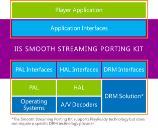

<properties 
	pageTitle="授权 Microsoft® 平滑流式处理客户端移植工具包" 
	description="了解如何为 Microsoft® 平滑流式处理客户端移植工具包授权。" 
	services="media-services" 
	documentationCenter="" 
	authors="xpouyat,vsood" 
	manager="erikre" 
	editor=""/>

<tags 
	ms.service="media-services" 
	ms.workload="media" 
	ms.tgt_pltfrm="na" 
	ms.devlang="na" 
	ms.topic="article" 
	ms.date="09/06/2016" 
	wacn.date="12/26/2016"  
	ms.author="xpouyat"/>

#授权 Microsoft® 平滑流式处理客户端移植工具包

##概述

Microsoft 平滑流式处理客户端移植工具包（简称 **SSPK**）是经过优化的平滑流式处理客户端实现，可帮助嵌入式设备制造商、有线和移动运营商、内容服务提供商、手持设备制造商、独立软件供应商 (ISV) 和解决方案提供商创建产品和服务，用于流式处理平滑流式处理格式的自适应流式处理内容。SSPK 是平滑流式处理客户端的与设备和平台无关的实现，许可接受方可将它移植到任何设备和平台。

下面是一个高级体系结构。IIS 平滑流式处理移植工具包框是 Microsoft 提供的平滑流式处理客户端实现，包含用于播放平滑流式处理内容的所有核心逻辑。特定设备或平台的合作伙伴可以通过实现相应接口移植该框。

##说明

经过授权的 SSPK 可以提供优异的商业价值。SSPK 许可证为行业提供：

- 采用 C++ 的平滑流式处理移植工具包源代码
  - 实现平滑流式处理客户端功能
  - 添加格式解析、启发、缓冲逻辑等
- 播放器应用程序 API
  -	可与媒体播放器应用程序交互的编程接口
- 平台抽象层 (PAL) 接口
  -	可与操作系统（线程、套接字）交互的编程接口
- 硬件抽象层 (HAL) 接口
  -	可与硬件 A/V 解码器（解码、绘制）交互的编程接口
- 数字权限管理 (DRM) 接口
  -	可通过 DRM 抽象层 (DAL) 处理 DRM 的编程接口
  -	Microsoft PlayReady 移植工具包单独发售，但可通过此接口集成。有关 Microsoft PlayReady 设备许可的详细信息，请单击[此处](http://www.microsoft.com/playready/licensing/device_technology.mspx#pddipdl)。
- 实现示例
  -	适用于 Linux 的 PAL 实现示例
  -	适用于 GStreamer 的 HAL 实现示例

##许可选项

Microsoft 平滑流式处理客户端移植工具包根据两份不同的许可协议提供给许可接受方：一份用于开发平滑流式处理客户端中期产品，另一份用于将平滑流式处理客户端最终产品分发给最终用户。
 
- 需要使用源代码移植工具包开发中期产品的芯片组制造商、系统集成商或独立软件供应商 (ISV) 应该执行 Microsoft 平滑流式处理客户端移植工具包**中期产品许可证**。
- 需要拥有对最终用户分发平滑流式处理客户端最终产品的权限的设备制造商或 ISV 应该执行 Microsoft 平滑流式处理客户端移植工具包**最终产品许可证**。

###Microsoft 平滑流式处理客户端移植工具包中期产品许可证

Microsoft 根据此许可证提供平滑流式处理客户端移植工具包和所需的知识产权，使客户能够开发平滑流式处理客户端中期产品并将其分发给其他可分发平滑流式处理客户端最终产品的平滑流式处理客户端移植工具包设备许可接受方。

####费用结构

支付 50,000 美元的一次性许可费即可访问平滑流式处理客户端移植工具包。

###Microsoft 平滑流式处理客户端移植工具包最终产品许可证

Microsoft 根据此许可证提供全部所需的知识产权，以便从其他平滑流式处理客户端移植工具包许可接受方接收平滑流式处理客户端中期产品，并将公司自有品牌的平滑流式处理客户端最终产品分发给最终用户。

####费用结构

平滑流式处理客户端最终产品根据如下所述的特许权使用费模式提供：

- 交付的每个设备实现支付 0.10 美元
- 每年的特许权使用费上限为 50,000 美元
- 每年的前 10,000 个设备实现无需支付特许权使用费

##Microsoft 平滑流式处理客户端中期产品协议许可接受方

- Adroit Business Solutions, Inc
- Advanced Digital Broadcast SA
- AirTies Kablosuz Iletism Sanayive Dis Ticaret A.S.
- Albis Technologies Ltd.
- Alticast Corporation
- Amazon Digital Services, Inc.
- AVC Multimedia Software Co., Ltd.
- Cavium, Inc.
- EchoStar Purchasing Corporation
- Enseo, Inc.
- Fluendo S.A.
- HANDAN BroadInfoCom Co., Ltd.
- Infomir GMBH
- Irdeto USA Inc.
- Liberty Global Services BV
- MediaTek Inc.
- MStar Co, Ltd
- Nintendo Co., Ltd.
- OpenTV, Inc.
- Saffron Digital Limited
- Sichuan Changhong Electric Co., Ltd
- SoftAtHome
- Sony Corporation
- Tatung Technology Inc.
- TCL Technoly Electronics (Huizhou) Co., Ltd.
- Vestel Elektronik Sanayi ve Ticaret A.S.
- VisualOn, Inc.
- ZTE Corporation

##Microsoft 平滑流式处理客户端最终产品协议许可接受方

- Advanced Digital Broadcast SA
- AirTies Kablosuz Iletism Sanayive Dis Ticaret A.S.
- Albis Technologies Ltd.
- Amazon Digital Services, Inc.
- AmTRAN Technology Co., Ltd.
- Arcadyan Technology Corporation
- ATMACA ELEKTRONİK SAN.VE TİC.A.Ş
- British Sky Broadcasting Limited
- CastPal Technology Inc., Shenzhen
- Compal Electronics, Inc.
- Dongguan Digital AV Technology Corp., Ltd.
- EchoStar Purchasing Corporation
- Enseo, Inc.
- Filmflex Movies Limited
- Fluendo S.A.
- Gibson Innovations Limited
- Haier Information Applicantion S.R.L
- HANDAN BroadInfoCom Co., Ltd.
- Homecast Co.,Ltd
- Hon Hai Precision Industry Co., Ltd.
- Infomir GMBH
- Kaonmedia Co., Ltd.
- KDDI Corporation
- Nintendo Co., Ltd.
- Orange SA
- Saffron Digital Limited
- Sagemcom Broadband SAS
- Shenzhen Coship Electronics CO., LTD
- Shenzhen Jiuzhou Electric Co.,Ltd
- Shenzhen Skyworth Digital Technology Co., Ltd
- Sichuan Changhong Electric Co., Ltd.
- Skardin Industrial Corp.
- Sky Deutschland Fernsehen GmbH & Co. KG
- SmarDTV S.A.
- SoftAtHome
- Sony Corporation
- TCL Overseas Marketing (Macao Commercial Offshore) Limited
- Technicolor Delivery Technologies, SAS
- Tongfang Global Ltd.
- Toshiba Lifestyle Products & Services Corporation
- Universal Media Corporation /Slovakia/ s.r.o.
- VIZIO, Inc.
- Wistron Corporation
- ZTE Corporation

<!---HONumber=Mooncake_Quality_Review_1215_2016-->