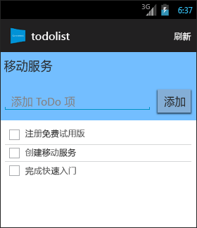

<properties 
	pageTitle="使用 Azure 移动服务开发 Android 应用程序入门" 
	description="遵照本教程开始使用 Azure 移动服务进行 Android 开发。" 
	services="mobile-services" 
	documentationCenter="android" 
	authors="RickSaling" 
	manager="erikre"
	editor=""/>

<tags 
	ms.service="mobile-services" 
	ms.date="03/05/2016"
	wacn.date="04/18/2016"/>

# 移动服务入门

[AZURE.INCLUDE [mobile-services-selector-get-started](../includes/mobile-services-selector-get-started.md)]

本教程说明如何使用 Azure 移动服务向 Android 应用程序添加基于云的后端服务。在本教程中，你将要创建一个新的移动服务，以及一个在新移动服务中存储应用程序数据的简单_待办事项列表_应用程序。要创建的移动服务将使用支持的 .NET 语言，你可以使用 Visual Studio 来提供服务器端业务逻辑和管理移动服务。若要创建允许以 JavaScript 编写服务器端业务逻辑的移动服务，请参阅本主题的 [JavaScript 后端版本](/documentation/articles/mobile-services-android-get-started/)。

以下是完成的应用程序的屏幕快照：

完成本教程需要你安装 [Android 开发人员工具][Android Studio]，其中包含 Android Studio 集成开发环境和最新的 Android 平台。需要使用 Android 4.2 或更高版本。

下载的快速入门项目包含适用于 Android 的移动服务 SDK。

> [AZURE.IMPORTANT]若要完成本教程，你需要一个 Azure 帐户。如果你没有帐户，可以注册 Azure 试用版并取得多达 10 个移动服务，即使在试用期结束之后仍可继续使用这些服务。有关详细信息，请参阅 [Azure 试用](/pricing/1rmb-trial/)。

## 创建新的移动服务

[AZURE.INCLUDE [mobile-services-dotnet-backend-create-new-service](../includes/mobile-services-dotnet-backend-create-new-service.md)]

## 将移动服务下载到本地计算机

在创建移动服务后，请下载可在本地计算机或虚拟机上运行的个性化移动服务项目。

1. 单击刚刚创建的移动服务，在快速入门选项卡中单击“选择平台”下的“Android”，然后展开“创建新的 Android 应用程序”。

	![][1]

2. 如果你尚未安装 Visual Studio，请下载和安装 [Visual Studio Professional 2013](https://go.microsoft.com/fwLink/p/?LinkID=391934) 或更高版本。

3. 在步骤 2 中，在“下载你的服务并将其发布到云”下面单击“下载”。

	这样可以下载实现你的移动服务的 Visual Studio 项目。将压缩的项目文件保存到本地计算机，并记下保存位置。

## 测试移动服务

[AZURE.INCLUDE [mobile-services-dotnet-backend-test-local-service](../includes/mobile-services-dotnet-backend-test-local-service.md)]

## 发布移动服务

[AZURE.INCLUDE [mobile-services-dotnet-backend-publish-service](../includes/mobile-services-dotnet-backend-publish-service.md)]

## 创建新的 Android 应用程序

在本部分中，你将要创建一个连接到移动服务的新的 Android 应用程序。

1. 在 [Azure 经典门户]中单击“移动服务”，然后单击你刚刚创建的移动服务。

2. 在快速入门选项卡中，单击“选择平台”下的“Android”，然后展开“创建新的 Android 应用程序”。
 
	![][2]

3. 在本地计算机或虚拟机上下载并安装 [Android 开发人员工具][Android SDK]（如果尚未这么做）。

4. 在“下载并运行应用程序”下面单击“下载”。

  	随即将会下载已连接到移动服务的示例“待办事项列表”应用程序的项目。将压缩的项目文件保存到本地计算机，并记下保存位置。

## 运行 Android 应用程序

[AZURE.INCLUDE [mobile-services-run-your-app](../includes/mobile-services-android-get-started.md)]

## 后续步骤
完成快速入门后，请了解如何在移动服务中执行其他重要任务：

* [向应用添加身份验证]
   了解如何将后端数据的访问权限限制为应用的特定注册用户。

* [移动服务 .NET 后端故障排除]
 了解如何诊断和修复移动服务 .NET 后端可能会出现的问题。

<!-- Anchors. -->
[Getting started with Mobile Services]: #getting-started
[Create a new mobile service]: #create-new-service
[Define the mobile service instance]: #define-mobile-service-instance
[Next Steps]: #next-steps

<!-- Images. -->

[0]: ./media/mobile-services-dotnet-backend-android-get-started/mobile-quickstart-completed-android.png
[1]: ./media/mobile-services-dotnet-backend-android-get-started/mobile-quickstart-steps-vs-AS.png
[2]: ./media/mobile-services-dotnet-backend-android-get-started/mobile-quickstart-steps-android-AS.png

[6]: ./media/mobile-services-dotnet-backend-android-get-started/mobile-portal-quickstart-android.png
[7]: ./media/mobile-services-dotnet-backend-android-get-started/mobile-quickstart-steps-android.png
[8]: ./media/mobile-services-dotnet-backend-android-get-started/mobile-eclipse-quickstart.png

[10]: ./media/mobile-services-dotnet-backend-android-get-started/mobile-quickstart-startup-android.png
[11]: ./media/mobile-services-dotnet-backend-android-get-started/mobile-data-tab.png
[12]: ./media/mobile-services-dotnet-backend-android-get-started/mobile-data-browse.png

[14]: ./media/mobile-services-dotnet-backend-android-get-started/mobile-services-import-android-workspace.png
[15]: ./media/mobile-services-dotnet-backend-android-get-started/mobile-services-import-android-project.png

<!-- URLs. -->
[Get started (Eclipse)]: /documentation/articles/mobile-services-dotnet-backend-android-get-started-ec/

[向应用添加身份验证]: /documentation/articles/mobile-services-dotnet-backend-android-get-started-auth/
[Android SDK]: https://go.microsoft.com/fwLink/p/?LinkID=280125
[Android Studio]: https://developer.android.com/sdk/index.html
[Mobile Services Android SDK]: https://go.microsoft.com/fwLink/p/?LinkID=266533
[移动服务 .NET 后端故障排除]: /documentation/articles/mobile-services-dotnet-backend-how-to-troubleshoot/

[Azure 经典门户]: https://manage.windowsazure.cn/

<!---HONumber=Mooncake_0118_2016-->