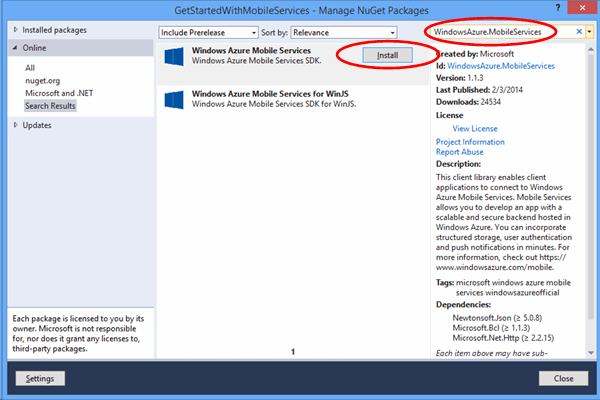
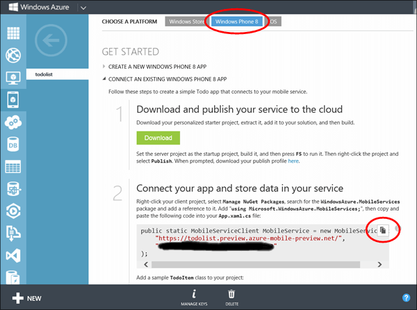
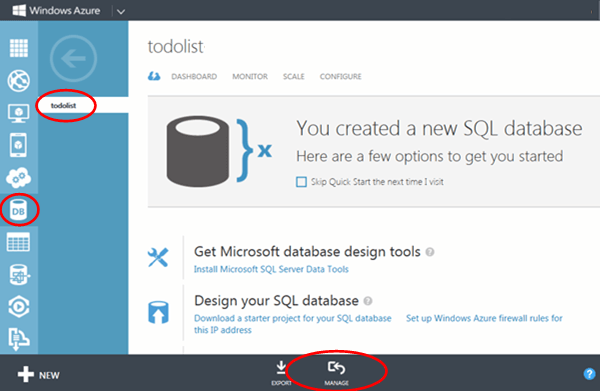

<properties 
	pageTitle="将移动服务添加到现有应用程序 (Windows Phone) | 移动开发人员中心" 
	description="了解如何开始使用移动服务来利用 Windows Phone 应用程序中的数据。" 
	services="mobile-services" 
	documentationCenter="windows" 
	authors="wesmc7777" 
	manager="dwrede" 
	editor=""/>

<tags 
	ms.service="mobile-services" 
	ms.date="08/18/2015" 
	wacn.date="10/03/2015"/>

# 将移动服务添加到现有应用程序

##概述

[AZURE.INCLUDE [mobile-services-selector-get-started-data-legacy](../includes/mobile-services-selector-get-started-data-legacy.md)]

本主题说明如何将 Azure 移动服务添加为 Windows Phone 8.1 Silverlight 应用程序的后端数据源。在本教程中，你将要为某个应用程序（该应用程序在内存中存储数据）下载一个 Visual Studio 项目，创建一个新的移动服务，将该移动服务与该应用程序相集成，并查看运行该应用程序时对数据所做的更改。若要将移动服务添加到 Windows Phone 应用商店 8.1 应用程序，请参阅[此教程版本](/documentation/articles/mobile-services-dotnet-backend-windows-universal-dotnet-get-started-data)。

在本教程中创建的移动服务支持移动服务中的 .NET 运行时。这样，你便可以将 .NET 语言和 Visual Studio 用于移动服务中的服务器端业务逻辑。若要创建允许以 JavaScript 编写服务器端业务逻辑的移动服务，请参阅本主题的 [JavaScript 后端版本](/documentation/articles/mobile-services-windows-phone-get-started-data)。

##先决条件

本教程需要的内容如下：

+ Visual Studio 2013 Update 2 或更高版本。
+ 一个 Windows Azure 帐户。如果你没有帐户，可以创建一个试用帐户，只需几分钟即可完成。有关详细信息，请参阅 <a href="http://www.windowsazure.cn/pricing/1rmb-trial/">Azure 试用</a>。 

##下载 GetStartedWithData 项目

本教程是在 [GetStartedWithMobileServices](https://code.msdn.microsoft.com/Add-Azure-Mobile-to-a-8b906f72) 应用程序的基础上制作的，该应用程序是适用于 Visual Studio 2013 的 Windows Phone Silverlight 8.1 应用程序项目。

1. 从[开发人员代码示例站点](https://code.msdn.microsoft.com/Add-Azure-Mobile-to-a-8b906f72)下载 GetStartedWithMobileServices 示例应用程序的 C# 版本。 

	>[AZURE.NOTE]若要创建 Windows Phone Silverlght 8.1 应用程序，只需在下载的 Windows Phone Silverlight 8 应用程序项目中将目标操作系统更改为 Windows Phone 8.1。若要创建 Windows Phone 应用商店应用程序，请下载 GetStartedWithData 示例应用程序项目的 [Windows Phone 应用商店应用程序版本](http://go.microsoft.com/fwlink/p/?LinkId=397372)。

2. 右键单击 Visual Studio，然后单击“以管理员身份运行”，以使用管理权限运行 Visual Studio。

3. 在 Visual Studio 中打开下载的项目，然后检查 MainPage.xaml.cs 文件。

   	请注意，添加的 **TodoItem** 对象存储在内存中的 **ObservableCollection&lt;TodoItem&gt;** 内。

4. 在 Visual Studio 中，选择应用程序的部署目标。你可以部署到 Windows Phone 设备，或者 Windows Phone SDK 随附的模拟器之一。在本教程中，我们将演示如何部署到模拟器。

5. 按 **F5** 键。随后将生成、部署并启动应用程序以进行调试。

6. 在应用程序中的文本框内键入一些文本，然后单击“保存”以便在内存中保存该应用程序的一些项。

   	

   	请注意每个 `TodoItem` 的文本显示在刷新按钮的下面，另外还提供了一个复选框，让你将项标记为已完成。

##创建新的移动服务

[AZURE.INCLUDE [mobile-services-dotnet-backend-create-new-service](../includes/mobile-services-dotnet-backend-create-new-service.md)]

##下载移动服务项目并将其添加到解决方案

1. 如果你尚未安装 Visual Studio，请下载和安装 [Visual Studio Professional 2013](https://go.microsoft.com/fwLink/p/?LinkID=391934) 或更高版本。

2. 在 [Azure 管理门户](https://manage.windowsazure.cn/)中，单击新建的移动服务，在快速启动页中单击“Windows”平台，然后在“开始”下，展开“连接现有的 Windows 或 Windows Phone 应用程序”。

    

3. 在“下载你的服务并将其发布到云”下，单击“下载”。

	这样可以下载实现你的移动服务的 Visual Studio 项目。

4. 解压缩你下载的个性化服务初学者解决方案，将 zip 文件中的文件夹复制到“数据处理入门”解决方案文件 (.sln) 所在的同一个 **C#** 目录中。这样可以方便 NuGet 包管理器将所有程序包保持同步。

5. 在 Visual Studio 的解决方案资源管理器中，右键单击“数据处理入门”Windows 应用商店应用程序对应的解决方案。单击“添加”，然后单击“现有项目”。

6. 在“添加现有项目”对话框中，导航到你已移到 **C#** 目录中的移动服务项目文件夹，在服务子目录中选择 C# 项目文件 (.csproj)，然后单击“打开”将该项目添加到你的解决方案。

7. 在 Visual Studio 的解决方案资源管理器中，右键单击你刚添加的服务项目，然后单击“生成”以验证该项目是否能够生成且不出错。在生成期间，NuGet 包管理器可能需要还原项目中引用的某些 NuGet 包。

8. 再次右键单击该服务项目。这一次请单击“调试”上下文菜单下的“启动新实例”。

    Visual Studio 将打开服务的默认网页。你可以单击“立即尝试”以从默认网页测试移动服务中的方法。

    

    默认情况下，Visual Studio 在 IIS Express 本地托管你的移动服务。在任务栏中右键单击 IIS Express 的任务栏图标即可看到此信息。

##更新 Windows Phone 应用程序以使用移动服务

在本部分中，你将要更新 Windows Phone 应用程序，以将移动服务用作应用程序的后端服务。

1. 在 Visual Studio 的解决方案资源管理器中，右键单击 Windows Phone 应用程序项目，然后单击“管理 NuGet 包”。

2. 在“管理 NuGet 包”对话框中，搜索联机包集合中的 **WindowsAzure.MobileServices**，并单击它以安装 Azure 移动服务 Nuget 包。然后关闭该对话框。

    

3. 返回到 Azure 管理门户，找到标签为“连接你的应用程序并存储服务中的数据”的步骤。复制用于创建 `MobileServiceClient` 连接的代码段。

    

4. 在 Visual Studio 中，打开 App.xaml.cs。粘贴位于 `App` 类定义开头的代码段。另外，请将以下 `using` 语句添加到该文件的顶部，然后保存该文件。

		using Microsoft.WindowsAzure.MobileServices;

5. 在 Visual Studio 中打开 MainPage.xaml.cs，然后在该文件的顶部添加以下 using 语句：

		using Microsoft.WindowsAzure.MobileServices;

6. 在 Visual Studio 中的 MainPage.xaml.cs 内，将 `MainPage` 类定义替换为以下定义，然后保存该文件。

    此代码借助移动服务 SDK 使应用程序将其数据存储在服务提供的表中，而不是本地存储在内存中。三个主要方法为 `InsertTodoItem`、`RefreshTodoItems` 和 `UpdateCheckedTodoItem`。通过这三个方法，你可以在 Azure 中的表内异步插入、查询和更新数据集合。

        public sealed partial class MainPage : PhoneApplicationPage
        {
            private MobileServiceCollection<TodoItem, TodoItem> items;
            private IMobileServiceTable<TodoItem> todoTable = 
                App.MobileService.GetTable<TodoItem>();            
            public MainPage()
            {
                this.InitializeComponent();
            }
            private async void InsertTodoItem(TodoItem todoItem)
            {
                await todoTable.InsertAsync(todoItem); 
                items.Add(todoItem);
            }
            private async void RefreshTodoItems()
            {
                items = await todoTable 
                    .ToCollectionAsync(); 
                ListItems.ItemsSource = items;
            }
            private async void UpdateCheckedTodoItem(TodoItem item)
            {
                await todoTable.UpdateAsync(item);      
            }
            private void ButtonRefresh_Click(object sender, RoutedEventArgs e)
            {
                RefreshTodoItems();
            }
            private void ButtonSave_Click(object sender, RoutedEventArgs e)
            {
                var todoItem = new TodoItem { Text = InputText.Text };
                InsertTodoItem(todoItem);
            }
            private void CheckBoxComplete_Checked(object sender, RoutedEventArgs e)
            {
                CheckBox cb = (CheckBox)sender;
                TodoItem item = cb.DataContext as TodoItem;
                item.Complete = (bool)cb.IsChecked;
                UpdateCheckedTodoItem(item);
            }
            protected override void OnNavigatedTo(NavigationEventArgs e)
            {
                RefreshTodoItems();
            }
        }

##针对本地托管的服务测试 Windows Phone 应用程序</h2>

在本部分中，你将要使用 Visual Studio 来测试位于开发工作站本地的应用程序和移动服务。若要从 Windows Phone 设备或者某个 Windows Phone 模拟器测试 IIS Express 本地托管的移动服务，你必须配置 IIS Express 和工作站，以允许与工作站的 IP 地址和端口建立连接。Windows Phone 设备和模拟器以非本地网络客户端的形式建立连接。

#### 配置 IIS Express 以允许建立远程连接

[AZURE.INCLUDE [mobile-services-how-to-configure-iis-express](../includes/mobile-services-how-to-configure-iis-express.md)]

#### 针对 IIS Express 中的移动服务测试应用程序

1. 在 Visual Studio 中打开 App.xaml.cs 文件，并注释掉你最近粘贴到该文件中的 `MobileService` 定义。添加新定义，以根据你在工作站上配置的 IP 地址和端口建立连接。然后保存该文件。你的代码应类似于...

        public static MobileServiceClient MobileService = new MobileServiceClient(
            "http://192.168.111.11:54321");

        //public static MobileServiceClient MobileService = new MobileServiceClient(
        //    "https://todolist.azure-mobile.net/",
        //    "XXXXXXXXXXXXXXXXXXXXXXXXXXXXXXXX"
        //);        

2. 在 Visual Studio 中，按 F7 键或者在“生成”菜单中单击“生成解决方案”，以同时生成 Windows Phone 应用程序和移动服务。在 Visual Studio 的输出窗口中确认是否已生成这两个项目且未出错

3. 在 Visual Studio 中，按 F5 键或者在“调试”菜单中单击“启动调试”，以运行应用程序并将移动服务托管在 IIS Express 本地。

    >[AZURE.NOTE]确保使用“以管理员身份运行”选项运行 Visual Studio。否则，IIS Express 可能不会加载 applicationhost.config 发生的更改。

4. 输入新 todoitem 的文本。然后单击“保存”。这样便会在 IIS Express 本地托管的移动服务所创建的数据库中插入一个新的 todoItem。单击某个项对应的复选框可将它标记为已完成。

5. 在 Visual Studio 中停止调试应用程序。打开服务器资源管理器并展开“数据连接”即可查看针对后端服务创建的数据库中的更改。右键单击“MS\_TableConnectionString”下的 TodoItems 表，然后单击“显示表数据”

    

6. 测试完本地托管的移动服务后，请删除你创建的、用于打开工作站上端口的 Windows 防火墙规则。

##将移动服务发布到 Azure

[AZURE.INCLUDE [mobile-services-dotnet-backend-publish-service](../includes/mobile-services-dotnet-backend-publish-service.md)]

##测试已发布到 Azure 的移动服务

1. 在 Visual Studio 中，打开 App.xaml.cs。注释掉功能如下的代码：创建与本地托管移动服务建立连接的 `MobileServiceClient`。取消注释功能如下的代码：创建与 Azure 中的服务建立连接的 `MobileServiceClient`。保存对该文件所做的更改。

        sealed partial class App : Application
        {
            //public static MobileServiceClient MobileService = new MobileServiceClient(
            //          "http://192.168.111.11:54321");

            // Use this constructor instead after publishing to the cloud
            public static MobileServiceClient MobileService = new MobileServiceClient(
                 "https://todolist.azure-mobile.net/",
                 "XXXXXXXXXXXXXXXXXXXXXXXXXXXXXXXX"
            );        
            ....

2. 在 Visual Studio 中，按 F5 键或者在“调试”菜单中单击“启动调试”。这样，便会使用运行应用程序之前发生的更改重新生成应用程序，以连接到 Azure 中远程托管的移动服务。

3. 输入一些新的 todoitem，然后单击“保存”以保存每个 todoitem。单击复选框以完成其中的某些新项。每个新的 todoItem 将在你前面通过 Azure 管理门户为移动服务配置的 SQL 数据库中存储并更新。

    您可以重新启动此应用，以查看更改是否已持久保存在 Azure 中的数据库内。你还可以使用 Azure 管理门户或者 Visual Studio 的 SQL Server 对象资源管理器来检查数据库。后面两个步骤将使用 Azure 管理门户来查看数据库中的更改。

4. 在 Azure 管理门户中，单击与移动服务关联的数据库对应的“管理”。

    

5. 在管理门户中，执行一个查询以查看应用程序所做的更改。你的查询应类似于以下查询，不过，请使用你的数据库名称而不是 `todolist`。

        SELECT * FROM [todolist].[todoitems]

    

**数据处理入门**教程到此结束。

##后续步骤

本教程所述的基础知识演示了如何使 Windows Phone 8 应用程序处理使用 .Net 运行时生成的移动服务中的数据。接下来，请试着学习下列教程之一：

* [身份验证入门] 了解如何对应用程序用户进行身份验证。

* 向应用程序添加推送通知 了解如何向应用程序发送一条很基本的推送通知。

* [移动服务 .NET 操作方法概念性参考] 了解有关如何将移动服务与 .NET 一起使用的详细信息。
  

<!-- Images. -->

<!-- URLs. -->
[Get started with Mobile Services]: /documentation/articles/mobile-services-dotnet-backend-windows-phone-get-started
[Get started with data]: /documentation/articles/mobile-services-dotnet-backend-windows-phone-get-started-data
[身份验证入门]: /documentation/articles/mobile-services-dotnet-backend-windows-phone-get-started-users
[Get started with push notifications]: /documentation/articles/mobile-services-dotnet-backend-windows-phone-get-started-push
[Windows Phone 8 SDK]: http://go.microsoft.com/fwlink/p/?linkid=268374
[Azure Management Portal]: https://manage.windowsazure.cn/
[Management Portal]: https://manage.windowsazure.cn/
[Mobile Services SDK]: http://go.microsoft.com/fwlink/p/?LinkId=257545
[Developer Code Samples site]: https://code.msdn.microsoft.com/Add-Azure-Mobile-to-a-8b906f72
[移动服务 .NET 操作方法概念性参考]: /documentation/articles/mobile-services-windows-dotnet-how-to-use-client-library
[MobileServiceClient class]: http://go.microsoft.com/fwlink/p/?LinkId=302030
[How to add a new Windows Firewall port rule]: http://go.microsoft.com/fwlink/?LinkId=392240
  

<!---HONumber=71-->