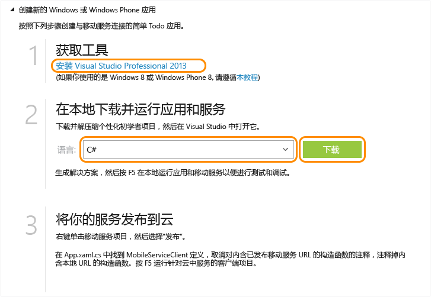

<properties
	pageTitle="适用于 Windows 通用应用的移动服务入门 | Azure"
	description="遵照本教程开始使用 Azure 移动服务以 C# 语言进行通用 Windows 应用程序开发。"
	services="mobile-services"
	documentationCenter="windows"
	authors="ggailey777"
	manager="erikre"
	editor=""/>

<tags 
	ms.service="mobile-services" 
	ms.date="05/11/2016"
	wacn.date="06/13/2016"/>

# 移动服务入门

[AZURE.INCLUDE [mobile-services-selector-get-started](../includes/mobile-services-selector-get-started.md)]

本教程说明如何使用 Azure 移动服务向通用 Windows 应用程序添加基于云的后端服务。通用 Windows 应用程序解决方案包括 Windows 应用商店 8.1 和 Windows Phone 应用商店 8.1 应用程序的项目，以及常见的共享项目。有关详细信息，请参阅[生成面向 Windows 和 Windows Phone 的通用 Windows 应用程序](http://msdn.microsoft.com/library/windows/apps/xaml/dn609832.aspx)。

在本教程中，你将要创建一个新的移动服务，以及一个在新移动服务中存储应用程序数据的简单*待办事项列表*应用程序。要创建的移动服务将使用支持的 .NET 语言，你可以使用 Visual Studio 来提供服务器端业务逻辑和管理移动服务。若要创建允许以 JavaScript 编写服务器端业务逻辑的移动服务，请参阅本主题中的 JavaScript 后端版本。

>[AZURE.NOTE]本主题说明如何使用 Azure 经典门户创建新的移动服务项目和通用 Windows 应用。通过使用 Visual Studio 2013 Update 3，还可以向现有的 Visual Studio 解决方案添加新的移动服务项目。有关详细信息，请参阅[将移动服务添加到现有应用程序](/documentation/articles/mobile-services-dotnet-backend-windows-universal-dotnet-get-started-data/)。

>若要将移动服务添加到 Windows Phone 8.0 或 Windows Phone Silverlight 8.1 应用程序项目，请参阅[将移动服务添加到现有的 Windows Phone 应用程序](/documentation/articles/mobile-services-windows-phone-get-started-data/)。
[AZURE.INCLUDE [mobile-services-windows-universal-get-started](../includes/mobile-services-windows-universal-get-started.md)]

若要完成本教程，您需要以下各项：

* 有效的 Azure 帐户。如果你没有帐户，可以注册 Azure 试用版并取得多达 10 个免费的移动服务，即使在试用期结束之后仍可继续使用这些服务。有关详细信息，请参阅 [Azure 试用](/pricing/1rmb-trial/)。
* [Visual Studio 2013]。 

## 创建新的移动服务

[AZURE.INCLUDE [mobile-services-dotnet-backend-create-new-service](../includes/mobile-services-dotnet-backend-create-new-service.md)]

## 创建新的通用 Windows 应用程序

创建移动服务后，你可以在 Azure 经典门户中遵照一个简易的快速入门项目来创建新应用程序或修改现有应用程序，以连接到你的移动服务。

在本部分中，你将要创建一个连接到移动服务的新的通用 Windows 应用程序。

1. 在 [Azure 经典门户]中单击“移动服务”，然后单击你刚刚创建的移动服务。

2.  在快速入门选项卡中，单击“选择平台”下的“Windows”，然后展开“创建新的 Windows 应用商店应用程序” 。

   	此时将显示三个简单步骤，描述如何创建与移动服务连接的 Windows 应用商店应用程序。

  	

3. 在本地计算机或虚拟机上下载并安装 [Visual Studio 2013]（如果尚未这么做）。

4.  在“下载并在本地运行应用程序和服务”下面，选择 Windows 应用商店应用程序的语言，然后单击“下载” 。

  	随即将会下载一个解决方案，其中包含移动服务的项目，以及已连接到移动服务的示例_待办事项列表_应用程序的项目。将压缩的项目文件保存到本地计算机，并记下保存位置。

## 针对本地移动服务测试应用程序

[AZURE.INCLUDE [mobile-services-dotnet-backend-test-local-service-dotnet](../includes/mobile-services-dotnet-backend-test-local-service-dotnet.md)]

>[AZURE.NOTE]你可以查看访问你的移动服务以查询和插入数据的代码，这些代码在 MainPage.xaml.cs 文件中。

## 发布移动服务

[AZURE.INCLUDE [mobile-services-dotnet-backend-publish-service](../includes/mobile-services-dotnet-backend-publish-service.md)]

<ol start="4">
<li>
在共享代码项目中，打开 App.xaml.cs 文件，找到创建 <a href="http://msdn.microsoft.com/zh-cn/library/Windowsazure/microsoft.windowsazure.mobileservices.mobileserviceclient.aspx" target="_blank">MobileServiceClient</a> 实例的代码，注释掉使用 <em>localhost</em> 创建此客户端的代码，然后取消注释使用如下所示远程移动服务 URL 创建客户端的代码：

        <pre><code>public static MobileServiceClient MobileService = new MobileServiceClient(
            "https://todolist.azure-mobile.net/",
            "XXXX-APPLICATION-KEY-XXXXX");</code></pre>

	
现在，客户端将会访问已发布到 Azure 的移动服务。
</li>
</ol>

## 针对 Azure 中托管的移动服务测试应用程序

发布移动服务并将客户端连接到 Azure 中托管的远程移动服务后，我们可以使用 Azure 作为项存储来运行应用程序。

[AZURE.INCLUDE [mobile-services-windows-universal-test-app](../includes/mobile-services-windows-universal-test-app.md)]

## 后续步骤

完成快速入门后，请了解如何在移动服务中执行其他重要任务：

* [将移动服务添加到现有应用程序][Get started with data]
   了解有关使用移动服务存储和查询数据的详细信息。

* [脱机数据同步入门]
   了解如何使用脱机数据同步来使应用程序保持较高的响应能力和稳健性。

* [向移动服务应用程序添加身份验证][Get started with authentication]
   了解如何使用标识提供程序对应用程序的用户进行身份验证。

* [向应用程序添加推送通知][Get started with push notifications]
   了解如何向应用程序发送一条很基本的推送通知。

* [向移动服务应用程序添加身份验证][Get started with authentication]
 了解如何使用标识提供程序对应用程序的用户进行身份验证。

* [向应用程序添加推送通知][Get started with push notifications]
 了解如何向应用程序发送一条很基本的推送通知。

* [移动服务 .NET 后端故障排除]
 了解如何诊断和修复移动服务 .NET 后端可能会出现的问题。

有关通用 Windows 应用程序的详细信息，请参阅[通过单个移动服务支持多个设备平台](/documentation/articles/mobile-services-how-to-use-multiple-clients-single-service/#shared-vs)。

[AZURE.INCLUDE [app-service-disqus-feedback-slug](../includes/app-service-disqus-feedback-slug.md)]

<!-- Anchors. -->

<!-- Images. -->

<!-- URLs. -->
[Visual Studio 2013]: https://go.microsoft.com/fwLink/p/?LinkID=257546
[Get started with data]: /documentation/articles/mobile-services-dotnet-backend-windows-universal-dotnet-get-started-data/
[脱机数据同步入门]: /documentation/articles/mobile-services-windows-store-dotnet-get-started-offline-data/
[Get started with authentication]: /documentation/articles/mobile-services-dotnet-backend-windows-universal-dotnet-get-started-users/
[Get started with push notifications]: /documentation/articles/mobile-services-dotnet-backend-windows-universal-dotnet-get-started-push/
[Visual Studio Professional 2013]: https://go.microsoft.com/fwLink/p/?LinkID=257546
[Mobile Services SDK]: http://go.microsoft.com/fwlink/?LinkId=257545
[JavaScript and HTML]: documentation/articles/mobile-services-win8-javascript/
[Azure 经典门户]: https://manage.windowsazure.cn/
[移动服务 .NET 后端故障排除]: /documentation/articles/mobile-services-dotnet-backend-how-to-troubleshoot/

<!---HONumber=Mooncake_0118_2016-->