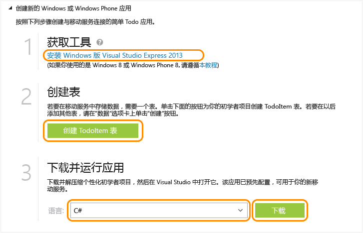

<properties
	pageTitle="适用于 Windows 应用商店应用的移动服务入门 (C#) | Microsoft Azure"
	description="按照本教程开始使用 Azure 移动服务通过 C# 进行 Windows 应用商店开发。"
	services="mobile-services"
	documentationCenter="windows"
	authors="ggailey777"
	manager="dwrede"
	editor=""/>

<tags
	ms.service="mobile-services"
	ms.date="05/11/2016"
	wacn.date="06/13/2016"/>

# 移动服务入门

[AZURE.INCLUDE [mobile-services-selector-get-started](../includes/mobile-services-selector-get-started.md)]

本教程说明如何使用 Azure 移动服务向通用 Windows 应用程序添加基于云的后端服务。通用 Windows 应用程序解决方案包括 Windows 应用商店 8.1 和 Windows Phone 应用商店 8.1 应用程序的项目，以及常见的共享项目。有关详细信息，请参阅[生成面向 Windows 和 Windows Phone 的通用 Windows 应用程序](http://msdn.microsoft.com/library/windows/apps/xaml/dn609832.aspx)。

在本教程中，你将要创建一个新的移动服务，以及一个在新移动服务中存储应用程序数据的简单待办事项列表应用程序。要创建的移动服务将为服务器端业务逻辑使用 JavaScript。若要创建允许你使用 Visual Studio 以受支持 .NET 语言编写服务器端业务逻辑的移动服务，请参阅本主题中的 .NET 后端版本。

[AZURE.INCLUDE [mobile-services-windows-universal-get-started](../includes/mobile-services-windows-universal-get-started.md)]

若要完成本教程，您需要以下各项：

* 有效的 Azure 帐户。如果你没有帐户，可以注册 Azure 试用版并取得多达 10 个免费的移动服务，即使在试用期结束之后仍可继续使用这些服务。有关详细信息，请参阅 [Azure 试用](/pricing/1rmb-trial)。
* [Visual Studio 2013 Express for Windows] 

## 创建新的移动服务

[AZURE.INCLUDE [mobile-services-create-new-service](../includes/mobile-services-create-new-service.md)]

## 创建新的通用 Windows 应用程序

创建移动服务后，你可以在 Azure 经典门户中遵照一个简易的快速入门项目来创建新的通用 Windows 应用程序，或修改现有 Windows 应用商店或 Windows Phone 应用程序项目，以连接到你的移动服务。

在本部分中，你将要创建一个连接到移动服务的新的通用 Windows 应用程序。

1.  在 [Azure 经典门户]中单击“移动服务”，然后单击你刚刚创建的移动服务。

   
2. 在快速入门选项卡中，单击“选择平台”下的“Windows”，然后展开“创建新的 Windows 应用商店应用程序”。

   	此时将显示三个简单步骤，描述如何创建与移动服务连接的 Windows 应用商店应用程序。

  	

3. 在本地计算机或虚拟机上下载并安装 [Visual Studio 2013 Express for Windows]（如果尚未这么做）。

4. 单击“创建 TodoItem 表”以创建用于存储应用程序数据的表。

5. 在“下载并运行应用”下，选择应用的语言，然后单击“下载”。

  	随即将会下载已连接到移动服务的示例待办事项列表应用程序的项目。将压缩的项目文件保存到本地计算机，并记下保存位置。

## 运行 Windows 应用程序

[AZURE.INCLUDE [mobile-services-javascript-backend-run-app](../includes/mobile-services-javascript-backend-run-app.md)]

>[AZURE.NOTE]你可以查看访问你的移动服务以查询和插入数据的代码，这些代码在 MainPage.xaml.cs 文件中。

## 后续步骤
完成快速入门后，请了解如何在移动服务中执行其他重要任务：

* [脱机数据同步入门]  
  了解如何使用脱机数据同步来使应用程序保持较高的响应能力和稳健性。

* [向移动服务应用程序添加身份验证][Get started with authentication]  
  了解如何使用标识提供者对应用程序的用户进行身份验证。

* [向应用添加推送通知][Get started with push notifications]  
  了解如何向应用发送一条很基本的推送通知。

* [如何使用 .NET 客户端库](/documentation/articles/mobile-services-dotnet-how-to-use-client-library/)  
 了解如何查询移动服务、处理数据和访问自定义 API。

[AZURE.INCLUDE [app-service-disqus-feedback-slug](../includes/app-service-disqus-feedback-slug.md)]

<!-- Anchors. -->
[Getting started with Mobile Services]: #getting-started
[Create a new mobile service]: #create-new-service
[Define the mobile service instance]: #define-mobile-service-instance
[Next Steps]: #next-steps

<!-- Images. -->

<!-- URLs. -->

[脱机数据同步入门]: /documentation/articles/mobile-services-windows-store-dotnet-get-started-offline-data/
[Get started with authentication]: /documentation/articles/mobile-services-javascript-backend-windows-universal-dotnet-get-started-users/
[Get started with push notifications]: /documentation/articles/mobile-services-javascript-backend-windows-universal-dotnet-get-started-push/
[Visual Studio 2013 Express for Windows]: http://go.microsoft.com/fwlink/?LinkId=257546
[Mobile Services SDK]: http://go.microsoft.com/fwlink/?LinkId=257545
[Azure 经典门户]: https://manage.windowsazure.cn/
 

<!---HONumber=Mooncake_0118_2016-->