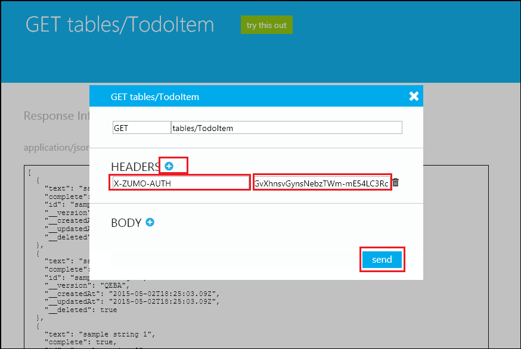
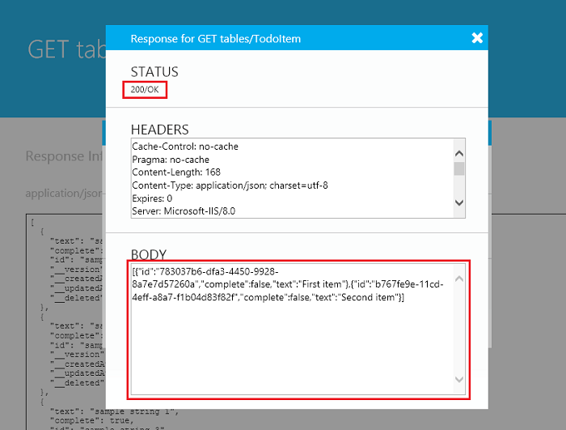

<properties
	pageTitle="自定义身份验证入门 | Azure"
	description="了解如何使用用户名和密码对用户进行身份验证。"
	documentationCenter="Mobile"
	authors="mattchenderson"
	manager="dwrede"
	editor=""
	services="mobile-services"/>

<tags 
	ms.service="mobile-services" 
	ms.date="02/07/2016"
	wacn.date="04/18/2016"/>

# 自定义身份验证入门

## 概述
本主题说明如何通过颁发自己的移动服务身份验证令牌，对 Azure 移动服务 .NET 后端中的用户进行身份验证。在本教程中，你将使用应用程序的自定义用户名和密码向快速入门项目添加身份验证。

>[AZURE.NOTE]本教程演示了使用自定义凭据对移动服务进行身份验证的高级方法。许多应用程序最好是改用内置的社交标识提供程序，以便让用户通过 Microsoft 帐户和 Azure Active Directory 登录。如果你这是第一次体验移动服务中的身份验证，请参阅[向应用程序添加身份验证]教程。

本教程基于移动服务快速入门。此外，还必须先完成[移动服务入门]教程。

>[AZURE.IMPORTANT]本教程旨在说明如何颁发移动服务的身份验证令牌。请不要将其视为安全指导原则。在开发应用程序时，你必须留意密码存储的安全问题，并且需要制定暴力破解攻击的管理策略。

## 设置帐户表

由于你使用自定义身份验证，且未依赖其他标识提供程序，因此需要存储用户的登录信息。在本部分中，你将为帐户创建一个表，并设置基本的安全性机制。帐户表包含用户名和加盐哈希密码，你也可以视需要加入其他用户信息。

1. 在后端项目的 **DataObjects** 数据夹中，创建名为 `Account` 的新实体。

2. 添加以下 `using` 语句：

		using Microsoft.WindowsAzure.Mobile.Service;  

3. 将类定义替换为以下代码：

            public class Account : EntityData
            {
                public string Username { get; set; }
                public byte[] Salt { get; set; }
                public byte[] SaltedAndHashedPassword { get; set; }
            }
    
    这样，我们的新帐户表中将会显示一行，其中包含用户名、该用户的盐以及安全存储的密码。

4. 在 **Models** 文件夹下，你将会看到与移动服务同名的 **DbContext** 派生类。请打开你的内容并添加以下代码，将帐户表添加到数据模型：

        public DbSet<Account> Accounts { get; set; }

	>[AZURE.NOTE]本教程中的代码段使用 `todoContext` 作为上下文名称。你必须更新项目上下文的代码段。 
        &nbsp;
	接下来，请设置安全功能以处理此数据。
 
5. 创建名为 `CustomLoginProviderUtils` 的类，然后添加以下 `using` 语句：

		using System.Security.Cryptography;

6. 将以下代码方法添加到新类：

        public static byte[] hash(string plaintext, byte[] salt)
        {
            SHA512Cng hashFunc = new SHA512Cng();
            byte[] plainBytes = System.Text.Encoding.ASCII.GetBytes(plaintext);
            byte[] toHash = new byte[plainBytes.Length + salt.Length];
            plainBytes.CopyTo(toHash,0);
            salt.CopyTo(toHash, plainBytes.Length);
            return hashFunc.ComputeHash(toHash);
        }

        public static byte[] generateSalt()
        {
            RNGCryptoServiceProvider rng = new RNGCryptoServiceProvider();
            byte[] salt = new byte[256];
            rng.GetBytes(salt);
            return salt;
        }

        public static bool slowEquals(byte[] a, byte[] b)
        {
            int diff = a.Length ^ b.Length;
            for (int i = 0; i < a.Length && i < b.Length; i++)
            {
                diff |= a[i] ^ b[i];
            }
            return diff == 0;
        }

	这样，便会生成新的长格式盐，添加用于哈希处理加盐密码的功能，以及比较两个哈希代码的安全方式。

## 创建注册终结点

此时，创建用户帐户的各项准备都已完成。在本部分中，你将设置注册终结点以处理新的注册请求。你将在此处强制实施新的用户名和密码策略，并确保用户名不会盗用。然后，你要将用户信息安全存储在数据库中。

1. 创建以下新类用于表示传入的注册尝试：

        public class RegistrationRequest
        {
            public String username { get; set; }
            public String password { get; set; }
        }

    如果你要在注册期间收集和存储其他信息，应该在此处执行相应的操作。

2. 在移动服务后端项目中，右键单击“控制器”，单击“添加”和“控制器”，创建名为 `CustomRegistrationController` 的新“Microsoft Azure 移动服务自定义控制器”，然后添加以下 `using` 语句：

		using Microsoft.WindowsAzure.Mobile.Service.Security;
		using System.Text.RegularExpressions;
		using <my_project_namespace>.DataObjects;
		using <my_project_namespace>.Models;

	在以上代码中，将占位符替换为项目的命名空间。
 
3. 将类定义替换为以下代码：

        [AuthorizeLevel(AuthorizationLevel.Anonymous)]
        public class CustomRegistrationController : ApiController
        {
            public ApiServices Services { get; set; }

            // POST api/CustomRegistration
            public HttpResponseMessage Post(RegistrationRequest registrationRequest)
            {
                if (!Regex.IsMatch(registrationRequest.username, "^[a-zA-Z0-9]{4,}$"))
                {
                    return this.Request.CreateResponse(HttpStatusCode.BadRequest, "Invalid username (at least 4 chars, alphanumeric only)");
                }
                else if (registrationRequest.password.Length < 8)
                {
                    return this.Request.CreateResponse(HttpStatusCode.BadRequest, "Invalid password (at least 8 chars required)");
                }

                todoContext context = new todoContext();
                Account account = context.Accounts.Where(a => a.Username == registrationRequest.username).SingleOrDefault();
                if (account != null)
                {
	                return this.Request.CreateResponse(HttpStatusCode.BadRequest, "That username already exists.");
                }
                else
                {
                    byte[] salt = CustomLoginProviderUtils.generateSalt();
                    Account newAccount = new Account
                    {
                        Id = Guid.NewGuid().ToString(),
                        Username = registrationRequest.username,
                        Salt = salt,
                        SaltedAndHashedPassword = CustomLoginProviderUtils.hash(registrationRequest.password, salt)
                    };
                    context.Accounts.Add(newAccount);
                    context.SaveChanges();
                    return this.Request.CreateResponse(HttpStatusCode.Created);
                }
            }
        }   

    请记得将 *todoContext* 变量替换为项目的 **DbContext** 的名称。请注意，此控制器使用以下属性来允许发往此终结点的所有流量：

        [AuthorizeLevel(AuthorizationLevel.Anonymous)]

>[AZURE.IMPORTANT]任何客户端均可通过 HTTP 访问此注册终结点。将此服务发布到生产环境之前，应实现某种形式的方案来验证注册，例如 SMS 或基于电子邮件的验证。这有助于防止恶意用户创建欺骗性的注册。

## 创建 LoginProvider

**LoginProvider** 是移动服务身份验证管道中的基础构造之一。在本部分中，你将创建自己的 `CustomLoginProvider`。它并不会像内置提供程序一样插入管道中，但会为你提供方便的功能。  
如果你使用 Visual Studio 2013，则可能需要安装 `WindowsAzure.MobileServices.Backend.Security` Nuget 包才能添加对 `LoginProvider` 类的引用。

1. 创建派生自 **LoginProvider** 的新类 `CustomLoginProvider`，然后添加以下 `using` 语句：

	    using Microsoft.WindowsAzure.Mobile.Service;
		using Microsoft.WindowsAzure.Mobile.Service.Security;
		using Newtonsoft.Json.Linq;
		using Owin;
		using System.Security.Claims;
 
2. 将 **CustomLoginProvider** 类定义替换为以下代码：

        public class CustomLoginProvider : LoginProvider
        {
            public const string ProviderName = "custom";

            public override string Name
            {
                get { return ProviderName; }
            }

            public CustomLoginProvider(IServiceTokenHandler tokenHandler)
                : base(tokenHandler)
            {
                this.TokenLifetime = new TimeSpan(30, 0, 0, 0);
            }

        }

       如果你现在尝试生成项目，生成将会失败。`LoginProvider` 有三个稍后需要实现的抽象方法。

3. 在同一个代码文件中创建名为 `CustomLoginProviderCredentials` 的新类。

        public class CustomLoginProviderCredentials : ProviderCredentials
        {
            public CustomLoginProviderCredentials()
                : base(CustomLoginProvider.ProviderName)
            {
            }
        }

	此类表示有关用户的信息，将通过 [GetIdentitiesAsync](https://msdn.microsoft.com/zh-cn/library/azure/microsoft.windowsazure.mobile.service.security.serviceuser.getidentitiesasync.aspx) 在后端上供你使用。如果你要添加自定义声明，请确保可在此对象中捕获这些声明。

4. 将抽象方法 `ConfigureMiddleware` 的以下实现添加到 **CustomLoginProvider**。

        public override void ConfigureMiddleware(IAppBuilder appBuilder, ServiceSettingsDictionary settings)
        {
            // Not Applicable - used for federated identity flows
            return;
        }

	此方法尚未实现，因为 **CustomLoginProvider** 不会与身份验证管道集成。

4. 将抽象方法 `ParseCredentials` 的以下实现添加到 **CustomLoginProvider**。

        public override ProviderCredentials ParseCredentials(JObject serialized)
        {
            if (serialized == null)
            {
                throw new ArgumentNullException("serialized");
            }

            return serialized.ToObject<CustomLoginProviderCredentials>();
        }

	此方法将使后端能够从传入的身份验证令牌反序列化用户信息。

6. 将抽象方法 `CreateCredentials` 的以下实现添加到 **CustomLoginProvider**。

        public override ProviderCredentials CreateCredentials(ClaimsIdentity claimsIdentity)
        {
            if (claimsIdentity == null)
            {
                throw new ArgumentNullException("claimsIdentity");
            }

            string username = claimsIdentity.FindFirst(ClaimTypes.NameIdentifier).Value;
            CustomLoginProviderCredentials credentials = new CustomLoginProviderCredentials
            {
                UserId = this.TokenHandler.CreateUserId(this.Name, username)
            };

            return credentials;
        }

	此方法将 [ClaimsIdentity] 转换成在身份验证令牌颁发阶段使用的 [ProviderCredentials] 对象。在此方法中，你可以再次捕获任何其他声明。
7. 创建 **ConfigOptions** 后，打开 App\_Start 文件夹中的 WebApiConfig.cs 项目文件并添加以下代码行:
		
		options.LoginProviders.Add(typeof(CustomLoginProvider));

## 创建登录终结点

接下来，需要创建一个终结点，使你的用户能够登录。系统会根据数据库检查你所收到的用户名和密码，方法是应用用户的盐，哈希处理密码，然后确保传入值与数据库的值匹配。如果匹配，则你可以创建 [ClaimsIdentity] 并将其传递给 **CustomLoginProvider**。客户端应用程序将接收用户 ID 和身份验证令牌，以进一步访问你的移动服务。

1. 在移动服务后端项目中创建以下新的 `LoginRequest` 类：

        public class LoginRequest
        {
            public String username { get; set; }
            public String password { get; set; }
        }

	此类表示传入的登录尝试。

2. 创建以下新的 `CustomLoginResult` 类：

	    public class CustomLoginResult
	    {
	        public string UserId { get; set; }
	        public string MobileServiceAuthenticationToken { get; set; }
	
	    }

	此类表示使用用户 ID 和身份验证令牌成功完成的登录。请注意，此类和客户端的 MobileServiceUser 类具有相同形式，因此，使用此类可以轻松地将登录响应传递给强类型化客户端。

2. 右键单击“控制器”，单击“添加”和“控制器”，创建名为 `CustomLoginController` 的新“Microsoft Azure 移动服务自定义控制器”，然后添加以下 `using` 语句：

		using Microsoft.WindowsAzure.Mobile.Service.Security;
		using System.Security.Claims;
		using <my_project_namespace>.DataObjects;
		using <my_project_namespace>.Models;

4. 将 **CustomLoginController** 类定义替换为以下代码：

        [AuthorizeLevel(AuthorizationLevel.Anonymous)]
        public class CustomLoginController : ApiController
        {
            public ApiServices Services { get; set; }
            public IServiceTokenHandler handler { get; set; }

            // POST api/CustomLogin
            public HttpResponseMessage Post(LoginRequest loginRequest)
            {
                todoContext context = new todoContext();
	            Account account = context.Accounts
	                .Where(a => a.Username == loginRequest.username).SingleOrDefault();
                if (account != null)
                {
	                byte[] incoming = CustomLoginProviderUtils
	                    .hash(loginRequest.password, account.Salt);

                    if (CustomLoginProviderUtils.slowEquals(incoming, account.SaltedAndHashedPassword))
                    {
                        ClaimsIdentity claimsIdentity = new ClaimsIdentity();
                        claimsIdentity.AddClaim(new Claim(ClaimTypes.NameIdentifier, loginRequest.username));
	                    LoginResult loginResult = new CustomLoginProvider(handler)
	                        .CreateLoginResult(claimsIdentity, Services.Settings.MasterKey);
	                    var customLoginResult = new CustomLoginResult()
	                    {
	                        UserId = loginResult.User.UserId,
	                        MobileServiceAuthenticationToken = loginResult.AuthenticationToken
	                    };
	                    return this.Request.CreateResponse(HttpStatusCode.OK, customLoginResult);
                    }
                }
	            return this.Request.CreateResponse(HttpStatusCode.Unauthorized,
	                "Invalid username or password");
            }
        }

       请记得将 *todoContext* 变量替换为项目的 **DbContext** 的名称。请注意，此控制器使用以下属性来允许发往此终结点的所有流量：

        [AuthorizeLevel(AuthorizationLevel.Anonymous)]

>[AZURE.IMPORTANT]用于生产环境的 `CustomLoginController` 也应包含暴力破解攻击检测策略。否则，你的登录解决方案可能容易受到攻击。

## 将移动服务配置为要求身份验证

[AZURE.INCLUDE [mobile-services-restrict-permissions-dotnet-backend](../includes/mobile-services-restrict-permissions-dotnet-backend.md)]

## 使用测试客户端测试登录流

在客户端应用程序中，必须开发一个自定义登录屏幕，以捕获用户名和密码，并将其以 JSON 负载形式发送到你的注册和登录终结点。要完成本教程，你只需使用移动服务 .NET 后端的内置测试客户端。

1. 在 Visual Studio 中，右键单击移动服务项目，然后单击“调试”和“启动新实例”。  

	随后会启动移动服务后端项目的新调试实例。成功启动服务之后，你会看到显示“此移动服务在正常运行”的启动页。

2. 在服务启动页中，单击“试用”，然后在身份验证对话框中，键入你在 web.config 文件的 **MS\_ApplicationKey** 应用程序设置中设置的密码，并将用户名保留空白。

3. 在帮助页中，单击“CustomRegistration”终结点，然后单击“试用”。

    ![][2]

4. 在正文中，将示例字符串替换为符合前面所指定条件的用户名和密码，然后单击“发送”。

    ![][3]

	响应应为“201/已创建”。

5. 单击浏览器中的后退按钮，并使用前一步骤中注册的同一用户名和密码，对 **CustomLogin** 终结点重复步骤 2 和 3。

    ![][4]

	你应会收到响应消息，其正文包含一个具有 *userId* 和 *authenticationToken* 的 **user** JSON 对象，此对象是自定义身份验证生成的移动服务身份验证令牌。此令牌足以授予客户端应用程序访问 TodoItem 终结点的权限。

	复制 *authenticationToken* 的值。稍后你将使用此值来访问受限制的 TodoItem 终结点。

6. 单击浏览器中的后退按钮，然后在 API 文档页中，依次单击“GetTables”、“试用”。

7. 在 GET 请求对话框中，单击“标头”旁边的加号，在左侧框中键入 `X-ZUMO-AUTH` 值，在右侧框中粘贴复制的 *authenticationToken* 值，然后单击“发送”。

 	

	移动服务应会授予访问终结点的权限，并返回“200/正常”状态，以及表中的 TodoItems 列表。

 	

>[AZURE.IMPORTANT]如果你选择还要将此移动服务项目发布到 Azure 以供测试，请记住，登录和身份验证提供程序将很容易受到攻击。确保这些提供程序已经过适当的增强，或者受保护的测试数据对你而言并不重要。使用自定义身份验证方案之前请保持谨慎，以确保生产环境服务的安全。

## 使用自定义身份验证从客户端登录

本部分介绍在从客户端访问自定义身份验证终结点，以获取访问移动服务所需的身份验证令牌时需要执行的步骤。由于所需的特定客户端代码取决于客户端，因此，此处提供的指引与平台无关。

>[AZURE.NOTE]移动服务客户端库通过 HTTPS 与服务通信。由于此解决方案需要你以纯文本发送密码，因此请务必在使用直接 REST 请求调用这些终结点时，使用 HTTPS。

1. 在客户端应用程序中创建所需的 UI 元素，以允许用户输入用户名和密码。

2. 在客户端库的 **MobileServiceClient** 上使用适当的 **invokeApi** 方法调用 **CustomRegistration** 终结点，以在消息正文中传递运行时提供的用户名和密码。

	如果你在“帐户”表中保留了用户登录信息，则你只需调用 **CustomRegistration** 终结点一次，即可为给定的用户创建帐户。有关如何在支持的各种客户端平台上调用自定义 API 的示例，请参阅文章 [Azure 移动服务中的自定义 API – 客户端 SDK](http://blogs.msdn.com/b/carlosfigueira/archive/2013/06/19/custom-api-in-azure-mobile-services-client-sdks.aspx)。
	 
	> [AZURE.IMPORTANT]由于此用户设置步骤只会发生一次，因此你可以考虑以某种带外方式创建用户帐户。对于公共注册终结点，还应该考虑实施基于短信或电子邮件的验证过程或者其他防护机制，以避免生成欺骗性的帐户。你可以使用 Twilio 从移动服务发送短信。也可以使用 SendGrid 从移动服务发送电子邮件。有关使用 SendGrid 的详细信息，请参阅[使用 SendGrid 从移动服务发送电子邮件](/documentation/articles/store-sendgrid-mobile-services-send-email-scripts/)。
	
3. 再次使用适当的 **invokeApi** 方法，但这次改为调用 **CustomLogin** 终结点，以在消息正文中传递运行时提供的用户名和密码。

	这次你必须在成功登录后，捕获响应对象中返回的 *userId* 和 *authenticationToken* 值。
	
4. 使用返回的 *userId* 和 *authenticationToken* 值创建新的 **MobileServiceUser** 对象，并将该对象设为 **MobileServiceClient** 实例的当前用户，如[向现有应用程序添加身份验证](/documentation/articles/mobile-services-dotnet-backend-ios-get-started-users/)主题中所述。由于 CustomLogin 的结果与 **MobileServiceUser** 对象具有相同形式，因此你应该能够直接转换结果。

本教程到此结束。

<!-- Anchors. -->

<!-- Images. -->

[0]: ./media/mobile-services-dotnet-backend-get-started-custom-authentication/mobile-services-dotnet-backend-debug-start.png
[1]: ./media/mobile-services-dotnet-backend-get-started-custom-authentication/mobile-services-dotnet-backend-try-out.png
[2]: ./media/mobile-services-dotnet-backend-get-started-custom-authentication/mobile-services-dotnet-backend-custom-auth-test-client.png
[3]: ./media/mobile-services-dotnet-backend-get-started-custom-authentication/mobile-services-dotnet-backend-custom-auth-send-register.png
[4]: ./media/mobile-services-dotnet-backend-get-started-custom-authentication/mobile-services-dotnet-backend-custom-auth-login-result.png

<!-- URLs. -->
[向应用程序添加身份验证]: /documentation/articles/mobile-services-dotnet-backend-windows-universal-dotnet-get-started-users/
[移动服务入门]: /documentation/articles/mobile-services-dotnet-backend-windows-store-dotnet-get-started/
[ClaimsIdentity]: https://msdn.microsoft.com/zh-cn/library/system.security.claims.claimsidentity(v=vs.110).aspx
[ProviderCredentials]: https://msdn.microsoft.com/zh-cn/library/azure/microsoft.windowsazure.mobile.service.security.providercredentials.aspx
 

<!---HONumber=Mooncake_0118_2016-->