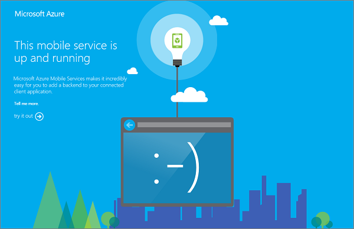

<properties
	pageTitle="在源代码管理中存储 .NET 后端项目代码 | Azure 移动服务"
	description="了解如何将 .NET 后端项目存储在计算机上的本地 Git 存储库中并从中发布。"
	services="mobile-services"
	documentationCenter=""
	authors="ggailey777"
	manager="dwrede"
	editor=""/>

<tags 
	ms.service="mobile-services" 
	ms.date="12/07/2015"
	wacn.date="01/29/2016"/>

# 在源代码管理中存储移动服务项目代码

> [AZURE.SELECTOR]
- [.NET backend](/zh-cn/documentation/articles/mobile-services-dotnet-backend-store-code-source-control/)
- [Javascript backend](/zh-cn/documentation/articles/mobile-services-store-scripts-source-control/)

本主题说明如何使用 Azure 移动服务提供的源代码管理存储 .NET 后端服务项目。只需将项目从本地 Git 存储库上载到生产移动服务，便可以发布该项目。

若要完成本教程，你必须事先参考[移动服务入门]教程创建一个移动服务。

##在移动服务中启用源代码管理

[AZURE.INCLUDE [mobile-services-enable-source-control](../includes/mobile-services-enable-source-control.md)]

##安装 Git 并创建本地存储库

1. 在本地计算机上安装 Git。 

	安装 Git 所需的步骤因操作系统的不同而异。有关操作系统特定的分发和安装指南，请参阅[安装 Git]。

	> [AZURE.NOTE]
	在某些操作系统上，命令行和 GUI 版本的 Git 都可用。本文中提供的说明使用命令行版本。

2. 打开一个命令行，例如 **GitBash** (Windows) 或 **Bash** (Unix Shell)。在 OS X 系统上，可以通过 **Terminal** 应用程序访问命令行。

3. 在命令行中，切换到要在其中存储脚本的目录。例如，`cd SourceControl`。

4. 使用以下命令创建新 Git 存储库的本地副本，并将 `<your_git_URL>` 替换为移动服务的 Git 存储库的 URL：

		git clone <your_git_URL>

5. 出现提示时，请键入你在移动服务中启用源代码管理时设置的用户名和密码。身份验证成功后，你将看到类似于下面的一系列响应：

		remote: Counting objects: 8, done.
		remote: Compressing objects: 100% (4/4), done.
		remote: Total 8 (delta 1), reused 0 (delta 0)
		Unpacking objects: 100% (8/8), done.

6. 浏览到你从中运行了 `git clone` 命令的目录，可以发现，已创建了一个与移动服务同名的新目录。对于 .NET 后端移动服务，git 存储库最初是空的。

创建本地存储库后，可以从此存储库发布 .NET 后端服务项目。

##使用 Git 发布项目

1. 在 Visual Studio 2013 中创建新的 .NET 后端移动服务项目，或者将现有项目移到新本地存储库。  

	为了进行快速测试，请下载移动服务快速入门项目并将其保存到此文件夹。

2. 删除所有 NuGet 包文件夹，只保留 packages.config 文件。

	移动服务将基于 packages.confign 文件自动还原 NuGet 包。你还可以定义一个 .gitignore 文件，以防止添加包目录。
 
3. 在 Git 命令提示符下，键入以下命令以开始跟踪新脚本文件：

		$ git add .
	
4. 键入以下命令以提交更改：

		$ git commit -m "adding the .NET backend service project"

5. 键入以下命令以将更改上载到远程存储库，并提供你的凭据：

		$ git push origin master
	
	你应会看到一系列命令，它们指示已将项目部署到移动服务、已添加包，并且已重新启动服务。

6. 浏览到 .NET 后端移动服务的 URL，你应会看到：

	

现在，你的移动服务项目已保留在源代码管理中，你只需从本地存储库推送更新，便可以发布服务更新。有关在使用 SQL 数据库的 .NET 后端移动服务中进行数据模型更改的信息，请参阅[如何对 .NET 后端移动服务进行数据模型更改]。

<!-- Anchors. -->

<!-- Images. -->

<!-- URLs. -->
[Git website]: http://git-scm.com
[Source control]: http://msdn.microsoft.com/zh-cn/library/azure/c25aaede-c1f0-4004-8b78-113708761643
[安装 Git]: http://git-scm.com/book/en/Getting-Started-Installing-Git
[移动服务入门]: /documentation/articles/mobile-services-dotnet-backend-ios-get-started/
[Azure Management Portal]: https://manage.windowsazure.cn/
[如何对 .NET 后端移动服务进行数据模型更改]: /documentation/articles/mobile-services-dotnet-backend-how-to-use-code-first-migrations/

<!---HONumber=Mooncake_0118_2016-->