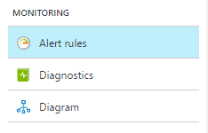

<properties
	pageTitle="为 Azure 服务创建警报 - Azure 门户 | Azure"
	description="满足指定的条件时，触发电子邮件、通知、调用网站 URL (webhook) 或自动执行。"
	authors="rboucher"
	manager="carmonm"
	editor=""
	services="monitoring-and-diagnostics"
	documentationCenter="monitoring-and-diagnostics"/>

<tags
	ms.service="monitoring-and-diagnostics"
	ms.workload="na"
	ms.tgt_pltfrm="na"
	ms.devlang="na"
	ms.topic="article"
	ms.date="09/23/2016"
	wacn.date="03/03/2017"
	ms.author="robb"/>

# 在 Azure Monitor 中为 Azure 服务创建警报 - Azure 门户

> [AZURE.SELECTOR]
- [门户预览](/documentation/articles/insights-alerts-portal/)
- [PowerShell](/documentation/articles/insights-alerts-powershell/)
- [CLI](/documentation/articles/insights-alerts-command-line-interface/)

## 概述

本文将展示如何使用 Azure 门户预览设置 Azure 警报。

可以根据监视指标或事件接收 Azure 服务的警报。

- **指标值** - 当指定指标的值在任一方向越过了指定的阈值时警报将触发。也就是说，当条件先是满足以及之后不再满足该条件时，警报都会触发。
- **活动日志事件** - 警报可以在发生 *每个* 事件时都触发，也可以仅在发生特定数量的事件时触发。

可以配置警报以在其触发时执行以下操作：

- 向服务管理员和共同管理员发送电子邮件通知
- 向指定的其他电子邮件地址发送电子邮件。
- 调用 Webhook
- 开始执行 Azure Runbook（仅在 Azure 门户预览中可行）

可以使用以下工具配置和获取关于警报的信息：

- [Azure 门户预览](/documentation/articles/insights-alerts-portal/)
- [PowerShell](/documentation/articles/insights-alerts-powershell/)
- [命令行界面 (CLI)](/documentation/articles/insights-alerts-command-line-interface/)
- [Azure Insights REST API](https://msdn.microsoft.com/zh-cn/library/azure/dn931945.aspx)
 

## 使用 Azure 门户预览创建指标的警报规则

1. 在[门户预览](https://portal.azure.cn/)中，找到希望监视的资源并选择该资源。

2. 在“监视”部分下选择“警报”或“警报规则”。对于不同的资源，文本和图标可能稍有不同。

	  

3. 选择“添加警报”命令并填写各个字段。

	  

4. 为警报规则**命名**，并选择一个**描述**，描述也将显示在通知电子邮件中。
5. 选择要监视的**指标**，然后为该指标选择**条件**和**阈值**值。另外，还要选择满足该指标规则必须达到多长**时间**，警报才会触发。例如，如果使用了时间“PT5M”，并且警报监视使用率高于 80% 的 CPU，则当 CPU 的使用率持续高于 80% 达 5 分钟时，该警报将触发。在发生第一次触发后，当 CPU 使用率保持低于 80% 达到 5 分钟时，该触发器将再次触发。CPU 度量每 1 分钟进行一次。

6. 如果希望在警报触发时向管理员和共同管理员发送电子邮件，请选中“电子邮件所有者...”。

7. 如果希望在警报触发时向其他电子邮件地址发送通知，请在“其他管理员电子邮件”字段中添加这些地址。请使用分号分隔多个电子邮件 - *email@contoso.com;email2@contoso.com*

8. 如果希望在警报触发时调用 Webhook，请在“Webhook”字段中输入有效的 URI。

9. 如果使用 Azure 自动化，则可以选择当警报触发时要运行的 Runbook。

10. 当完成警报创建后选择“确定”。

在几分钟后，警报将如前所述激活并触发。

## 管理警报

在创建警报后，可以选择警报并且：

- 查看其中显示了指标阈值和前一天的实际值的图形。
- 编辑或删除警报。
- **禁用**或**启用**警报（如果希望暂时停止或恢复接收该警报的通知）。

## 后续步骤

* 详细了解[在警报中配置 Webhook](/documentation/articles/insights-webhooks-alerts/)。
* 详细了解 [Azure 自动化 Runbook](/documentation/articles/automation-starting-a-runbook/)。
* [大致了解指标收集](/documentation/articles/insights-how-to-customize-monitoring/)以确保你的服务可用且响应迅速。

<!---HONumber=Mooncake_0227_2017-->
<!--Update_Description:update wording -->