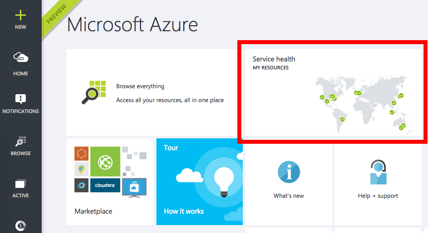

<properties
	pageTitle="使用 Azure Monitor 活动日志跟踪 Azure 服务运行状况 | Azure"
	description="在 Azure 遇到性能下降或服务中断及时发现。"
	authors="rboucher"
	manager=""
	editor=""
	services="monitoring-and-diagnostics"
	documentationCenter="monitoring-and-diagnostics"/>  

<tags
	ms.service="azure-portal"
	ms.workload="na"
	ms.tgt_pltfrm="na"
	ms.devlang="na"
	ms.topic="article"
	ms.date="10/20/2016"
	wacn.date="12/05/2016"
	ms.author="robb"/>

# 使用 Azure Monitor 活动日志跟踪 Azure 服务运行状况
每次发生服务中断或性能下降时 Azure 会进行宣传。可以在 Azure 门户中浏览这些事件，也可以使用 [REST API](https://msdn.microsoft.com/zh-cn/library/azure/dn931927.aspx) 或 [.NET SDK](https://www.nuget.org/packages/Microsoft.Azure.Insights/) 以编程方式访问完整的事件集。

## 浏览订阅的服务运行状况日志

1. 登录到 [Azure 门户](https://portal.azure.cn/)。

2. 在“主页”上，应看到名为“服务运行状况”的磁贴。单击它。
    
3. 会看到 Azure 中所有区域的列表。单击任何区域可打开活动日志查询，该查询可显示过去 24 小时内影响任何订阅的服务事件。
   
      

4. 单击表中的各个事件可以查看该事件的详细信息。
5. 更改 **Timespan** 以查看更长的时间范围。

<!---HONumber=Mooncake_1128_2016-->