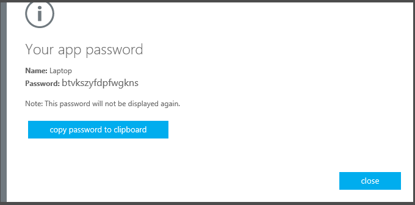

<properties 
	pageTitle="在 Azure 门户中为 Azure Multi-Factor Authentication 创建应用密码" 
	description="本页说明用户如何在 Azure 门户中创建更多的应用密码。" 
	services="multi-factor-authentication" 
	documentationCenter="" 
	authors="billmath" 
	manager="stevenp" 
	editor="curtland"/>

<tags 
	ms.service="multi-factor-authentication" 
	ms.date="05/12/2016" 
	wacn.date="04/13/2016"/>

# 在 Azure 门户中为多重身份验证创建应用密码

如果你在 Azure 上使用多重身份验证，则需要通过 Azure 门户创建应用密码。

## 在 Azure 门户中创建应用密码

1. 登录到 Azure 经典管理门户
3. 在顶部，右键单击你的用户名并选择“其他安全性验证”。
5. 在验证页的顶部选择应用密码
6. 单击“创建”
7. 输入应用密码的名称，然后单击“下一步”
8. 将应用密码复制到剪贴板，然后将它粘贴到你的应用。

 
<!---HONumber=Mooncake_0530_2016-->