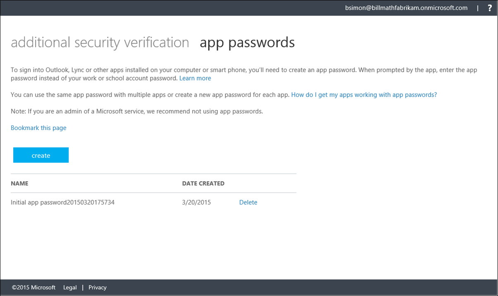

<properties 
	pageTitle="在 Myapps 门户中为 Azure Multi-Factor Authentication 创建应用密码" 
	description="本页说明用户如何在 Myapps 门户中创建更多的应用密码。" 
	services="multi-factor-authentication" 
	documentationCenter="" 
	authors="billmath" 
	manager="stevenp" 
	editor="curtland"/>

<tags 
	ms.service="multi-factor-authentication" 
	ms.date="05/12/2016" 
	wacn.date="06/06/2016"/>

# 在 myapps 365 门户中为 Azure  (MFA)多重身份验证创建应用密码

如果你不在包含 Azure 订阅的 Office 365 上使用多重身份验证，则需要通过 myapps 门户创建应用密码。

## 在没有 Office 365 或 Azure 订阅的情况下创建应用密码
--------------------------------------------------------------------------------
<ol>
<li>登录到 [https://myapps.microsoft.com](https://myapps.microsoft.com)</li>
<li>在顶部选择配置文件。</li>

<li>单击你的用户名并选择“其他安全性验证”。</li>
<li>在验证页的顶部选择应用密码</li>
<li>单击“创建”</li>

<li>输入应用密码的名称，然后单击“下一步”</li>
<li>将应用密码复制到剪贴板，然后将它粘贴到你的应用。</li>

 
<!---HONumber=Mooncake_0530_2016-->