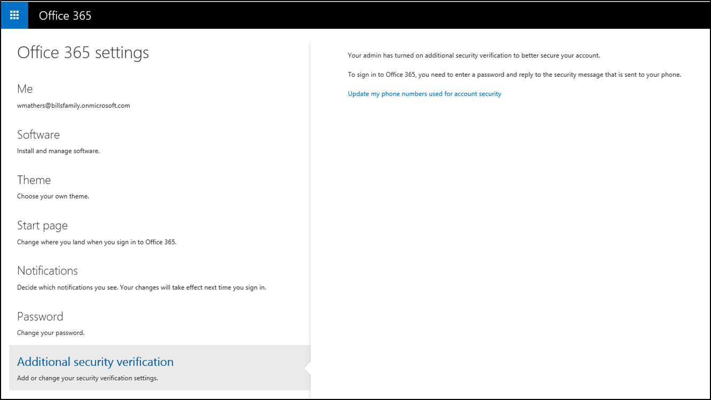
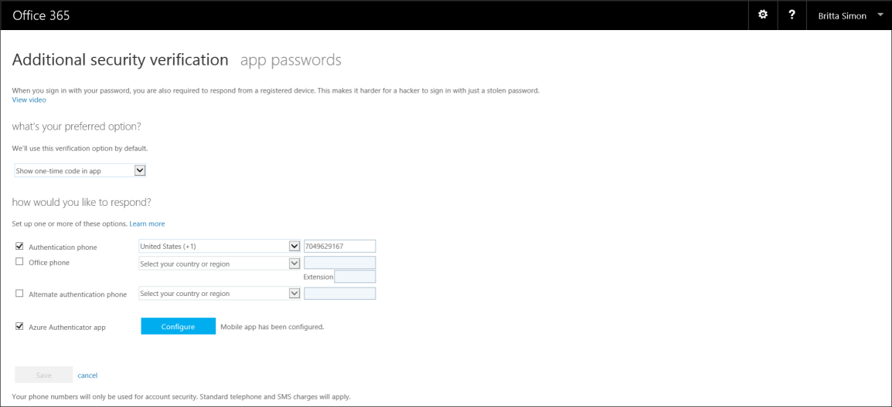

<properties 
	pageTitle="在 Office 365 门户中为 Azure Multi-Factor Authentication 创建应用密码" 
	description="本页说明用户如何在 Office 365 门户中创建更多的应用密码。" 
	services="multi-factor-authentication" 
	documentationCenter="" 
	authors="billmath" 
	manager="stevenp" 
	editor="curtland"/>

<tags 
	ms.service="multi-factor-authentication" 
	ms.date="05/12/2016" 
	wacn.date="01/14/2016"/>

# 在 Office 365 门户中创建或删除 Azure 多重身份验证的应用密码

如果你在 Office 365 上使用多重身份验证，则需要通过 Office 365 门户创建和删除应用密码。

## 在 Office 365 门户中创建应用密码
--------------------------------------------------------------------------------

<ol>
<li>登录到 Office 365 门户</li>
<li>在右上角选择设置小组件</li>
<li>在左侧选择“其他安全性验证”</li>

<li>在右侧，选择“更新用于帐户安全性的电话号码”</li>
<li>在验证页的顶部选择应用密码</li>

<li>单击“创建”</li>

<li>输入应用密码的名称，然后单击“下一步”</li>
<li>将应用密码复制到剪贴板，然后将它粘贴到你的应用。</li>

## 在 Office 365 门户中删除应用密码
--------------------------------------------------------------------------------

<ol>
<li>登录到 Office 365 门户</li>
<li>在右上角选择小组件并选择“Office 365 设置”</li>
<li>在底部，单击“其他安全性验证”，然后选择“更新用于帐户安全性的电话号码”。3</li>

<li>在右侧，选择“更新用于帐户安全性的电话号码”</li>
<li>在验证页的顶部选择应用密码</li>

<li>在要删除的应用密码旁边，选择“删除”。</li>

<li>将弹出一个对话框，要求你确认删除。</li>
<li>单击“是”。</li>

 
<!---HONumber=Mooncake_0530_2016-->