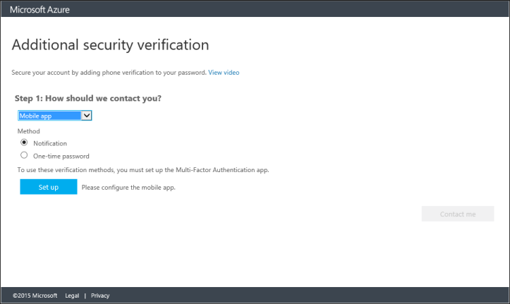
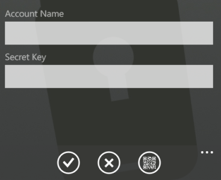

<properties 
	pageTitle="在 Azure MFA 中使用移动应用作为联系方法" 
	description="本页说明用户如何使用移动应用作为 Azure MFA 的主要联系方法。" 
	services="multi-factor-authentication" 
	documentationCenter="" 
	authors="billmath" 
	manager="stevenp" 
	editor="curtland"/>

<tags 
	ms.service="multi-factor-authentication" 
	ms.date="05/12/2016" 
	wacn.date="06/06/2016"/>

# 在 Azure 多重身份验证中使用移动应用作为联系方法

如果要使用移动应用作为主要联系方法，你可以参考本文。本文将会引导你设置多重身份验证，以使用移动应用作为主要联系方法。

Azure 验证器应用可用于 [Windows Phone](http://www.windowsphone.com/zh-cn/store/app/azure-authenticator/03a5b2bf-6066-418f-b569-e8aecbc06e50)、[Android](https://play.google.com/store/apps/details?id=com.azure.authenticator) 和 [iOS](https://itunes.apple.com/us/app/azure-authenticator/id983156458)。

## 使用移动应用作为联系方法

- 从下拉列表中选择“移动应用”。

- 选择“通知”或“一次性密码”，然后单击“设置”。
- 在已安装 Azure 验证器应用的手机上，启动该应用并单击“扫描条形码”。若要添加已启用 Azure MFA 的帐户或第三方帐户，请参阅[手动添加帐户](#adding-an-account-manually)。

- 扫描“配置移动应用”屏幕上显示的条形码图片。单击“完成”关闭条形码屏幕。如果无法获取要扫描的条形码，请手动输入信息。

- 在手机上，将会开始激活帐户，完成此过程后，请单击“联系我”。随后会将通知或验证码发送到你的手机。单击“验证”。

- 单击“关闭”。此时，验证应已成功。
- 建议输入你的手机号码，以免无法访问移动应用。
- 通过下拉列表指定你的国家/地区，然后在国家/地区旁边的框中输入手机号码。单击“下一步”。
- 此时，你已设置好联系方法，接着可以设置非浏览器应用（例如 Outlook 2010 或更低版本）的应用密码。如果你不使用这些应用，请单击“完成”。否则，请继续下一步骤。

- 如果你正在使用这些应用，请复制提供的应用密码，然后将该密码粘贴到非浏览器应用。有关在每个应用程序（例如 Outlook 和 Lync）上执行的步骤，请参阅“如何将电子邮件中的密码更改为应用密码”和“如何将应用程序中的密码更改为应用密码”。
- 单击“Done”（完成）。

## 手动添加帐户
如果想要手动添加帐户，请选择用于手动输入帐户的按钮。

如果你的某个帐户已启用 Azure MFA，请输入显示条形码的同一页面上所提供的代码和 URL。此信息将会填入移动应用上的代码和 URL 框中。激活过程随后将会开始。

完成此操作后，单击“联系我”。随后会将通知或验证码发送到你的手机。单击“验证”。若要完成此过程，请从上述步骤编号 6 开始执行。

如果你在移动应用上使用第三方帐户，请在提供的框中输入帐户名和安全密钥，然后激活帐户。完成此操作并验证帐户后，请从上述步骤编号 6 开始执行。

>[AZURE.NOTE]如果你看到“添加工作帐户”，请注意该选项适用于“工作区加入”，而不适用于多重身份验证。你可以忽略此选项。
 

<!---HONumber=Mooncake_0530_2016-->