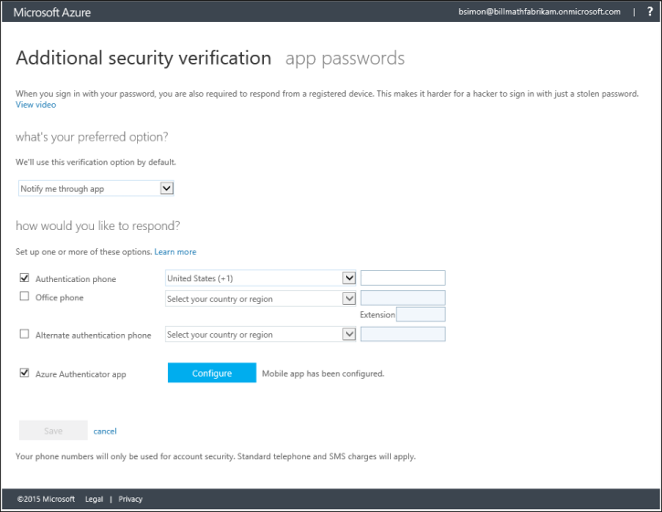

<properties 
	pageTitle="在 Azure 门户中管理 Azure MFA 设置" 
	description="本页说明用户需要在 Azure 门户中的哪个位置管理其 Azure MFA 设置。" 
	services="multi-factor-authentication" 
	documentationCenter="" 
	authors="billmath" 
	manager="terrylan" 
	editor="bryanla"/>

<tags 
	ms.service="multi-factor-authentication"  
	ms.date="06/02/2015" 
	wacn.date="12/17/2015"/>

# 在 Azure 门户中管理 Azure 多重认证设置

如果你在 Azure 上使用多重认证，则需要通过 Azure 门户管理其他安全性验证设置。

## 在 Azure 门户中访问其他安全性验证设置

<ol>
<li>登录到 Azure 门户。<li>在 Azure 门户的顶部，单击你的用户名。此时将显示一个下拉框。<li>在下拉框中，选择“其他安全性验证”此时将打开“其他安全性验证”部分。

<li>现在，你应该已位于验证页，并可以更改设置。</li>

<!---HONumber=69-->