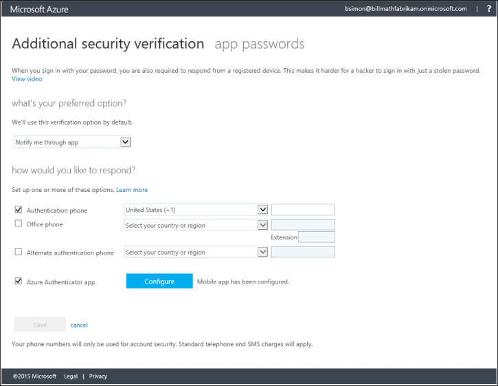

<properties 
	pageTitle="在 Myapps 门户中管理 Azure MFA 设置" 
	description="本页说明用户需要在 Myapps 门户中的哪个位置管理其 Azure MFA 设置。" 
	services="multi-factor-authentication" 
	documentationCenter="" 
	authors="billmath" 
	manager="terrylan" 
	editor="bryanla"/>

<tags 
	ms.service="multi-factor-authentication" 
	ms.date="06/02/2015" 
	wacn.date="09/15/2015"/>

# 在 Myapps 门户中管理 Azure 多重认证设置

如果你在 Office 365 上使用多重认证，则需要通过 Office 365 门户管理其他安全性验证设置。

## 在 Myapps 门户中访问其他安全性验证设置
<ol>
<li>登录到 [https://myapps.microsoft.com] (https://myapps.microsoft.com)</li>
<li>在顶部选择配置文件。</li>
<li>单击你的用户名并选择“其他安全性验证”。</li>

<li>现在，你应该已位于验证页，并可以更改设置。</li>

<!---HONumber=69-->