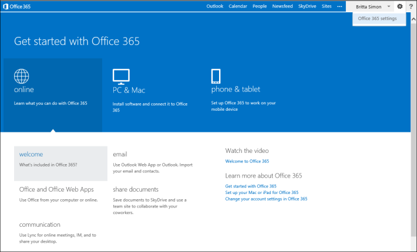
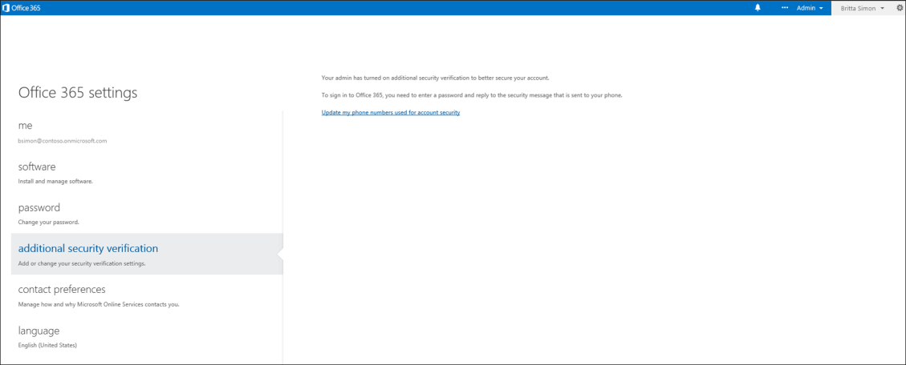
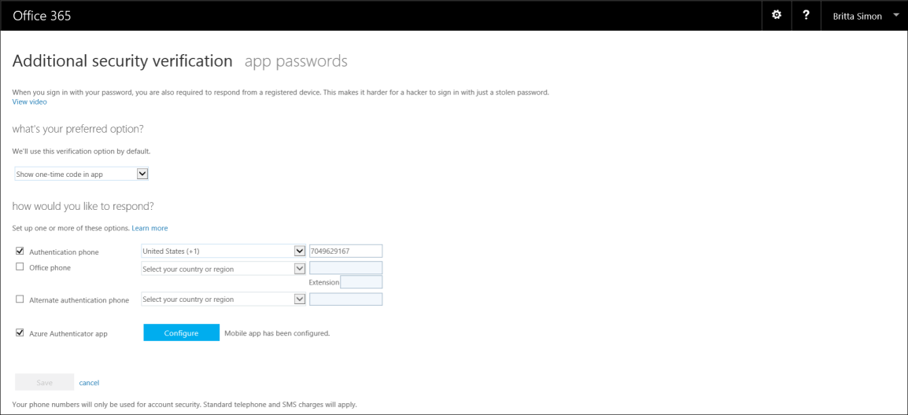

<properties 
	pageTitle="在 Office 365 门户中管理 Azure MFA 设置" 
	description="本页说明用户需要在 Office 365 门户中的哪个位置管理其 Azure MFA 设置。" 
	services="multi-factor-authentication" 
	documentationCenter="" 
	authors="billmath" 
	manager="terrylan" 
	editor="bryanla"/>

<tags 
	ms.service="multi-factor-authentication" 
	ms.date="06/02/2015" 
	wacn.date="09/15/2015"/>

# 在 Office 365 门户中管理 Azure Multi-Factor Authentication 设置

如果你在 Office 365 上使用 Multi-Factor Authentication，则需要通过 Office 365 门户管理其他安全性验证设置。

## 在 Office 365 门户中访问其他安全性验证设置

<ol>

<li>登录到 [Office 365 门户] (https://login.microsoftonline.com/)。</li>
<li>在顶部，单击看起来像是齿轮的图标。此时将显示一个下拉列表，其中列出了 Office 365 设置。</li>

<li>单击“Office 365”>“设置”。此时将打开设置页。</li>
<li>在左侧单击“其他安全性验证”。</li>

<li>在右侧，单击“更新用于帐户安全性的电话号码”链接。随后你将重定向到一个新页面。你必须再次使用手机或移动应用进行验证</li>
<li>完成此操作后，你应该位于验证页，并可以更改设置。</li>

<!---HONumber=69-->