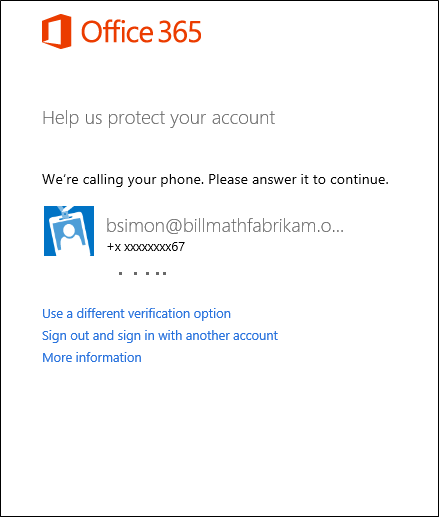
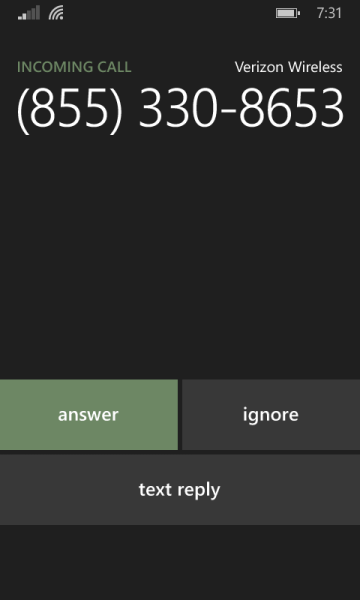

<properties 
	pageTitle="在 Azure Multi-Factor Authentication 中使用办公电话或手机呼叫进行登录" 
	description="本页介绍用户如何使用手机登录。" 
	services="multi-factor-authentication" 
	documentationCenter="" 
	authors="billmath" 
	manager="stevenpo" 
	editor="curtland"/>

<tags 
	ms.service="multi-factor-authentication" 
	ms.date="05/12/2016" 
	wacn.date="06/06/2016"/>

# 在 Azure 多重身份验证中使用办公电话或手机呼叫进行登录

以下信息介绍在使用手机或办公电话执行多重身份验证时的体验。

## 使用办公电话或手机呼叫登录

<ol>

<li>使用你的用户名和密码登录到 Office 365 等应用程序或服务。</li>
<li>Microsoft 将会向你拨打电话。</li>

<li>请接听电话并按 # 键。</li>

<li>现在你应已登录。</li>

 
<!---HONumber=Mooncake_0530_2016-->